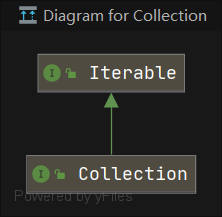
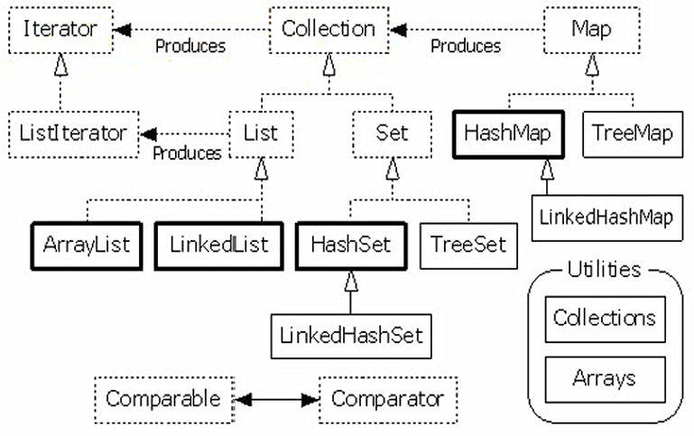
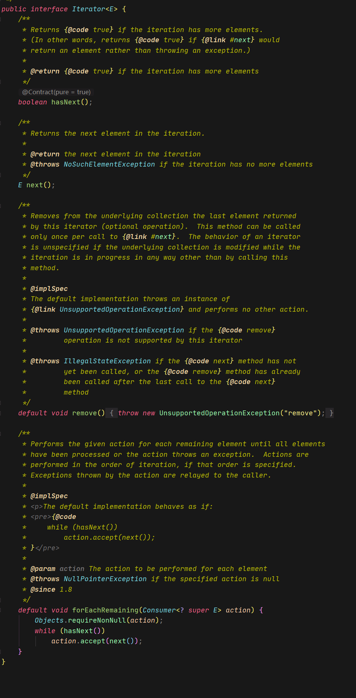
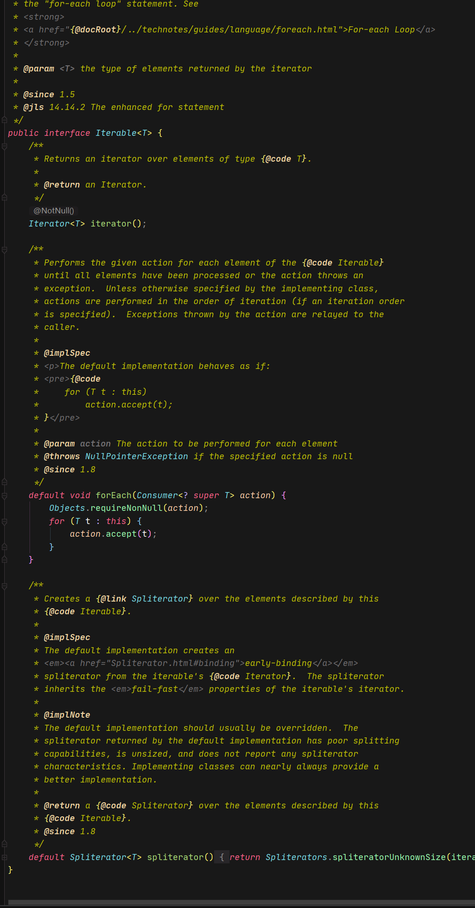
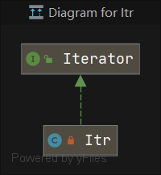
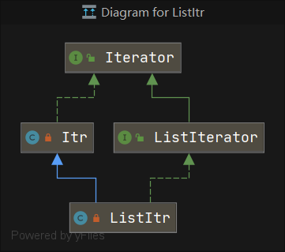

<!--https://www.cnblogs.com/zyuze/p/7726582.html-->

# 迭代器总结
- 思想
  - 不管是Colletion的哪一个实现类,[调用者]使用Iterator提供的方法都可以完成遍历
  - 每个类的实现细节由[编写者]完成
    - 接口与实现分离,同样的接口,可以有不同的实现    

## 集合框架
- Iterator接口: 迭代器
- Iterable接口:
  - 里面有一个Iterator成员
  - 返回一个foreach可以遍历的iterator对象
- Collection接口: 
  - 继承了Iterable接口
  - 所以Collection中所有的类都可以使用foreach遍历







## Iterator



- Iterator(最顶层)
  - 两个方法
    - hasNext()
    - next()
  - 两个默认方法
    - remove()
    - forEachRemaining()
  - 文档介绍
```
 * An iterator over a collection.  {@code Iterator} takes the place of
 * {@link Enumeration} in the Java Collections Framework.  Iterators
 * differ from enumerations in two ways:
 *
 * <ul>
 *      <li> Iterators allow the caller to remove elements from the
 *           underlying collection during the iteration with well-defined
 *           semantics.
 *      <li> Method names have been improved.
```

## Iterable




- Iterable
  - 里面有一个<font color=red>**成员**</font>是Iterator
  - 默认方法
    - forEach()
    - spliterator()

## 遍历集合  
- **<font color=red>遍历集合的方式</font>**
  - Iterator
  - Iterator的子接口(提供更多方法)
    - 通常功能会比Iterator强大
  - forEach
    - 底层还是使用Iterator实现
  - 聚合操作

## 栗子
- ArrayList
  - 内部类Itr




  - 内部类ListItr




```
  // Iterator 提供的遍历的接口 next()
        // 1 遍历方式一, Iterator
        Iterator<Integer> it = list.iterator();
        while(it.hasNext()){
            System.out.println(it.next());
        }
        for(Iterator iter = list.iterator(); iter.hasNext();){
            System.out.println(iter.next());
        }
        // ListIterator 提供的遍历接口 next() previous()
        // 2 遍历方式二, ListIterator
        ListIterator<Integer> listItr = list.listIterator();
        System.out.println("listItr.hasNext() = " + listItr.hasNext());
        System.out.println("listItr.next() = " + listItr.next());
        System.out.println("listItr.hasPrevious() = " + listItr.hasPrevious());
        System.out.println("listItr.next() = " + listItr.next());
        System.out.println("listItr.previous() = " + listItr.previous());
        System.out.println("listItr.previous() = " + listItr.previous());

        // 3 遍历方式三,forEach
        for (Integer i:
             list) {

        }
        list.forEach(i -> {

        });

        // 4 遍历方式四 使用聚合操作
        list.stream().forEach(i -> {
            
        });
```
