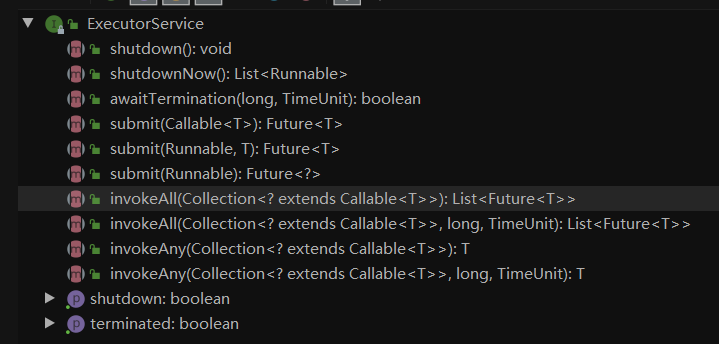

# 抽象类 和 接口的区别
<!-- 这一部分参考: https://www.jianshu.com/p/28e3b4d61945-->
## 抽象类
在java中抽象的关键字为abstract，抽象类被创造出来就是为了继承，简单明了地告诉用户跟编译器自己大概是长什么样子的。例如抽象类申明的语法

```
abstract class Abc {
    abstract void fun();
}
```
- 抽象类有以下几个特性：

    - 抽象方法必须为public、protected（若为private，则不能给子类继承，子类无法实现该方法，所以无意义），缺省时为public；
    
    - 抽象类不能直接用来创建对象，必须由子类继承并实现其父类方法才能创建对象；
    
    - 抽象类可以继承抽象类，子类必须复制继承父类的抽象方法；
    - 只要包含一个抽象方法的抽象类，该方法必须要定义成抽象类，不管是否还包含有其他方法。

## 接口 
在java中抽象的关键字为interface，接口也可以说是一个更加抽象的抽象类，对行为进行抽象，只提供一种形式，并不提供实施的细节。
接口的语法如下：


```
[public] interface InterfaceName {
 
}
```

## 接口和抽象类的区别

- 抽象类中的成员变量可以是各种类型的，而接口中的成员变量只能是public static final类型的
- 方法类型要根据jdk版本:
  - jdk1.7 接口只能有常量和公共抽象方法
  - jdk1.8 接口中增加公共默认方法和公共静态方法
    - 不能有静态变量(会被隐式指定)
    - 目的是为了提供默认的方法实现
  - jdk1.9 增加私有方法以及私有静态方法
    - 私有静态方法限制该方法通过接口名.方法来调用
- 接口中不能含有静态代码块，而抽象类可以有静态代码块；
- 一个类只能继承一个抽象类，而一个类却可以实现多个接口


## 形象的栗子

把编程映射会日常生活进行对照，那么一个东西，抽象类表示它是什么，接口表示它能做什么。举一个栗子，一个Person，他有眼睛、肤色，这些描述一个人的特征可以定义在抽象类中，而一个人的行为如打篮球，所以这些可以定义在接口中

```
//抽象类Person
abstract class Person {
    abstract void eyes();
    abstract void skin();
}
```

```
//接口 Action
public interface Action {
    void playBasketball();
}
```
- 那么有个中国人，他不会打篮球，这个类可以这样写
```
public class Chinese extends Person {
    @Override
    void eyes() {
        System.out.print("我的眼睛是黑色的");
    }

    @Override
    void skin() {
        System.out.print("我的皮肤是黄色的");
    }
}
```

- 有个俄罗斯人，他会打篮球，这个类可以这样写
```
public class Russian extends Person implements Action{
    @Override
    void eyes() {
        System.out.print("我的眼睛是黑色的");
    }

    @Override
    void skin() {
        System.out.print("我的皮肤是白色的");
    }

    @Override
    public void playBasketball() {
        System.out.print("我能扣篮");
    }
}
```
## 小结(网上粘贴的)
- 1、抽象类适合用来定义某个领域的固有属性，也就是本质，接口适合用来定义某个领域的扩展功能。
- 2、当需要为一些类提供公共的实现代码时，应优先考虑抽象类。因为抽象类中的非抽象方法可以被子类继承下来，使实现功能的代码更简单。
- 3、当注重代码的扩展性跟可维护性时，应当优先采用接口。①接口与实现它的类之间可以不存在任何层次关系，接口可以实现毫不相关类的相同行为，比抽象类的使用更加方便灵活;②接口只关心对象之间的交互的方法，而不关心对象所对应的具体类。接口是程序之间的一个协议，比抽象类的使用更安全、清晰。一般使用接口的情况更多。


## 源码中的栗子
### CASE1 接口的应用

- RunnableFuture继承了Runnable接口和Future接口
    - Runnable接口只有一个run方法,用于执行任务
    - Future接口的主要作用有:
      - cancel() 对任务的执行取消操作
      - isCanceled() 判断任务是否被取消
      - isDone() 判断任务是否执行完成
      - get() 获取任务返回的结果
- RunnableFuture接口的实现类既拥有Runnable的功能,也拥有Future的功能

### CASE2 接口+抽象类
<!-- https://blog.csdn.net/xiaojie_570/article/details/79301195 -->
# List为接口
```
public interface List<E> extends Collection<E>
```


- (图中的都是各种接口)


## AbstractList抽象类
- 继承了抽象类AbstractCollection
- 实现了List接口

```
public abstract class AbstractList<E>
extends AbstractCollection<E>
implements List<E>
```


- <font color=blue>AbstractList抽象类实现了很多List接口中的方法，减轻了想要实现List接口的开发人员的负担，如果开发人员想要实现List接口，那么他可以直接继承AbstractList类然后重写对应的方法就可以了。如果开发人员想要顺序访问数据（如LinkedList类），那么继承AbstractSequentialList 类比继承AbstractList要更高效</font>
- 如果开发人员想要实现一个不可修改的List，那么只需要继承该类，然后重写两个方法：get(int)和size()方法
- 如果开发人员想要实现一个可修改的List，那么需要重写set()方法，如果不重写会抛出UnsupportedOperationException异常，如果size()的大小是可变的，那么开发人员还需要重写add(int, E)和 remove(int)方法
该类的子类需要有2个构造方法，一个是空参，一个是参数类型为Collection的构造方法
- <font color=blue>该类的子类可以不实现iterator方法，因为这个抽象类已经实现了iterator()方法</font>
### CASE3 接口 + 抽象类
- 线程池


- Executor
  - execute
  


- ExecutorService
  - shutdown
  - awaitxxx
    - shutdown后 阻塞直至所有任务被执行
  - submit
    - 提交任务到线程池
  - invokeAll
  



- AbstractExecutorService
  - 提供ExecutorService的默认实现
  - newTaskFor
    - 创建任务
 


### 个人小结-1 ###
- 源码中接口的使用
  - 希望FutureTask既有Runable的run()方法,又可以有Future的get和cancelled方法
  - RunnableFuture继承Future和Runable
  - FutureTask为RunnableFuture的实现类

- 源码中接口 + 抽象类的使用
  - List接口中提供了查询,修改,批量修改,产生迭代器等方法
  - AbstracList为抽象类,实现了List,实现了批量修改方法addAll,迭代相关的listIterator方法,因此他的子类就可以不用去实现了
       
### <font color=red>个人小结-2</font>
- 如果我希望某个类,拥有少数几个功能,而这些功能分别是接口A,B具有的
    - 首先可以创建一个接口C,继承A,B
    - 然后创建接口C的实现类

- 如果我希望某个类E1,可以实现一些基本功能,以后可能也会有一些类E2,他们同样会具有这些基本功能
 - (1)创建接口C,继承A,B在A,B的基础上扩展A的部分功能
 - (2)创建抽象实现类D,实现C的默认功能,这一部分是其子类默认都有的功能
 - (3)创建D的子类E1
  
## 项目中的栗子
### 接口
- springboot 中的Service层
  - 首先声明一个接口ServiceA
  - 然后创建该接口的实现类ServiceAImpl

### 抽象类
- xml中引入外部依赖,如webSocket
  - 自己定义配置类继承抽象配置类
    - 抽象类中有非抽象方法,这些方法里面定义了一些公共配置
      - <font color=red>查了一下,抽象类中可以没有抽象方法</font>
    - 添加一点自己的配置即可,免去了额外的配置
- 
## 接口和抽象类在类文件中
- 在类文件的访问标志中可以得到信息
  - 访问标志
    - ACC_INTERFACE: 表示是类还是接口
    - ACC_ABSTRACT: 表示是否抽象(只有抽象类和接口才为真)

### 抽象类中的非抽象方法可以重写吗
- 可以的
- AbstractList是默认不可修改的数组
 - 关于值的修改的方法,其子类如果不重写直接调用会抛出异常 unsupportedOperation
 - AQS的tryAccquire也需要子类重写,否则抛异常