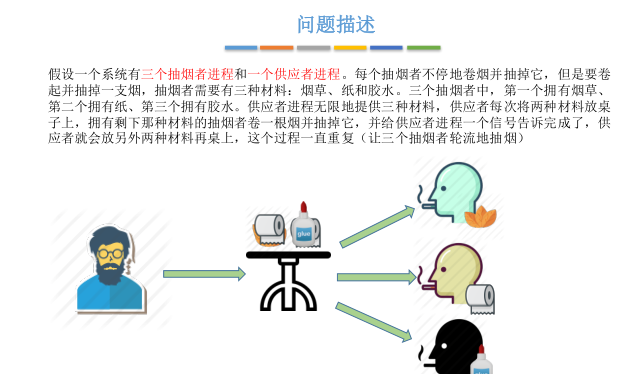
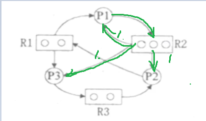

# 前置知识
## 为什么要使用信号量机制
### S初始值设置为0,实现进程同步
- 进程同步
  - 即保证P2的[代码4]一定在P1的[代码1,代码2]后执行


### S初始值设置为1,实现进程互斥
 <center> <b>mutex</b> </center>


- wait(S) **P**
  - 只有S > 0时进程进入wait方法才不会被阻塞
    - S = S - 1
  - 若S完成自减操作后,有<0,则此时进程等待(阻塞)
- signal(S) **V**
  - S = S + 1
  - 若S完成自增操作后,有S <= 0:
    - 则唤醒一个处于wait状态的线程


- 互斥实现(以上方图片为例)
  - mutex对应的S的初始值为1
    - p1 P(S)(wait(S)) --> p1进入wait --> S == 0 --> p1退出wait
    - p2 P(S) (wait(S)) --> p2进入wait --> S == -1 --> p2阻塞
    - p1使用临界区资源
    - p1 V(S) (signal(S)) --> p1进入signal --> S == 0 --> 
      - p1 唤醒p2
      - p1退出signal
    - p2被唤醒
    - p2退出wait
    - p2使用临界区资源
    - p2 V(S) (signal(S)) --> p2进入signal --> S == 1
    - p2 退出signal
  

# 生产者-消费者
## 记录型信号量解决
```
Var mutex,empty,full:semaphore:=1,n,0;
    buffer:array[0,...,n-1]of item;
    in,out:integer:=0,0;
    begin
        parbegin
            proceducer:begin
                    repeat
                    .
                    .
                    .
                    producer an item nextp;
                    .
                    .
                    .
                    wait(empty);
                    wait(mutex);
                    buffer(in):=nextp;
                    in:=(in+1)mod n;
                    signal(mutex);
                    signal(full);
                    until false;
    	           end
            consumer:begin
                    repeat
                    wait(full);
  	                wait(mutex);
                   nextc:=buffer(out);
                   out:=(out+1)mod n;
                   signal(mutex);
                    signal(empty);
   	               consumer the item in neXtg;
                    until false;
                end
        parend
    end
```
- 参考链接

https://blog.csdn.net/qq_45273552/article/details/109054767

- 代码实现

[记录型信号量解决生产者消费者问题](https://github.com/xiongshengyufluffy/Java/tree/master/0_weekly/com/pc_1)


## AND信号量解决

```
Var mutex,empty,full:semaphore:=1,n,0;
    buffer:array[0,...,n-1]of item;
    in,out:integer:=0,0;
    begin
        parbegin
            proceducer:begin
                    repeat
                    .
                    .
                    .
                    producer an item nextp;
                    .
                    .
                    .
                    // wait(empty);
                    // wait(mutex);
                    Swait(empty, mutex);
                    buffer(in):=nextp;
                    in:=(in+1)mod n;
                    Signal(mutex, full);
                    // signal(mutex);
                    // signal(full);
                    until false;
    	           end
            consumer:begin
                    repeat
                    // wait(full);
  	                // wait(mutex);
                   Swait(full, mutex);
                   nextc:=buffer(out);
                   out:=(out+1)mod n;
                   Signal(mutex, empty);
                   // signal(mutex);
                   // signal(empty);
   	               consumer the item in nextg;
                    until false;
                end
        parend
    end

```
- 参考链接

https://blog.csdn.net/qq_45273552/article/details/109055936

- Swait伪代码理解
```
wait(S1, S2, …, Sn)
{
    While(TRUE)
    {
        if (S1 >=1 and … and Sn>=1 ){
          	for( i=1 ;i<=n; i++) Si--;
		break;
	    }
        else{
             Place the process in the waiting queue associated  with the first Si 
             found with Si < 1,and set the progress count of this process to the 
             beginning of Swait operation	
        }
    }
}
```
- AND型信号量用于进程A和进程B要求访问多个共享数据
  - 在生产者消费者的例子中,producer和consumer要求访问的共享数据是信号量empty, full和mutex
  - 在生产者进行生产之前
    - 如果使用记录型信号量,则单独的
      - wait(empty)
      - wait(mutex)
    - 如果使用AND型信号量,则要求访问的共享数据是empty,mutex
- Swait Java实现
- 方法调用
  - 在Producer中,SWAIT(empty, mutex)
  - PS:"..."
    - SWAIT(Semaphore...list)可以用来接受
      - Semaphore数组,如Semaphore[] sarray1; SWAIT(sarray1);
      - 若干个Semaphore对象,如Semaphore s1; Semaphore s2; SWAIT(s1, s2)

```
    public void SWAIT(Semaphore...list) {
        //传过来的参数是S1,S2,S3,...,Sn
        // 调用SWAIT(empty, mutex)时,相当于接收[empty, mutex]
        lock.lock();

        while (true) {
            int count=0;
            // 统计满足S1>=1,S2>=1,...,Sn>=1的个数count
            // 统计
            for (Semaphore semaphore:list){
                if(semaphore.availablePermits()>0){
                    count++;
                }
            }
            if(count == list.length){
                break; //  满足伪代码中if (S1 >=1 and … and Sn>=1 )条件,可以执行for( i=1 ;i<=n; i++) Si--;
            }
            try {
                condition.await(); // 不满足S1 >=1 and … and Sn>=1,进入else分支
                // 进程阻塞
                // 将发现第一个Si<1的进程放入等待队列中
                // 重新计算count
            } catch (InterruptedException e) {
                // TODO Auto-generated catch block
                e.printStackTrace();
            }
        }
        // 满足S1>=1ANDS2>=1,...,Sn>=1
        // for( i=1 ;i<=n; i++) Si--;
        for (Semaphore semaphore:list){
            try {
              // 获得资源,即Si--;
              // empty --, mutex --
                semaphore.acquire();
            } catch (InterruptedException e) {
                // TODO Auto-generated catch block
                e.printStackTrace();
            }
        }

        lock.unlock();
    }
```

[AND型信号量解决生产者消费者问题](https://github.com/xiongshengyufluffy/Java/tree/master/0_weekly/com/pc_2)


## 多生产者,多消费者问题--使用信号量P,V解决
### 吃水果问题


- 不同类别的生产者和不同类别的消费者


- 思路
  - 互斥关系
    - 对缓冲区(盘子)的访问要互斥的进行
    - **互斥关系**实现
      - p1() {**P**; 临界区; **V**}
      - p2() {**P**; 临界区; **V**}
      - mutex = 1(互斥信号量初值一般为1)
  - 同步关系
    - 是否存在一前一后的访问顺序 
      - 父亲将苹果放入盘子后,女儿才能取苹果
      - 母亲将橘子放入盘子后,儿子才能取橘子
      - 儿子消费完橘子,母亲才能放橘子
      - 女儿消费完苹果,父亲才能放苹果
    - **同步关系**实现
      - 要求 p1:code1-->code2-->p2:code3-->code4
        - p1() {..code1;code2;**V**;..} 
        - p2() {..**P**;code3;code4}
      - 同步信号量初值由资源初始值决定
- 过程
  ```
  father(){
    product apple;
    visit plate;
  }
  ```
  ```
  mother(){
    product orange;
    visit plate;
  }
  ```
  ```
  daugther(){
    visit plate;
    consume apple;
  }
  ```
  ```
  son(){
    visit plate;
    consume orange;
  }
  ```
- 实现
  - 增加访问临界资源的互斥关系
  ```
  father(){
    product apple;
    P(mutex)
    visit plate;
    V(mutex)
  }
  ```
  ```
  mother(){
    product orange;
    P(mutex)
    visit plate;
    V(mutex)
  }
  ```
  ```
  daugther(){
    P(mutex)
    visit plate;
    V(mutex)
    consume apple;
  }
  ```
  ```
  son(){
    P(mutex)
    visit plate;
    V(mutex)
    consume orange;
  }
  ```


  - 同步关系
    - 是否存在一前一后的访问顺序 
      - 父亲将苹果放入盘子后,女儿才能访问盘子取到苹果(V--P)
        - 这里的apple相当于代码中的信号量appleIsFine
          - 表示苹果已经放在盘子上了
        - 
        
      - 母亲将橘子放入盘子后,儿子才能访问盘子取到橘子(V--P)
        
      - 儿子访问盘子取到橘子之后离开盘子,父亲**或者**母亲才能放入水果

      - 
      - 

      - 女儿访问盘子取到橘子之后离开盘子,父亲**或者**母亲才能放入水果
      - 
      - 
  
  - 伪代码汇总
  

  - 编写代码时参考链接

  https://blog.csdn.net/qq_29109181/article/details/78358762?utm_source=blogxgwz1
  https://blog.csdn.net/qq_29109181/article/details/78358762?utm_source=blogxgwz1

- 实现代码
- PS:
  - 通过在代码中sleep设置,可以实现下述效果:
    - 设置:
      - father 和 daughter是一组较快的生产者消费者
      - mother 和 son是一组较慢的生产者消费者
      - father V(apple)(即通知apple已经放置完毕后),不睡眠
      - daughter V(plate)(即通知plate已经为空后),睡50ms
      - mother V(orange)(即通知orange已经放置完毕后),睡100ms
      - son V(plate)(即通知plate已经为空后),睡100ms
    - 打印输出效果: 
    - father put apple --> daughter eat apple
    - father put apple --> daughter eat apple
    - mother put orange --> son eat orange

[信号量解决吃水果问题](https://github.com/xiongshengyufluffy/Java/tree/master/0_weekly/com/multi_pc_3_2)


### 吸烟者问题
- 不保证吸烟者能够轮流吸上烟
- 类似于吃水果
  - 信号量desk:表示桌子是否可以访问
  - 逻辑
    - [吸烟者问题思路](thinks/smoker.md)
  
  - 代码:
    - [吸烟者问题代码](https://github.com/xiongshengyufluffy/Java/tree/master/0_weekly/com/multi_pc_2) 
  





<!-- - 实现轮流抽烟
D:\javaCodes\javaSE\src\com\multi_pc_2_3 -->

# 读者-写者问题


- 关系梳理
  - 共享资源为文件
  - 互斥
    - 要求
      - 写进程与其他进程(其他进程:其他读进程/其他写进程)互斥
      - 读进程与写进程互斥,与其他读进程不互斥
    - 设置互斥信号量rw
      - 写进程和读进程实现互斥的访问文件
  ```
  writer(){
    P(rw);
    visit file;
    V(rw);
  }
  ```
  ```
  reader(){
    P(rw);
    visit file;
    V(rw);
  }
  ```
  -
    - 要求
      - 写进程与其他进程(其他进程:其他读进程/其他写进程)互斥 √
      - 读进程与写进程互斥,与其他读进程不互斥 ×
        - 此时读进程与其他任意进程(无论是读进程还是写进程)互斥
   - **改进一**
     - P(rw)相当于对文件加锁,V(rw)相当于对文件解锁
     - 第一个准备visit file的读进程执行P(rw),此后若干个读进程可以visit file
       - 设置count来记录当前visit file的读进程数量
     - 在visit file完成之后,最后一个完成visit file的读进程执行V(rw)
     - 通过这种方式
        - 写进程与其他进程(其他进程:其他读进程/其他写进程)互斥 √
        - 读进程与写进程互斥,与其他读进程不互斥 √
    - **改进一伪代码**
  ```
  Semaphore rw = 1; //实现对文件的互斥访问
  int count = 0; //记录当前有多少个读进程在访问文件

  writer(){
    P(rw);
    writer visit file;
    V(rw);
  }

  reader(){
    while(1){
      if (count == 0) P(rw);// 第一个读进程"加锁"
      count += 1;
      reader visit file;
      count -= 1;
      if (count == 0) V(rw);// 最后一个读进程"解锁"
    }
  }
  ```
  - [读者-写者问题:改进一代码](https://github.com/xiongshengyufluffy/Java/tree/master/0_weekly/com/multi_pc_3_0)

  
  - 可能产生的问题 
    - 在count == 0时, reader0, reader4都可以根据count的值进行判断
    - ∵ count == 0, ∴ reader0 执行P(rw) 执行P(rw)完毕
    - reader0还来不及对count += 1的操作
    - cpu将时间片分给reader4
    - ∵ count == 0, ∴ reader4 执行P(rw) 
      - 由于没有任意一个线程执行V(rw)
      - 所以reader4被阻塞
    - reader0,reader4之间产生了互斥 
  
<!-- 
  - ~~**多线程调试**~~
    - 把IO放在互斥区(P-V中),可以知道执行顺序
    - 举个例子(下图)
    - 效果:
      - 同时启动5个reader
 -->


  - **改进二**
    - reader之间对count互斥访问 
    - 先写一下reader对count互斥访问的过程,才能理解为什么改进一会被阻塞
    - 因为我们希望达到
      - count的一个取值对应一个单独的线程
      - 在count == 0时,只有reader0可以根据count的值进行判断,并修改count
        - ∵ count == 0, ∴ reader0 执行P(rw) 执行P(rw)完毕
        - reader0 make count += 1
      - 在count == 1时,只有reader4可以根据count的值进行判断,并修改count
        - ∵ count == 0, ∴ reader4 不需要执行P(rw) 
        - reader4 make count += 1
    - **改进**: 对count访问,++;和对count访问,--;的两部分加上互斥锁
      -  **保证对count变量的检查和赋值一气呵成**
      -  
  - [读者-写者问题:改进二代码](https://github.com/xiongshengyufluffy/Java/tree/master/0_weekly/com/multi_pc_3_1)


- **读者写者对文件共同操作**
- [读者-写者问题:读者,写者对文件共同操作](https://github.com/xiongshengyufluffy/Java/tree/master/0_weekly/com/multi_pc_3_2)
- (改进版1,2只包括了读者)


- 运行效果


- 改进一,改进二,读者写者对文件共同操作
  - 可能存在的问题


- 分析为什么是**读优先**

```
  Semaphore rw = 1; //实现对文件的互斥访问
  int count = 0; //记录当前有多少个读进程在访问文件
  Semaphore mutex = 1; //实现不同读者之间对count的互斥访问
  writer(){
    P(rw);
    writer visit file;
    V(rw);
  }

  reader(){
    while(1){
      P(mutex);
      if (count == 0) P(rw);// 第一个读进程"加锁"
      count += 1;
      V(mutex);
// 在第一个读进程"加锁"之后,只有其他读进程可以visit file
// 规定只有最后一个读进程visit file完毕之后才能 "解锁"
// 在此期间, 写进程没法visit file
      reader visit file;

      P(mutex);
      count -= 1;
      if (count == 0) V(rw);// 最后一个读进程"解锁"
      V(mutex);
    }
  }
  ```
- 改进:**读写公平锁**
- 理解:
  - 写优先锁
    - 写操作与读操作互斥
      - 而写操作不与读操作数量的增加互斥
        - 执行顺序:
          - reader4 do something before visit file
          - visit file部分的执行顺序为: reader0 visit file --> reader3 visit file --> reader 2 visit file --> writer1 visit file
          - 当reader 3 visit file执行完毕,此时reader4 需要visit file
          - visit file部分的执行顺序变为: reader2 visit file --> reader4 visit file --> writer1 visit file
  - 读写公平锁(或者说写优先锁)
    - 并不是保证写的优先级,而是实现先到先得的原则
    - **写操作与读操作数量的增加互斥**
      - 执行顺序:
          - reader4 do something before visit file
          - visit file部分的执行顺序为: reader0 visit file --> reader3 visit file --> reader 2 visit file --> writer1 visit file
          - 当reader 3 visit file执行完毕,此时reader4 需要visit file
          - visit file部分的执行顺序变为: reader2 visit file --> writer1 visit file --> reader4 visit file

```
// 写优先锁
  writer(){
    //writer begin write file
    P(rw);
    writer visit file;
    V(rw);
    //writer end write file
  }

  reader(){
    while(1){
      //reader begin read file
      //begin add reader
      P(mutex);
      if (count == 0) P(rw);// 第一个读进程"加锁"
      count += 1;
      V(mutex);
      //end add reader

      reader visit file;

      //begin decline reader
      P(mutex);
      count -= 1;
      if (count == 0) V(rw);// 最后一个读进程"解锁"
      V(mutex);
      //end decline reader
      //reader end read file
    }
  }
```

```
// 读写公平锁
  writer(){
    p(w) // 新增互斥
    //writer begin write file
    P(rw);
    writer visit file;
    V(rw);
    //writer end write file
    v(W) // 新增互斥
  }

  reader(){
    while(1){
      
      //reader begin read file
      P(W) // 新增互斥
      //begin add reader
      P(mutex);
      if (count == 0) P(rw);// 第一个读进程"加锁"
      count += 1;
      V(mutex);
      //end add reader
      P(W) // 新增互斥
    
      reader visit file;

      //begin decline reader
      P(mutex);
      count -= 1;
      if (count == 0) V(rw);// 最后一个读进程"解锁"
      V(mutex);
      //end decline reader
      //reader end read file
    }
  }
```

- [实现现**读写公平锁**代码](https://github.com/xiongshengyufluffy/Java/tree/master/0_weekly/com/multi_pc_3_3)


# 哲学家进餐问题


**lc题解链接**

https://leetcode-cn.com/problems/the-dining-philosophers/solution/1ge-semaphore-1ge-reentrantlockshu-zu-by-gfu/

#### 防止死锁的发生--解决方案一
- 当5个哲学家全部都试图去拿到左叉子,或者全部都试图去拿到右叉子时会发生死锁
- 为了避免死锁
  - 最多允许4个哲学家同时进餐
    - 这样至少有1个哲学家可以拿到左右两只筷子

[哲学家问题-解决方案一代码](https://github.com/xiongshengyufluffy/Java/tree/master/0_weekly/com/multi_pc_3_4)


#### 防止死锁的发生--解决方案二
- 当5个哲学家全部都试图去拿到左叉子,或者全部都试图去拿到右叉子时会发生死锁
- 为了避免死锁
- **一部分哲学家**优先获取其左边的叉子,再获取其右边的叉子
  - 编号为偶数的哲学家,先拿起左边的叉子,再拿起右边的叉子
  
|id|left|right|
|--|--|--|
|0|1|0|
|2|3|2|
|4|5|4|

- **剩余哲学家**优先获取其右侧的叉子,再获取其左边的叉子
  - 编号为奇数的哲学家,先拿起右边的叉子,再拿起左边的叉子

|id|right|left|
|--|--|--|
|1|1|2|
|3|3|4|

[哲学家问题-解决方案二代码](https://github.com/xiongshengyufluffy/Java/tree/master/0_weekly/com/multi_pc_3_5)

<!-- D:\javaCodes\javaSE\src\com\multi_pc_3_5 -->

#### 防止死锁的发生--解决方案三
- 当5个哲学家全部都试图去拿到左叉子,或者全部都试图去拿到右叉子时会发生死锁
- 为了避免死锁
- 当一个哲学家其左右筷子都可用时,才允许他抓起筷子

[哲学家问题-解决方案三代码](https://github.com/xiongshengyufluffy/Java/tree/master/0_weekly/com/multi_pc_3_6)

<!-- D:\javaCodes\javaSE\src\com\multi_pc_3_6 -->

- 运行效果
  - 同时进餐的哲学家可以多达2个

#### 注:解决方案三不等价于只允许一个哲学家就餐
- 只允许一个哲学家就餐的方案
- 此时相当于严格的串行执行


[哲学家问题-只允许一个哲学家就餐代码](https://github.com/xiongshengyufluffy/Java/tree/master/0_weekly/com/multi_pc_3_7)

<!-- D:\javaCodes\javaSE\src\com\multi_pc_3_7 -->

- 运行效果
  - 同时进餐的哲学家只能有一个

## 管程解决

https://blog.csdn.net/qq_45273552/article/details/109059666

- 思路
```
// 管程
monitor ProducerConsumer
  condition full, empty; //条件变量,保证同步
  int count = 0; //缓冲区的产品数

  void insert(Item item){ //把产品item放入缓冲区
    if(count == N)
      wait(full)
    count ++;
    insert_item(item);
    if(count==1)
      signal(empty);
  }

  Item remove(){ //从缓冲区中取出一个产品
    if (count == 0)
      wait(empty);
    if (count == N - 1)
      signal(full);
    return remove_item();
  }

  end monitor;

//生产者进程
producer(){
  while(1){
    item = 生产一个产品;
    ProducerConsumer.insert(item);
  }
}

//消费者进程
consumer(){
  while(1){
    item = ProducerConsumer.remove();
    消费产品item;
  }
}
```

- 实现
- 版本一: synchronized 关键字
  - 参考链接
  - https://blog.csdn.net/qq_22238021/article/details/80159066?utm_medium=distribute.pc_relevant_t0.none-task-blog-BlogCommendFromMachineLearnPai2-1.edu_weight&depth_1-utm_source=distribute.pc_relevant_t0.none-task-blog-BlogCommendFromMachineLearnPai2-1.edu_weight

- [管程-生产者消费者--版本一-实现1](https://github.com/xiongshengyufluffy/Java/tree/master/0_weekly/com/multi_pc_3_8)
  <!-- - D:\javaCodes\javaSE\src\com\multi_pc_3_8 -->

- [管程-生产者消费者--版本一-实现2](https://github.com/xiongshengyufluffy/Java/tree/master/0_weekly/com/multi_pc_3_9)
  <!-- - D:\javaCodes\javaSE\src\com\multi_pc_3_9 -->
 
  

- 版本二: 条件变量
  - 参考链接
  - https://blog.csdn.net/whueratsjtuer/article/details/89063387
  - [管程-生产者消费者--版本二-实现1](https://github.com/xiongshengyufluffy/Java/tree/master/0_weekly/com/multi_pc_3_10)
    <!-- - D:\javaCodes\javaSE\src\com\multi_pc_3_10 -->


## 死锁分析资源请求图


- 资源(圆圈)分配原则
  - (1)先分配(从资源出发的箭头)
  - (2)再满足请求(指向资源的箭头)

- 各个进程之间的资源请求图



- step1:
  - P1请求R2
    - 对于R2
      - (1)先分配给P1,P3,P2 R2 == 0
      - (2)再满足P1的请求 --> P1阻塞


- step2:
  - P2请求R1
    - 对于R1
      - (1)先分配给P1,P3 R1 == 0
      - (2)再满足P2的请求 --> P2阻塞


- step3:
  - P3请求R3
    - 对于R3
      - (1)先分配给P2 R3 == 1
      - (2)再满足P3的请求 --> P3可以得到资源


- step4:
  - P3不会被阻塞,可以把关联P3的所有边释放
  - P3关联的所有的边中涉及到P1和P2


- step5:
  - P1请求R2
    - 对于R2
      - (1)先分配给P1,~~P3~~,P2 R2 == 1
      - (2)再满足P1的请求 --> P1不会被阻塞
  - 可以把关联P1的所有边释放 
  - 此时从图中可以发现,P2也不会被阻塞
  - 所以不会发生死锁


## 代码中的死锁问题分析
```
//版本一:有可能会发生死锁
p1(){
  1 get lock A
  2 get lock B
  3 release lock B
  4 release lock A
}

p2(){
  1 get lock B
  2 get lock A
  3 release lock A
  4 release lock B
  }
```

```

p1(){
  get lock A
  get lock B
  release lock B
  release lock A
}

p2(){
  get lock A
  get lock B
  release lock B
  release lock A
  }
```
//版本1:不会发生死锁
- 对于P1
  - 希望获得lock A
  - **假设A已经分配给p2,p1阻塞**
  - P2 得到lock A
- 对于P2
  - **按照程序**,在获得lock A之前,已经得到lock B
  - P2 得到lock A
  - 释放lock A
- 对于P1,P2都不会阻塞 
  
//版本1:会死锁
- 对于P1
  - 已经得到lock A
  - 希望获得lock B
  - **假设B已经分配给p2,p1阻塞**
  - p2得到了lock B
- 对于P2
  - p2已经得到了lock B
  - **按照程序**,p2 希望得到lock A
  - **A已经分配给p1,p2阻塞**
- --> 造成死锁
  
//版本2:不会发生死锁
- 对于P1
  - 希望获得lock A
  - **假设A已经分配给p2,p1阻塞**
  - P2 得到lock A
- 对于P2
  - P2 已经获得了lock A
  - **按照程序**,p2 希望得到lock B
  - 该假设不成立: ~~**假设B已经分配给p1,p2阻塞**~~
    - 因为**按照程序**, p1在得到lock B之前,一定要得到lock A
      - 换言之,p1只有得到lock A,才会尝试获得lock B,p1此时未能获得lock A,所以自然不可能被分配到lock B
      - 此时lock B一定未分配
  - P2得到了lock B
  - p2释放lock A
- 对于P1,P2都不会阻塞
 


<!-- https://www.zhihu.com/question/66733477 -->