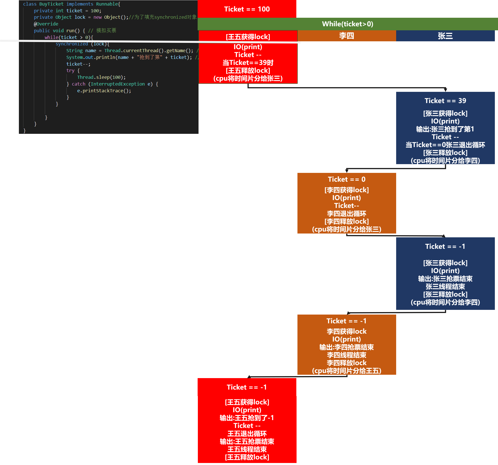
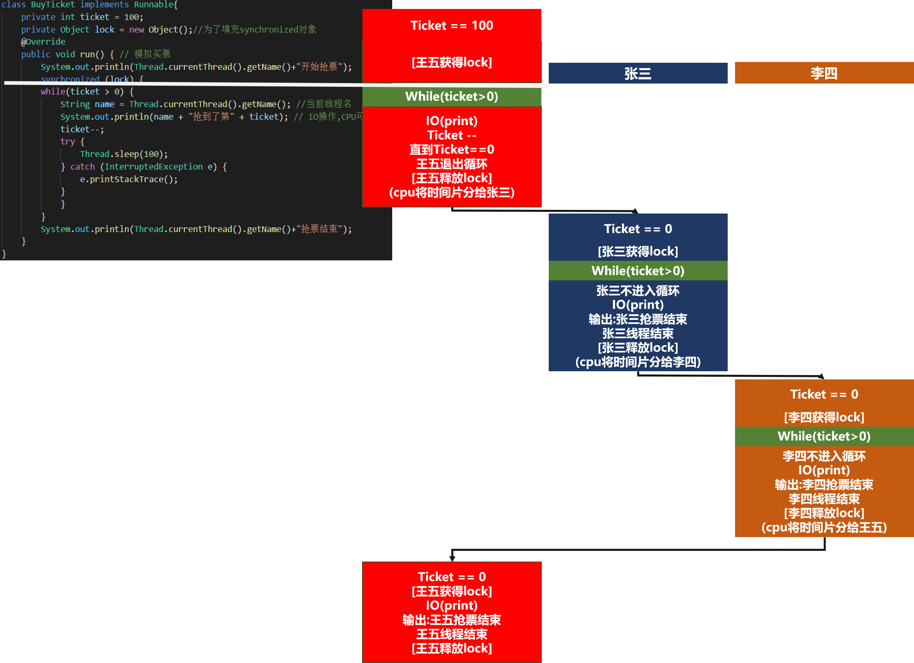
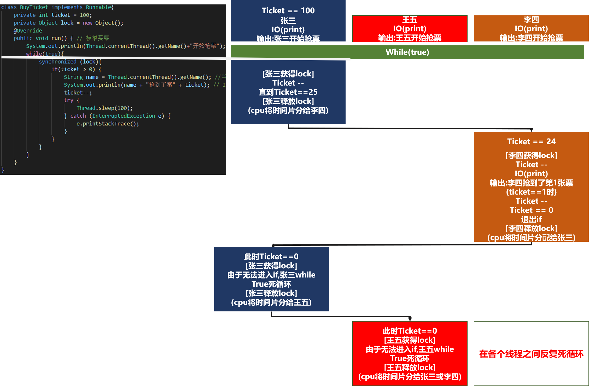
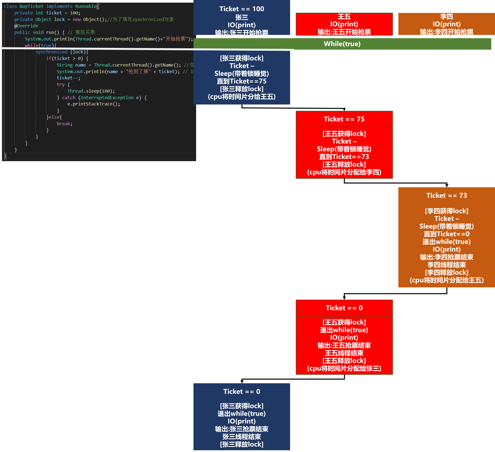

# 多人购票问题

## main方法
```
public class howToBuy {
    public static void main(String[] args) {
        //多人买票,多个线程(未使用任何锁)
//        BuyTicket1 buyTicket = new BuyTicket1();
        //第一次尝试解决
//        BuyTicket2 buyTicket = new BuyTicket2();
        //第二次尝试解决
//        BuyTicket3 buyTicket = new BuyTicket3();
        //第三次尝试解决
//        BuyTicket4 buyTicket = new BuyTicket4();
        //第四次尝试解决
//        BuyTicket5 buyTicket = new BuyTicket5();
        BuyTicket6 buyTicket = new BuyTicket6();
        Thread t1 = new Thread(buyTicket);
        Thread t2 = new Thread(buyTicket);
        Thread t3 = new Thread(buyTicket);
        t1.setName("张三");
        t2.setName("李四");
        t3.setName("王五");
        t1.start();
        t2.start();
        t3.start();
    }
}
```

## 并发修改
```
class BuyTicket1 implements Runnable{
    private int ticket = 100;
    @Override
    public void run() { //模拟买票
        while(ticket > 0){
            String name = Thread.currentThread().getName();//当前线程名
            System.out.println(name + "抢到了第" + ticket); //IO,cpu可能把时间片分给另外一个线程
            //就算没有IO,cpu也可能切换时间片
            ticket--;
            try {
                Thread.sleep(100);
            } catch (InterruptedException e) {
                e.printStackTrace();
            }
        }
    }
}
```
**问题**
- 抢到了重复的票
- 运行结果截取
```
张三抢到了第100
王五抢到了第100
李四抢到了第100
李四抢到了第97
王五抢到了第97
张三抢到了第97
...
王五抢到了第1
张三抢到了第1
李四抢到了第1
```
- 原因分析
  - 张三在进入while循环,做了输出,结果还没有对ticket-1,李四也进入了循环,李四也会显示ticket为100

**解决**
- 加锁,排队买,拿到钥匙的人才能购票 
- 采用"同步"方式解决 
- 计算机中"同步"的概念类似于排队(串行),而不是同时
- 计算机中"异步"类似于并行

**解决方式**
- 通过加锁,通过synchronized来解决,synchronized可以修饰语句块,也可以修饰方法
- 语法 synchronized(对象){}

## 尝试一
- 加入synchronized到while中
```
//第一次解决
class BuyTicket2 implements Runnable{
    private int ticket = 100;
    private Object lock = new Object();
    @Override
    public void run() { //模拟买票
        System.out.println(Thread.currentThread().getName()+"开始抢票");
        while(ticket > 0){
            synchronized (lock){
                String name = Thread.currentThread().getName();//当前线程名
                System.out.println(name + "抢到了第" + ticket); //IO,cpu可能把时间片分给另外一个线程
                //就算没有IO,cpu也可能切换时间片
                ticket--;
                try {
                    Thread.sleep(100);
                } catch (InterruptedException e) {
                    e.printStackTrace();
                }
            }
        }
        System.out.println(Thread.currentThread().getName()+"抢票结束");
    }
}
```

**问题**
- 出现了第0张和第-1张票
- 运行结果截取
```
王五开始抢票 
李四开始抢票 
张三开始抢票 
王五抢到了第100 
... 
王五抢到了第39 
张三抢到了第38 
... 
张三抢到了第1 
李四抢到了第0
张三抢票结束 
李四抢票结束 
王五抢到了第-1 
王五抢票结束 
```
- 图解分析



## 尝试二
- 用synchronized包裹while循环
```
// 第二次解决
class BuyTicket3 implements Runnable{
    private int ticket = 100;
    private Object lock = new Object();
    @Override
    public void run() { //模拟买票
        System.out.println(Thread.currentThread().getName()+"开始抢票");
        synchronized (lock){
            while(ticket > 0) {
                String name = Thread.currentThread().getName();//当前线程名
                System.out.println(name + "抢到了第" + ticket); //IO,cpu可能把时间片分给另外一个线程
                //就算没有IO,cpu也可能切换时间片
                ticket--;
                try {
                    Thread.sleep(100);
                } catch (InterruptedException e) {
                    e.printStackTrace();
                }
            }
        }
        System.out.println(Thread.currentThread().getName()+"抢票结束");
    }
}
```
**问题**
- 一个线程将所有的票都抢光了
- 运行结果截取
```
王五开始抢票 
张三开始抢票 
李四开始抢票 
王五抢到了第100 
... 
王五抢到了第1 
张三抢票结束 
王五抢票结束 
李四抢票结束 
```
- 图解分析


## 尝试三
- 尝试一
  - 将synchronized放入while循环,而票数ticket在while循环外侧,循环的判断条件为ticket > 0
    - 一开始王五拿到了锁,张三李四在各自的while循环入口处等待锁
    - 票数的减少在循环内部
    - 会造成拿到第0张票,第-1张票
- 尝试二
  -  将synchronized包裹while循环
     - 一开始王五拿到了锁,可以进入循环,张三李四无法进入循环
     - 票数的减少在循环内部
     - 会造成只有王五能抢到票
- 尝试三
  -  将synchronized放入while循环,循环始终为true
  - 这样张三,李四,王五都可以进入循环,避免情况二
  - 对票数减少部分上锁if(ticket > 0)

```
//核心代码逻辑
while(true){
    lock{
        if(ticket > 0){
            ticket --;
            try{sleep(); }except{}
        }
    }
}
```

```
class BuyTicket4 implements Runnable{
    private int ticket = 100;
    private Object lock = new Object();
    @Override
    public void run() { //模拟买票
        System.out.println(Thread.currentThread().getName()+"开始抢票");
        while(true){
            synchronized (lock){
                if(ticket > 0){
                    String name = Thread.currentThread().getName();//当前线程名
                    System.out.println(name + "抢到了第" + ticket); //IO,cpu可能把时间片分给另外一个线程
                    //就算没有IO,cpu也可能切换时间片
                    ticket--;
                    try {
                        Thread.sleep(100);
                    } catch (InterruptedException e) {
                        e.printStackTrace();
                    }
                }
            }
        }
    }
}
```

**问题**
- 票数抢完后程序陷入死循环
- 运行结果截取
```
张三开始抢票 
王五开始抢票 
李四开始抢票 
张三抢到了第100 
... 
张三抢到了第25 
李四抢到了第24 
... 
李四抢到了第1 
...
(此时控制台没有输出,实际上是在各个线程间反复切换死循环)
```

- 图解分析


## 尝试四
- 在尝试三的基础上进行改进
- 尝试三
  - 将synchronized放入while循环,循环始终为true
  - 这样张三,李四,王五都可以进入循环,避免情况二
  - 对票数减少部分上锁,if(ticket > 0)
  - 否则,break,退出while true

```
//核心代码逻辑
while(true){
    lock{
        if(ticket > 0){
            ticket --;
            try{sleep(); }except{}
        }else{
            break;
        }
    }
}
```

```
class BuyTicket5 implements Runnable{
    private int ticket = 100;
    private Object lock = new Object();
    @Override
    public void run() { //模拟买票
        System.out.println(Thread.currentThread().getName()+"开始抢票");
        while(true){
            synchronized (lock){
                if(ticket > 0){
                    String name = Thread.currentThread().getName();//当前线程名
                    System.out.println(name + "抢到了第" + ticket); //IO,cpu可能把时间片分给另外一个线程
                    //就算没有IO,cpu也可能切换时间片
                    ticket--;
                    try {
                        Thread.sleep(100);
                    } catch (InterruptedException e) {
                        e.printStackTrace();
                    }
                }else{
                    break;
                }
            }
        }
        System.out.println(Thread.currentThread().getName()+"结束抢票");
    }
}
```

- 图解分析


## 尝试五
- 在尝试四中,lock将票保护起来,在减少ticket后,sleep
    - 即,lock包裹了ticket和sleep
    - 这样就会出现**一个线程抢走一堆票的情况**
    - 因为一个线程在抢票后,带着锁sleep,而其他线程无法获得锁
      - 当cpu将时间片分配给其他线程时,其他线程才有机会买到票
    - 解决这种情况的方法是将sleep和抢票分离,只用lock对ticket的减少保护
      - 一旦ticket减少,本线程sleep,释放锁
      - cpu将时间片分配给其他线程,其他线程获得锁
- 因此,lock只需要包裹ticket即可,sleep可以放在lock外面

```
//核心代码逻辑
while(true){
    lock{
        if(ticket > 0){
            ticket --;

        }else{
            break;
        }
    }            
    try{sleep(); }except{}
}
```
```
class BuyTicket6 implements Runnable{
    private int ticket = 100;
    private Object lock = new Object();
    @Override
    public void run() { //模拟买票
        System.out.println(Thread.currentThread().getName()+"开始抢票");
        while(true){
            synchronized (lock) {
                if (ticket > 0) {
                    String name = Thread.currentThread().getName();//当前线程名
                    System.out.println(name + "抢到了第" + ticket); //IO,cpu可能把时间片分给另外一个线程
                    //就算没有IO,cpu也可能切换时间片
                    ticket--;

                } else {
                    break;
                }
            }
            //将睡眠放在锁外面
            try {
                Thread.sleep(100);
            } catch (InterruptedException e) {
                e.printStackTrace();
            }
        }
        System.out.println(Thread.currentThread().getName()+"结束抢票");
    }
}
```

- 等价写法(使用当前对象this替换在类中声明的私有成员object)
```
class BuyTicket6_2 implements Runnable{
    private int ticket = 100;
    @Override
    public void run() { //模拟买票
        System.out.println(Thread.currentThread().getName()+"开始抢票");
        while(true){
            synchronized (this) {
                if (ticket > 0) {
                    String name = Thread.currentThread().getName();//当前线程名
                    System.out.println(name + "抢到了第" + ticket); //IO,cpu可能把时间片分给另外一个线程
                    //就算没有IO,cpu也可能切换时间片
                    ticket--;

                } else {
                    break;
                }
            }
            //将睡眠放在锁外面
            try {
                Thread.sleep(100);
            } catch (InterruptedException e) {
                e.printStackTrace();
            }
        }
        System.out.println(Thread.currentThread().getName()+"结束抢票");
    }
}
```

## 尝试六
- 使用synchronized修饰类的普通方法
```
class BuyTicket7 implements Runnable{
    private int ticket = 100;
    @Override
    public void run() { //模拟买票
        System.out.println(Thread.currentThread().getName()+"开始抢票");
        while(true){
            if(!buy()) break;
            try {
                Thread.sleep(100);
            } catch (InterruptedException e) {
                e.printStackTrace();
            }
        }
        System.out.println(Thread.currentThread().getName()+"结束抢票");
    }
    public synchronized boolean buy() {
        if (ticket > 0) {
            String name = Thread.currentThread().getName();//当前线程名
            System.out.println(name + "抢到了第" + ticket); //IO,cpu可能把时间片分给另外一个线程
            //就算没有IO,cpu也可能切换时间片
            ticket--;
            return true;
        } else {
            return false;
        }
    }
}
```

## 尝试七
- 使用lock方法手动上锁,解锁(较为少见)

```
//核心代码逻辑(和尝试四逻辑类似)
while(true){
    lock.lock();//手动上锁
        if(ticket > 0){
            ticket --;

        }else{
            break;
        }
    lock.unlock();//手动释放锁            
    try{sleep(); }except{}
}
```
```
mport java.util.concurrent.locks.Lock;
import java.util.concurrent.locks.ReentrantLock;

class BuyTicket8 implements Runnable{
    private int ticket = 100;
    private Lock lock = new ReentrantLock();
    @Override
    public void run() { //模拟买票
        System.out.println(Thread.currentThread().getName()+"开始抢票");
        while(true){
                lock.lock();
                if(ticket > 0) {
                    String name = Thread.currentThread().getName();//当前线程名
                    System.out.println(name + "抢到了第" + ticket); //IO,cpu可能把时间片分给另外一个线程
                    //就算没有IO,cpu也可能切换时间片
                    ticket--;
                }else{
                    break;
                }
                lock.unlock();
                try {
                    Thread.sleep(100);
                } catch (InterruptedException e) {
                    e.printStackTrace();
                }
            }
        System.out.println(Thread.currentThread().getName()+"抢票结束");
        }
    }
```
**问题**
- 手动上锁,解锁会出现问题
  - 当某个线程抢完最后一张票时,程序阻塞
- 运行结果截取
```
王五开始抢票
张三开始抢票
李四开始抢票
张三抢到了第100
李四抢到了第99
...
王五抢到了第3
李四抢到了第2
王五抢到了第1
李四抢票结束
//程序阻塞
``` 

- 图解分析


## 尝试八
- 在尝试七的基础上使用finally
```
//尝试七核心代码逻辑
while(true){
    lock.lock();//手动上锁
        if(ticket > 0){
            ticket --;

        }else{
            break;
        }
    lock.unlock();//手动释放锁            
    try{sleep(); }except{}
}
```
```
//尝试八核心代码逻辑
while(true){
    try{
    lock.lock();//手动上锁
        if(ticket > 0){
            ticket --;

        }else{
            break;
        }
    }
    finally{
        lock.unlock();//手动释放锁
    }            
    try{sleep(); }except{}
}
```
```
class BuyTicket9 implements Runnable{
    private int ticket = 100;
    private Lock lock = new ReentrantLock();
    @Override
    public void run() { //模拟买票
        System.out.println(Thread.currentThread().getName()+"开始抢票");
        while(true){
            try{
                lock.lock();
                if(ticket > 0) {
                    String name = Thread.currentThread().getName();//当前线程名
                    System.out.println(name + "抢到了第" + ticket); //IO,cpu可能把时间片分给另外一个线程
                    ticket--;
                }else{
                    break;
                }
            }
            finally {
                lock.unlock();
            }
            try {
                Thread.sleep(100);
            } catch (InterruptedException e) {
                e.printStackTrace();
            }

        }
        System.out.println(Thread.currentThread().getName()+"抢票结束");
    }
}
```
