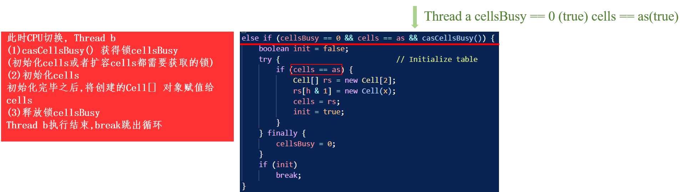

# ConcurrentHashMap


## initTable 初始化构造函数


```
 /**
     * Initializes table, using the size recorded in sizeCtl.
     */
    private final Node<K,V>[] initTable() {
        Node<K,V>[] tab; int sc;
        while ((tab = table) == null || tab.length == 0) {
            // step 1: sizeCtl小于0，这意味着已经有其他线程进行初始化了，所以当前线程让出CPU时间片。直接结束
            if ((sc = sizeCtl) < 0)
                Thread.yield(); // lost initialization race; just spin
            // step 2: 否则，通过CAS操作尝试修改sizeCtl为-1，表示正在初始化，
            else if (U.compareAndSwapInt(this, SIZECTL, sc, -1)) {
                try {
                    if ((tab = table) == null || tab.length == 0) {
                        // 如果之前sizeCtl = 0，使用默认容量（16）进行初始化，否则，会根据之前sizeCtl的值进行初始化
                        int n = (sc > 0) ? sc : DEFAULT_CAPACITY;
                        @SuppressWarnings("unchecked")
                        Node<K,V>[] nt = (Node<K,V>[])new Node<?,?>[n];
                        table = tab = nt;
                        // step3: 计算阈值，n的75%，阈值赋给sizeCtl
                        sc = n - (n >>> 2);
                    }
                } finally {
                    sizeCtl = sc;
                }
                break;
            }
        }
        return tab;
    }
```

## addCount
- 统计concurrenthashMap元素个数,并且在必要的时候扩容
### baseCount 
- node节点的数量,根据cas更新的,有可能不准确,需要结合CounterCells一起计算
```
/**
     * Adds to count, and if table is too small and not already
     * resizing, initiates transfer. If already resizing, helps
     * perform transfer if work is available.  Rechecks occupancy
     * after a transfer to see if another resize is already needed
     * because resizings are lagging additions.
     *
     * @param x the count to add
     * @param check if <0, don't check resize, if <= 1 only check if uncontended
     */
    private final void addCount(long x, int check) {
        CounterCell[] as; long b, s;
        if ((as = counterCells) != null ||
            !U.compareAndSwapLong(this, BASECOUNT, b = baseCount, s = b + x)) {
            CounterCell a; long v; int m;
            boolean uncontended = true;
            if (as == null || (m = as.length - 1) < 0 ||
                (a = as[ThreadLocalRandom.getProbe() & m]) == null ||
                !(uncontended =
                U.compareAndSwapLong(a, CELLVALUE, v = a.value, v + x))) {
                fullAddCount(x, uncontended);
                return;
            }
            if (check <= 1)
                return;
            s = sumCount();
        }
        if (check >= 0) {
            Node<K,V>[] tab, nt; int n, sc;
            while (s >= (long)(sc = sizeCtl) && (tab = table) != null &&
                   (n = tab.length) < MAXIMUM_CAPACITY) {
                int rs = resizeStamp(n);
                if (sc < 0) {
                    if ((sc >>> RESIZE_STAMP_SHIFT) != rs || sc == rs + 1 ||
                        sc == rs + MAX_RESIZERS || (nt = nextTable) == null ||
                        transferIndex <= 0)
                        break;
                    if (U.compareAndSwapInt(this, SIZECTL, sc, sc + 1))
                        transfer(tab, nt);
                }
                else if (U.compareAndSwapInt(this, SIZECTL, sc,
                                             (rs << RESIZE_STAMP_SHIFT) + 2))
                    transfer(tab, null);
                s = sumCount();
            }
        }
    }
```

```
// fullAddCount的参数wasUncontended是由在CAS操作返回的boolean值确定的，默认为true,即没有CAS冲突
 private final void fullAddCount(long x, boolean wasUncontended) {
        int h;
        // step1: 获取线程probe值，如果为0，则初始化当前线程的probe值
        // h <- 线程probe值
        if ((h = ThreadLocalRandom.getProbe()) == 0) {
            ThreadLocalRandom.localInit();      // force initialization
            h = ThreadLocalRandom.getProbe();
            wasUncontended = true; // 由于重新生成了probe,未冲突标志设置为true,表示cas没有冲突
        }
        // step2: 设置第一次不进行扩容，collide为false，进入for循环自旋，3，4，5步为else if 结构互斥，只能进入其中一步
        boolean collide = false;                // True if last slot nonempty
        for (;;) {
            CounterCell[] as; CounterCell a; int n; long v;
            // step3: 如果CounterCell数组不为空，且数组长度大于0，进入以下步骤，注意，以下6步都是else if结构，只能进入其中一步
            // n <- countercell数组长度
            if ((as = counterCells) != null && (n = as.length) > 0) {
                // step3.1: 如果当前线程对应CounterCell数组位置的CounterCell为null
                // n为countercell数组长度,为2的n次方 (n - 1) & h 得到对应的数组下标(hash), a为countercell 中下标 (n - 1) & h 对应元素
                if ((a = as[(n - 1) & h]) == null) {
                    // step3.1.1: 如果cellsBusy == 0,表示数组不在初始化或者扩容
                    if (cellsBusy == 0) {            // Try to attach new Cell
                        // 创建CounterCell 对象r
                        CounterCell r = new CounterCell(x); // Optimistic create
                        // 通过cas设置cellsBusy,防止其他线程对counterCells并发处理
                        if (cellsBusy == 0 &&
                            U.compareAndSwapInt(this, CELLSBUSY, 0, 1)) {
                            // cas成功 cellsBusy设置为1
                            // 初始化对象创建成功标志create 默认为false
                            boolean created = false;
                            try {               // Recheck under lock
                                CounterCell[] rs; int m, j;
                                // counterCells数组非空 且 长度>0 且线程对应counterCells数组索引元素为空
                                if ((rs = counterCells) != null &&
                                    (m = rs.length) > 0 &&
                                    rs[j = (m - 1) & h] == null) {
                                    // 将初始化r对象的元素个数放在对应下标的位置
                                    rs[j] = r;
                                    created = true;
                                }
                            } finally {
                                // 对counterCells处理完毕,恢复标志位
                                cellsBusy = 0;
                            }
                            // 创建成功,退出循环
                            if (created)
                                break;
                            // 表示  rs[j = (m - 1) & h] != null,进行下一次循环
                            // 更新失败,下一次自旋
                            continue;           // Slot is now non-empty
                        }
                    }
                    // 扩容标志设置为false
                    collide = false;
                }
                // 3.2 如果wasUncontended为false,
                // 当前线程的probe != 0(如果当前线程probe == 0,则会在step1中wasUncontended初始化为true),addCountCAS失败
                else if (!wasUncontended)       // CAS already known to fail
                // 设置为true,进入下一次自旋
                    wasUncontended = true;      // Continue after rehash
                // 3.3 指定下标对应的cell值非空(),直接通过cas进行累加
                else if (U.compareAndSwapLong(a, CELLVALUE, v = a.value, v + x))
                    // 一旦累加成功,则退出循环
                    break;
                // 3.4 如果counterCeils的引用发生修改 或者 CounterCells 大于 CPU核心数
                else if (counterCells != as || n >= NCPU)
                    // 扩容标志设置为false
                    collide = false;            // At max size or stale
                // 3.5 如果扩容标志为false,设置扩容标志为true
                else if (!collide)
                    collide = true;
                // 3.6 到此处时表示至少cas了两次Countercell失败
                // 理解: 
                // -- 1.到达3.6 之前一定经过3.3的判断 3.3 CAS失败(如果成功,会跳出循环,不可能进入3.4以后的分支)
                // -- 2.到达3.3 之前一定经过3.2的判断
                // addCount调用fullyaddCount一共有三种情况
                else if (cellsBusy == 0 &&
                         U.compareAndSwapInt(this, CELLSBUSY, 0, 1)) {
                    try {
                        if (counterCells == as) {// Expand table unless stale
                            CounterCell[] rs = new CounterCell[n << 1];
                            for (int i = 0; i < n; ++i)
                                rs[i] = as[i];
                            counterCells = rs;
                        }
                    } finally {
                        cellsBusy = 0;
                    }
                    collide = false;
                    continue;                   // Retry with expanded table
                }
                h = ThreadLocalRandom.advanceProbe(h);
            }
            else if (cellsBusy == 0 && counterCells == as &&
                     U.compareAndSwapInt(this, CELLSBUSY, 0, 1)) {
                boolean init = false;
                try {                           // Initialize table
                    if (counterCells == as) {
                        CounterCell[] rs = new CounterCell[2];
                        rs[h & 1] = new CounterCell(x);
                        counterCells = rs;
                        init = true;
                    }
                } finally {
                    cellsBusy = 0;
                }
                if (init)
                    break;
            }
            else if (U.compareAndSwapLong(this, BASECOUNT, v = baseCount, v + x))
                break;                          // Fall back on using base
        }
    }
```

- 理解:
  - 为什么说到3.6时**代表至少更新了2次CounterCell失败**
  
  - <font color=blue>**addCount**调用**fullAddCount**的三种情况</font>
    - (1) as == null (CounterCell尚未被初始化) 或 (m = as.length - 1) < 0 (CounterCell已经被初始化,但是长度为0)
      - fullyAddCount(x, uncontended); 此时uncontended == true;
    - (2) a = as[ThreadLocalRandom.getProbe() & m] == null (Countercell已被初始化,非空,从中随机取出一个数组,为空)
      - fullyAddCount(x, uncontended); 此时uncontended == true;
    - <b>(3)</b> !(uncontented = U.compareAndSwapLong(a, CELLVALUE, v = a.value, v + x)) (Countercell已被初始化,非空,从中随机取出一个数组,非空,尝试**CAS修改Cell value, 累加v 和 x失败**)
      - 在这种情况下,线程调用addCount之后,才能在第一次自旋中跨过3.1的判断
      - (<font color="red">**CAS失败次数+1**</font>)
      - fullyAddCount(x, uncontended); 此时uncontended == false;
  - <font color=blue>在**fullAddCount**执行到3.6的条件</font>
    - counterCells已经被初始化过(否则无法进入3),并且线程对应的counterCells的cell不为null(否则会进入3.1)
    - 在3.3中**CAS修改Cell value,累加v 和 x失败**,如果CAS成功,则会直接break出自旋,返回addCount
  <!-- - 如果要进入fullAddCount的 step3: 要求countercell不为空,且数组长度 > 0(只有(2), (3)满足)
  - 假设符合<b>(2)</b>的线程进入fullyAddCount:
    - 抵达 3.1 满足条件((a = as[(n - 1) & h]) == null)
      - 不管从3.1中哪个分支退出当前循环,进入下一个循环,只要满足3.1,当前数组上元素为空,在每次循环中,就会一直在3.1
    - 一旦抵达**3.2**,意味着a = as[(n - 1) & h]) != null
    - 而符合<b>(2)</b>的线程一旦进入了3.2,表明其一定在3.1中遭到了CAS失败,否则会跳出当前循环(<font color="red">**CAS失败次数+1**</font>)
    - 抵达3.3,CAS失败,才能往3.6走(<font color="red">**CAS失败次数+1**</font>)
    - 此时经历了<font color="red">3次</font>CAS失败
  - 假设符合<b>(3)</b>的线程进入fullyAddCount
    - 此时在addCount中已经CAS失败过一次
    - 抵达3.3,CAS失败,才能往3.6走(<font color="red">**CAS失败次数+1**</font>)
    - 此时经历了<font color="red">2次</font>CAS失败 -->
  - **所以说抵达3.6代表至少更新了2次CounterCell失败** 
```

```

## concurrentHashMap存储的数据结构

- 结构和hashMap基本一致: 数组 + 链表 + 红黑树
- 存储数据的单元为Node:
  - key, value
  - next
    - 指向下一个节点
    - 解决hash冲突后,生成一个链表(没明白)
  - hash


## concurrentHashMap的负载因子是否可以修改(或者指定)

- ``` private static final float LOAD_FACTOR = 0.75f;```
- 不可修改

## 为什么Node.hash 一般 >= 0

- 特殊节点的hash值都是负数
- ForwardingNode的hash值为-1
  - 该节点出现在扩容的时候,不会储存实际的数据
- TreeBin的hash值为-2
  - 用来表示红黑树(对象)

## sizeCtl
- 表示sizeControl,是一个violate变量
### sizeClt
- sizeCtl == 0时候，默认情况
- sizeCtl == -1 时候，说明table正在初始化
- sizeCtl > 0 时候，说明接下来初始化要的初始化容量或者是扩容成功后threshold的值
- sizeCtl < 0 时候，说明正在扩容
- 注意：sizeCtl是一个volatile变量，只要有一个线程CAS操作成功，sizeCtl就会被暂时地修改为-1，这样其他线程就能够根据sizeCtl得知table是否已经处于初始化状态中，最后sizeCtl会被设置成阈值，用于触发扩容操作。

- sc 和 sizeCtl 表示的含义相同, sc是方法内的局部变量,而sizeCtl是类成员

### 什么情况下 sizeCtl == -1
- 见initTable部分


- table 正在初始化时
- hashMap:延迟初始化
  - 在构造函数中仅仅设置参数
  - 在发生插入时真正初始化(initTable在putVal中被调用)
- concurrentHashMap:采用的也是<font color="green">**延迟初始化(leetcode 480 延迟删除)**</font>的方式
  - 需要确保在并发的条件下,散列表结构(table)只能被创建一次  
  - 当多个线程执行到initTable方法中时
    - 如果一个tabhle从未进行过初始化,sizeCtl == 0是默认情况
    - 第一个执行初始化的线程发现sizeClt >= 0(CASE 2),使用CAS的方式设置sizeCtl为-1
      - CAS执行成功的线程真正执行创建散列表的逻辑(<font color="red">**并发下,只有一个成功**</font>)
      - CAS失败的线程会进行自旋检查,在下一轮迭代中,发现sizeClt < 0(CASE 1)
        - 此时sizeClt == -1,表示已经有其他线程初始化,当前线程短暂的让出时间片,释放占用的CPU


### table初始化之后,sizeCtl > 0,表示的含义
- 此时的sizeCtl表示下次触发扩容的阈值
- 假设table的长度为12,sizeClt为 0.75 * 长度 == 12
- addCount方法中, 插入一个新的元素之后,检查已有元素个数s,发现s >= sizeCtl之后,触发扩容


### sizeCtl是负数,但是它不是-1(sizeCtl < 0 && sizeCtl != -1),此时的含义
- sizeCtl < 0,表示table正在处于扩容状态,当sizeCtl != -1时有
  - 高16位为扩容标志戳
  - 低16位表示当前正在参与扩容的线程数 + 1

### 扩容标志戳必须保证此时参与扩容的每一个线程得到的扩容标志戳相同,否则没有办法实现并发扩容,扩容标志戳的计算方式


- 扩容标志戳由resizeStamp计算
  - 需要保证由size为n的原table扩容至size为2n的新table时,参与扩容的线程的计算结果都是一致的
  - 计算方式如下
    - (1) 得到原表的size的二进制下的前导零数量(最高有效位之前零的数量)
      - 例如,原表size为16,二进制表示为10000,int类型4个字节对应32位数,前导零数量为27,结果为11011
    - (2) 将前导零数量和另一个二进制数(即, 1 << 15)按位或运算,得到的结果为扩容标志戳
  - **扩容标志戳**
    - 由计算方式可知,在多个线程同时参与size相同的原表的扩容时,对应的扩容标识戳(即sizeCtl中国的高16位)是相同的

### ConcurrentHashMap如何保证写数据线程安全
- 写操作(见putVal)


- 当需要往table表上位置i写数据时
  - 当位置i的桶为空(没有头节点以及数据)(2.2)
    - 使用CAS的方式往桶中写入第一个数据来保证线程安全
      <!-- - 如果CAS成功,则本线程退出循环,结束putVal方法 -->
      <!-- - 如果CAS失败,则本线程再次执行写逻辑,再次路由到该桶的位置时,如果此时的桶应该已经有其他线程CAS写入成功过,对应当前位置i桶非空的情况(本轮2.2 下一轮2.3) -->
  - 当位置i的桶非空
    <!-- - 首节点的值为MOVED(2.3) -->
      <!-- - 表示已有线程在对当前的table扩容,当前写线程调用helpTransfer方法帮助扩容 -->
    - 首节点的值非MOVED,可以往其中写数据时(2.4)
      - 对桶中的第一个节点f用**synchronized**进行加锁
      - 使得多个线程往同一个桶内的写入是串行化执行的

### 描述Concurrenhash寻址算法
- ps:在hashMap中的哈希函数为
  - int hash
    - (将hashCode的低16位和高16位进行异或运算)
  - 作用是将hashCode进一步的混淆,增加其随机度
- concurrentHashMap中起到类似作用的是spread


  - int spread
    - (1)扰动运算: 将hash值的高16位和低16位进行异或运算
      - table的size为n,$n = 2 ^ {m}$, hash % n == hash & (n - 1)
      - 通常table的size为16~256,即如果不做处理,对于一个hash值,受到table长度的限制,一般只有4~8位(低于16位)参与与运算,容易和其他的hash值发生碰撞
        - 示例(只考虑低16位, 发生碰撞)
          - index:
            - index1: H1: 00000000 00000000 00000000 00000101 & 1111 = 0101
            - idnex2: H2: 00000000 11111111 00000000 00000101 & 1111 = 0101
        - 示例(低16位和高16位异或, 没有发生碰撞)
          - 00000000 00000000 00000000 00000101 // H1
          - 00000000 00000000 00000000 00000000 // H1 >>> 16
          - 00000000 00000000 00000000 00000101 // hash = H1 ^ (H1 >>> 16) = 5

          - 00000000 11111111 00000000 00000101 // H2
          - 00000000 00000000 00000000 11111111 // H2 >>> 16
          - 00000000 00000000 00000000 11111010 // hash = H2 ^ (H2 >>> 16) = 250
          - index:
            - index1 = (n - 1) & H1 = (16 - 1) & 5 = 5
            - index2 = (n - 1) & H2 = (16 - 1) & 250 = 10
    - `**理解**:异或运算其实是以一种方式在结果中增加了一部分来自原hash值高16位信息量,如果直接用低16位,则高16位信息量一点都没有考虑到,两个不同的hash散列结果只受原hash码低16位影响,容易发生冲突;而使用低16位和高16位异或运算,他们的散列结果会受到低位和高位的共同影响,相对而言发生冲突的概率降低了。
    - (2)确保非负: 异或运算结果 和 HASH_BITS 进行与运算, HASH_BITS为```0x7fffffff```,表示的是 ```0111 1111 | 1111 1111 | 1111 1111 | 1111 1111 ```,即为$2 ^ {31} - 1$(在数值上和Integer.MAX_VALUE相等),这一步的作用是强制将最高位的bit设置为0(这一步的作用是将hash值强制设置为**正数**)

### ConcurrentHashMap如何统计当前table中数据量
- ConcurrentHashMap中实际使用的是longAdder(fullAddCount方法)
#### 为什么不使用AutomicLong这种原子类型？
- AutomicLong自增操作是采用CAS实现的,而CAS在并发量小时性能不错,CAS在并发量大的情况下性能不佳
  - 举个例子:100个线程同时让AutomicLong自增
    - CAS首先比较期望值,如果期望值和内存的实际值是一致的,再执行替换操作
    - CAS对应内核层面为cmpxchg指令,该指令执行时
      - (1)首先会先检查当前平台是否为多核平台
      - (2)如果是多核平台,cmpxchg会通过锁总线的形式来保证同一时刻只能有一颗cpu去执行
    - 如果100个线程同时让AutomicLong自增,这些线程反应到平台上仍然是串行通过的
    - 如果一个线程CAS通过,后面线程对应的期望值都是过期数据,与实际内存值不一致,后面的线程全部会CAS失败
    - 失败之后,会再去读内存中的新值作为期望值,再尝试修改,直到成功为止
    - 即,每次多个线程CAS,只有一个能够成功,其他线程白白浪费CPU资源

#### LongAdder怎么解决AutomicLong在大并发下的性能问题

- AtomicLong是通过无限循环不停的采取CAS的方法去设置内部的value，直到成功为止。那么当并发数比较多或出现更新**热点**时，就会导致CAS的失败机率变高，重试次数更多，越多的线程重试，CAS失败的机率越高，形成恶性循环，从而降低了效率

- LongAdder的原理就是降低对value更新的并发数，也就是将对单一value的变更压力分散到多个value值上，降低单个value的“热度”,碰到热点数据时,将其拆分开,将多个请求命中一个点的情况转换为命中几个不同的点,这样冲突的概率就降低,因此性能得到了提升(空间换时间) 

#### LongAdder的内部结构
- 作用
  - 在高并发的情况下实现高性能的统计,始于jdk1.8
  - 在jdk1.8之前,使用AtomicLong来在高并发的情况下实现统计的功能 
- 大致过程


- (1) 在线程没有发生竞争时,多个线程会以CAS的方式来写BASE
- (2) 一旦发生线程并发问题,即在(1)中表现为CAS失败返回false
  - 此时线程会创建cells数组
  - 每个cell单元存的为一个value
  - 每个线程通过将其对应的hash值进行位运算(同hashmap寻址算法同一个逻辑)得到一个桶位(cell)
- (3) 求和
  - <font color=red>base</font> 加上<font color=red>cells中所有cell</font>的value
- 核心字段
  - long型的baseCount
  - CounterCell[]
    - CounterCell中的成员为volatile long value
- 使用LongAdder的过程中,如果从来没有CAS修改base失败过,数据就会全部以CAS的方式累加到base 
- 当某个线程与其他线程产生冲突,CAS修改base失败时

#### LongAdder
- 继承自**Striped64**
- LongAdder自身没有field <font color=red>base</font>和<font color=red>cells</font>,base 和 cells为继承自Striped64的field


- 其中,<font color=red>longAccumulate</font>是**Striped64**中的方法

##### Striped64
- Cell[]cells
  - Cell 
    - volatile long value
  - base

#### Striped64.longAccumulate
- **CASE2中 else if (cellsBusy == 0 && cells == as && casCellsBusy)中cells == as的作用**


- **CASE2中 分支内 cells == as的作用**





- ps: 感觉这里有点像单例模式下的双重校验

- **CASE1.2 中关于wasUnContended标志(未冲突标志)的理解**


- **CASE1.3: 为什么说对应的情况为当前线程rehash过hash值,且命中的cell非空**
  - 如果线程第一次使用LongAdder.add方法,没有被分配过hash值,CAS cells[0]竞争失败 --> Striped64.longAccumulate 
    - 未冲突标志为false
    - 进入1,得到分配后的hash值(**rehash**),未冲突标志重新设置为true
    - 如果新命中的cell非空 --> CASE 1.3
  - 如果线程之前使用过LongAdder.add方法,获得过hash值, CAS cells[hash & (cells.length - 1)] --> Striped64.longAccumulate 
    - 未冲突标志为false
    - 进入CASE 1.2 未冲突标志设置为true,结束1.2
      - 在本轮迭代中通过``` h = advanceProbe(h) ```的到新的hash值（**reshash**）,自旋
    - 如果新命中的cell非空 --> CASE 1.3
  - <font color=red>只要能够抵达CASE 1.3,表示当前线程都先CAS失败过一次,随即rehash过一次</font>

- **CASE1.4: 抵达CASE1.4的线程都发生过两次竞争CAS 增加Cell value失败以及随机rehash过1次**
  - 具体分析见图  


- **CASE1.1: 对同一个Cell单元两次判断原因分析(a = as[(n - 1) & h]) == null 和 rs[j = (m - 1) & h] == null两处**


- **CASE1.6: 在执行真正的扩容逻辑之前对cells == as的判断也是出于和CASE1.1类似的原因**
  - CASE1.1: 避免重复创建Cell单元
  - CASE1.6: 避免重复扩容(分析见图)


- **CASE 1补充1: CASE1.1 和 CASE1.6**
  - (个人理解)
    - 在并发情况下,要真正对cell单元(CASE1.1) 或 cells数组(CASE 1.6)执行一些操作之前的判断 是将对象当前的状态 (左值) 与对象的期望状态(右值,对象的副本)比较,如果相等执行后续的操作
      - CASE1.1:```rs[j = (m - 1) & h] == null```
      - CASE1.6:```cells == as```
    - 这种方式感觉类似于CAS,如果当前值和期望值相等(比较),则执行后续操作(交换)
- **CASE 1补充2: 关于标志位wasUnContended 和collide理解**
  - wasUncontended是未冲突标志,默认为true
    - 一旦线程在获得过hash值之后,调用LongAdder.add方法时CAS 累加Cell value失败,wasUncontended才会被设置为false,表示发生了真正的竞争冲突
  - collide表示扩容意向,默认为false
    - 当在竞争累加竞争CAS Cell较为激烈时,collide才会被设置为true(可以理解,当前cells容量过小,所以线程在往某个cell写数据时,容易与其他线程发生冲突)
    - 在CASE1.5s时会被设置为true
      - 而在抵达CASE1.4时,线程就已经CAS在不同的Cell上累加数据失败过两次
      - 因此,能够抵达CASE1.5表明当先线程的竞争较大
  - wasUncontended 和 collide的作用是尽可能使线程对Cell的竞争降低 collide是基于wasUncontended的判断(两步判断)
  
```
for(;;){ // 自旋
  if(){  // CASE 1:Cells已经创建
    if(){
      ...
    }else if(!wasUncontended){ // CASE 1.2
      wasUncontended = true;
    }else if(){

    }else if(!collide){ // CASE 1.5
      collide = true;
    }else if(){ // CASE 1.6 真正执行扩容的逻辑

    }
    h = ThreadLocalRandom.advanceProbe(h); // rehash,用于得到一个新的Cell

  }else if{ // CASE 2:Cells 未创建

  }else if{ // CASE 3:抢占Cells锁失败

  }

}
```

- 分析:
  - (1)只有在CASE1wasUncontended和collide才会起到作用
  - (2)整体而言,wasUncontended和collide都是来控制线程抵达真正扩容分支CASE1.6的进度
    - 在CASE1.2 中
      - 如果, 此时wasUncontended为true(<font color=blue>当前线程与其他线程竞争cells并不激烈</font>),则在本轮迭代中可以抵达CASE1.3及后续的分支(<font color=blue>后续分支中存在分支涉及对cell单元的CAS操作,获得cells的锁</font>)
        - <font color=red>换言之,在**本次**迭代中线程有可能真正执行扩容逻辑</font>
        - 否则, 此时wasUncontended为false,(<font color=blue>当前线程与其他线程竞争cells非常激烈</font>)
        - 在本轮自旋中,线程进入CASE1.2,wasUncontended <- true
        - 线程**rehash**
        - 进入下一轮自旋
        - 在下一轮自旋时,由于wasUncontended被设置为true,到那时线程才能抵达CASE1.3及后续分支
        - <font color=red>换言之,在**下次**迭代中线程才有可能真正执行扩容逻辑,变相的缓解对cells的竞争</font>
      - 在CASE1.5中
        - 如果,此时collide为true,在本轮迭代中线程可以执行CASE1.6,可能回会真正执行扩容
        - 否则,此时collide为false
          - 在本轮自旋中,线程进入CASE1.5,collide <- trues
          - 线程rehash
          - 进入下一轮自旋
          - 在下一轮自旋中,线程才有可能抵达CASE1.5之后的分支
        - CASE1.5(基于collide标志,来决定在本轮迭代中是否进入真正的扩容分支CASE1.6)是在CASE1.2(基于wasUncontended来判断在本轮迭代中是否进入后续分支),可以理解为,只有在当前线程与其他线程竞争cells不太激烈时,才考虑让当前线程进行扩容;否则,让当前线程rehash并自旋尝试命中其他的cell单元

- **CASE 3:什么情况下会使用CASE3**
  - 在分支CASE 1 和 CASE 2中,线程a获取到了锁
    - CASE 1:cells已经完成了初始化，线程a抢占到了casCellsBusy锁
      - 两种在CASE 1中可能会抢占到casCellsBusy的情况
        - CASE 1.1:命中的cell为null,需要创建cell对象时抢占到了casCellsBusy
        - CASE 1.6:当多次CAS累加cell value时失败,竞争较为激烈,需要扩容时当前的线程抢占到了casCellsBusy
    - CASE 2:cells并未初始化,需要初始化cells数组时 抢占到了casCellsBusy
  - 线程b在CASE1 或者 CASE2中想要获得锁但是此时锁已经被占用了,就会进入CASE 3,以CAS的方式将值累加到base中
  
  
### sum 得到的是一个近似值,而不是一个精确值
### 扩容
#### 触发扩容条件的线程,执行的预处理工作都有哪些?

- 参考addCount方法(2)

- (1) 修改sizeCtl
  - sizeClt == 0(2.2):
    - 表示当前尚未有线程进行扩容,而且没有线程执行initTable,当前线程CAS修改sizeClt,设置低位+2(高16位不发生改变, 值 0 --> -2)
  - 当sizeCtl < 0时(2.1)
    - sizeCtl == -1,表示有线程正在执行initTable,初始化table
    - sizeClt <= -1 当前table正在扩容
     - 回到问题,如果当前线程为触发扩容的线程,则当前线程需要CAS修改sizeCtl为sizeClt(低16位) + 1(高16位不发生改变, 值 -1 --> -2, -3 --> -4),表示当前扩容线程数+1


- (2) 将原表每个桶中的节点移动或者复制到新表中的桶中,使用transfer方法,新表为volate 变量 nextTable(参考transfer)
  - 如果该线程是第一个进行扩容的线程,则nextTable为null,则需要多一个创建新表的步骤
    - 原表的长度为n
    - 创建一个长度为2 * n的新表
    - 使用新表的引用更新nextTable,用原表的长度n更新transferIndex
      - nextTable
        - 表示的是扩容后新的数组
      - transferIndex:
        - 总迁移进度,表示需要迁移的桶的数量或者说是索引
- (3) 扩容线程的迁移工作是从高位桶开始,一直迁移到下标为0的桶

#### 原表中迁移完成的桶如何标记
- 使用ForwardingNode
  - 如果原table中桶中的元素被迁移到新的table中,会在原table中桶对应的位置上插入一个ForwardingNode临时节点
    - 该节点标记原桶对应的位置中的元素已经迁移完毕
    - 该节点内部的nextTable指针会指向新的table

#### ForwardingNode还有别的什么功能?
- 在写操作(putVal方法)中,
  - 如果发现桶中的首节点的hash值为-1(和常量MOVED相等)
  - 碰到了ForwardingNode时,当前线程帮助扩容,调用helpTranserfer方法
  - ```else if ((fh = f.hash) == MOVED) tab = helpTransfer(tab, f)```
- 在读操作(get方法)中,
  - 如果发现桶中的首节点的hash值 < 0
  - 意味着当前节点e可能是红黑树对象 或者 是forwardingNode,会调用该节点的find()方法
  - 碰到了ForwardingNode时,内部类ForwardingNode中重写了Node中的find方法:当查询(读)的时候一旦碰到了ForwardingNode,会通过ForwardingNode中内部的nextTable找到新table,继续读
  - ```else if (eh < 0) return (p = e.find(h, key)) != null ? p.val : null;```


#### table正在扩容时,此时再来一个写请求,此时如何处理？
- 分情况(putVal方法中)
  - 如果该写请求对应的桶还没有被迁移(对应for循环中的else分支),接下**来获得桶的锁**,进行正常的插入操作(putVal 2.4)
  - 如果该写请求对应的桶已经被迁移(对应for循环中的else if ((fh = f.hash) == MOVED))分支(putVal 2.3)
    - 则该写请求帮助扩容(helptransfer)
    - 在扩容过程中对原table种桶f迁移时,也会对桶上锁(transfer)
  - 如果该写请求对应的桶中无任何节点,则以CAS的方式在桶的位置新建一个节点(putVal 2.2)
  
  

  - <font color="red">**在这里,对桶的操作是同步的,不存在并发问题**</font>
  - **理解**
    - 扩容过程种,所有的原表中的桶都需要被迁移
    - (1)情况一:当前的桶尚未被迁移(先插入,再迁移)
      - 对桶加锁-->插入元素-->释放锁-->轮到该桶被迁移-->对桶加锁-->迁移元素-->释放锁
    - (2)情况二:当前的桶正在被迁移(先迁移,再插入)
      - 轮到该桶被迁移-->对桶加锁-->迁移元素-->释放锁-->对桶加锁-->插入元素-->释放锁
  - 写线程协助扩容逻辑(```private final void transfer(Node<K,V>[] tab, Node<K,V>[] nextTab)```):
    - 根据transferIndex规划当前线程迁移任务区间
    - 例如规划到原table的[a, b],原table 的size为n
    - 则该线程对应的任务区间即为扩容后新table的[a + n, b + n]
    - 当前线程迁移结束,如果此时transferIndex > 0,表示还有区间没有迁移完,于是根据当前的transferIndex去分配下一个区间,直到transferIndex为0
    - 当前线程可以返回到写数据逻辑中,最终数据会被写入到扩容后的新table中


#### 扩容期间,扩容工作线程如何维护sizeCtl低16位?
- 每个执行扩容任务的线程,在开始工作之前,都会更新sizeCtl的低16位,使低16位+1
  - addCount和helpTransfer**等**方法都可以通过CAS的方式使扩容线程+1(sizeClt低16位+1),然后再调用transfer方法
  - addCount调用transfer
    - 当前增加了table元素之后,table中已有元素可能达到阈值,会调用transfer方法加入扩容
    - 使用CAS使扩容线程+1,CAS成功,调用tranfer
  - helpTranfer调用transfer
    - 写线程putVal时,当发现需要写的桶上有其他的线程在扩容,会调用helpTransfer方法帮助扩容
    - 在helpTransfer方法中,使用CAS使扩容线程+1,CAS成功,调用transfer

(addCount中调用transfer,调用之前使用CAS将sizeCtl低16位+1)


(putVal中调用helpTransfer)


(helpTransfer中调用tranfer,调用之前使用CAS将sizeCtl低16位+1)


- 在无法获得新的迁移任务区间时,扩容线程退出扩容任务,在退出之前,会更新sizeClt的低16位,使低16位-1
  - 在transfer方法中


#### 最后一个退出扩容任务的线程还有哪些收尾工作?
- 最后一个退出扩容任务的线程收尾工作的逻辑在transfer中
- (1)通过CAS的方式使得sizeClt的低16位 - 1
- (2)判断自身是否为最后一个退出扩容任务的线程
  - ```当前sizeClt - 2 == 扩容标志戳 << 16位```,则表示当前线程为最后一个退出扩容的线程
  - 如果不是最后一个线程,此时退出扩容逻辑
- (3)设置扩容结束标志finishing和推进标志为true,设置循环中当前区间可以处理的最大下标i为n(**意图是再次循环检查一下整张原table,是否有遗漏的桶,遗漏的桶是指之前多线程迁移时,可能多个线程都竞争桶失败中,遗漏搬运的桶**)    (transfer 2.2.2)
  - 判断遗漏的桶
    - 如果该桶为空(遗漏的桶,设置为forwardingnode)
    - 如果该桶非空且hash值不为forwardingnode,加锁搬运(2.5),此时只有一个线程对桶进行transfer操作,所以不用担心失败问题(此时之后的分析是我猜的)
  - <font color=red>对应transfer(2.2.2),i <- n之后,源码中的注释为**recheck before commit**,过程理解如下</font>
- **recheck before commit 过程梳理**

- 2.2.2 此时```finishing == advance == true, i == n```,进入下一轮的2.1


- 2.1.1 ```if(--i >= bound || finishing)``` --i之后,i为n-1,且finishing为true,所以线程会进入2.1.1 执行完毕后```advance <- false```
- 线程抵达2.2 部分,此时 ```i == n - 1```,不满足```2.2 的条件 if(i < 0 || i >= n || i + n >= nextn)```,此时会根据当前的条件,选择(2.3 - 2.5)
  - 2.3-2.5是根据table[i]中桶的状态来占位,跳过或扩容
  - 当前结束扩容的最后一个线程是检查原表[0, n-1]每个桶中是否有遗漏占位或搬运节点的桶


- 假设table[i](```i == n - 1```)上桶的hash为MOVED,表示该桶已经被成功迁移,进入2.4
- 进入2.4之后,在下一轮循环中进入2.1.1,--i,此时```i == n - 2```
- 假设table[i](```i == n - 2```)上桶的hash为MOVED,表示该桶已经被成功迁移,进入2.4
- ...(即从i == n - 1出发,再次扫描一下原表中是否有空桶或者桶在非空的情况下hash是否为MOVED(即为forwardnode,forwarding node表示占位成功的节点,其hash值为-1)所谓的recheck before commit)

### 假如某个桶已经升级成红黑树,并且有读线程正在这棵树上查询数据,此时又有一个写线程,那么该写线程能否到该树上写数据?
- 不能写
- (1) 往红黑树上写数据可能会导致红黑树失衡,然后会触发自平衡操作,导致红黑树的结构发生变化,读线程在一颗发生结构变化的树上查询数据是不现实的

### 过程
#### <font color=blue>写线程准备往treeBin上写数据时,发现红黑树上还有一个读线程</font>
#### 读线程继续执行
- 对红黑树的处理基于内部类TreeBin
- TreeBin中中有一个volatile int 字段 lockState
- (1)首先是写线程需要等待,读线程先完成读treeBin
  - 每个读线程(指的是读treebin对象,会调用treeBin的find方法的线程(但是真正从treeBin上读数据是在find中调用findTreeNode))在读数据之前,会使用CAS的方式将lockState + 常量READER, READER的值为4
    - ```U.compareAndSwapInt(this, LOCKSTATE, s,s + READER)```
  - 读完数据之后,同样会使用CAS的方式将lockState值 + (- READER)
    - ```if (U.getAndAddInt(this, LOCKSTATE, -READER) == (READER|WAITER) && (w = waiter) != null)```
  - 最后一个读线程读完数据之后,如果发现此时存在一个等待者线程在等待操作treeBin,会使用upark让写线程恢复运行状态
    - 最后一个读线程将lockState CAS -4之后,此时的lockState对应的waiter 和 reader的标志为1,其他的标志位为0
  - (见find)


- (2)然后时等待的写线程开始写操作
  - 每个写线程(指的是准备往treebin对象上写数据,调用treeBin的putTreeVal方法的线程)
    - 在写数据之前,**检查lockState是否为0**(<font color="red">**putTreeVal-->lockRoot**</font>)
      - 如果为0,说明这棵树上没有读线程在访问数据,此时写线程使用CAS的方式将lockState设置为1(表示加上写锁)
    - 一旦加上了写锁,其他线程就无法访问红黑树结构了
  - (见lockRoot方法)


#### 如果写线程发现lockState非0
- 如果非0或者CAS设置失败
  - <font color="red">**putTreeVal-->lockRoot-->contentLock**</font>
- **contentLock**方法
- 如果当前lockState为WAITER(lockState bit第二位为1),当前写线程处于等待状态,并且此时没有其他的写线程或者读线程占用Treebin
  - 对应contentLock分支1
  - 当前线程以CAS的方式去抢占写锁
- 如果当前lockState为READER 或者 WRITER(lockState bit第二位为0),表示此时有其他读线程或者写线程占用Treebin
  - 对应contentLock分支2
  - 当前线程以CAS的方式去设置WAITER标志位(lockState bit第二位),一旦设置成功,将waiter标志位设置为true,当前线程对象赋值给waiter,在下一轮迭代中进入contentLock分支3,调用LockSupport.park方法将当前线程**挂起**


#### 被挂起的写线程,在什么时候会被唤醒,然后继续执行
- 见find操作
- 每一个读线程完成节点的的查询之后,都会使用CAS的方式将lockState - READER,如果CAS成功后发现lockState的READER和WAITER标志位为1(其他标志位为0) 且waiter 不为空,则表示当前完成读操作的线程是最后一个读线程,并且有一个写线程处于等待状态
- 此时最后一个读线程调用upark()方法让写线程恢复运行状态


#### 读线程准备往treeBin上读数据时,发现红黑树上还有一个写线程
- 见find操作
- TreeBin在设计时保留了两个数据结构:红黑树和链表
- 当前的lockState上WAITER或者WRITER的标志位上为1(WRITER标志位为1,表示当前有写线程在对Treebin操作)
  - 此时读线程肯定不能到当前写线程所在的TreeBin上访问数据
  - 读线程在保留的链表结构上去访问数据


