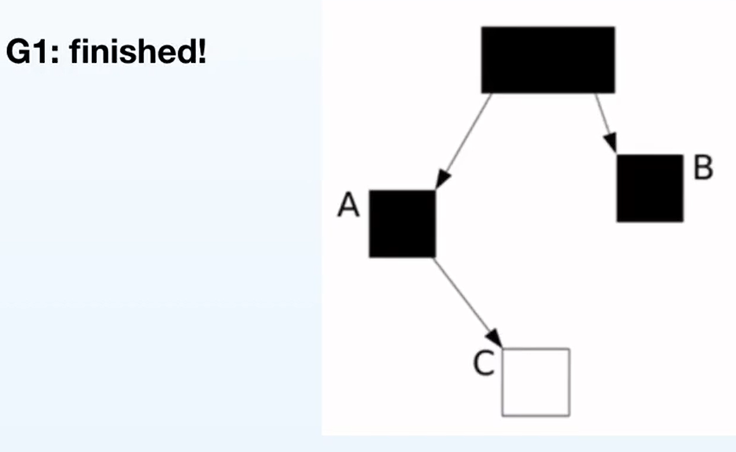

# 垃圾对象
- 通过任何方式都无法访问到(通过任何方式都无法在jvm中找到该对象的引用)的对象可以认为是垃圾对象
- GC Roots不是垃圾, 能通过GC Roots访问到的对象也不是垃圾对象

# GC收集算法
- Mark-Sweep
  - 即标记-清除
- Mark-Sweep-Compact
  - 即标记-整理(带有<font color="red">**压缩**</font>功能)
- Mark-Copy
  - 即复制(可以认为带有<font color="red">**压缩**</font>功能)
# GC收集器
## 古典时期
- Serial
  - **串行**:用一个GC线程使用单核cpu来回收垃圾
  - 年轻代: Serial
  - 老年代: SerialOld
- Parallel
  - **并行**: 在一段时间内, 多个GC线程使用多核cpu来回收垃圾
  - 年轻代: Parallel Scavenge
  - 老年代: Parallel Old
## 中古时期
 

- CMS
- 早期GC(图左侧)
  - (1)用户线程运行,stop the world,用户线程暂停
  - (2)用一个GC线程(串行) 或多个GC线程(并行)来收集垃圾
  - (3)用户线程运行
- CMS(图右侧)
  - (1)Initial Mark: 先进行一个短暂的stop the world pause,在这一阶段initial Mark
  - (2)Concurrent Mark: GC线程和用户线程同时(concurrent 并发的意思)运行
    - 用户线程在运行时会修改堆的状态,GC线程没有办法知道准确的堆的状态
  - (3)Remark: 由于(2),再次进行一个短暂的stop the world pause, 用多个线程将堆的状态修改为最新的, 这样就可以清楚的知道堆的哪些对象存放的是垃圾
  - (4)Concurrent Sweep:用一个和用户线程并发进行(concurrent)的GC线程(最左边的黄色,蓝色线)清理垃圾
  - 进化: GC线程串行GC --> GC线程并行GC --> GC线程和用户线程并发GC
  
  - 特点:
    - 低延时系统
    - 不进行compact(使用的是Mark Sweep,不具有压缩功能)
    - 用于老年代
    - 配合Serial / PairNew使用

  - 缺点:
    - 使用Mark Sweep,会产生大量的内存碎片
    - 无法和Parallel 的年轻代的收集器(Parallel Scavenge)搭配使用,因此研发了**Pair New**收集器
  - add:
    - (1)CMS 在19年12月已经移除了标准的jdk
    - (2)为什么**年轻代**不能用CMS
      - 年轻代GC需要拷贝对象(从from survivor拷贝到to survivor中),需要用到**Mark Copy**,而CMS是Mark Sweep,不适用于年轻代GC

```
评论区
解释下为什么年轻代一般都使用的copy:
(1) 年轻代 回收效率高  
(2) 年轻代 一般不会很大 
以上2点其实都是根据它的特点来的: 朝生夕死.
使用copy的原因是 它快, 不需要额外的压缩, 没有碎片.  它的缺点就是空间利用率会低一些. 但是本身年轻代不会太大, 所以这个缺点也就不是很严重
```

### 垃圾收集器出现过程(传统的GC算法)
- (1) GC串行 serial serial Old
 
- (2) GC并行 parallel scavenge parallel Old
 
- (3) GC线程和用户线程并发 CMS concurrent mark sweep

- (4) CMS需要和一个较为高效的年轻代收集器配合使用--> Pair New


# G1
- jdk9之后的默认垃圾收集器
- 软实时,低延时,可设定目标
  - 可设定目标:
    - 参考官方文档: G1 can meet the pause time goals that were set using -XX:MaxGCPauseTimeMills and -XX:PauseTimeMills
    - 可以通过设定目标,来保证每次GC的停顿时间不超过某个毫秒(默认为250ms)
    - G1会尽最大可能满足,但不能保证
- 适用于较大的堆(> 4 ~ 6G)
- 用于替代CMS

## G1产生的原因
- 现在的堆变大,G1非常适合在大堆上GC
  - 原因在于: 
    - 当堆变大时,需要把堆完整回收一遍的延时更高
    - 串行,并行,CMS进行GC时,要么不进行回收,要么回收整个年轻代,整个老年代,会造成极高的延时

## G1的年轻代和老年代使用的GC算法
- 年轻代
  - STW, Parallel, Copy
- 老年代
  - Mostly-concurrent Marking
  - incremental compaction
  
## G1的内存布局


- eg:默认分为2048个区域,假设内存为2G,则每个区域region默认大小为1M
- 每个区域可能是Eden, Survior,Old和Humongous(超大对象, 老年代)
  - 如果一个对象超过一个region的一半,那么该对象会被直接分配到humongous

## G1回收细节

- 两种GC方式中,Mixed GC包含了一次Fully young GC(全年轻代GC)

## 可能存在的问题
- G1希望在GC时,每次只回收一小块区域,这样可以使得每次GC的延时都非常低
  - **带来的问题**
    - (1) 老年代对象可能持有年轻代对象的引用(跨代引用)
    - (2) 不同的Region之间相互引用

### 跨代引用


- Eden区中看上去只有E, F, G,在没有GC ROOTS指向的对象的时候表面上似乎可以直接回收掉这一块区域


- 其他的区域可能有指向Eden的指针,以至于我们不能安全的回收掉Eden,因此需要采取一种方法来知道有哪些Eden区域之外的对象引用了eden,才能安全的回收eden


### Card Table & Remembered Set


- Card Table & Remember Set
  - 将整个堆划分为一个个大小为512字节的卡，并且维护一个卡表，用来存储每张卡的一个标识位。这个标识位代表对应的卡是否可能存有指向**新生代对象的引用(或者对应的内存空间发生改变,即<font color=red>赋值</font>操作发生)**。如果可能存在，那么我们就认为这张卡是脏的。(之后该region 中remember set中对应的引用指向被赋值的对象对应的region 中的card)
  - 假设一个region的大小为1M(1024 * 1024 Byte), 则对应卡表上大概2000张卡(entry)
  - (1)上图中有三个Region，每个Region被分成了多个Card，在不同Region中的Card会相互引用，**Region1中的Card中的对象引用了Region2中的Card中的对象**，蓝色实线表示的就是points-out的关系，而在**Region2的RSet中，记录了Region1的Card**，即红色虚线表示的关系，这就是points-into。
  - (2)在回收Region2时,通过Region2的Rset就可以知道Region1喝Region3中的card引用了Region2,因此**只需扫描Region2和Region3对应的card就行**,避免了整堆扫描

### 怎么知道某个Card中对应的内存空间发生了改变--Write Barrier
- 该Write Barrier非并发中的write barrier
- wiki: 垃圾收集器中的write barrier
  - A write barrier in a garbage collector is a fragment of code emitted by the compiler immediately before every store operation to ensure that (e.g.) generational invariants are maintained. 
  - 在垃圾收集器中, write barrier 是在每个store操作前由编译器及时生成的一小段代码用于保证代间的关系可以维护。

- **write barrier**

- ```oject.field = <reference> (putfield)``` 指的是java中的赋值操作,jvm每执行到该赋值操作时,会额外产生一个引用,在字节码层面为putfield指令,jvm会产生一小段代码,将其记录在rset中
  - a = b // 字节码层面为(putfield)

  - 此时jvm会更新b对象所在的rset(并不是立即更新)
    - 在将region A中a对应的**card(卡表)标记为dirty后**
    - 
    - 将card放入dirty card queue
    - (此时并没有立即更新B 的rset),不**立即更新**的原因在于
      - java是多线程的,如果在更新完指针(```a = b```)后立即更新B的rset,可能会发生多个线程竞争写B的rset的情况(可能Region A中有多个对象的引用都指向B中的对象),需要付出较多的开销
      - G1采取的策略是在card 被标记为dirty之后, 不立即更新rset,而是将card 加入队列(即dirty card queue)中

- **dirty card queue**
  - 其中的dirty card分为白/绿/黄/红四种颜色

- White区域: 表示此时card的状态更新较慢, dirty card 增加
- Green区域: Refinement线程(优化线程)
  - Refirement线程从队列中拿出脏卡,更新b中的rset
  - 
- Yellow区域: dirty card更新速度非常快, 此时refirement线程全部被激活,全力以赴更新rset
- Red区域: 使应用线程也加入工作,放缓应用线程,减少脏卡的产生速度,加快rset的更新速度

# G1的GC工作流程
## G1的GC工作流程--Fully Young GC


### 1.STW(Evacuation Pause)
  - 把整个堆疏散,然后暂停(如图所示),疏散体现在把不同的堆拷贝到另外的区域中


- 构建CS(Collection Set),决定要回收哪些区, 在Young GC中回收Eden + Survivor即可
- 在**stw期间**的操作包括**扫描GC Roots**, **Update RS**,**Process RS**
#### 1.1 扫描GC Roots
#### 1.2 Update RS: 将所有的rset更新为最新状态

#### 1.3 Process RS: 找到被哪些老年代对象所引用
- 如图,此时的rset只记录了region B中对象b被region A中a所引用(即**region A中a对应的card是脏的**),但不知道a属于哪种对象
- 
- 在这一步,对于region B的rset来说, 需要扫描记录的dirty card对应的对象a

#### 1.4 Object Copy
- 年轻代中: 把Eden 和 Survivor From 中所有的活对象拷贝到另外一个Survivor区域的过程

#### 1.5 Reference Processing
- 在这一阶段处理各种引用

- 

### 2.G1记录每个阶段的时间,用于自动调优
### 3.记录Eden/Survivor的数量和GC时间
- 如果GC时间没有达到设定的GC时间,例如,设定的GC时间过短
#### 3.1 根据暂停目标自动调整Region的数量
- 假设年轻代100G,回收花费了100ms,而设定的时间为50ms
- G1只能把年轻代数量减少
#### 3.2 暂停目标越短,Eden数量越少
- 年轻代数量减少后,年轻代GC会发生的非常频繁,但是每次GC的时间缩短来达到设定的目标
- 年轻代GC过于频繁会使得较多的cpu时间发生在年轻代GC,能够响应用户线程的cpu时间减少,会造成**吞吐量下降**

## G1的GC工作流程--Old GC


- 如何在应用程序在不断更新堆的状态的情况下标记出堆中所有的活对象--**三色标记算法**
- (1) 标记GC Roots(黑色), GC Roots所指向的所有对象都为灰色,将所有的灰色对象放入一个队列中


- (2) 队列中出队一个灰色对象,将其标记为黑色
  - 该原灰色对象引用的对象标记为灰色
  - 逐一清空当前的灰色对象(bfs) 


- (3) bfs结束,此时所有的对象都是黑色


- 此时,应用线程同时在执行,可能会发生**lost object**问题
- (1) 当前状态,GC的并发标记线程执行


- (2) GC并发标记线程执行到某一刻,cpu切换到用户线程修改 
  - A.c = C


  - B.c = null


- (3) GC并发标记线程恢复,将B染成黑色,此时对于并发标记线程来说,所有的对象都被标记为黑色,并发标记线程结束


- **产生的问题**
  - 本来C是活对象,由于用户线程和G1GC标记线程执行上的时序问题,**活对象C没有被标记出来--Lost Object问题**
  
  ### Lost Object问题解决
  - 同样基于**Write Barrier**
  
  - 在```B.c = null```后记录C,在垃圾回收时不回收C
    - 可能引发的另外一个问题是**浮动垃圾**
    - 即:在B.c = null之后,C可能为可达对象,也可能为垃圾(不可达对象),为了安全起见,G1GC时不回收C(认为在B.c = null之后C可能变为了可达对象)
      - B.c = null 之后, C可能为可达对象, 也可能仍是不可达对象
      - 当在赋值操作后, C仍为不可达对象时,G1GC不会回收C,此时的C被称为**浮动垃圾**

- 该机制被成为Snapshot-At-The-Beginning(**SATB**),
  - 顾名思义,在<b>初始标记(initial-mark)</b>时,记录一下快照(C的状态),在<b>重新标记(remark)</b>时,根据C的状态,决定是否要将C垃圾回收
  - (1)STW(Fully Young GC) 
    - 在G1的**初始标记**(initial-mark)阶段实际上进行了一次G1 Evacuation Pause(即fully young GC), 记录快照
    - 
    - **PS**
      - 日志中以```concurrent-```开头执行的都是用户线程和GC线程并发执行
      - 未以```concurrent-```开头的都处于STW状态,用户线程暂停,GC线程执行
  - (2)恢复应用线程
  - (3)并发初始标记(采用三色标记法)
    - 找出所有堆中的存活对象
  - (4)STW
    - (4.1) **Remark**: 这一步的作用是保证并发初始标记中找到的存活对象都为真正的存活对象
      - **SATB**/Reference processing
    - (4.2) clean up: 
      - 不进行老年代的存活对象的拷贝
      - <font color="red">**只清空全部都是垃圾的老年代对象区域**</font>
      - CMS对老年代进行垃圾回收,采用的是Mark-Sweep(不具有压缩功能),会产生大量的内存碎片,而B1能够解决内存碎片的问题,对于**存在一些垃圾以及存活对象的老年代区域,一定要采取copy(要进行compact,copy是必不可少的)-->Mixed GC**
  - (5)恢复应用线程


## G1的GC工作流程--Mixed GC
- G1会根据设定的延时目标及具体的从之前阶段收集到的信息构成的延时预测模型来决定GC是否进行


- Mixed GC会同时进行**老年代和年轻代**的回收 
  - 和**年轻代采取同一个GC算法,都是STW, Parallel, Coping**
- 选择Old Region的原则:
  - 选择**垃圾最多**的老年代优先进行(所谓Garbage First)
    - **垃圾越多==>活对象越少==>STW的延时取决于活对象的大小(延时和堆的总大小无关,需要copy的活对象越少,延时越短)**
    - G1HeapWastePercent: 假设一个区域活对象比例高,只有5%的垃圾,可以放弃GC这一块区域(比例通过该参数设置)


