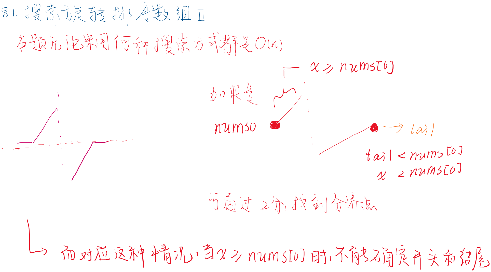
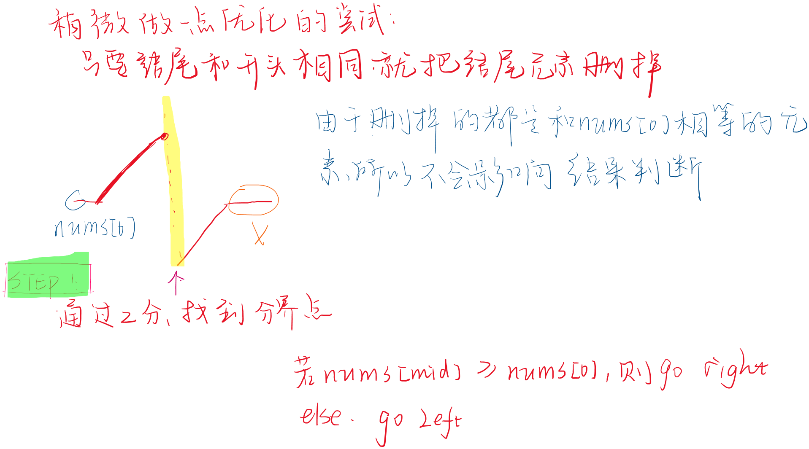
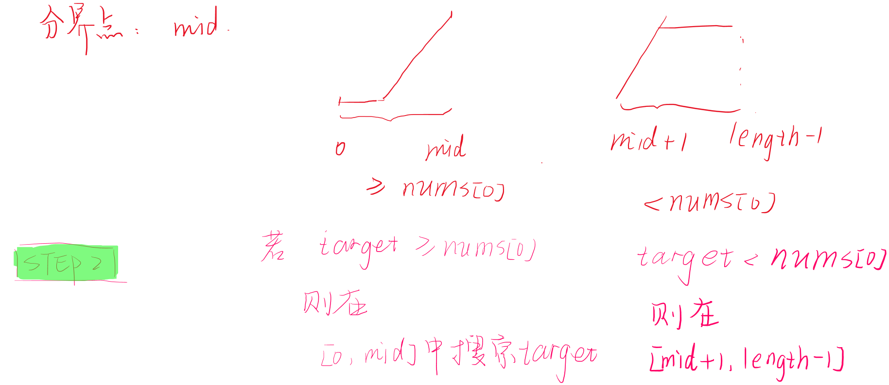

# 704. 二分查找

```
class Solution:
    def search(self, nums: List[int], target: int) -> int:

        lo, hi = 0, len(nums) - 1
        while lo < hi:
            mid = lo + (hi - lo) // 2
            if nums[mid] < target:
                lo = mid + 1
            else:
                hi = mid
        
        return lo if nums[lo] == target else -1
```

# 35. 搜索插入位置

## 示例1
```
输入: [1,3,5,6], 5
输出: 2
```
- [1,3,[5],6] --> [1,3,[5],5,6]
## 示例 2
```
输入: [1,3,5,6], 2
输出: 1
```
- [1,[3],5,6] --> [1,[2],3,5,6]

- 思路:
  - 即搜索nums中第一个$>=target$的元素的索引
- [1,3,5,6],target == 5, lo==0, hi==3, mid==1
- nums[mid]<=target
  - lo = mid + 1
- 特例:
- [1,3,5,6],target == 7,此时数组中不存在>=target的元素
- 为了避免出现这种情况,在一开始在有序数组尾部加入哨兵

```
class Solution:
    def searchInsert(self, nums: List[int], target: int) -> int:
        nums.append(float("inf"))
        lo, hi = 0, len(nums) - 1
        while lo < hi:
            mid = lo + (hi - lo) // 2
            if nums[mid] < target:
                lo = mid + 1
            else:
                hi = mid 
        return lo
```

# 34. 在排序数组中查找元素的第一个和最后一个位置
## 示例
```
输入: nums = [5,7,7,8,8,10], target = 8
输出: [3,4]
```
- 思路:
- 即输出target在数组中的开始位置和结束位置
- [5,7,7,8,8,10],target = 8
  - 开始位置start
    - [5,7,7,|8,8,10], nums[:start] < target, nums[start:] >= target
  - 结束位置end
    -  [5,7,7,8,8|,10], nums[:end+1] <= target, nums[end+1:] > target
- 在数组中插入哨兵
- 先查找start
  - if nums[mid] < target, lo = mid + 1; else hi = mid
  - 所以mid取左中位数,mid = lo + (hi - lo) // 2
  - 判断nums[lo]是否等于target,是的话start = lo,否则返回[-1,-1]
- 再查找end
  - if nums[mid] > target, hi = mid - 1; else lo = mid
  - 所以mid取右中位数,mid = lo + (hi - lo + 1) // 2
  - 此时end = lo
- 返回[start, end]

# 81. 搜索旋转排序数组







```
class Solution {
    public boolean search(int[] nums, int target) {
        // 1.先去掉尾部和nums[0]相同的元素
        int right = nums.length - 1;
        while(right > 0 && nums[right] == nums[0]) right --;
        if(right == 0) return target == nums[right];
        int rightCopy = right;
        // 2.再找到分界点
        int left = 0;
        while(left < right){
            int mid = left + (right - left + 1) / 2;
            if(nums[mid] >= nums[0]) left = mid;
            else right = mid - 1;
        }
        int idx = left;
        // 3.分区间查找
        int l, r;
        if(target >= nums[0]){
            // [0, idx]
            l = 0;
            r = idx;
        }else{
            l = idx + 1;
            r = rightCopy;
        }
        if(l > r) return false; // 区间不存在
        //System.out.println("l: " + l + "r: " + r);
        while(l < r){
            int m = l + (r - l + 1) / 2;
            if(nums[m] <= target) l = m;
            else r = m - 1;
        }
        //System.out.println("l: " + l + "r: " + r);
        return nums[l] == target;
    
    }
}
```
# 275.H指数Ⅱ
## 示例
```
输入: citations = [0,1,3,5,6]
输出: 3 
解释: 给定数组表示研究者总共有 5 篇论文，每篇论文相应的被引用了 0, 1, 3, 5, 6 次。
     由于研究者有 3 篇论文每篇至少被引用了 3 次，其余两篇论文每篇被引用不多于 3 次，所以她的 h 指数是 3。

```
- 思路:
  - target == citations[mid]
  - hIndex其实是需要查找的$>=target$的区间长度
- 例如:
  - [0,1,[3,5,6]]
    - ```mid==2```,区间长度为length - mid == citations[mid],查找成功
  - [0,[1,3,5,6]] 
    - ```mid==1```,区间长度为length - mid > citations[mid],此时合适的mid位于[mid+1,hi]
      - length - mid <= citations[mid],[lo, mid]
  - [0,1,3,[5,6]] 
    - ```mid==3```,区间长度为length - mid < citations[mid],此时合适的mid位于区间[lo, mid-1]
      - length - mid >= citation[mid],[mid,hi]

- 左中位数:
```
class Solution:
    def hIndex(self, citations: List[int]) -> int:
        if not citations:
            return 0
        if citations[-1] == 0:
            return 0
        length = len(citations)
        lo, hi = 0, length - 1
        while lo < hi:
            mid = lo + (hi - lo) // 2
            if length - mid > citations[mid]:
                lo = mid + 1
            else:
                hi = mid
        return length - lo
```

- 右中位数
```
class Solution:
    def hIndex(self, citations: List[int]) -> int:
        if not citations:
            return 0
        if citations[-1] == 0:
            return 0
        length = len(citations)
        lo, hi = 0, length - 1
        while lo < hi:
            mid = lo + (hi - lo + 1) // 2
            if length - (mid-1) > citations[mid-1]:
                lo = mid
            else:
                hi = mid - 1
        
        return length - lo
```

# 287.寻找重复数
```
示例 1:

输入: [1,3,4,2,2]
输出: 2
```

- 思路:
  - 注意**nums**为范围为1~n的数组,长度为n+1
  - 考虑两种nums
    - (1) nums == [1,3,4,2,2]
    - (2) nums == [1,1,3,4,2]
- 初始化
  - left=1, right=len(nums)-1
    - left=1,right=4,mid=2
  - 假设mid为数组中的重复数
    - 注意**mid为假定的重复数,而非坐标**
  - 遍历nums,得到$<=$mid的元素个数cnt,cnt表示**nums中元素大小在[left,mid]中元素的个数**
    - ```mid==2```
    - 对于(1) nums == [1,3,4,2,2],cnt=3(3个元素<=2),cnt > mid
      - 真正的重复数为2,所处范围为[left,mid]
      - 理解:
        - 在[left,mid]中的元素较多,所以重复数在[left,mid]中
    - 对于(2) nums == [1,2,3,4,4],cnt=2(2个元素<=2),cnt <= mid
      - 真正的重复数为4,所处范围为[mid+1,right]
      - 理解:
        - 在[left,mid]中的元素较少,所以重复数在[mid+1,right]中
# 658.找到 K 个最接近的元素

```
给定一个排序好的数组，两个整数 k 和 x，从数组中找到最靠近 x（两数之差最小）的 k 个数。
返回的结果必须要是按升序排好的。
如果有两个数与 x 的差值一样，优先选择数值较小的那个数。

示例 1:

输入: [1,2,3,4,5], k=4, x=3
输出: [1,2,3,4]
 

示例 2:

输入: [1,2,3,4,5], k=4, x=-1
输出: [1,2,3,4]
```

- 思路1:
  - 搜索区间左端点 
    - 假设arr长度为length,区间长度为k
      - arr中所有的区间构成为[0, k-1], [1, k], ..., [length-k, length-1]
    - 如果只搜索区间左端点,则起始位置
      - left, right = 0, length - k
        - 1.1 使用左中位数(mid = left + (right - left) // 2)搜索
        - 1.2 使用右中位数(mid = left + (right - left + 1) // 2)搜索
- 思路2:
  - 搜索区间右端点 
    - 假设arr长度为length,区间长度为k
      - arr中所有的区间构成为[0, k-1], [1, k], ..., [length-k, length-1]
    - 如果只搜索区间右端点,则起始位置
      - left, right = k - 1, length - 1
        - 2.2 使用左中位数(mid = left + (right - left) // 2)搜索
        - 2.1 使用右中位数(mid = left + (right - left + 1) // 2)搜索
```
# 1.1
class Solution:
    def findClosestElements(self, arr: List[int], k: int, x: int) -> List[int]:
        length = len(arr)
        left = 0
        right = length-k
        while left < right:
            mid = left + (right - left) // 2
            if x - arr[mid] <= arr[mid+k] - x:
                right = mid
            else:
                left = mid + 1
        
        return arr[left:left+k]
```
```
# 1.2
class Solution:
    def findClosestElements(self, arr: List[int], k: int, x: int) -> List[int]:
        length = len(arr)
        left = 0
        right = length-k
        while left < right:
            mid = left + (right - left + 1) // 2
            if x - arr[mid-1] <= arr[mid-1+k] - x:
                right = mid - 1
            else:
                left = mid
        return arr[left:left+k]
```
```
# 2.1
class Solution:
    def findClosestElements(self, arr: List[int], k: int, x: int) -> List[int]:
        length = len(arr)
        right = length - 1
        left = k - 1
        while left < right:
            mid = left + (right - left + 1) // 2
            if x - arr[mid - k] <= arr[mid] - x:
                right = mid - 1
            else:
                left = mid
    
        return arr[right - k+1:right+1]
```
```
# 2.2
class Solution:
    def findClosestElements(self, arr: List[int], k: int, x: int) -> List[int]:
        length = len(arr)
        right = length - 1
        left = k - 1
        while left < right:
            mid = left + (right - left) // 2
            if x - arr[mid + 1 - k] <= arr[mid + 1] - x:
                right = mid
            else:
                left = mid + 1
    
        return arr[right - k+1:right+1]
```
# 剑指 Offer 03. 数组中重复的数字

- 这道题不能用二分
- 
  该方法对于本题不适用，但是题目类似，长度为n的数组，且数字都在1~n-1之间，且一定有数字是重复的。每一遍二分的过程，统计nums元素中1~m的数量(m <=n-1, 改变m的值，遍历的是整个数组)，如果数量大于这个值，这说明重复的元素一定在1~m中。
但实际此种方法不可行，例如[1, 1, 1, 2, 4, 5, 6, 7, 8, 9]，对这个样例，则无法找到正确的答案。
- 注:
  - 如果不存在重复数,返回-1


# binSearch结合其他方法
# 1631. 最小体力消耗路径

- 条件
```
提示：

rows == heights.length
columns == heights[i].length
1 <= rows, columns <= 100
1 <= heights[i][j] <= 106
```

- 参考题解

https://leetcode-cn.com/problems/path-with-minimum-effort/solution/dfs-er-fen-cha-zhao-mo-ban-ti-by-kobe24o/


- 思路
  - 题目中给了高度的范围为1 <= heights[i][j] <= 10e6
  - 对于1 <= height <= 10e6,查找一个高度height_min
    - 使得遍历矩阵对应的消耗的高度==height_min时成功
    - height_min是可以取得的最小高度

```
class Solution {
    int m, n;
    vector<vector<int>> dir = {{1,0},{0,1},{0,-1},{-1,0}};
public:
    int minimumEffortPath(vector<vector<int>>& heights) {
        m = heights.size(), n = heights[0].size();
        int l = 0, r = 1e6, mid, ans = 0;
        while(l <= r)
        {
            mid = l + ((r-l)>>1);
            vector<vector<bool>> vis(m, vector<bool>(n,false));
            if(dfs(heights, vis, 0, 0, mid))
            {
                r = mid-1;
                ans = mid;
            }
            else
                l = mid+1;
        }
        return ans;
    }
    bool dfs(vector<vector<int>>& heights, vector<vector<bool>>& vis, int x, int y, int d)
    {
        if(x == m-1 && y == n-1)
            return true;
        vis[x][y] = true;
        int i, j, k;
        for(k = 0; k < 4; k++)
        {
            i = x + dir[k][0];
            j = y + dir[k][1];
            if(i>=0 && i<m && j>=0 && j<n && !vis[i][j]
                    && abs(heights[x][y]-heights[i][j]) <= d)
            {
                if(dfs(heights, vis, i, j, d))
                    return true;
            }
        }
        return false;
    }
};

```

- 待补充
  - (ps:以后直接整理个dfs模板,省的每次都去写)
```
class Solution:
    def minimumEffortPath(self, heights: List[List[int]]) -> int:
        m, n = len(heights), len(heights[0])
        l, r = 0, 10 ** 6
        while l < r:
            mid = l + (r - l) // 2
            # 初始化是否访问过某个点的数组visited
            visited = [[False] * n for _ in range(m)]
            # 如果查找成功,尝试更小的mid
            if(self.dfs(heights, visited, 0, 0, mid)):
                right = mid
            else:
                left = mid + 1

        return left

    def dfs(self, heights, visited, x, y, target_height):
        pass
```

# 5556. 可以到达的最远建筑
## [binSearch + 贪心]
```
class Solution:
    def furthestBuilding(self, heights: List[int], bricks: int, ladders: int) -> int:
        # (1)先计算高度差值diff
        diff = []
        length = len(heights)
        for i in range(1, length):
            diff.append(heights[i] - heights[i-1])
        print(diff)
        self.diff = diff
        self.bricks = bricks
        self.ladders = ladders
        # (2)在[0, len(heights)-1]中二分查找i
        # --判断i是否可以到达
        # ----diff[0:i]按照大到小排序,优先使用梯子,然后再使用砖块
        left, right = 0, length - 1
        while left < right:
            mid = left + (right - left + 1) // 2
            # 如果可达,可以尝试更远的索引 解集在[mid,right]中
            if (self.check(mid)):
                left = mid
            else:
                right = mid - 1
        return left
    # 判断索引为mid的位置是否可达
    def check(self, mid):
        if mid == 0:
            return True # 第0个位置肯定可达
        # else:
            # mid = mid - 1# 索引为2的元素在diff中对应的索引为1
        
        _cur_diff = self.diff[:mid]
        _cur_diff.sort(reverse=True)
        # 过滤掉差值<=0的
        # print(_cur_diff)
        cur_diff = [_ for _ in _cur_diff if _ > 0]
        cur_bricks, cur_ladders = self.bricks, self.ladders
        # 梯子数较多
        if cur_ladders >= len(cur_diff):
            return True
        # 用完全部梯子
        cur_diff = cur_diff[cur_ladders:]
        # 尝试消耗砖块
        for _ in cur_diff:
            cur_bricks -= _
            if cur_bricks < 0:
                return False
        return True
```

# 5563. 销售价值减少的颜色球
## [binSearch + 贪心]
- 参考链接
  
https://leetcode-cn.com/problems/sell-diminishing-valued-colored-balls/solution/xiao-shou-jie-zhi-jian-shao-de-yan-se-qiu-by-zerot/

- 贪心思路:
  - 每次拿走颜色球时,总是拿走当前数量最多的颜色球
### 结果分析
- inventory = [6, 10, 10]
```
inventory[0]: 1 2 3 4 5 6
inventory[1]: 1 2 3 4 5 6 7 8 9 10
inventory[2]: 1 2 3 4 5 6 7 8 9 10
```
- 当orders == 8时,得到$maxProfits_{orders=8}$的拿法
  - 拿完毕后inventory中的最大球数$T$为6
```
inventory[0]: 1 2 3 4 5 6
inventory[1]: 1 2 3 4 5 6 
inventory[2]: 1 2 3 4 5 6 
```
- 当orders == 11时,得到$maxProfits_{orders=11}$的拿法
  - 拿完毕后inventory中的最大球数$T-1$为5

```
inventory[0]: 1 2 3 4 5 
inventory[1]: 1 2 3 4 5 
inventory[2]: 1 2 3 4 5 
```
- 使用**binSearch**,可以计算出在给定的orders的情况下对应的T
- 当8($orders_{T=6}$) <= $orders_{given}$ < 11($orders_{T=5}$)时
  - $maxProfits_{orders=9}=maxProfits_{orders=8}+T$
  - $maxProfits_{orders=10}=maxProfits_{orders=8}+2 * T$
  - ...
  - $maxProfits_{orders=orders_{given}}=maxProfits_{orders=8}+(orders_{given}-8) * T$

- 查找T值
  - 根据1 <= inventory[i] <= 10^9
  - T的取值范围:left == 1, right == max(inventory)

```
inventory = [6, 10, 10]
--
inventory[0]: 1 2 3 4 5 6
inventory[1]: 1 2 3 4 5 6 7 8 9 10
inventory[2]: 1 2 3 4 5 6 7 8 9 10

T == 10: orders == 0
--
inventory[0]: 1 2 3 4 5 6
inventory[1]: 1 2 3 4 5 6 7 8 9 
inventory[2]: 1 2 3 4 5 6 7 8 9 

T == 9: orders == 2, maxProfits == 20
--

inventory[0]: 1 2 3 4 5 6
inventory[1]: 1 2 3 4 5 6 7 8 
inventory[2]: 1 2 3 4 5 6 7 8 

T == 8: orders == 4, maxProfits == 38
--
T == n: orders == sum([invent - T if invent >= T else 0 for invent in inventory])
``` 
  - 找到对应的T,使得
    - $orders_{T=T-1}$ < $orders_{given}$ <= $orders_{T=T}$
    - 其中, $orders_{T=T}$ == ```sum([invent - T if invent >= T else 0 for invent in inventory])```
  

- 思路
  - (1)根据给定的orders, 二分查找得到T
  - (2)计算T对应的maxProfits
```
inventory = [6, 10, 10]
--
inventory[0]: 1 2 3 4 5 6
inventory[1]: 1 2 3 4 5 6 7 8 9 10
inventory[2]: 1 2 3 4 5 6 7 8 9 10

T == 10: maxProfits == 0
--
inventory[0]: 1 2 3 4 5 6
inventory[1]: 1 2 3 4 5 6 7 8 9 
inventory[2]: 1 2 3 4 5 6 7 8 9 

T == 9: maxProfits == (10) + (10)
--

inventory[0]: 1 2 3 4 5 6
inventory[1]: 1 2 3 4 5 6 7 8 
inventory[2]: 1 2 3 4 5 6 7 8 

T == 8: maxProfits == (10 + 9) + (10 + 9)

--
T == n: maxProfits == sum([(invent + invent - T - 1)*(invent - T)//2 if invent >= T else 0 for invent in inventory])
```
- 可以比对一下周赛上的二分查找写法和cookbook上的二分查找写法是否一致

```
class Solution:
    def maxProfit(self, inventory: List[int], orders: int) -> int:
        divisor = 10 ** 9 + 7
        l, r = 0, max(inventory)
        while l < r:
            mid = l + (r - l) // 2
            # 此时T的取值可能为[l, mid]
            if self.provideOrders(inventory, mid) <= orders:
                r = mid
            else:
                l = mid + 1

        res = 0
        for num in inventory:
            if num >= l:
                orders -= (num - l + 1)
                first, last = num, l
                n = num - l + 1
                res = (res + ((first + last) * n // 2) % divisor) % divisor
            
        res = (res + orders * (l - 1) % divisor ) % divisor 
        return res
        
    def provideOrders(self, inventory, m):
        orders = 0
        for num in inventory:
            orders += max(num - m + 1, 0)
        return orders
```

# 1760. 袋子里最少数目的球

```
class Solution {
    // 和剪绳子一个性质
    public int minimumSize(int[] nums, int cost) {
        int left = 1, right = 1000000001;
        while (left < right){
            // mid越小,需要的cost越多
            // 在给定的cost的情况下,希望mid尽可能小
            int mid = left + (right - left) / 2;
            if(check(mid, cost, nums)) right = mid;
            else left = mid + 1;
        }
        return left;
    }
    
    public boolean check(int target, int cost, int[] nums){
        int result = 0;
        for(int num : nums){
            result += (num - 1) / target;
            if(result > cost) return false;
        }
        return true;
    }
}
```