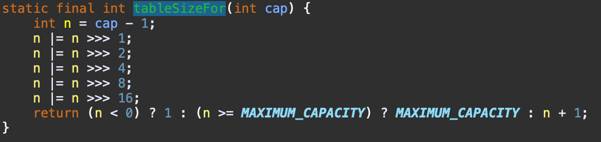

# 相关文章

https://mp.weixin.qq.com/s/pDXzZoSByzYKkim71qCsCw


# 位运算相关

# 某个数的二进制中1的个数
## 338. 比特位计数
**计算某个num对应的二进制中1的个数(可以抽取成通用函数)**

- 12月11日
- 即: 统计从$0 <= i <= num$中各位数字对应的二进制中1的个数
- Java实现
```
class Solution {
    public int[] countBits(int num) {
        int[] dp = new int[num+1];
        dp[0] = 0;
        for(int i = 1; i <= num; i++){
            // if(i & 1 == 1){
            //     dp[i] = dp[i >> 1] + 1;
            // }else{
            //     dp[i] = dp[i >> 1];
            // }
            dp[i] = dp[i>>1] + (i % 2);
            // System.out.println("i: " + i + " i>>1: " + (i >>1));
        }

        return dp;
    }
}
```
## 1356. 根据数字二进制下 1 的数目排序

- 思路:
  - (1)获得1的数目getOne()
    - 初始化res = 0
    - 当a!=0时,res += a%2,同时a整除2
  - (2)比较器compare(a, b) 
    - 先按照getOne(a), getOne(b)的大小比较
      - 若getOne(a)==getOne(b),则按照a,b的数值大小比较

- Python实现
```
from functools import cmp_to_key
class Solution:
    def sortByBits(self, arr: List[int]) -> List[int]:
        return sorted(arr, key=cmp_to_key(self.compare))
        
    def getOne(self, num):
        res = 0
        while num:
            res += num % 2
            num //= 2
        return res
    
    def compare(self, a, b):
        if self.getOne(a) > self.getOne(b):
            return 1
        elif self.getOne(a) < self.getOne(b):
            return -1 
        else:
            return 1 if a > b else -1
```

- Java实现
```
class Solution {
    public int getOne(int num){
        int res = 0;
        while (num > 0){
            res += num % 2;
            num /= 2;
        }
        return res;
    }
    public int[] sortByBits(int[] arr) {
        List<Integer> list = new ArrayList<Integer>();
        for (int x : arr) {
            list.add(x);
        }

        Collections.sort(list, new Comparator<Integer>() {
            @Override
            public int compare(Integer x, Integer y) {
                if (getOne(x) > getOne(y)) { return 1; }
                else if (getOne(x) < getOne(y)) { return -1; }
                else{
                    return x > y ? 1 : -1;
                }
            }
        });
        for (int i = 0; i < arr.length; ++i) {
            arr[i] = list.get(i);
        }
        return arr;
    }   
}
```

- 12月11日(受到338的启发)
```
class Solution {
    public static int[] dp;
    static{
        //由于给定的num的范围是0 ~ 10 ^ 4,所以可以事先生成dp
        //dp[i]表示i对应的数字的二进制数中1的个数
        dp = new int[10001];
        dp[0] = 0;
        for(int i = 1; i <= 10000; i ++){
            dp[i] = dp[i>>1] + (i % 2);
        }
    }
    public int getOne(int num){
        return dp[num];
    }
    public int[] sortByBits(int[] arr) {
        List<Integer> list = new ArrayList<Integer>();
        for (int x : arr) {
            list.add(x);
        }

        Collections.sort(list, new Comparator<Integer>() {
            @Override
            public int compare(Integer x, Integer y) {
                if (getOne(x) > getOne(y)) { return 1; }
                else if (getOne(x) < getOne(y)) { return -1; }
                else{
                    return x > y ? 1 : -1;
                }
            }
        });
        for (int i = 0; i < arr.length; ++i) {
            arr[i] = list.get(i);
        }
        return arr;
    }   
}
```
  

## 137. 只出现一次的数字 II
- 主题解指路(强烈安利)
- https://leetcode-cn.com/problems/single-number-ii/solution/luo-ji-dian-lu-jiao-du-xiang-xi-fen-xi-gai-ti-si-l/
- https://leetcode-cn.com/problems/single-number-ii/solution/li-yong-qia-nuo-tu-sheng-cheng-zhuang-tai-zhuan-yi/
- 在n个数字中找到只出现k次的数字,通解
```
看过题解<逻辑电路角度详细分析该题思路，可推广至通解>后豁然明白，以后遇到这种K次的题，直接祭出真值表，然后写出表达式求解。 以后再遇到类似的题，应该会解了。例如：

除了一个元素出现2次，其余都出现3次。查找出现2次的元素。
除了一个元素出现n次，其余都出现K次。（n<k），查找出现n次的元素。
C++ 看过题解后的解题：

/*
XY  Z  X'Y'
00  0  0 0
01  0  0 1
10  0  1 0
00  1  0 1
01  1  1 0 
10  1  0 0

X'=X[Y][Z]+[X]YZ
Y'=[X]Y[Z]+[X][Y]Z
其中[]表示取反
*/
class Solution {
public:
    int singleNumber(vector<int>& nums) {
        int x = 0, y = 0;
        int ty = 0;
        int s = nums.size();
        for (int i=0; i<s; i++) {
            ty = ((~x)&y&(~nums[i])) | ((~x)&(~y)&nums[i]);
            x = (x&(~y)&(~nums[i])) | ((~x)&y&nums[i]);
            y = ty;
            //y = (y^nums[i])&(~x);
            //x = (x^nums[i])&(~y);
        }
        //printf("x:%d y:%d\n", x,y);
        //这里为什么会返回y，因为题目要求只出现一次，而出现一次，根据真值表来看，就是XY=01时，这个时候Y为1。那么返回y就行。
        return y; 
    }
};
```

<!-- 晚上回去整理 真值表-卡诺图 -->


- 理解: 
  - XY构成当前的状态
  - Z表示是否碰到状态转换的输入
  - X'表示X在碰到Z之后的变化,Y'表示Y在碰到Z之后的变化

-  例如,只在00(0),01(1)和10(2)三个状态间转换时
   -  00(XY) 碰到一个输入(Z == 1) --> (01)
   -  10(XY) 碰到一个输入(Z == 1) --> (00)
   -  10(XY) 碰到一个输入(Z == 0) --> (10)

- 画出真值表


- 画出卡诺图
  


- $X' = Z * \bar{X} * Y + \bar{Z} * X * \bar{Y}$

 


- $Y' = \bar{Z} * \bar{X} * Y + Z * \bar{X} * \bar{Y}$

- 最后需要返回出现1次的元素,对应状态```XY==01```,所以返回y
- 如果题目改为返回在多个出现三次的数组中唯一出现两次的一个数字,对应状态```XY==10```,返回x即可


- 如果题目改为,在一堆出现4次的元素中,找到唯一一个出现三次的元素
- 画出真值表
  
|X|Y|Z|X'|Y'|
|--|--|--|--|--|
|0|0|0|0|0|
|0|1|0|0|1|
|1|0|0|1|0|
|1|1|0|1|1|
|0|0|1|0|1|
|0|1|1|1|0|
|1|0|1|1|1|
|1|1|1|0|0|

- 画出卡诺图(next_X)
  
|||XY|||
|--|--|--|--|--|
|Z|00|01|10|11|
|0|0|0|1|1|
|1|0|1|1|0|
- 观察图发现
  - 在Z==0时,只要X为1,next_X为1
  - 在Z==1时,当X和Y异或值为11时,next_X为1
  - $nextX = \hat{Z} * X + Z * (X xor Y)$

- 画出卡诺图(next_Y)
  
|||XY|||
|--|--|--|--|--|
|Z|00|01|10|11|
|0|0|1|0|1|
|1|1|0|1|0|
- 观察图发现
  - 在Z==0时,只要Y为1,next_Y为1
  - 在Z==1时,只要Y为0,next_Y为1
  - $nextY = \hat{Z} * Y + Z * \hat{Y}$

- 在一堆出现4次的元素中,找到唯一一个出现三次的元素,对应的状态```XY == 11```
- 此时返回X或者Y都行

|array|lastX|lastY|
|--|--|--|
|2,3,3,3,5,3,4,4,4,4,2,2,2|0|5|
|2,3,3,3,5,3,4,4,4,5,4,2,2,2|5|0|
|2,3,3,3,5,3,4,4,4,5,4,2,5,2,2|5|5|

- Java代码
```
    public int singleNumber(int[] nums) {
        int length = nums.length;
        int x = 0, y = 0;
        for (int i=0; i<length; i++) {
            int nx = ((~nums[i]) & x) | (nums[i] & (x ^ y));
            int ny = ((~nums[i]) & y) | (nums[i] & (~y));
            x = nx;
            y = ny;
        }

//        System.out.println("x = " + x);
//        System.out.println("y = " + y);
        return x;
    }
    public static void main(String[] args) {
        Solution solution = new Solution();
        int r = solution.singleNumber(new int[] {2,3,3,3,5,3,4,4,4,4,2,2,2});
    }
```

## XOR 异或运算的性质

- a ^ b = c, 则有 b = c ^ a

### 5649.解码异或后的数组

https://leetcode-cn.com/problems/decode-xored-array/

题目中

- a0 ^ a1 = b0, a1 ^ a2 = b1, a2 ^ a3 = b2
- 题目中给了a0,b0,b1,b2,要求a1,a2,a3

- a1 = b0 ^ a0, 计算出a1
- a2 = b1 ^ a1, 计算出a2

## 对分母为2 的次方的数取余的性质
- 参考hashMap 3.位运算
- N % M == N & (M - 1)，当M为2的次方。但是位运算比求余数更高效

## 补位操作
- 参考HashMap 3.位运算



- tableSize实现的功能为,返回>=cap的最小的2 ** n的整数
- 为了避免 cap == 2 ** n 时 对 cap * 2处理, n = cap - 1

```
- 这一段代码实现的是将n的高位1(即第一个出现1的位置)到低位的所有位补为1
n |= n >>> 1;
n |= n >>> 2;
n |= n >>> 4;
n |= n >>> 8;
n |= n >>> 16;

```
- 举个例子
```
N = 165
Bin(N) =       0b 00000000 00000000 00000000 10100101
N >>> 1        0b 00000000 00000000 00000000 01010010
N |= (N >>> 1) 0b 00000000 00000000 00000000 11110111
N >>> 2        0b 00000000 00000000 00000000 00111101
N |= (N >>> 2) 0b 00000000 00000000 00000000 11111111
(到这一步时,就已经实现N的高位 ~ 低位全部补充为1)
N >>> 4 (可以不用再分析了)

```
- 分析
```
假设N 为 |1|0|0|0|0|0|...|0|
N >>> 1   |0|1|0|0|0|0|...|0|
N |= (N >>> 1) 可以保证, N的第一个为1的位置和相邻的右侧的第一个位置都为1, 此时的N为 |1|1|0|0|0|0|...|0|
N >>> 2   |0|0|1|1|0|0|...|0|
N |= (N >>> 2) 可以保证, N的第一个为1的位置一直到从该位置出发向右的第四个位置都为1, 此时的N为 |1|1|1|1|0|0|...|0|
....
```
- cap 为 166, n 初始为 165 0000 10100101 
- 所以在经过上一段之后 n 的高位1到最低位都为1 为 0000 11111111的形式
- n += 1 --> 001 00000000 为256(即>=cap的最小的一个2的整数次方的数字)