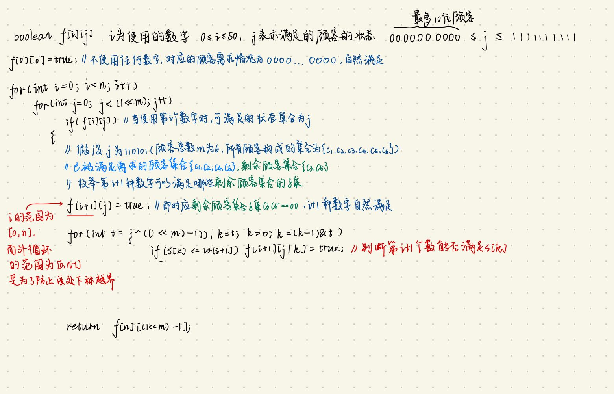
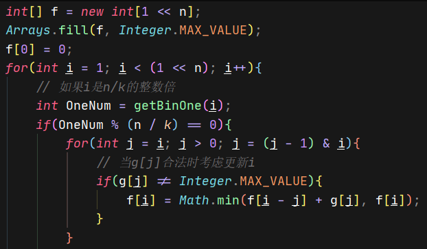
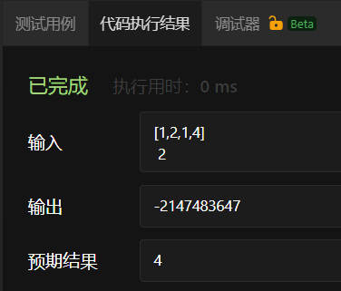
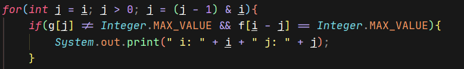
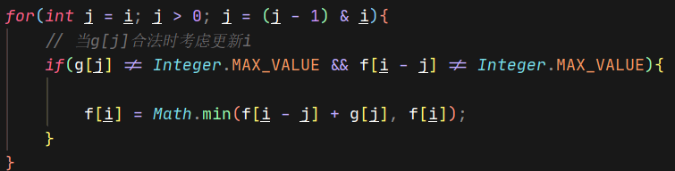
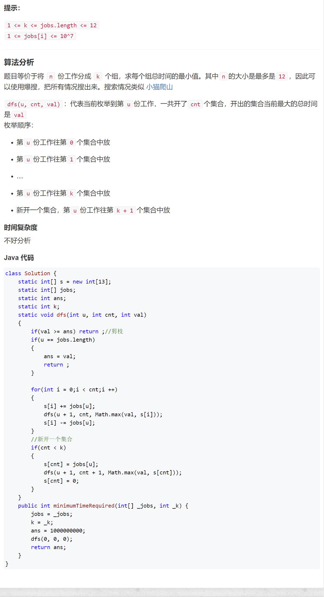
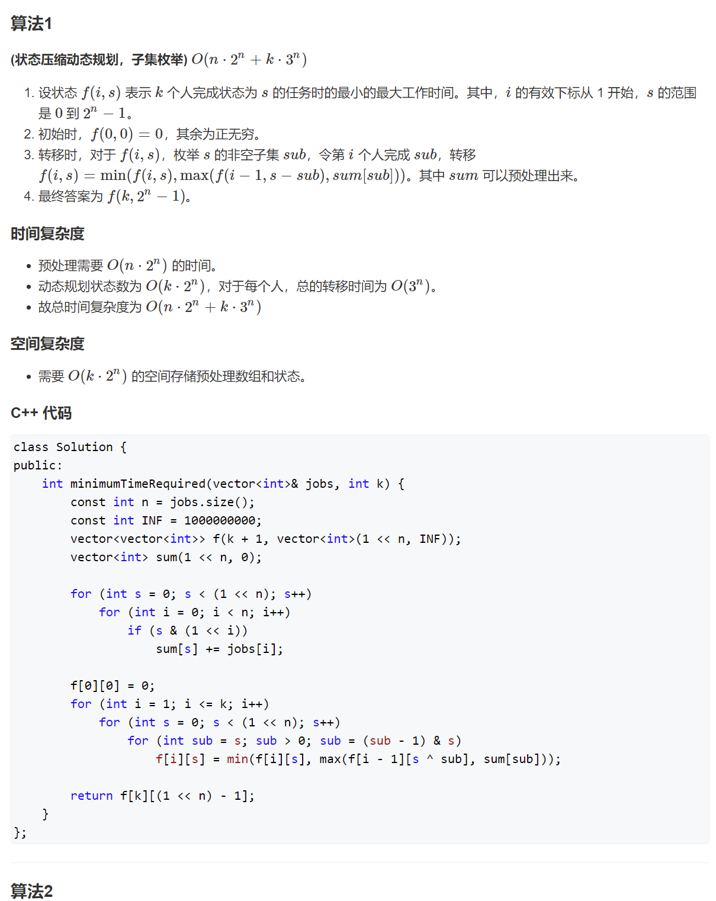

# 动态规划小结、
## easy
### 62. 不同路径
- 多解法
  
https://leetcode-cn.com/problems/unique-paths/solution/dong-tai-gui-hua-di-gui-gong-shi-deng-4chong-jie-j/

- 解法一:dp
```
class Solution {
    public int uniquePaths(int m, int n) {
        int[][] dp = new int[m][n];
        dp[0][0] = 1;
        for(int i = 0; i < m; i++){
            for(int j = 0; j < n; j++){
                if((i == 0) && (j != 0)) dp[i][j] = dp[i][j-1];
                else if((j == 0) && (i != 0)) dp[i][j] = dp[i-1][j];
                else if((i != 0) && (j != 0)) dp[i][j] = dp[i-1][j] + dp[i][j-1];
            }
        }
        return dp[m-1][n-1];
    }
}
```
- 解法二:其实可以归类为mathTricks.md(求排列组合数)

## 区间动态规划

### 回文串相关
### 5.最长回文子串

给定一个字符串 s，找到 s 中最长的回文子串。你可以假设 s 的最大长度为 1000。

示例 1：
```
输入: "babad"

输出: "bab"
```
注意: "aba" 也是一个有效答案。

示例 2：
```
输入: "cbbd"

输出: "bb"
```

**思路**
- 区间动态规划,字符串长度为length,初始化dp[i][j]==False, 0 $\le$ i, j $\le$ length - 1
- 初始时为单个区间(单个字符),单个字符自然构成长度为1的回文子串, dp[i][i]==True
  - 如果区间长度为2,且首位两端字符相等,也构成回文串,如"aa" ```dp[i][j] = True if j == i + 1 and s[i] == s[j] ```
- 区间动态规划的特点(每次循环由小区间(例如:区间长度为1)逐渐增加到大区间(例如:区间长度为字符串长度length)),由外层循环控制
- 每次循环的时候,较大的外侧区间的结果由较小的内侧区间结果得出
  - 本题中,当s[i-1]==s[j+1]时且s[i]~s[j]构成回文串,则s[i-1]~s[j+1]也构成回文子串
- 特例:当s为空串或者s长度为1时
```
for i in range(length-1, -1, 0):
    for j in range(i+1, length):
```
- loop 0
  - i==length-1, j==length, 区间长度为1(不会进入循环)
- loop 1
  - i==length-2, j==length-1,区间长度为2
- loop 2
  - i==length-3, j==length-2,区间长度为2
  - i==length-3, j==length-1,区间长度为3

**实现**
```
class Solution:
    def longestPalindrome(self, s: str) -> str:
        length = len(s)
        if not length or length == 1:
            return s
        
        dp = [[False] * length for _ in range(length)]
        for i in range(length):
            dp[i][i] = True
        
        max_left, max_right = 0, 0
        max_length = 1
        for i in range(length-1, -1, -1):
            for j in range(i+1, length):
                # 区间长度为2,且s[i]==s[j]
                if s[i] == s[j] and j == i + 1:
                    dp[i][j] = True
                # 区间长度>=3,且dp[i+1][j-1]为回文串,所以i+1,j-1不会越界
                elif s[i] == s[j] and j > i + 1 and dp[i+1][j-1]:
                    dp[i][j] = True
                # 如果s[i]~s[j]构成回文串,判断是否要更新最长区间长度
                if dp[i][j] and j - i + 1 > max_length:
                    max_length = j - i + 1
                    max_left, max_right = i, j
        
        return s[max_left:max_right+1]

```
### 131.分割回文串
- 即长度最多为16的字符串,分割成所有子串都是回文串,有多少种组合方案
```
class Solution {
    boolean[][] f;
    List<List<String>> ret = new ArrayList<List<String>>();
    List<String> ans = new ArrayList<String>();
    int n;

    public List<List<String>> partition(String s) {
        n = s.length();
        f = new boolean[n][n];
        for (int i = 0; i < n; ++i) {
            Arrays.fill(f[i], true);
        }

        for (int i = n - 1; i >= 0; --i) {
            for (int j = i + 1; j < n; ++j) {
                f[i][j] = (s.charAt(i) == s.charAt(j)) && f[i + 1][j - 1];
            }
        }

        dfs(s, 0);
        return ret;
    }

    public void dfs(String s, int i) {
        if (i == n) {
            ret.add(new ArrayList<String>(ans));
            return;
        }
        for (int j = i; j < n; ++j) {
            if (f[i][j]) {
                ans.add(s.substring(i, j + 1));
                dfs(s, j + 1);
                ans.remove(ans.size() - 1);
            }
        }
    }
}

```

### 132.分割回文串Ⅱ
- 最少多少刀可以将一个回文串分成子串,其中子串全部由回文串组成
```
class Solution {
    String s;
    boolean[][] memo;
    int n;
    char[] cs;
    int[] dp;
    
    public int minCut(String s) {
        this.s = s;
        n = s.length();
        memo = new boolean[n][n];
        cs = s.toCharArray();
        ifP();
       
        dp = new int[n + 1];
        Arrays.fill(dp, Integer.MAX_VALUE - 100);
        
        dp[0] = 0;
        dp[1] = 1;
        for(int j = 2; j <= n; j++){
            for(int i = 1; i <= j; i++){
                // if (j == 3){
                //     // System.out.println("(i, j) i  dp[i]" + i + "---" + dp[i]);
                // }
                if(memo[i-1][j-1]){
                    dp[j] = Math.min(dp[j], dp[i-1] + 1);
                }
            }
            // System.out.println("j:" + j + "dp[j]: " + dp[j]);
        }
        return dp[n] - 1;
        
    }
    
    public void ifP(){
        for(int len = 1; len <= n; len++){
            for(int i = 0; i + len - 1 < n; i++){
                int j = i + len - 1;
                if(len == 1){
                    memo[i][j] = true;
                }
                else if(len == 2 && cs[i] == cs[j]){
                    memo[i][j] = true;
                }
                else if (len >= 3 && memo[i+1][j-1] && cs[i] == cs[j]){
                    memo[i][j] = true;             
                }
            }
        }
    }
}
```

### 补充(来自于82)


## 一维动态规划
### 96.不同的二叉搜索树

给定一个整数 n，求以 1 ... n 为节点组成的二叉搜索树有多少种？

示例:
```
输入: 3
输出: 5
解释:
给定 n = 3, 一共有 5 种不同结构的二叉搜索树:

   1         3     3      2      1
    \       /     /      / \      \
     3     2     1      1   3      2
    /     /       \                 \
   2     1         2                 3
```

**思路**
- 二叉搜索树的子树仍然是二叉搜索树
- n == 3时,图中给的例子可以看作:
  - 以1为根节点```i==0```,左子树构成[]```arr[0:0]```,右子树构成[2,3]```arr[1:3]```
  - 以2为根节点```i==1```,左子树构成[1]```arr[0:1]```,右子树构成[3]```arr[2:3]```
  - 以3为根节点```i==2```,左子树构成[1,2]```arr[0:2]```,右子树构成[]```arr[3:3]```
- 当构成BST的节点数量是固定的时,对应的BST的数量也是固定的,例如只有2个节点构成的BST,对应的BST种类数为2
- 设i个节点(0 $\le$ i $\le$ n)对应的BST数量为dp[i]
  - 初始情况```dp[0] = 0, dp[1] = 1```,i可以从2开始
  - 以k(0 $\le$ k $\le$ i-1)依次作为根节点
    - 该根节点左子树(对应```arr[0:k]```)共有(k-0)个节点,能生成```dp[k]```个BST
    - 该根节点右子树(对应```arr[k+1:i]```)共有(i-(k+1))个节点,能生成```dp[i-(k+1)]```个BST
  - 若 ```dp[k] != 0```且```dp[i-(k+1)] != 0```,则```dp[n] += dp[k] * dp[i-(k+1)]```
  - 否则(其一为0), ```dp[n] += (dp[k] + dp[i-(k+1)])```
  
  **代码**

  ```
  class Solution:
    def numTrees(self, n: int) -> int:
        if n == 0:
            return 1
        dp = [0] * (n + 1)
        dp[1] = 1
        
        for i in range(2, n+1):
            for k in range(i):
                if dp[k] != 0 and dp[i-(k+1)] != 0:
                    dp[i] += (dp[k] * dp[i-(k+1)])
                else:
                    dp[i] += (dp[k] + dp[i-(k+1)])
        return dp[n]
  ```

  ## 子序列系列
  ### 300.最长上升子序列

  给定一个无序的整数数组，找到其中最长上升子序列的长度。
  ```
  输入: [10,9,2,5,3,7,101,18]
  输出: 4 
  解释: 最长的上升子序列是 [2,3,7,101]，它的长度是 4。
  ```
  **思路**
  - 数组的长度为length, 0$\le$i$\le$length-1, dp[i]设为以```i为结尾```的子序列中最长的上升子序列的长度
    - 例如[4,10,4,3,8,9], dp[4]\(即以8为结尾的最长上升子序列长度为2)
    - 遍历i的前缀j, 0$\le$j$\le$ i-1,当dp[i] $\gt$ dp[j]时,更新dp[i],即```dp[i]=max(dp[i], dp[j]+1)```
  - 在对外层的i进行遍历时,使用```max_seq```记录或更新最长的上升子序列长度```max_seq=max(max_seq, dp[i])```
  - 初始情况:对于数组中索引为i任意元素来说,至少它能和自身构成长度为1的上升子序列,所以```dp=[1]*length```

  **代码**
  ```
  class Solution:
    def lengthOfLIS(self, nums: List[int]) -> int:
        length = len(nums)
        if length <= 1:
            return length
        # dp[i]:以i为结尾的最长上升子序列长度
        dp = [1]*length
        # i区间右侧,j区间左侧
        max_seq = 1
        for i in range(1, length):
            for j in range(i-1, -1, -1):
                if nums[i] > nums[j]:
                    dp[i] = max(dp[i], dp[j] + 1)
                max_seq = max(max_seq, dp[i])
        return max_seq
  ```

  ## 数学题
  ### 357.计算各个位数不同的数字个数
  给定一个非负整数 n，计算各位数字都不同的数字 x 的个数，其中 0 ≤ x < $10^n$ 。

  示例:
  ```
  输入: 2
  输出: 91 
  解释: 答案应为除去 11,22,33,44,55,66,77,88,99 外，在 [0,100) 区间内的所有数字
  ```

  **思路**
  - 对于n==1来说,个位数不同的数字个数为$10*1$,即0~9
  - 对于n==2来说,个位数不同的数字个数为$9*9$ + $10*1$
    - eg.对于两位数来说:
      - 第一位可以选择的范围为1~9;假设选择8,共有9种选择
      - 第二位可以选择的范围为0~7,9;共有9种选择
  - 对于n==3来说,个位数不同的数字个数为$9*9*8$ + $9*9$ + $10*1$
    - eg.对于三位数来说:
      - 第一位可以选择的范围为1~9;假设选择8,共有9种选择
      - 第二位可以选择的范围为0~7,9;假设选择6,共有9种选择
      - 第三位可以选择的范围为0~5,7,9;共有8种选择
  - ```dp[i] = base + dp[i-1]```,其中base由i计算得到
  - 初始化dp = [10] * n
    - ```i==0, base==0(9*0)```
    - ```i==1, base==9*9```
    - ```i==2, base==9*9*8```
  
  **代码**
  ```
  class Solution:
    def countNumbersWithUniqueDigits(self, n: int) -> int:
        if n == 0:
            return 1
        
        dp = [10] * n
        for i in range(1, n):
            # 计算base
            base, time = 9, 9
            # 记录i的位置
            mark_i = i
            while mark_i > 0:
                base = base * time
                time, mark_i = time - 1, mark_i - 1
        
            dp[i] = base + dp[i-1]
        
        return dp[n-1]
  ```


  ## 股票问题(或者说状态转移dp?)
  ### 引申--秋叶收藏集
  **参考题解**

  https://leetcode-cn.com/problems/UlBDOe/solution/zhe-dao-ti-ru-guo-qia-zhu-de-jian-yi-sou-suo-yi-xi/

  - 最终需要的状态为```ryr```
  - 三种状态
  - (1)```..[r]```:到目前为止都为红色--**状态0**
    - 由**状态0**转移过来
      - 由于题目中提到的是最小的转移次数,所以没有必要考虑由**状态1**或**状态2**转移过来的情况,因为这样付出的转移代价太大了
    - 可以转移至**状态0**或**状态1**
  - (2)```.rrr[y]或.rrry[y]```--**状态1**
    - 当前位置之前的所有元素都为红色,当前位置变为黄色
    - 当前位置之前的所有元素为红色+黄色的组合,当前位置为黄色
      - 由**状态0**或**状态1**转移过来
      - 可以转移至**状态1**
      - 注意:当叶子的个数>=2时,**状态1**才有可能有取值
        - 能到达**状态1**对应的叶子情况最少为```r[y]```
  - (3)```.rrryyy[r]或.rrryyyr[r]```--**状态2**
    - 由**状态1**```.rrryyy[r]```或**状态2**```.rrryyyr[r]```转移过来
    - 可以转移至**状态2**
    - 注意:当叶子的个数>=3时,**状态2**才有可能有取值
      - 能到达**状态2**对应的叶子情况最少为```ry[r]```

```
class Solution:
    def minimumOperations(self, leaves: str) -> int:
        n = len(leaves)
        dp = [[0] * 3 for _ in range(n + 1)]
        # n < 1,状态0非法
        dp[0][0] = float("inf")
        dp[1][0] = 0 if leaves[0] == "r" else 1
        # n < 2,状态1非法
        dp[0][1] = float("inf")
        dp[1][1] = float("inf")
        # n < 3,状态2非法
        dp[0][2] = float("inf")
        dp[1][2] = float("inf")
        dp[2][2] = float("inf")

        
        for i in range(2, n+1):
            # 当前为"r"
            if leaves[i-1] == "r":
                dp[i][0] = dp[i-1][0]
                dp[i][1] = min(dp[i-1][1] + 1, dp[i-1][0] + 1)
                if i >= 3:
                    dp[i][2] = min(dp[i-1][1], dp[i-1][2])
            else: # 当前为"y"
                dp[i][0] = dp[i-1][0] + 1
                dp[i][1] = min(dp[i-1][1], dp[i-1][0])
                if i >= 3:
                    dp[i][2] = min(dp[i-1][1] + 1, dp[i-1][2] + 1)
        return dp[n][2]
```

## 打家劫舍系列
- [198. 打家劫舍] 和 [213. 打家劫舍 II] 和 [740. 删除与获得点数]性质比较接近

### 198. 打家劫舍

你是一个专业的小偷，计划偷窃沿街的房屋。每间房内都藏有一定的现金，影响你偷窃的唯一制约因素就是相邻的房屋装有相互连通的防盗系统，如果两间相邻的房屋在同一晚上被小偷闯入，系统会自动报警。

给定一个代表每个房屋存放金额的非负整数数组，计算你 不触动警报装置的情况下 ，一夜之内能够偷窃到的最高金额。

```
示例 1：

输入：[1,2,3,1]
输出：4
解释：偷窃 1 号房屋 (金额 = 1) ，然后偷窃 3 号房屋 (金额 = 3)。
     偷窃到的最高金额 = 1 + 3 = 4 。
示例 2：

输入：[2,7,9,3,1]
输出：12
解释：偷窃 1 号房屋 (金额 = 2), 偷窃 3 号房屋 (金额 = 9)，接着偷窃 5 号房屋 (金额 = 1)。
     偷窃到的最高金额 = 2 + 9 + 1 = 12 。
```
- 思路
  - 输入数组为nums
  - 对于索引为0的房屋
    - 其能获得的最大利润dp[0]=nums[0]
  - 对于索引为1的房屋
    - 其能获得的最大利润dp[1]=max(nums[1], dp[0]) 
      - 即为不偷0号房屋,偷1号房屋 或者 偷0号房屋 所能获得利润的最大者
  - 对于索引为i的房屋($i >= 2$) 
    - 其能获得的最大利润dp[i]=max(dp[i-2]+nums[i], dp[i-1])
      - 即为不偷第i-1个房屋,偷第i-2个房屋 或者 偷第i-1个房屋,不偷第i-2个房屋 所能获得利润的最大者

- Python实现
```
class Solution:
    def rob(self, nums: List[int]) -> int:
        length = len(nums)
        if length == 0:
            return 0
        if length == 1:
            return nums[0]
        dp = [0] * length
        dp[0] = nums[0]
        dp[1] = max(nums[1], dp[0])
        for i in range(2, length):
            dp[i] = max(dp[i-2]+nums[i], dp[i-1])
        
        return dp[length-1]
```
- Java实现
```
class Solution {
    public int rob(int[] nums) {
        int length = nums.length;
        if (length == 0) return 0;
        if (length == 1) return nums[0];
        int[] dp = new int[length];
        dp[0] = nums[0];
        dp[1] = Math.max(dp[0], nums[1]);
        for(int i = 2; i < dp.length; i++){
            dp[i] = Math.max(dp[i-2]+nums[i], dp[i-1]);
        }
        return dp[length-1];
    }
}
```

### 213. 打家劫舍 II
你是一个专业的小偷，计划偷窃沿街的房屋，每间房内都藏有一定的现金。这个地方所有的房屋都 **围成一圈** ，这意味着**第一个房屋和最后一个房屋**是紧挨着的。同时，相邻的房屋装有相互连通的防盗系统，如果两间相邻的房屋在同一晚上被小偷闯入，系统会自动报警 。

给定一个代表每个房屋存放金额的非负整数数组，计算你 在不触动警报装置的情况下 ，能够偷窃到的最高金额。

```
示例 1：

输入：nums = [2,3,2]
输出：3
解释：你不能先偷窃 1 号房屋（金额 = 2），然后偷窃 3 号房屋（金额 = 2）, 因为他们是相邻的。
示例 2：

输入：nums = [1,2,3,1]
输出：4
解释：你可以先偷窃 1 号房屋（金额 = 1），然后偷窃 3 号房屋（金额 = 3）。
     偷窃到的最高金额 = 1 + 3 = 4 。
示例 3：

输入：nums = [0]
输出：0
```
- 思路
  - 由于**第一个房屋和最后一个房屋**是紧挨着的
    - 所以小偷要么偷第一个房屋,要么偷最后一个房屋 --> 转化为198. 打家劫舍
    - nums = [1,2,3,1]
      - 偷第一个房屋 --> nums1 = [1,2,3]
      - 偷第二个房屋 --> nums2 = [2,3,1]

- Python实现
```
class Solution:
    def rob(self, nums: List[int]) -> int:
        length = len(nums)
        if length == 0:
            return 0
        if length == 1:
            return nums[0]
        profit1 = self.rob1(nums[:length-1])
        profit2 = self.rob1(nums[1:])
        return max(profit1, profit2)
        
    # 198.打家劫舍
    def rob1(self, nums):
        length = len(nums)
        if length == 0:
            return 0
        if length == 1:
            return nums[0]
        dp = [0] * length
        dp[0] = nums[0]
        dp[1] = max(nums[1], dp[0])
        for i in range(2, length):
            dp[i] = max(dp[i-2]+nums[i], dp[i-1])
        
        return dp[length-1]
```
- Java实现
```
class Solution {
    public int rob(int[] nums) {
        int length = nums.length;
        if (length == 0) return 0;
        if (length == 1) return nums[0];
        int[] nums1 = new int[length-1];
        int[] nums2 = new int[length-1];
        int profit1, profit2;
        for(int i = 0; i < nums.length; i++){
            if ((0 <= i)&&(i <= length-2)) nums1[i] = nums[i];
            if ((1 <= i)&&(i <= length-1)) nums2[i-1] = nums[i];
        }
        profit1 = rob1(nums1);
        profit2 = rob1(nums2);
        return Math.max(profit1, profit2);
    }
    // 198. 打家劫舍
    public int rob1(int[] nums) {
        int length = nums.length;
        if (length == 0) return 0;
        if (length == 1) return nums[0];
        int[] dp = new int[length];
        dp[0] = nums[0];
        dp[1] = Math.max(dp[0], nums[1]);
        for(int i = 2; i < dp.length; i++){
            dp[i] = Math.max(dp[i-2]+nums[i], dp[i-1]);
        }
        return dp[length-1];
    }
}
```

### 740. 删除与获得点数
```
给定一个整数数组 nums ，你可以对它进行一些操作。

每次操作中，选择任意一个 nums[i] ，删除它并获得 nums[i] 的点数。之后，你必须删除每个等于 nums[i] - 1 或 nums[i] + 1 的元素。

开始你拥有 0 个点数。返回你能通过这些操作获得的最大点数。

示例 1:

输入: nums = [3, 4, 2]
输出: 6
解释: 
删除 4 来获得 4 个点数，因此 3 也被删除。
之后，删除 2 来获得 2 个点数。总共获得 6 个点数。
示例 2:

输入: nums = [2, 2, 3, 3, 3, 4]
输出: 9
解释: 
删除 3 来获得 3 个点数，接着要删除两个 2 和 4 。
之后，再次删除 3 获得 3 个点数，再次删除 3 获得 3 个点数。
总共获得 9 个点数。
注意:

nums的长度最大为20000。
每个整数nums[i]的大小都在[1, 10000]范围内。
```
- 思路
  - 打家劫舍的变形题
  - 例如,对于nums = [2, 2, 3, 3, 3, 4],取出3之后,元素2和4便不能获得
    - 元素3在nums中出现了3次,一旦确定取出元素3,那么总共可以从元素3上获得的点数为3*3
  - 使用num_dict来记录nums中每一个num出现的频率

- Python实现
```
from collections import defaultdict
class Solution:
    def deleteAndEarn(self, nums: List[int]) -> int:
        length = len(nums)
        if length == 0:
            return 0
        if length == 1:
            return nums[0]
        # 类似于打家劫舍
        # 当取了nums[i]后,相邻元素(nums[i]-1, nums[i]+1)的取值就无法获得了
        num_dict = defaultdict(int)
        for num in nums:
            num_dict[num] += 1
        return self.rob1(nums, num_dict)
    def rob1(self, nums, num_dict):
        # nums [2,2,2,3,3,5]
        # num_dict key-value {2:3, 3:2, 5:1}
        # numbers [2,3,4,5] 
        numbers = [n for n in range(min(nums), max(nums)+1)]
        length = len(numbers)
        # dp [0, 0, 0, 0] --> [取2时maxProfit,取3时maxProfit,取4时maxProfit,取5时maxProfit]
        dp = [0] * length
        # numbers[0] == min(nums), numbers[0]一定在nums中存在
        dp[0] = numbers[0] * num_dict[numbers[0]]
        if length == 1:
            return dp[0]
        if numbers[1] in num_dict:
            dp[1] = max(numbers[1] * num_dict[numbers[1]], dp[0])
        else:
        # numbers[1] 可能在nums中不存在
        # 如nums = [1,1,3,3,3,4] --> numbers == [1,2,3,4]
        # numbers[1]为2,在nums中不存在
        # --取2时的maxProfit和取1时maxProfit相等
        # --因为2无法取到,不会在已经取到1的基础上增加maxProfit
            dp[1] = dp[0]

        for i in range(2, length):
            if numbers[i] in num_dict:
                dp[i] = max(dp[i-2]+numbers[i] * num_dict[numbers[i]], dp[i-1])
            else:
                dp[i] = dp[i-1]
        
        return dp[length-1]
```

- Java实现
```
class Solution {
    public int deleteAndEarn(int[] nums) {
        int length = nums.length;
        if (length == 0) return 0;
        if (length == 1) return nums[0];
        Map<Integer, Integer> numDict = new HashMap<>();
        for (int num:
             nums) {
            Integer value = numDict.getOrDefault(num, 0);
            value += 1;
            numDict.put(num, value);
        }
        
        return rob1(nums, numDict);
    }
    // 198. 打家劫舍
    public int rob1(int[] nums, Map<Integer, Integer> numDict) {
        int[] numbers;
        int maxValue = Integer.MIN_VALUE;
        int minValue = Integer.MAX_VALUE;
        int length;
        for (int num:
                nums) {
            maxValue = Math.max(maxValue, num);
            minValue = Math.min(minValue, num);
        }
        length = maxValue - minValue + 1;
        numbers = new int[length];
        for (int i = 0; i < numbers.length; i++) {
            numbers[i] = minValue + i;
        }
        int[] dp = new int[length];

        dp[0] = numbers[0] * numDict.get(numbers[0]);
        if (length == 1){
            return dp[0];
        }
        if (numDict.containsKey(numbers[1])){
            dp[1] = Math.max(numbers[1] * numDict.get(numbers[1]), dp[0]);
        }else{
            dp[1] = dp[0];
        }

        for(int i = 2; i < dp.length; i++){
            if(numDict.containsKey(numbers[i])){
                dp[i] = Math.max(dp[i-2]+numbers[i] * numDict.get(numbers[i]), dp[i-1]);
            }else{
                dp[i] = dp[i-1];
            }

        }
        return dp[length-1];
    }
}
```

## 不知道归到哪一类
### 1024. 视频拼接
你将会获得一系列视频片段，这些片段来自于一项持续时长为 T 秒的体育赛事。这些片段可能有所重叠，也可能长度不一。

视频片段 clips[i] 都用区间进行表示：开始于 clips[i][0] 并于 clips[i][1] 结束。我们甚至可以对这些片段自由地再剪辑，例如片段 [0, 7] 可以剪切成 [0, 1] + [1, 3] + [3, 7] 三部分。

我们需要将这些片段进行再剪辑，并将剪辑后的内容拼接成覆盖整个运动过程的片段（[0, T]）。返回所需片段的最小数目，如果无法完成该任务，则返回 -1 。

 
```
示例 1：

输入：clips = [[0,2],[4,6],[8,10],[1,9],[1,5],[5,9]], T = 10
输出：3
解释：
我们选中 [0,2], [8,10], [1,9] 这三个片段。
然后，按下面的方案重制比赛片段：
将 [1,9] 再剪辑为 [1,2] + [2,8] + [8,9] 。
现在我们手上有 [0,2] + [2,8] + [8,10]，而这些涵盖了整场比赛 [0, 10]。

示例 2：

输入：clips = [[0,1],[1,2]], T = 5
输出：-1
解释：
我们无法只用 [0,1] 和 [1,2] 覆盖 [0,5] 的整个过程。
```

**思路**
- 初始化dp[i],表示可以拼接为[0,i]所需要的最小片段数
- 对于clips中任意一个片段clip,如clip==[4,6]
  - 假设```i==5```,即需要拼接区间[0,5]
    - 此时满足$clip[0] < i <= clip[1]$
    - 拼接区间[0,5]所需要的最小片段数dp[5]可能可以由
      - 拼接区间[0,4]\(即:$[0,clip[0]]$\)所需要的最小片段数dp[clip[0]] + 1\(即:使用当前片段```clip=[4,6]```\)得到

```
class Solution:
    def videoStitching(self, clips: List[List[int]], T: int) -> int:
        dp = [float("inf")] * (T + 1)
        dp[0] = 0
        for i in range(1, T + 1):
            for clip in clips:
                if clip[0] < i and i <= clip[1]:
                    dp[i] = min(dp[i], dp[clip[0]] + 1)
        
        return dp[T] if dp[T] != float("inf") else -1
```

### 139.单词拆分

给定一个非空字符串 s 和一个包含非空单词的列表 wordDict，判定 s 是否可以被空格拆分为一个或多个在字典中出现的单词。

说明：

拆分时可以重复使用字典中的单词。

你可以假设字典中没有重复的单词。

```
示例 1：

输入: s = "leetcode", wordDict = ["leet", "code"]
输出: true
解释: 返回 true 因为 "leetcode" 可以被拆分成 "leet code"。
示例 2：

输入: s = "applepenapple", wordDict = ["apple", "pen"]
输出: true
解释: 返回 true 因为 "applepenapple" 可以被拆分成 "apple pen apple"。
     注意你可以重复使用字典中的单词。
示例 3：

输入: s = "catsandog", wordDict = ["cats", "dog", "sand", "and", "cat"]
输出: false
```

- 思路
  - 字符串s的长度为length
  - 初始化dp为[False] * length
      - dp[i]字符串的s[0:i+1]是否能由wordDict中提供的单词拼接而成
  - dp[i] = True存在两种可能的情况,例如对于```s = "applepenapple"以及wordDict = ["apple", "pen"]```
    - 当i==4时
      - ```s[:4+1] == "apple"```,本身就存在wordDict中
    - 当i==7时
      - ```s[:7+1] == "apple|pen"```
        - ```s[:4+1] == "apple"```,dp[4] == True,s[:4+1]存在于wordDict中
        - ```s[4+1:7+1] == "pen"```也存在于wordDict中
```
class Solution:
    def wordBreak(self, s: str, wordDict: List[str]) -> bool:
        length = len(s)
        dp = [False] * length
        for i in range(length):
            if s[:i+1] in wordDict:
                dp[i] = True
            else:
                for j in range(i):
                    if dp[j] and s[j+1:i+1] in wordDict:
                        dp[i] = True
        return dp[length-1]
```

- 改进
```
class Solution:
    def wordBreak(self, s: str, wordDict: List[str]) -> bool:
        length = len(s)
        dp = [False] * length
        for i in range(length):
            if s[:i+1] in wordDict:
                dp[i] = True
            else:
                for j in range(i):
                    if dp[j] and s[j+1:i+1] in wordDict:
                        dp[i] = True
                        break # 一旦设置为True,立即跳出循环
        return dp[length-1]
```
### 140. 单词拆分 II
- [dp + 回溯]
  - 题目如果问「一个问题的所有的具体解」，一般而言使用回溯算法完成
- 思路
  
- 参考链接
  
  https://leetcode-cn.com/problems/word-break-ii/solution/dong-tai-gui-hua-hui-su-qiu-jie-ju-ti-zhi-python-d/

- 对于
  - ```s = "pineapplepenapple"```
  - ```wordDict = ["apple", "pen", "applepen", "pine", "pineapple"]```
  - 准备工作
    - 基于**139.单词拆分**,创建dp,来记录s中位置i是否可以由wordDict中的单词组成(便于回溯时剪枝)
    - j自后向前遍历s
      - ```s = "pineapplepenapple"```,在j==12时
        - ```s[12:] == "apple"```,刚好位于wordDict中
        - ```dp[:12] == True, s[:12] == "pineapplepen"```可以由wordDict中的单词拼接而成
    - 启动回溯 
  - 回溯树


```
class Solution:
    def wordBreak(self, s: str, wordDict: List[str]) -> List[str]:
        length = len(s)
        self.s = s
        self.length = length
        dp = [False] * length
        wordDict = set(wordDict)
        self.wordDict = wordDict
        for i in range(length):
            if s[:i+1] in wordDict:
                dp[i] = True
            else:
                for j in range(i):
                    if dp[j] and s[j+1:i+1] in wordDict:
                        dp[i] = True
                        break
        self.dp = dp
        # print(self.dp)
        self.solutions = []
        self.backtrack(length, "")
        # print(self.solutions)
        results = []
        for solu in self.solutions:
            results.append(solu.rstrip(" "))
        return results

    # start = self.length
    def backtrack(self, start, solution):
        if start == 0:
            self.solutions.append(solution)
            return 
        for j in range(start, -1, -1):
            if self.dp[j-1] and self.s[j:start] in self.wordDict:
                self.backtrack(j, self.s[j:start] + " " + solution)
```

### 514. 自由之路

- 参考链接
https://leetcode-cn.com/problems/freedom-trail/solution/dong-tai-gui-hua-xiang-xi-jie-shi-bei-keng-de-xian/

```
from collections import defaultdict
class Solution:
    def findRotateSteps(self, ring: str, key: str) -> int:
        mp = defaultdict(list)
        length1 = len(ring)
        for i in range(length1):
            mp[ring[i]].append(i)
        
        length2 = len(key)
        dp = [[float("inf")] * length1 for _ in range(length2)]
        # 初始化key[0]对应的dp[0][idx]
        for idx in mp[key[0]]:
            last_idx = 0
            # 顺时针旋转所需要的最小步数,逆时针旋转所需要的最小步数
            clock_steps = (idx - last_idx + length1) % length1 + 1
            counterclock_steps = (last_idx - idx + length1) % length1 + 1
            dp[0][idx] = min(clock_steps, counterclock_steps)

        # 遍历key[1]~key[length2-1]
        for j in range(1, length2):
            idxs = mp[key[j]] # 当前字符对应的在ring中的同样字符的索引
            for idx in idxs:
                last_idxs = mp[key[j-1]]
                cur_steps = float("inf")
                for last_idx in last_idxs:
                    clock_steps = (idx - last_idx + length1) % length1 + 1
                    counterclock_steps = (last_idx - idx + length1) % length1 + 1
                    # 从last_idxs中任意一个last_idx转移过来对应的最小的步数(顺时针或者逆时针)
                    cur_steps = min(min(clock_steps, counterclock_steps) + dp[j-1][last_idx], cur_steps)
                    # print("由[",last_idx,"]-->[",idx,"],顺时针需要:",clock_steps,",",
                    # "逆时针需要:",counterclock_steps,"到[",last_idx,"]至少需要",dp[j-1][last_idx],"步",
                    # "到[",idx,"]至少需要",dp[j-1][last_idx]+min(clock_steps, counterclock_steps))
                dp[j][idx] = min(cur_steps, dp[j][idx]) 
        # print(dp)
        # key[length2-1]对应的可行索引
        min_steps = float("inf") # 整体所需最小步数
        for idx in mp[key[length2-1]]:
            min_steps = min(dp[length2-1][idx], min_steps)
        
        return min_steps
```

# 石子游戏系列
- (有待补充)
- 思想:
  - 当前player在选择取走某个/某堆石子时,使得
    - 当前player的最大总收益 -- 当前player的最好决策(最好决策方案) - 上一个player的最大总收益(最坏情况)
    - 当前player的总收益 = 自己取走该石子/该堆石子的直接收益 - 上一个player

### 5660. 最多可以参加的会议数目 II
- 区间选取问题(**贪心**) + 二分 + dp

你一个```events``` 数组，其中 ```events[i] = [startDayi, endDayi, valuei]```，表示第 ```i``` 个会议在 ```startDayi``` 天开始，第 ```endDayi``` 天结束，如果你参加这个会议，你能得到价值 ```valuei``` 。同时给你一个整数 ```k``` 表示你能参加的最多会议数目。

你同一时间只能参加一个会议。如果你选择参加某个会议，那么你必须 完整 地参加完这个会议。会议结束日期是包含在会议内的，也就是说你不能同时参加一个开始日期与另一个结束日期相同的两个会议。

请你返回能得到的会议价值 **最大和** 。

#### 示例1


```
输入：events = [[1,2,4],[3,4,3],[2,3,1]], k = 2
输出：7
解释：选择绿色的活动会议 0 和 1，得到总价值和为 4 + 3 = 7 。
```

#### 示例2


```
输入：events = [[1,2,4],[3,4,3],[2,3,10]], k = 2
输出：10
解释：参加会议 2 ，得到价值和为 10 。
你没法再参加别的会议了，因为跟会议 2 有重叠。你 不 需要参加满 k 个会议。
```
#### 示例3


```
输入：events = [[1,1,1],[2,2,2],[3,3,3],[4,4,4]], k = 3
输出：9
解释：尽管会议互不重叠，你只能参加 3 个会议，所以选择价值最大的 3 个会议。
```

#### 提示：

- $1 <= k <= events.length$
- $1 <= k * events.length <= 10^6$
- $1 <= startDayi <= endDayi <= 10^9$
- $1 <= valuei <= 10^6$

#### 分析
- 本题相当于给每一个区间赋予一个权值
  - 如果权值为1,相当于最大不相交区间数
  - 本题中相当于权值不为1,可以使用dp来做

#### 思路

- 将所有区间按照右端点排序
- dp:考虑<font color=red>状态表示</font>和<font>状态计算</font>
  - 状态表示 $f(i, j)$ 
    - 集合($f(i,j)表示哪一个集合$)
      - 表示所有<font color=red>**从前i个区间中选出j个不相交的区间的方案的集合**</font>
    - 属性($f(i,j)存储的是对应集合的哪一个属性$)
      - 属性即为<font color=red>求解的问题: 从前i个区间中选出j个不相交区间有若干个选法,这些选法中选出区间的价值最大值之和</font>
    - 返回结果为<font color=red>**$f(n, k)$**</font>
  - 状态计算
    - 对应集合的划分
    - 考虑$f(i, j)$的最后一步,在选择第$j$个区间时
      - <font color=blue>**情况一: 可能选择区间$i$**</font>
        - 由于区间$i$已经被选,所以当前价值中区间$i$的价值(即$value_i$)是不变的部分
        - 需要$f(i-1, j-1)$取到最大
          - 并且$f(i-1, j-1)$对应的从前$i-1$个区间中选出$j-1$个不重叠的区间的**右端点**必须位于区间$i$的左端点的左侧
          - 即<font color=red>**将所有区间按照右端点排序的原因:可以根据区间$i$的左端点的值,定位到所有右端点$<=$区间$i$左端点的区间**</font>
          - 由于区间端点是单调递增的,因此可以使用二分的方式来找到<font color=red>最靠右的区间$t$,使得区间$t$的右端点 $<=$ 区间$i$左端点</font>
          - 因此
            - 原本希望$f(i-1,j-1)$取到最大
            - 但对前i-1个区间的选择条件做出了**限制**
            - 转化为$f(t, j-1)$取到最大
      - <font color=blue>**情况二: 可能不选择区间i**</font>
        - 相当于从区间1-i-1中选出j个区间  $f(i-1, j)$

- 时间复杂度 $nklog(n)$
- 其他
  - 二分边界问题
    - 在二分的时候, 如果某一个区间$intvs_i$的区间左端点为1,则需要找到符合$intvs_t.endDay \lt intvs_i.startDay$的区间$intvs_t$,然而$intvs_t$不存在,因为由题目给出的数据范围有:
      - $1 <= startDayi <= endDayi <= 10^9$
    - 区间$intvs$标号为$1 \sim n$,对应$intvs[1] \sim intvs[n]$,其中每个区间按照区间的右端点$endDayi$排序,由题意知每个区间的右端点$endDayi \ge 1$
    - 因此可以将$intvs[0]$ 设置为$startDay = endDay = 0, value = 0$

#### 实现
```


class Solution {
    static final int N = 1000010;   //  events.length <= 10 ** 6
    public int maxValue(int[][] events, int k) {
        int n = events.length;
        Interval[] intvs = new Interval[n + 1];

        // 定义状态
        int[][] f = new int[n + 1][k + 1];
        Interval intv = new Interval(0, 0, 0);
        intvs[0] = intv;
        for (int i = 1; i <= n; i++) {
            int[] event = events[i-1];
            intv = new Interval(event[0], event[1], event[2]);
            intvs[i] = intv;
        }
        Arrays.sort(intvs);

        for (int i = 1; i <= n ; i++) {
            for (int j = 1; j <= k ; j++) {
                // 情况二较为简单: j个区间为从前i-1个区间中选择得到
                f[i][j] = Math.max(f[i-1][j], f[i][j]);

                // 情况一: 需要二分
                // 选择第i个区间,剩余j-1个所需的区间从前t个区间中选择
                int t = binSearch(intvs, i);
                f[i][j] = Math.max(f[t][j-1] + intvs[i].value, f[i][j]);
            }
        }
        // System.out.println(Arrays.toString(intvs));
        return f[n][k];
    }

    public int binSearch(Interval[] intvs, int i){
        int l = 0, r = intvs.length - 1;
        while (l < r){
            int mid = l + (r - l + 1) / 2;
            if (intvs[mid].end < intvs[i].start) l = mid; // [mid, hi]
            else r = mid - 1;
        }
        return l;
    }

    public static void main(String[] args) {
        Solution solu = new Solution();
        int[][] nums = new int[][] {{1,2,4},{3,4,3},{2,3,10}};
        int k = 2;
        solu.maxValue(nums, k);
    }
    static class Interval implements Comparable{
        int start;
        int end;
        int value;
        Interval(int start, int end, int value){
            this.start = start;
            this.end = end;
            this.value = value;
        }

        @Override
        public int compareTo(Object o) {
            Interval into = (Interval)o;
            return this.end - into.end;
        }

        @Override
        public String toString() {
            return "Interval{" +
                    "start=" + start +
                    ", end=" + end +
                    ", value=" + value +
                    '}';
        }
    }
}
```

 


# 状压dp系列
- 状压dp本质上是对暴搜的优化
- 可以先思考暴搜怎么做


## 1655.分配重复整数

- 一共有50种数字,可以先统计每种数的个数,可以记录为$w_1,w_2,w_3...w_n$(假设有n个数), $1 \le n \le 50$
- 最多10个顾客,每个顾客需要的相同的数字,每个顾客的需求量为$q_1, q_2,q_3,...,q_m$(假设有m个顾客), $1 \le m \le 10$
- 暴力思路:
  - 当前已经枚举到**第i种数字**,满足了一些顾客,<font color="blue">**这些已经被满足需求的顾客顾客构成一个集合**</font>这些顾客的满意情况可以看作是二进制的状态(如果满足为1,没有满足为0)
    - 没有被满足的顾客构成<font color="green">**剩余顾客集合j**</font>
    - 在此基础上,枚举**第i+1种数字**可以满足哪些<font color="green">**剩余的顾客集合**</font>的<font color="red">**子集**</font>(假设剩余的顾客为一个集合,当前要做的就是枚举该集合的子集)
      - 如果可以满足,记录当前状态为true
- 当枚举到前i个数字,并且满足顾客的**总数**为j时对应一种状态(能达到这种状态可能有很多种方案)
  - 例如:
    - 数字为[1,1,2,2,3,3],顾客需求为[1,1,1]
      - 可以将$c1 \leftarrow g1, c2  \leftarrow g2, c3 \leftarrow g3$,此时顾客的状态为$111$
      - 也可以将$c1 \leftarrow g1, c2 \leftarrow g1, c3 \leftarrow g2$,此时顾客的状态为$111$
- $f(i, j)$ 表示使用前i个数字,是否能够满足所有顾客状态j,其中j为二进制表示
- 接下来,枚举第i+1个数,可以满足哪些顾客
  - 假设在一共有6个顾客的情况下,$j = 110101$(只有顾客3和顾客5没有满足$c3= 0, c5 = 0$
    - 查看剩余顾客的所有子集
      - 状态k1:$c3=1, c5=1$
        - 查看第i+1个数是否满足顾客c3,c5的总需求
      - 状态k2:$c3=0, c5=1$
        - 查看第i+1个数是否满足顾客c5的总需求
      - 状态k3:$c3=1, c5=0$
        - 查看第i+1个数是否满足顾客c3的总需求
      - 状态k4:$c3=0, c5=0$
    - 假设第i+1种商品可以满足子集状态k
        - <font color="red">$f(i + 1, j | k) \leftarrow f(i, j)$</font>
- 时间复杂度分析: 
  - 状态数量: $50 * 2 ^{10} \quad 50000$ 
  - 对于每一个状态需要进一步枚举k
    - 如果暴力枚举, $k \quad 2^{10}$,总时间复杂度为$50 * 2 ^{10} * 2 ^{10}$
    - 因此枚举k时,需要枚举**剩余元素的子集**
      - 例如对于$j: \quad 110101$,只需枚举剩余元素的子集$k1: \quad 001010 \quad k2:001000 \quad k3:000010 \quad k4:000000$
      - 总时间复杂度 $50 * 2 ^{10} * 2 ^{10} \rightarrow 50 * 3 ^{10}$
- 技巧1: 不能暴力的枚举子集
- 技巧2: 快速的枚举一个状态的所有子集
  - dfs暴搜
  - ```t = 001010 for(i = t; i >= 0; i = (i - 1) & t)```

### 实现
- 将nums转化为<数字,数字出现频率>数组w,数组下标从1开始
```
int n = math.Max(nums); // nums种的最大数字
int[] w = new int[n + 1];
for(int num : nums) w[num]++;
```

    
- 因为对于每一个特定的顾客子集,需要知道某个数字(的出现频率)是否可以满足该子集的需求,因此可以实现**制表s(每个顾客子集对应的商品需求量)**

```
 int m = quantity.length; // m位顾客对应的需求 
int[] s = new int[1 << m]; // 一共有 2 ^ m种状态
// s[i]表示第i种状态需要的数字总数
for(int i = 0; i < (1 << m); i++){
    for(int j = 0; j < m; j++){
        // 如果i第j位上是1,则s[i] 需要加上quantity[j]
        if((i >> j) & 1 == 1) s[i] += quantity[j];
        }
}
```
- dp部分




```
// java实现
class Solution {
    public boolean canDistribute(int[] nums, int[] quantity) {
        int n = Integer.MIN_VALUE; // nums种的最大数字
        for(int num : nums) n = Math.max(num, n);
        int[] w = new int[n + 1];
        for(int num : nums) w[num]++;
        int m = quantity.length; // m位顾客对应的需求 
        int[] s = new int[1 << m]; // 一共有 2 ^ m种状态
        // s[i]表示第i种状态需要的数字总数
        for(int i = 0; i < (1 << m); i++){
            for(int j = 0; j < m; j++){
                // 如果i第j位上是1,则s[i] 需要加上quantity[j]
                if(((i >> j) & 1) == 1) s[i] += quantity[j];
            }
        }
        // 状态压缩dp
        boolean[][] f = new boolean[n + 1][1 << m];
        // 不适用任何数字 且 对应顾客需求情况 为0000...0000自然满足
        f[0][0] = true;
        for(int i = 0; i < n; i++){
            for(int j = 0; j < (1 << m); j++){
                if(f[i][j]){
                    f[i+1][j] = true;
                    for(int t = j ^ ((1 << m) - 1), k = t; k > 0; k = (k - 1) & t){
                        if(s[k] <= w[i + 1]) f[i + 1][j | k] = true;
                    }
                }
            }
        }

        return f[n][(1 << m) - 1];
    }
}
```
## 1681.最小不兼容性 
### 要求
- 将长度为n的整数数组nums划分到k组中
- (1)每组中的数字不能重复
- (2)每组数字都对应一个(最大值 - 最小值),希望k组数字的(最大值 - 最小值)之和最小
### 思路
- 思路类似于1655
- 由```1 <= k <= nums.length <= 16```,该题为状压dp
- 每组中元素个数为```n / k```
- 思路:
  - $f(i)$ 已经凑好了若干组,每组中元素个数为```n / k```, f(i)表示当前不兼容性的最小值
    - i为长度为n的二进制数字,某一位上为1表示对应的数字有被使用过
    - 只有i代表的二进制数字中1的个数为$\frac{n}{k}$的整数倍的时候,$f(i)$才**可能**具有合法取值
      - 基于题意,当i表示的被选中的元素不存在重复时,$f(i)$才一定具有合法取值(例如i为101,选中n1和n3,但是n1==3,n3==3,此时f(i)非法,不符合题意<font color="red">(1)每组中的数字不能重复</font>)
      - 假设$n == 15, k == 3$,每组的元素$\frac{n}{k} == 5$时-

|可能合法的i|bin(i)|i的个数
|--|--|--|
|31|000 0000 0001 1111|$\frac{n}{k}$|
|2930|111 1011 0111 0010|$2*\frac{n}{k}$||
|32767|111 1111 1111 1111|$3*\frac{n}{k}$||


- $g(j)$ 表示选取一组元素的对应该组的不兼容性(即为该组maxValue -  minValue)
  - 同i,当j对应的二进制字符串中选择的元素不存在重复值
  - $g(j)$可以通过预处理得到

|可能合法的j|bin(j)|i的个数
|--|--|--|
|31|000 0000 0001 1111|$\frac{n}{k}$|
|31232|111 1010 0000 0000|$\frac{n}{k}$||


- 目标是求```i == 111...111```时的f(i),即$f(1 << n - 1)$
  - $f(i) = min(f(i-j) + g(j))$
### 预处理
-  枚举i,$0 \le i \le (1 << n)$,生成$g(i)$
-  $g(i)$表示状态$i$对应的数组的(最大值 - 最小值),当i非法时$g(i)=+\inf$,以下为合法情况
   -  <font color="red">i对应的二进制数包含$\frac{n}{k}个1$</font>
   -  <font color="red">i对应的二进制数对应的元素没有重复</font>
- 当i的二进制中1的数量为$\frac{n}{k}$时,表示当前i表示被选中的元素可能成为其中的一组
   - 例如, n == 15, k == 3时,每组元素为5个
   - i = $010 0010 0110 0001$中1的数量为5,表示元素$n2,n6,n9.n10,n15$被选中,他们可能能够构成3组中的一组
   - (1)对$n2, n6, n10, n15$从小到大进行排序
   - (2)遍历排序后的数组,判断是否存在重复元素,维护$minValue,maxValue$
     - 如果是,则$g(i) = inf$


   - (3)否则,将$g(i) \leftarrow maxValue - minValue$

### 小坑
- 错误代码



- 输出结果为



- 分析
  - 出现-2xxx的原因在于,使用$f[i] \leftarrow f[i - j] + g[j]$时,当$f[i-j] == inf$时,更新了$f[i]$(inf + 正数g[j]导致相加结果最高位被置为1,符号位为1导致结果为负数,所以作为最小值更新了f[i])
  - 但是从计算上来说,当$i$为$\frac{n}{k}$的$m$倍,$j$为$\frac{n}{k}$的$n$倍($m \ge n$),则$i - j$自然应该为$\frac{n}{k}$的整数倍,$f[i-j]$理应合法
  - 输出$g[i] \neq inf, f[i-j] == inf$的情况

  - 输入用例
    - $nums = \{ 6,3,8,1,3,1,2,2 \}$
    - $k = 4$
  - 输出$i,j$结果
    - (1) 符合 当$i$为$\frac{n}{k}$的$m$倍,$j$为$\frac{n}{k}$的$n$倍($m \ge n$),则$i - j$自然应该为$\frac{n}{k}$的整数倍,$f[i-j]$理应合法的情况
    - (2) 一对输出的$i, j$为$23, 5$
      - $bin(i) == 10111, bin(j) == 101$
      - $bin(i - j) == 10010$,$i - j == 18时对应一个f[i - j]不合法情况$
      - $i' \leftarrow (i - j), bin(i') == 10010$ 
      - 输出$bin(i')$对应的nums中的元素,为${3,3}$,所以$f[i-j]$非法
  
|6|3|8|1|3|1|2|2|
|--|--|--|--|--|--|--|--|
|0|1|0|0|1|null|null|null
  
  
- 修改:在原位置增加 ```&& f[i-j] != Integer.MAX_VALUE``` 



### 实现
```
// java实现
class Solution {
    static int[] binOne; // 每个数对应的二进制的个数
    public int minimumIncompatibility(int[] nums, int k) {
        int n = nums.length;
        // 当前可以被分为k组,每组中n/k个元素
        // 特判,当nums中某个元素的数量>k,即一定有某一组中存在两个及以上该元素,则直接返回-1
        Map<Integer, Integer> map = new HashMap<>();
        for(int num : nums){
            int fre = map.getOrDefault(num, 0) + 1;
            if(fre > k) return -1;
            map.put(num, fre);
        }
        binOne = new int[1 << n];
        Arrays.fill(binOne, -1);
        binOne[0] = 0;
        int[] g = new int[1 << n];
        Arrays.fill(g, Integer.MAX_VALUE);
        int[] temp = new int[n / k]; // 临时存放n / k个元素
        for(int i = 0; i < (1 << n); i++){
            int oneNum = getBinOne(i); // i 对应的二进制数字的个数
            int idx = 0;
            if(oneNum == n / k){
                for(int j = 0; j < n; j++){
                    if(((i >> j) & 1) == 1){
                        temp[idx++] = nums[j];
                    }
                }
                Arrays.sort(temp);
                boolean flag = false;
                // 判断i对应的n/k个元素是否存在重复值
                int minValue = temp[0], maxValue = temp[n/k-1];
                for(int t = 0; t < n / k - 1; t++){
                    if(temp[t] == temp[t+1]){
                        flag = true;
                        break;
                    }
                }
                if(!flag) g[i] = maxValue - minValue;
            }
        }
        // System.out.println(Arrays.toString(g));
        
        int[] f = new int[1 << n];
        Arrays.fill(f, Integer.MAX_VALUE);
        f[0] = 0;
        for(int i = 1; i < (1 << n); i++){
            // 如果i是n/k的整数倍
            int OneNum = getBinOne(i);
            if(OneNum % (n / k) == 0){
                // 枚举i的子集j
                for(int j = i; j > 0; j = (j - 1) & i){
                    // 当g[j]合法 并且 f[i-1]合法时考虑更新i
                    if(g[j] != Integer.MAX_VALUE && f[i - j] != Integer.MAX_VALUE){
                        f[i] = Math.min(f[i - j] + g[j], f[i]);
                    }
                }
            }
        }
        return f[(1 << n) - 1];

    }


    // 将n - 1,再和n与运算,每次会把整数最右边的1变成0
    public int getBinOne(int n) {
        if(binOne[n] != -1) return binOne[n];
        binOne[n] = getBinOne((n - 1) & n) + 1;
        return binOne[n];
    }
}
```

## 1723.完成所有工作的最短时间
### 分析:
- 将n个数分到m组,使得所有组每组数字之和的最大值最小

#### 暴力方法


#### 状态压缩



## 115.不同的子序列
```
我来解释下2个问题，1： 为啥状态方程这样对？ 2：怎么想到这样的状态方程？

我个人习惯dp[i][j] 表示为s[0-i] 和t[0-j]均闭区间的子序列个数，但这样不能表示s和t空串的情况

所以声明 int[][] dp = new int[m + 1][n + 1]; 这样dp[0][x]可以表示s为空串，dp[x][0]同理。

先不扣初始化的细节，假设dp[i][j] 就是s[i] 和t[j] 索引的元素子序列数量

1：为啥状态方程是： s[i] == t[j] 时 dp[i][j] = dp[i-1][j-1] + dp[i-1][j]

s[i] != t[j] 时 dp[i][j] = dp[i-1][j]

先看s[i] == t[j] 时，以s = "rara" t = "ra" 为例，当i = 3, j = 1时，s[i] == t[j]。

此时分为2种情况，s串用最后一位的a + 不用最后一位的a。

如果用s串最后一位的a,那么t串最后一位的a也被消耗掉，此时的子序列其实=dp[i-1][j-1]

如果不用s串最后一位的a，那就得看"rar"里面是否有"ra"子序列的了，就是dp[i-1][j]

所以 dp[i][j] = dp[i-1][j-1] + dp[i-1][j]

再看s[i] != t[j] 比如 s = "rarb" t = "ra" 还是当i = 3, j = 1时，s[i] != t[j]

此时显然最后的b想用也用不上啊。所以只能指望前面的"rar"里面是否有能匹配"ra"的

所以此时dp[i][j] = dp[i-1][j]

2: 怎么想到这样状态方程的？

一点个人经验，见过的很多2个串的题，大部分都是dp[i][j] 分别表示s串[0...i] 和t串[0...j]怎么怎么样 然后都是观察s[i]和t[j]分等或者不等的情况 而且方程通常就是 dp[i-1][j-1] 要么+ 要么 || dp[i-1][j]类似的

类似的题比如有 10：正则表达式匹配 44：通配符匹配 编辑距离 1143：最长公共子序列等等的 还有几道想不起来了
```