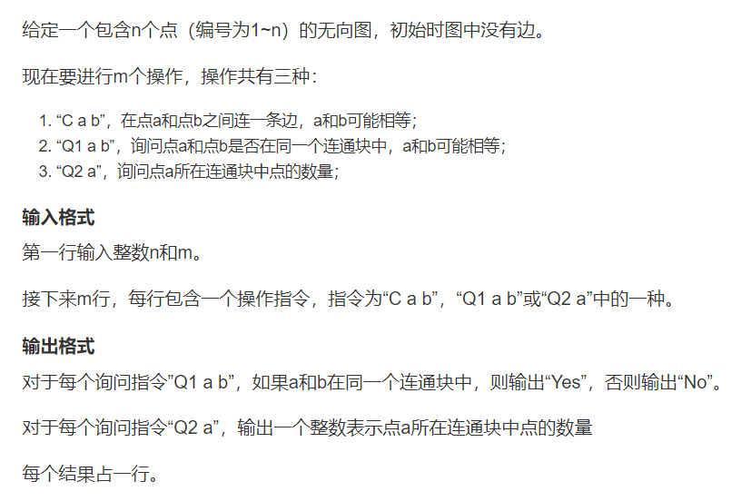
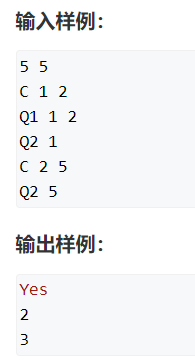

# 图算法相关
- BFS或者DFS时间复杂度


- 各种图算法时间复杂度


- ps：
  - 单源最短路优先使用SPFA(一般O(m)),如果卡极端用例,那么复杂度会上升到O(mn)使用堆优化的dijkstra
## 最短路径问题
- 从图中的某个顶点出发到达另外一个顶点的所经过的边的权重和最小的一条路径，称为最短路径
- 是针对**一个点**到**另一个点**来说的

### 朴素dijkstra算法


- 743.网络延迟时间    
```
class Solution {
    public static int[] dist;
    public static boolean[] set;
    public static int[][] g;
    public static int n;
    public static int k;
    static final int INF = Integer.MAX_VALUE - 200;
    public int networkDelayTime(int[][] times, int n, int k) {
        this.n = n;
        this.k = k;
        
        dist = new int[n + 1];
        set = new boolean[n + 1];
        g = new int[n + 1][n + 1];
        for(int i = 1; i <= n; i++){
            Arrays.fill(g[i], -1);
        }
        for(int[] time : times){
            int a = time[0];
            int b = time[1];
            int w = time[2];
            g[a][b] = w;
        }
        
        return dijkstra(k);
    }
    
    // 从第k个点出发,到其他顶点的最短路
    public static int dijkstra(int k){
        // max_value - 2 * 边权重的最大值,避免 dist[?] + g[t][j] 溢出 
        Arrays.fill(dist, INF);
        // dist的含义是所有点距离指定指定点(点k)的最短距离
        dist[k] = 0; // 既然是从第k个点出发,那么首先初始化第k个点->k的距离为0
        
        // 1.[在还未确定最短路的点中,寻找最小的dist]
        // 接下来(n-1)次 每一次迭代,寻找当前距离k最近的点t
        for(int i = 0; i < n - 1; i++){
            int t = -1; // t还未被更新过  
            // 遍历n个点 // 用j去更新t
            for(int j = 1; j <= n; j++){
                // j不在集合中 并且 (t 还未被更新过 || t 符合更新条件)
                if(!set[j] && (t == -1 || dist[t] > dist[j])){
                    t = j;
                }
            }
            // 2.用t去更新其他点到k的最短距离
            // 可能是 2.1 j点之前到k的距离 或者 2.2 t到k的距离 + t 到 j的距离
            // 2.1 dist[j], 2.2 dist[t] + g[t][j]
            for(int j = 1; j <= n; j++){
                if(g[t][j] != -1){
                   dist[j] = Math.min(dist[j], dist[t] + g[t][j]); 
                }
            }
                
            // 3.将t加入集合
            set[t] = true;
        }
        
        // 收尾工作:
        int max_time = -1;
        for(int i = 1; i <= n; i++){
            if(dist[i] == INF) return -1;
            max_time = Math.max(dist[i], max_time);
        }
        return max_time;
    }
}
```
### 堆优化的dijstra算法
- 针对稀疏图
  - 如果点的数量为$10^5$,那么使用朴素dijkstra就会爆炸


### 堆优化
#### 不使用邻接表
- 内部类Node,实现Comparable接口
  - 成员
    - 节点值node
    - map<Node, Integer>
      - key为node的邻居--n1,n2,n3...
      - value为node到邻居--n1,n2,n3...对应的边的权重
  - 方法
    - 重写compareTo(Node e)
      - 返回dist[this.val] - dist[e.val]
      - dist[k]为k号节点距离1号节点的距离,表示按照距离1号节点的距离形成小顶堆
- 输入
  - 每一条边 a b w, 顶点a, 顶点b, a,b之间的权重w,a->b为单向边
- 方法add
  - 将a,b,w转化为Node
    - (1) a == b 时, a->b就是一个点(或者是自环),这种输入是无效的
    - (2) a != b 时, 
      - original_weight <- node a.map.getOrDefault(b, Integer.MAX_VALUE) 
      - node a.map.put(b, min(original_weight, w))
- 流程
  - 初始化一个长度为n + 1的小顶堆
  - 将nodes[1]入队
  - 当队列元素 > 0时
    - 出队当前节点node(即为距离1号点最近的节点) (<font color=red>不需要遍历,直接就找到本轮迭代中距离1最近的点</font>)
      - 如果题目是求1-->n的最短距离时,若当前节点为n则退出循环
    - 通过node.neighbors(map)访问他的邻居n1,n2,...
      - n1 为 map的key
      - weight[node][n1]为map的value
      - dist[n1] = min(dist[n1], weight[node][n1] + dist[node])
        - ps: 如果weight[node][n1] + dist[node] < dist[n1],则需要将n1加入队列
- 链接:
  - https://www.acwing.com/solution/content/7061/
    - 这个是不使用邻接表的版本
  - https://www.acwing.com/solution/content/26112/
    - 这个是使用邻接表的版本

#### 个人喜欢的写法
```java
// 787.
class Solution {
    static Map<Integer, List<int[]>> map;
    public static int[] dist; 
    public static boolean[] set;
    public static int[][] g;
    public static int n;
 
    static final int INF = Integer.MAX_VALUE;
    public int networkDelayTime(int[][] times, int n, int k) {
        this.n = n;
        map = new HashMap<>();
        // 初始化邻接表
         for (int[] t : times) {
            map.computeIfAbsent(t[0], e -> new ArrayList<>()).add(new int[]{t[1], t[2]});
        }
        
        dist = new int[n + 1];
        set = new boolean[n + 1];
        return dijkstra(k);
    }
    // 堆优化的dijkstra
    private int dijkstra(int k){
        Arrays.fill(dist, INF);
        dist[k] = 0;
        
        // 创建一个小堆
        PriorityQueue<Integer> queue = new PriorityQueue<>((o1, o2) -> dist[o1] - dist[o2]);
        // 将起点放入堆中
        queue.add(k);
        
        while(!queue.isEmpty()){
            // 1.[在还未确定最短路的点中,寻找最小的dist对应的点t]
            Integer t = queue.poll(); // 出队当前距离k点最近的t点
            if(set[t]) continue;
            // 3.将加入集合
            set[t] = true;
            // 2.[用t去更新其他不在集合中的点距离k的最短距离]
            // 遍历t的邻居
            List<int[]> neibrs = map.getOrDefault(t, Collections.emptyList());
            for(int[] nei : neibrs){
                int j = nei[0];
                int w = nei[1];
                // 如果这一个邻居被访问过,则继续
                if(set[j]) continue; // 可以进行剪枝
                dist[j] = Math.min(dist[j], dist[t] + w);
                // 将更新后的邻居入队
                queue.offer(j);
            }   
        }
        //System.out.println(Arrays.toString(dist));
        // 收尾工作:
        int max_time = -1;
        for(int i = 1; i <= n; i++){
           // System.out.println("i: " + i + "dist[i]: " + dist[i]);
            if(dist[i] == INF) return -1;
            max_time = Math.max(dist[i], max_time);
        }
        return max_time;
        
    }
    
    private void showEdge(){
         // 显示由每个点出发的单向边以及对应的权重
        for(Integer in : map.keySet()){
            System.out.print("key = " + in );
            System.out.print("value = ");
            for(int[] e : map.get(in)){
                System.out.print(in + "-->" + e[0] + " w :" + e[1] + "\t");
            } 
            System.out.println(" ");
        }
    }

}
```
### Bellman-Ford


#### 朴素版本

- 787
```
class Solution {

    // static Node[] nodes;
    static int n; // 总的点数
    static int m; // 总的边数
    static int k; // 最多可以经过k次中转
    static int[] dist; // 在第i次迭代时,从src到达某个点的距离
    static int[] backup; // 在第i次迭代时,从src到达某个点的距离(第i-1次更新后结果的备份)
    final static int INF = Integer.MAX_VALUE;
    
    public int findCheapestPrice(int n, int[][] flights, int src, int dst, int K) {
        this.n = n;
        this.m = flights.length;
        this.k = K + 1;
        dist = new int[n + 1];
        backup = new int[n + 1];
        return bellmanFord(src, dst, flights);
        
            
        
    }
    
    
    public static int bellmanFord(int s, int e, int[][] edges){
        Arrays.fill(dist, INF);
        dist[s] = 0;
        int minCost = INF;
        // 1. 迭代k次 
        for(int i = 0; i < k; i++){
            // 2.遍历所有的边, 对于任意一条边 a --> b,
            // 更新起点到每个边的终点b的最短距离 
            // 2.1 记得副本拷贝
            System.arraycopy(dist, 0, backup, 0, n + 1);
            for(int j = 0; j < edges.length; j++){   
                int a = edges[j][0];
                int b = edges[j][1];
                int w = edges[j][2];
                dist[b] = (int)Math.min((long)dist[b], (long)backup[a] + (long)w);
                if(b == e) minCost = Math.min(minCost, dist[b]);
            }
            //System.out.println(Arrays.toString(dist));
        }
        if(minCost == INF) return -1;
        else return minCost;
    }
    
    // static class Node{
    //     int a;
    //     int b;
    //     int w;
    //     public Node(int a, int b, int w){
    //         this.a = a;
    //         this.b = b;
    //         thils.w = w;
    //     }
    // }
}
```
#### 堆优化版本-SPFA

```
class Solution {
    static Map<Integer, List<int[]>> map;
    public static int[] dist; 
    public static boolean[] set;
    public static int[][] g;
    public static int n;
 
    static final int INF = Integer.MAX_VALUE;
    public int networkDelayTime(int[][] times, int n, int k) {
        this.n = n;
        map = new HashMap<>();
        // 初始化邻接表
         for (int[] t : times) {
            map.computeIfAbsent(t[0], e -> new ArrayList<>()).add(new int[]{t[1], t[2]});
        }
        
        dist = new int[n + 1];
        set = new boolean[n + 1];
        return dijkstra(k);
    }
    // 堆优化的BF--SPFA
    private int dijkstra(int k){
        Arrays.fill(dist, INF);
        dist[k] = 0;
        
        // 创建一个小堆
        PriorityQueue<Integer> queue = new PriorityQueue<>((o1, o2) -> dist[o1] - dist[o2]);
        // 将起点放入堆中
        queue.add(k);
        
        while(!queue.isEmpty()){
            // 1.[在还未确定最短路的点中,寻找最小的dist对应的点t]
            Integer t = queue.poll(); // 出队当前距离k点最近的t点
            set[t] = false; // 同一个点,可以重复入队(考虑到BF适用于存在负权边的情况)
            // 表示t点此时不在队列中
            
            // 2.[用t去更新其他不在集合中的点距离k的最短距离]
            // 遍历t的邻居
            List<int[]> neibrs = map.getOrDefault(t, Collections.emptyList());
            for(int[] nei : neibrs){
                int j = nei[0];
                int w = nei[1];
                // 如果没有更新过,或者需要更新距离
                if(dist[j] == INF || dist[j] > dist[t] + w) {
                    dist[j] = dist[t] + w;  
                    // 如果j在队列中,则不需要重复入队
                    if(!set[j]){
                        set[j] = true;
                        queue.offer(j);
                    }
                    
                }
            }   
        }
        // 使用stream进行操作
        // 为了避免dist[0] == INF的影响,设置dist[0] = 0
        dist[0] = 0;
        int max_time = Arrays.stream(dist).max().getAsInt();
        return max_time == INF ? -1 : max_time;
        
    }
    
    private void showEdge(){
         // 显示由每个点出发的单向边以及对应的权重
        for(Integer in : map.keySet()){
            System.out.print("key = " + in );
            System.out.print("value = ");
            for(int[] e : map.get(in)){
                System.out.print(in + "-->" + e[0] + " w :" + e[1] + "\t");
            } 
            System.out.println(" ");
        }
    }

}
```

## 最小生成树问题
- 从一个顶点出发,将整个图连通


- 求最小生成树
  - 一般来说使用Prim或者kruskal
    - kruskal $mlogm$
    - prim(朴素版) $n^2$
    - prim(堆优化版) $mlogn$
## Prim
### Prim-朴素版
- (1) ```dist[i] <- +∞``` 把所有点的距离初始化为+∞
- (2) for(i = 0; i < n; i++>) n次迭代
  - (2.1) t <- 找到不在集合s(在当前联通块中的所有点)中距离最小的点(赋值给t,t表示的是一个点)
  - (2.2) 用t更新其他点到<font color=red>**集合**</font>的距离(而dijkstra是使用t更新其他点到<font color=red>**起点**</font>的距离)
  - (2.3) s[t] = true 把t点加到集合中去

- 和dijkstra的区别
  - prim需要迭代n次, prim一开始没有选中一个一个点,在迭代结束后,才将选中的该点添加到集合中
  - dijkstra需要迭代n-1次, dijkstra一开始就选中了一个点,只需要迭代n-1次

### 图解(见ipad,还未粘上来)

### 1584. 连接所有点的最小费用
- 条件
  - n个点 
  -  每个点到集合的距离dist[n]
  -  邻接矩阵g[n][n]
  -  集合外中所有点到集合距离最短的点t, 点的坐标从0开始, t初始化为-1
  -  st[n] 表示该点是否在集合内部
- 思路
  - 初始化所有边的距离为-inf 
  - n次迭代
```java
class Solution {
    static int[] dist;
    static boolean[] set;
    static int[][] g;
    static int n; // 点的数量
    static final int INF = Integer.MAX_VALUE;
    
    public int minCostConnectPoints(int[][] points) {
        this.n = points.length; 
        
        dist = new int[n + 1];
        set = new boolean[n + 1];
        g = new int[n + 1][n + 1];
        
        initGraph(points);
        return prim();
        
    }

    private void initGraph(int[][] points){
          // 初始化邻接矩阵
        for(int i = 1; i <= n; i++){
            Arrays.fill(g[i], -1);
        }
        for(int i = 0; i < points.length; i++){
            for(int j = i + 1; j < points.length; j++){
                int a = i + 1;
                int b = j + 1;
                int w = Math.abs(points[i][0] - points[j][0]) + Math.abs(points[i][1] - points[j][1]); // 两点之间的距离
                g[a][b] = w;
                g[b][a] = w;
            }
        }
    }
    private int prim(){
        // dist的含义是所有点距离(最小生成树)集合的最近距离
        Arrays.fill(dist, INF); 
        dist[1] = 0; // 将1号点设置为集合中的点
        int minCost = 0;
        // 1.[在不在集合中的点中,寻找距离集合最近的点dist]
        // 接下来n次 每一次迭代 寻找当前距离集合最近的点t
        for(int i = 0; i < n; i++){
            int t = -1; // t还未被更新过
            // 遍历n个点 用j去更新t
            for(int j = 1; j <= n; j++){
                if(!set[j] && (t == -1 || dist[j] < dist[t])){
                    t = j;
                }
            }
            // if(dist[t] == INF) ; 代表该点无法连通 在无法连通的情况下,无法得到最小生成树
            // 2.[用t去更新其他点到集合的最小距离]
            // 可能是 2.1 j点之前到集合的距离 或者 2.2 j点到t点的距离(此时t已经属于集合了)
            // 2.1 d[j], 2.2 g[j][t]
            for(int j = 1; j <= n; j++) {
              if (g[j][t] != -1) dist[j] = Math.min(dist[j], g[j][t]);  
            }
            
            // 3.将t加入集合
            set[t] = true;
            
            // 增加最小生成树的权重之和
            minCost += dist[t];
            
        }
        return minCost;
    }
}
```

## Kruskal 
- 一般在稀疏图中使用kruskcal
- (1) 先将所有边按照从小到大权重排序 $O(mlogm)$
- (2) 从小到大枚举每一条边 ```a --- b``` (无向边,权重为c)
  - if a,b不连通
    - 将边c加入到集合中
    - 具体怎么做参考 Acwing 837. 连通块中点的数量(基于并查集的性质)
    - 整个(2)的时间复杂度为O(m)
- 使用kruskal的另外一个优点在于,不需要用**邻接表**或者**邻接矩阵**来存图
- step1:
  - 对于java,可以使用**内部类**来存边
    - (1)定义内部类Edge,属性为a,b(相连的两个点),w为边的权重
    - (2)使用Array自定义排序规则,对Edge排序
- step2:
  - 初始化并查集, result = 0(最小生成树中所有边的权重之和), cnt = 0(当前加入了多少条边)
  - 从小到大枚举所有边 e
    - rootA = find(e.a), rootB = find(e.b),判断两个点的根节点是否相同
      - 如果不连通
        - result += e.w; //增加该条边的权值
        - cnt ++; //加入边总数+1
        - merge(e.a, e.b); // 合并两个集合
- step3:
  - if cnt < n - 1,则表明该图不联通

### Acwing 837. 连通块中点的数量
  

- **样例**                

  

- 思路                            
  - (1) 用一个集合来维护一个连通块,一个集合中的点在一个连通块中
  - (2) 当在两个集合中连一条边时,起到的作用是将两个集合合并
  - 并查集
    - 操作C表示merge两个元素所在的集合
    - 操作Q1表示得到两个元素对应集合的根节点,判断根节点是否相等
    - 操作Q2
      - 基于数组size,表示每一个集合的大小(即每个集合中点的数量),规定只有根节点的size才有意义

```
- 建立size()
// 初始化parent时,每个集合中元素初始化为1
    static class unionFindSet{
        int[] parent;
        int[] size;
        unionFindSet(int n){
            parent = new int[n];
            size = new int[n];
            for (int i = 0; i < n; i++) {
                parent[i] = i;
                size[i] = 1; 
            }
        }

        public void merge(int x, int y){
          int rootX = find(x), rootY = find(y);
          if(rootX != rootY) {
            parent[rootX] = rootY;
            size[rootY] += size[rootX];
          }
        } 

        pubic int getSize(int x){
          int rootX = find(x);
          return size[rootX];
        }
    }
```
### 1489. 找到最小生成树里的关键边和伪关键边
- 边
  - 关键边: 去掉某一条边后, 最小生成树的权值和增加
  - 伪关键边: 是可能会出现在某些最小生成树中但不会出现在所有最小生成树中的边
- 本题点数 n <= 100, 边数 e <= 200, 所以可以按照定义来枚举
- 使用kruskal
- 思路
    - 先求一下所有边对应的最小生成树的$cost$
    - **判断关键边**: 依次枚举每一条边,假设当前是第k条边,删掉该边后再次求最小生成树$cost_{k}$,如果$cost_{k} > cost$或者发现无法形成最小生成树,则该边为**关键边**
    - **判断伪关键边**: 如果删掉该边之后可以求得最小生成树(即$cost_{k} == cost$),而且加上该边之后也可以求到最小生成树,那么此边为**伪关键边**
    - 基于kruskal
      - 需要使用某条特定边,在一开始加入某条边
      - 需要删掉某条特定边,在遍历边时跳过这条边


### 1579.保证图可完全遍历(0127)
- 数据范围:
  - 点数: $0 \le n \le 10^{5}$
  - 边数: $1 \le e \le min(10^{5}, 3 * n * (n - 1) / 2)$
- 分析:
  - (1)如果只有一种边,问题转化为删除无向图中尽可能多的边,使得删完之后的图为连通图 --> 可以将该问题转换为**对偶问题**,即最少保留(**选择**)多少条边,可以使得图联通(边数一定的情况下,删掉的边数最多,意味着剩下的边数最少)
  - (2)本质上是**最小生成树**的变种-->可以使用**kruskal**
- 思路:
  - (1)考虑哪些边可以优先选 
    - 红色边只能提供Alice的连通性,绿色边只能提供Bob的连通性
    - 蓝色边可以同时提供Alice和Bob的连通性,从直觉上来说,可以优先选择蓝色边
  - (2)可以将边分为两大类
    - 类别1:蓝边
    - 类别2:红边或者绿边  
    - 优先枚举类别1,然后是类别2
  - (3)枚举每一条边
    - 类别1:
      - 发现边对应的两个点不在一个集合中,则该条边需要被选上(**合并**),否则,该边无需选上(**删除**)
    - 类别2:
      - 同类别1的处理方式
    - 统计**一共删除了多少条线**,$O(n)$

### 1631.最小体力消耗路径
- 这种做法是Kruskal了
```
class Solution {
    public int minimumEffortPath(int[][] heights) {
        int M = heights.length, N = heights[0].length;
        if(M == N && M == 1) return 0;
        Queue<Edge> pq = new PriorityQueue<>(new Comparator<Edge>(){
            @Override
            public int compare(Edge e1, Edge e2){
                return e1.w - e2.w;
            }
        });
        
        
        // 将每个顶点的右边和下边添加到并查集中
        for(int i = 0; i < M; i++){
            for(int j = 0; j < N; j++){
                int aid = i * N + j;
                if (j < N - 1){ // 此时可以添加右侧边
                    int bid = i * N + j + 1;
                    int rw = Math.abs(heights[i][j + 1] - heights[i][j]);
                    pq.add(new Edge(rw, aid, bid));
                }
                if (i < M - 1) { // 此时可以添加下侧边
                    int bid = (i + 1) * N + j;
                    int dw = Math.abs(heights[i+1][j] - heights[i][j]);
                    pq.add(new Edge(dw, aid, bid));
                }
            }
        }
        UnionFindSet uset = new UnionFindSet(M * N);
        int result = Integer.MAX_VALUE;
        int startid = 0, endid = M * N - 1;
        while (!pq.isEmpty()){
            Edge curE = pq.poll();
            int aid = curE.aid, bid = curE.bid;
            uset.merge(aid, bid);
            if(uset.find(startid) == uset.find(endid)){
                result = curE.w;
                break;
            }
        }
        return result;
    }

    static class Edge{
        int w; // 每条边的权重
        int aid; // 边连接的点a id
        int bid; // 边连接的点b id
        Edge(int w, int aid, int bid){
            this.w = w;
            this.aid = aid;
            this.bid = bid;
        }
    }
    static class UnionFindSet{
        int[] p;
        UnionFindSet(int n){
            p = new int[n];
            for(int i = 0; i < n; i++){
                p[i] = i;
            }
        }
        public int find(int x){
            if(p[x] != x) p[x] = find(p[x]);
            return p[x];
        }

        public void merge(int x, int y){
            int rx = find(x), ry = find(y);
            if(rx != ry) p[rx] = ry;
        }
    }
}

// 并查集: 将所有边按照权重大小依次加入并查集,直至起点到终点联通
```

### 776.水位上升的泳池中游泳
```
class Solution {
    public int swimInWater(int[][] g) {
        int N = g.length;
        Queue<Edge> pq = new PriorityQueue<>(new Comparator<Edge>(){
            @Override
            public int compare(Edge e1, Edge e2){
                return e1.w - e2.w;
            }
        });
        for(int i = 0; i < N; i++){
            for(int j = 0; j < N; j++){
                // 当前点的编号
                int aid = i * N + j;
                if(j < N - 1){
                    // 右侧边
                    int bid = i * N + (j + 1);
                    int w = Math.max(g[i][j], g[i][j+1]);
                    pq.add(new Edge(w, aid, bid));
                }
                if(i < N - 1){
                    // 下方边
                    int bid = (i + 1) * N + j;
                    int w = Math.max(g[i][j], g[i+1][j]);
                    pq.add(new Edge(w, aid, bid));
                }
            }
        }
        UnionFindSet uset = new UnionFindSet(N * N);
        int startId = 0, endId = N * N - 1;
        int t = -1;
        while(pq.size() > 0){
            Edge e = pq.poll();
            int aid = e.aid, bid = e.bid;
            uset.merge(aid, bid);
            if (uset.find(startId) == uset.find(endId)){
                t = e.w;
                break;
            }
        }
        return t;
    }

    static class Edge{
        int w;
        int aid;
        int bid;
        Edge(int w, int aid, int bid){
            this.w = w;
            this.aid = aid;
            this.bid = bid;
        }
    }

    static class UnionFindSet{
        int[] p;
        UnionFindSet(int n){
            p = new int[n];
            for(int i = 0; i < n; i++){
                p[i] = i;
            }
        }
        public void merge(int x, int y){
            int rx = find(x), ry = find(y);
            if(rx != ry) p[rx] = ry;
        }
        public int find(int x){
            if(p[x] != x) p[x] = find(p[x]);
            return p[x];
        }
    }
}

// 并查集
// 类似1631
// (1)先将网格中的所有边生成,每个边给予一个权重,该权重为两个点之间值的较大者
// --(表示到达该时间点时,可以从较小的边游到较大的边)
// (2)将边按权重大小依次加入并查集中,直至起点和终点联通
```