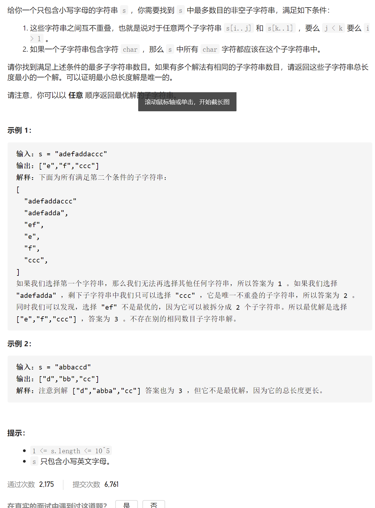
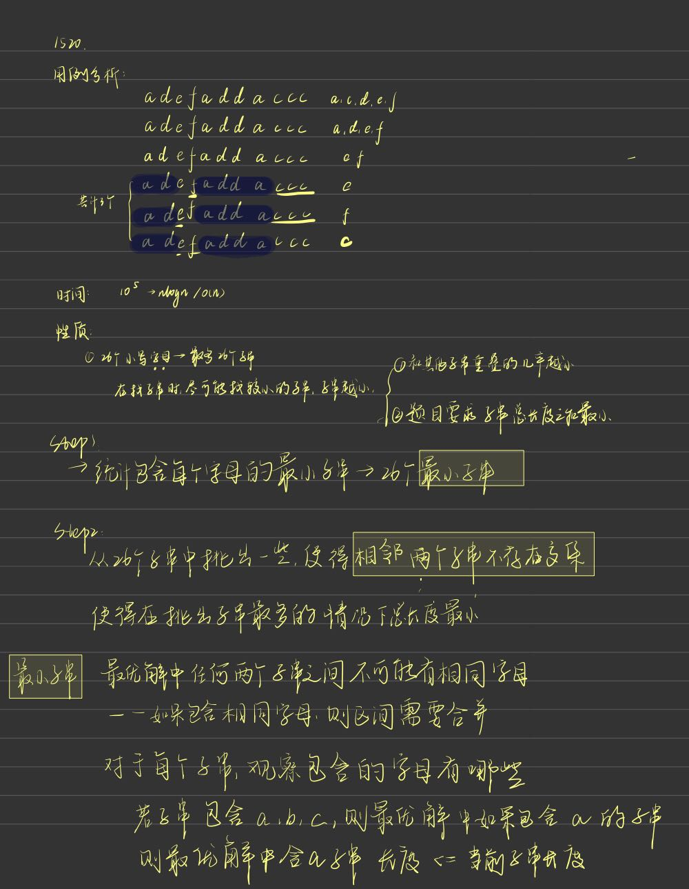
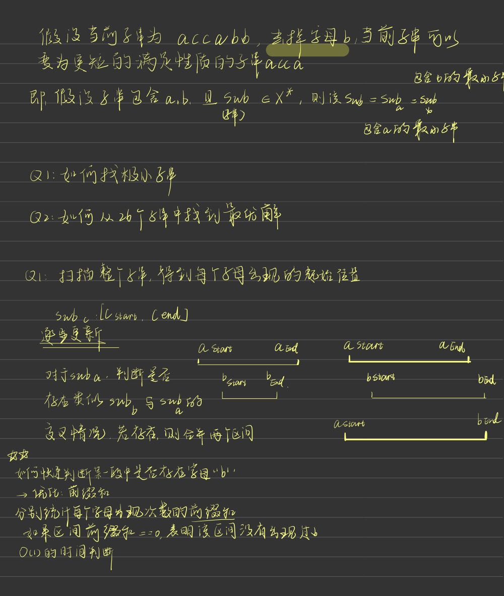
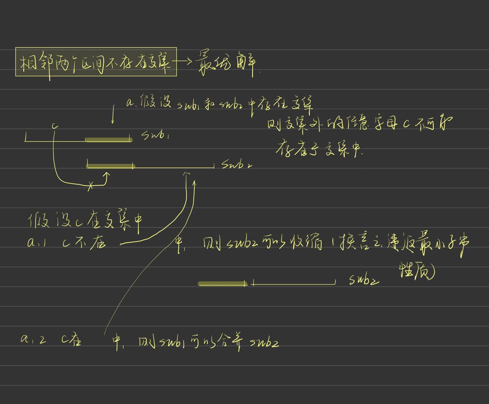

## 767.重构字符串
### 字符串处理
### 大顶堆 + 自定义类
### 启发:可以用自定义的静态内部类实现key-value映射,而非使用HashMap

// PS:这个其实是贪心的思路
```
/**
     * 写一个NewChar类，里面包含字母的出现频数，和字母本身。用优先队列PriorityQueue来存储一个一个的NewChar，
     * 并自己写一个比较器，通过字母的频数降序排列，即构建一个大顶堆。之后两两输出，输出前两个大的，
     * 然后将它们两个对应的count频率-1，再次放入，继续输出……
     *
     * 这样输出是为了总能有一个字母可以把频率最多的字母隔开，优先队列是为了维持储存NewChar的集合总是可以降序输出。
     *
     * @param S 定一个字符串S
     * @return 若可行，输出任意可行的结果。若不可行，返回空字符串。
     */
    public String reorganizeS   tring(String S) {
        //整理好各个字母对应出现的频率
        int[] counts = new int[26];
        for (int i = 0; i < S.length(); i++) {
            counts[S.charAt(i) - 'a']++;
        }
        //定义大顶堆规则
        
        
        //构建大顶堆
        for (int i = 0; i < 26; i++) {
            //判断重构是否可行，counts[i] <= (S.length() + 1) / 2)---某个字母过半就不能重构
            if (counts[i] > 0 && counts[i] <= (S.length() + 1) / 2) {
                //可以重构，就往大顶堆里面塞对象
                pq.add(new NewChar(counts[i], (char) (i + 'a')));
            } else if (counts[i] > (S.length() + 1) / 2) {
                return "";
            }
        }
        //由大顶堆重构字符串
        StringBuilder str = new StringBuilder();

        while (pq.size() > 1) {//最后剩下一个字符或者一个不剩，终止
            //拿出来频率老大和老二
            NewChar c1 = pq.poll();
            NewChar c2 = pq.poll();

            str.append(c1.letter);
            str.append(c2.letter);

            if (--c1.count > 0) pq.add(c1);
            if (--c2.count > 0) pq.add(c2);
        }
        //若剩下一个，特殊处理；一个不剩正好，美滋滋
        // 不会出现ab|b的情况
        if (pq.size() > 0)
            str.append(pq.poll().letter);

        return str.toString();
    }

    /**
     * 自己根据数据特点搞个对象
     */
    static class NewChar {
        int count;//出现的频率
        char letter;//字母

        NewChar(int count, char letter) {
            this.count = count;
            this.letter = letter;
        }
    }

    /**
     * 创建PriorityQueue的时候一定要写一个比较器Comparator，因为NewChar是自己写的一个类，
     * 不写比较器的话程序自己不知道该如何排序，从而会报错：
     *
     * cannot be cast to java.lang.Comparable 	at java.util.PriorityQueue.siftUpCom
     */
```

### 尝试使用静态内部类实现{(1,1), (2,3)}

```
public class staticInner {

    public static void main(String[] args) {
        HashSet<Coo> hs = new HashSet<>();
        hs.add(new Coo(1,1));
        hs.add(new Coo(2,3));
        System.out.println(hs.contains(new Coo(1, 2)));

    }
    static class Coo {
        int x;//出现的频率
        int y;

        public int hashCode() {
            return 1;
        }
        @Override
        public boolean equals(Object obj) {
            if (obj instanceof Coo) {
                Coo coo = (Coo) obj;
                return (this.x == coo.x) && (this.y == coo.y);
            }
            else {
                return false;
            }
        }
        Coo(int x, int y) {
            this.x = x;
            this.y = y;
        }
    }

}
```

## 1675. 数组的最小偏移量
```
class Solution {
    public int minimumDeviation(int[] nums) {
        // [1,2,4,7] -- [2,2,4,14] 
        // {2,4,14}
        // {2,4,7}
        //nums 全部元素取到最大值 --> 所有元素都为偶数 [1,2,3,4] --> [2,2,6,4] 
        //nums 全部元素取到最小值 --> 所有元素都为奇数 [1,2,3,4] --> [1,1,3,1]
        // {2,4,6}
        // {2,3,4}
        // {2,3} 
        TreeSet<Integer> set = new TreeSet<>(); // 
        //将nums 对应的最大值全部加入大顶堆和小顶堆
        for(Integer num:nums){
            //如果num为奇数,其对应的最大值为2*num
            if(num % 2 == 1){
                set.add(2 * num);
            }else{
                set.add(num);
            }
        }
        
        Integer minBias = Integer.MAX_VALUE;
        int setNumber = set.size();
        while (true){
            int curMax = set.last();
            int curMin = set.first();
            minBias = Math.min(curMax - curMin, minBias);
            if (curMax % 2 == 1) break; //调整到最大值为奇数即可 如{2,3} / {2,7}
            set.remove(curMax);
            // 没有break出去,最大值必为偶数
            curMax /= 2;
            set.add(curMax);
        }

        return minBias;
    }
}
```

## 659. 分割数组为连续子序列
- 参考链接:
  - 官方题解
  - https://leetcode-cn.com/problems/split-array-into-consecutive-subsequences/solution/fen-ge-shu-zu-wei-lian-xu-zi-xu-lie-by-l-lbs5/

```
// 官方题解: 解法1
class Solution {
    public boolean isPossible(int[] nums) {
        Map<Integer, PriorityQueue<Integer>> map = new HashMap<Integer, PriorityQueue<Integer>>();
        for (int x : nums) {
            
            if (!map.containsKey(x)) {
                map.put(x, new PriorityQueue<Integer>());
            }
            
            if (map.containsKey(x - 1)) {
                // num-1对应的最小长度
                int prevLength = map.get(x - 1).poll();
                map.get(x).offer(prevLength + 1);
                if (map.get(x - 1).isEmpty()) {
                    map.remove(x - 1);
                }
                
            } else {
                map.get(x).offer(1);
            }
        }
        Set<Map.Entry<Integer, PriorityQueue<Integer>>> entrySet = map.entrySet();
        for (Map.Entry<Integer, PriorityQueue<Integer>> entry : entrySet) {
            PriorityQueue<Integer> queue = entry.getValue();
            if (queue.peek() < 3) {
                return false;
            }
        }
        return true;
    }
}
```

- Java实现
```
class Solution {
    public boolean isPossible(int[] nums) {
        Map<Integer, PriorityQueue<Integer>> map = new HashMap<Integer, PriorityQueue<Integer>>();
        for(int num: nums){
            if(map.containsKey(num - 1)){
                int minLength = map.get(num - 1).poll();
                if (map.containsKey(num)){
                    map.get(num).add(minLength + 1);
                }else{
                    map.put(num, new PriorityQueue<Integer>());
                    map.get(num).add(minLength + 1);
                }
                if(map.get(num - 1).size() == 0){
                    map.remove(num - 1);
                }
            }else{
                if (map.containsKey(num)){
                    map.get(num).add(1);
                }else{
                    map.put(num, new PriorityQueue<Integer>());
                    map.get(num).add(1);
                }
                
            }
        }

        Set<Map.Entry<Integer, PriorityQueue<Integer>>> entrySet = map.entrySet();
        for (Map.Entry<Integer, PriorityQueue<Integer>> entry : entrySet) {
            PriorityQueue<Integer> queue = entry.getValue();
            if (queue.peek() < 3) {
                return false;
            }
        }
        return true;

    }
}
```

## 621.任务调度器
```
class Solution {
    public int leastInterval(char[] tasks, int n) {
        PriorityQueue<NewChar> maxHeap = new PriorityQueue<>(new Comparator<NewChar>(){
            @Override
            public int compare(NewChar c1, NewChar c2){
                if(c2.count != c1.count){
                    return c2.count - c1.count;
                }else{
                    return c1.task - c2.task;
                }  
            }
        });
        int[] counts = new int[26]; //统计每一个task的出现频率
        for(char task: tasks){
            counts[task-'A'] ++;
        }
        // System.out.println(Arrays.toString(counts));

        for(int i = 0; i < 26; i++){
            if(counts[i] != 0){
                maxHeap.add(new NewChar((char)('A'+i), counts[i]));
            }
        }

        StringBuilder sb = new StringBuilder();
        while (maxHeap.size() != 0){
            LinkedList<NewChar> temp = new LinkedList<>(); // 暂时存放从堆中取出的n个元素
            //为每个桶分配元素
            for (int j = 0; j <= n; j++){
                if(maxHeap.size() != 0){
                    NewChar curChar = maxHeap.poll();
                    sb.append(curChar.task);
                    temp.add(curChar);
                }else{
                    sb.append("#");
                }
            }
            while(temp.size() != 0){
                NewChar curChar = temp.removeLast();
                curChar.count --;
                if(curChar.count != 0) maxHeap.add(curChar);
            }  
        }

        // System.out.println(sb.toString());
        char[] rets = sb.toString().toCharArray();
        // System.out.println(Arrays.toString(rets));
        int lastWait = 0; // 在最后一个桶中的等待时间
        for (int j = rets.length - 1; j > -1; j--)
            if(rets[j] == '#') lastWait ++;
            else break;
    
        return rets.length - lastWait;
    }

    
    static class NewChar{
            Character task;
            Integer count;
            NewChar(Character task, Integer count){
                this.task = task;
                this.count = count;
            }
        }
}
```

## 1520.







