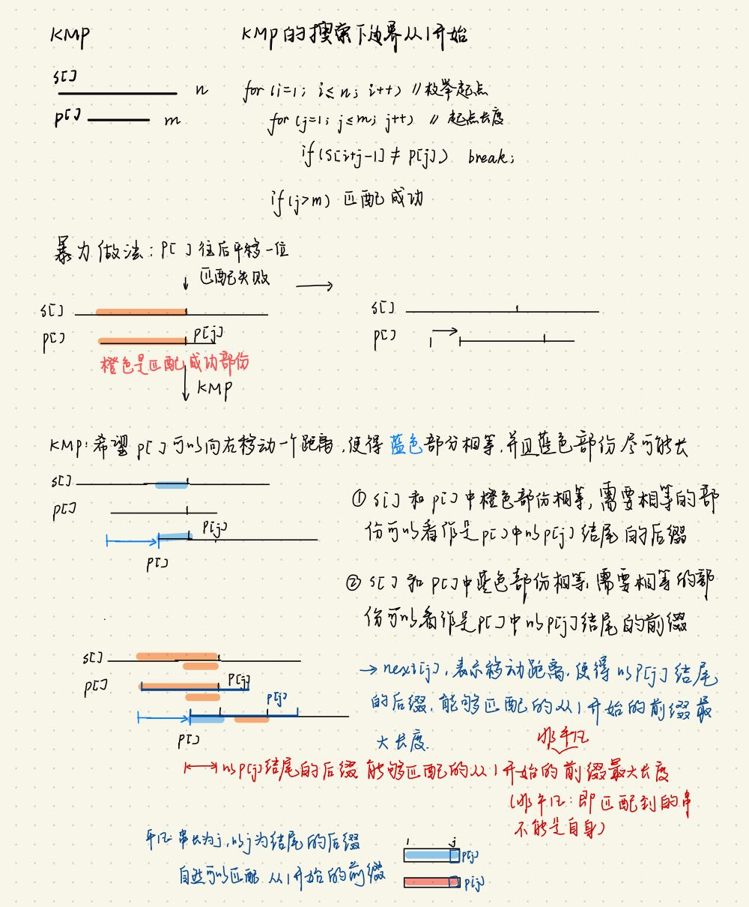
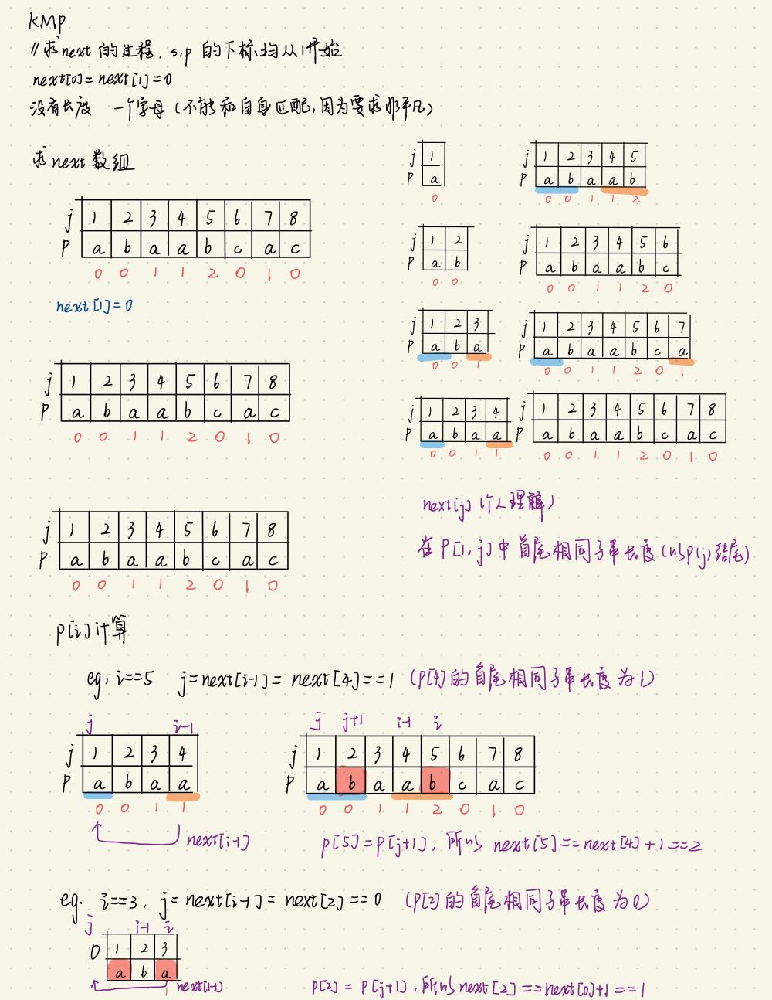
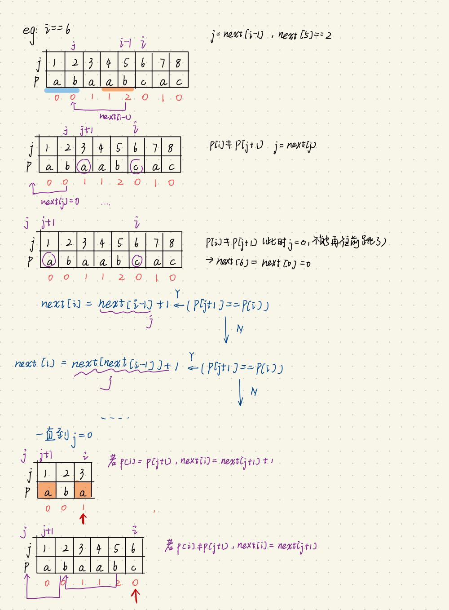
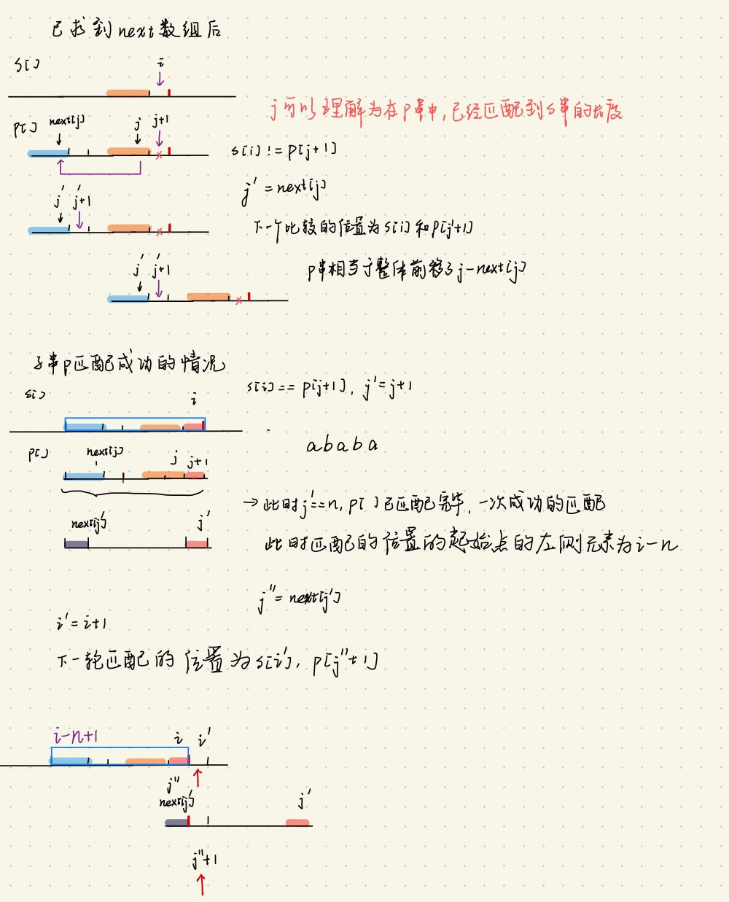

# KMP
## 原理
 

## 过程
### (1) 求next数组
```
   public int[] findNext(char[] p){
        int n = p.length - 1;
        int[] next = new int[n + 1];
        for(int i = 2; i <= n; i++){
            int j = next[i - 1];
            while(j > 0 && p[i] != p[j + 1]) j = next[j];
            if(p[i] == p[j + 1]) j++;
            next[i] = j;
        }
        
        return next;
    }
```
 
 

###  (2) 基于next数组,求匹配位置
```
    public List<Integer> kmp(char[] s, char[] p, int[] next){
        int m = s.length - 1; // s中有效字符数量为m,此时char[] s中s[0] 未赋值
        int n = p.length - 1; // p中有效字符数量为n,此时char[] p中p[0] 未赋值
        List<Integer> results = new LinkedList<>();
        int j = 0;
        for(int i = 1; i <= m; i++){
            while(j > 0 && s[i] != p[j + 1]) j = next[j];
            if(s[i] == p[j + 1]) j++;
            if(j == n){
                results.add(i - n + 1); // 匹配成功的在区间中的起始位置
                j = next[j];
            }
        }
        return results;
    }
```
 


### 应用
#### 28. 实现strStr()
```
实现 strStr() 函数。

给定一个 haystack 字符串和一个 needle 字符串，在 haystack 字符串中找出 needle 字符串出现的第一个位置 (从0开始)。如果不存在，则返回  -1。
```
```
class Solution {
    public int strStr(String haystack, String needle) {
        if (needle.length() == 0) return 0;

        char[] s = preprocessString(haystack);
        char[] p = preprocessString(needle);
        

        int[] next = findNext(p);
        List<Integer> results = kmp(s, p, next);
        // char[] s 的有效元素下标为1~m, char[] p 的有效元素下标为1~n
        // 假设模式串长度为2, s[2:3] 匹配 p[1:2] 成功
        // 此时 i == 3, n == 2, i - n + 1 为模式串p在原串s中的起始位置的下标
        // 考虑到要返回在原字符串中的索引(下标从0开始),所以需要将 i - n - 1
        if(results.size() == 0) return -1;
        int[] ress = new int[results.size()];
        for(int i = 0; i < results.size(); i++){
            ress[i] = results.get(i) - 1;
        }
        return ress[0];
    }
    // 实现: 将 字符串 转化为字符串数组,并且字符串数组的下标从1开始
    public char[] preprocessString(String pattern){
        int n = pattern.length();
        char[] pArray = pattern.toCharArray();
        char[] p = new char[n + 1];
        for(int i = 0; i < n; i++){
            p[i + 1] = pArray[i];
        }
        
        return p;
    }

    public int[] findNext(char[] p){
        int n = p.length - 1;
        int[] next = new int[n + 1];
        for(int i = 2; i <= n; i++){
            int j = next[i - 1];
            while(j > 0 && p[i] != p[j + 1]) j = next[j];
            if(p[i] == p[j + 1]) j++;
            next[i] = j;
        }
        
        return next;
    }

    public List<Integer> kmp(char[] s, char[] p, int[] next){
        int m = s.length - 1; // s中有效字符数量为m,此时char[] s中s[0] 未赋值
        int n = p.length - 1; // p中有效字符数量为n,此时char[] p中p[0] 未赋值
        List<Integer> results = new LinkedList<>();
        int j = 0;
        for(int i = 1; i <= m; i++){
            while(j > 0 && s[i] != p[j + 1]) j = next[j];
            if(s[i] == p[j + 1]) j++;
            if(j == n){
                results.add(i - n + 1); // 匹配成功的在区间中的起始位置
                j = next[j];
            }
        }
        return results;
    }
    
}
```