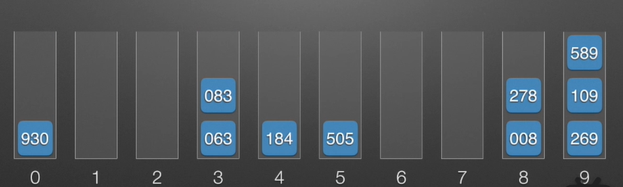

- 计数排序,基数排序,桶排序都是几种比较常见的非比较排序

# 164. 最大间距
- 参考题解1
  - https://leetcode-cn.com/problems/maximum-gap/solution/javacong-bi-jiao-pai-xu-dao-ji-shu-pai-xu-zai-dao-/
- 参考题解2
```
class Solution {
    public int maximumGap(int[] nums) {
        int n = nums.length;
        if (n < 2) {
            return 0;
        }
        long exp = 1;
        int[] buf = new int[n];
        int maxVal = Arrays.stream(nums).max().getAsInt();
        // int最大有10位数也就是十亿以上，所以可能会循环10次以上
        while (maxVal >= exp) { // 数组中的最大值大于10 ** (exp)时
            int[] cnt = new int[10]; // 创建一个临时长度为10的数组
            for (int i = 0; i < n; i++) {// 这里是O(n)
                int digit = (nums[i] / (int) exp) % 10;
                cnt[digit]++;
            }
            for (int i = 1; i < 10; i++) {
                cnt[i] += cnt[i - 1];
            }
            for (int i = n - 1; i >= 0; i--) {// 这里是O(n)
                int digit = (nums[i] / (int) exp) % 10;
                buf[cnt[digit] - 1] = nums[i];
                cnt[digit]--;
            }
            System.arraycopy(buf, 0, nums, 0, n);// 这里是O(n)
            exp *= 10;
        }
        /*  上面的循环最多要10*3*O(n) */
        int ret = 0;
        for (int i = 1; i < n; i++) {// 这里是O(n)，加上这里，最多要(30+1)O(n)
            ret = Math.max(ret, nums[i] - nums[i - 1]);
        }
        return ret;
    }
}
```
```
Arrays.stream(nums).max().getAsInt(); //用法指路
```
- 参考链接
  - https://blog.csdn.net/issunmingzhi/article/details/106413031
- Java
  - 使用计数排序
```
class Solution {
    public int maximumGap(int[] nums) {
        // 计数排序
        int length = nums.length;
        if (length < 2) return 0;
        int maxNum = Integer.MIN_VALUE, minNum = Integer.MAX_VALUE;
        for(int num: nums){
            maxNum = Math.max(maxNum, num);
            minNum = Math.min(minNum, num);
        }
        // System.out.println(maxNum+" "+minNum);
        int[] cnt = new int[maxNum - minNum + 1];
        for (int num: nums){
            cnt[num-minNum]++;
        }
        // System.out.println(Arrays.toString(cnt));
        
        int maxGap = Integer.MIN_VALUE; // 元素之间的最大差值
        int pre = -1; // 上一个在数组nums中出现过的元素坐标
        for (int i = 0; i < cnt.length; i++) {
            if((pre == -1) && (cnt[i] != 0)) pre = i;
            if(cnt[i] != 0) {
                maxGap = Math.max(maxGap, i - pre);
                pre = i;
            }
        }
        return maxGap;
    }
}
```
- 会挂在用例[2,99999999]上,原因是超出内存限制

- 使用基数排序
  - 基数排序动画讲解
  - 见
    - https://www.bilibili.com/video/BV1wa4y177rX/?spm_id_from=333.788.recommend_more_video.0
    - 步骤
      - 对于数组
        -  
        - |278|109|63|930|589|184|505|269|8|83|
          - 最高为3位,不足三位的数字补0处理
        -  
          - |278|109|063|930|589|184|505|269|008|083|
    - **顺序遍历数组**按照最低位(个位)分桶
      - 
      - 注:
        - 因为是顺序遍历数组,所以|063|先进桶,|083|后进桶
    - 分桶完成后还原数组,此时数组的最低位(个位)从低到高有序
      - 
      - 注:
        - 对于在同一个桶的|063|和|083|,在还原得到的数组中的位置为|063|083|
        - 先进桶的|063|先出桶,后进桶的|083|后出桶
    - 完成对最低位的排序,下一轮迭代按照更高一位(十位)从低到高排序 

```
public class Solution {
    public int maximumGap(int[] nums) {
        int n = nums.length;
        if (n < 2) {
            return 0;
        }
        long exp = 1;
        int[] buf = new int[n];
        int maxVal = Arrays.stream(nums).max().getAsInt();

        LinkedList<Integer>[] buckets = new LinkedList[10];
        // 初始化链表数组
        for (int i = 0; i < buckets.length; i++) {
            buckets[i] = new LinkedList<>();
        }
        // int最大有10位数也就是十亿以上，所以可能会循环10次以上
        while (maxVal >= exp) { // 数组中的最大值大于10 ** (exp)时
            for (int i = 0; i < n; i++) {// 这里是O(n)
                int digit = (nums[i] / (int) exp) % 10;
                buckets[digit].add(nums[i]);
            }//个位数[0~9]对应的元素个数
            // 遍历buckets,将buckets中的元素回填入nums中
            int idx = 0;
            while (idx < n){
                // 遍历桶的最低位到最高位
                for (int i = 0; i < 10; i++) {
                    //当前桶buckets[i]中元素数量
                    int bucketSize = buckets[i].size();
                    while(bucketSize > 0){
                        nums[idx] = buckets[i].peek();
                        idx ++;

                        buckets[i].poll();
                        bucketSize --;
                    }
                }
            }
            exp *= 10;
        }
        /*  上面的循环最多要10*3*O(n) */
        int ret = 0;
        for (int i = 1; i < n; i++) {// 这里是O(n)，加上这里，最多要(30+1)O(n)
            ret = Math.max(ret, nums[i] - nums[i - 1]);
        }
        return ret;
    }
}
```