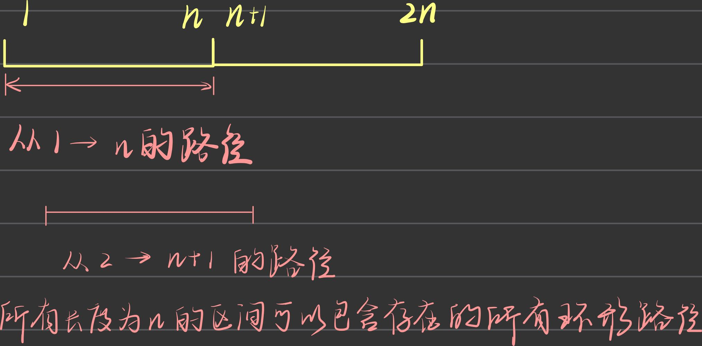

原始模板

# 整体思路
- 当前的字符的处理方式取决于后续的字符

## 栈的压入,弹出序列
pushed = [1,2,3,4,5], popped = [4,5,3,2,1]

```
pushed |1|2|3|4|5|-->stack | | | | | | popped |[4]|5|3|2|1|
pushed |[1]|2|3|4|5|-->stack |[1]| | | | | popped |[4]|5|3|2|1|
pushed |1|[2]|3|4|5|-->stack |1|[2]| | | | popped |[4]|5|3|2|1|
pushed |1|2|[3]|4|5|-->stack |1|2|[3]| | | popped |[4]|5|3|2|1|
pushed |1|2|3|[4]|5|-->stack |1|2|3|[4]| | popped |[4]|5|3|2|1|

--- while begin
pushed |1|2|3|[4]|5|   stack |1|2|[3]| | | popped |4|[5]|3|2|1|
--- while end

pushed |1|2|3|4|[5]|-->stack |1|2|3|[5]| | popped |4|[5]|3|2|1|

--- while begin
pushed |1|2|3|4|[5]|   stack |1|2|[3]| | | popped |4|5|[3]|2|1|
pushed |1|2|3|4|[5]|   stack |1|[2]| | | | popped |4|5|3|[2]|1|
pushed |1|2|3|4|[5]|   stack |[1]| | | | | popped |4|5|3|2|[1]|
pushed |1|2|3|4|[5]|   stack | | | | | |   popped |4|5|3|2|1|[ ]
--- while end
```
- 策略:
  - <font color='red'>**保证**</font>栈中的元素都是压入操作对应的元素(栈中都是**单调的压入操作序列,这些元素此时都未进行过弹栈操作**)
  - 对于pushed中的元素n_i
    - stack 中|n_a1|n_a2|n_a3|..|n_m||n_i-1| poped|[n_i]|n_x|n_y
    - push n_i
    - stack |n_a1|n_a2|n_a3|..|n_m||n_i-1|n_i| poped|[n_i]|n_i-1|n_y
```

pushed |[1]|2|3|4|5|-->stack |[1]| | | | | popped |[4]|5|3|2|1|
pushed |1|[2]|3|4|5|-->stack |1|[2]| | | | popped |[4]|5|3|2|1|
pushed |1|2|[3]|4|5|-->stack |1|2|[3]| | | popped |[4]|5|3|2|1|
# 此时栈中的元素|1|2|3|都对应的是压栈操作(这些元素都未进行弹栈操作)
pushed |1|2|3|[4]|5|-->stack |1|2|3|[4]| | popped |[4]|5|3|2|1|
-- 对应n_i == 4, 发现此时n_i和弹栈序列popped中对应的元素相等
-- 表示此时n_i进行了弹栈操作
-- 此时弹出stack中n_i,同时弹栈序列排除n_i,一直到n_m ≠ n_y
``` 
<!-- <> -->
- 
  - 
    - pop n_i
    - stack |n_a1|n_a2|n_a3|..|n_m||n_i-1| poped|n_i|[n_i-1]|n_y|
    - stack |n_a1|n_a2|n_a3|..|n_m| poped |n_y|

**思路**
```
class Solution:
    def validateStackSequences(self, pushed: List[int], popped: List[int]) -> bool:
        # 辅助栈,popped当前的位置i
        stack, i = [], 0
        # 遍历辅助栈pushed
        for num in pushed:
            # 将pushed中元素加入到辅助栈中
            stack.append(num) # num 入栈
            # 当辅助栈非空且栈顶的元素与当前popped遍历到位置对应的元素相等,辅助栈弹栈,且popped对应的元素i位置+1
            # 注意这里的条件是while
            while stack and stack[-1] == popped[i]: 
                stack.pop()
                i += 1
        return not stack
```

## k
https://leetcode-cn.com/problems/remove-k-digits/solution/yi-zhao-chi-bian-li-kou-si-dao-ti-ma-ma-zai-ye-b-5/

- 策略
  - |n_0|n_1|...|n_m|..|n_i-1|n_i|
  - <font color='red'>**保证**</font>,stack 中|n_a1|n_a2|n_a3|..|n_m|..|n_i-1|**单调递增**
  - 对于nums中元素n_i 假设 |n_m| > n_i
    - 将stack调整为 |n_a1|n_a2|n_a3|..|n_i|
    

```
nums = 1432219, k = 3
nums |[1]|4|3|2|2|1|9|  stack | | | | | | | | k = 3
-- 判断是否进入while: stack | | | | | | | | not stack 
nums |[1]|4|3|2|2|1|9| --> stack |[1]| | | | | | | k = 3
-- 判断是否进入while: nums |1|[4]|3|2|2|1|9| stack |[1]| | | | | | | stack[-1] <= num
nums |1|[4]|3|2|2|1|9| --> stack |1|[4]| | | | | | k = 3
-- 判断是否进入while: nums |1|4|[3]|2|2|1|9| stack |1|[4]| | | | | | stack[-1] > num pop()
--- while begin
nums |1|4|[3]|2|2|1|9| stack |[1]| | | | | | | k--
--- while end

nums |1|4|[3]|2|2|1|9| --> stack |1|[3]| | | | | | k = 2
-- 判断是否进入while: nums |1|4|3|[2]|2|1|9| stack |1|[3]| | | | | | stack[-1] > num pop()
--- while begin
nums |1|4|3|[2]|2|1|9| stack |[1]| | | | | | | k--
--- while end

nums |1|4|3|[2]|2|1|9| --> stack |1|[2]| | | | | | k = 1
-- 判断是否进入while: nums |1|4|3|2|[2]|1|9| stack |1|[2]| | | | | | stack[-1] <= num
nums |1|4|3|2|[2]|1|9| --> stack |1|2|[2]| | | | | k = 1
-- 判断是否进入while: nums |1|4|3|2|2|[1]|9| stack |1|2|[2]| | | | | stack[-1] > num pop()

--- while begin
nums |1|4|3|2|2|[1]|9| stack |1|[2]| | | | | | k-- --> k = 0 break
--- while end

stack把nums中后续元素压入
stack |1|2|1|9| | | | 
return stack[:4]

nums = "1234567890", k = 9
nums = |1|2|3|4|5|6|7|8|9|0|
-- 判断是否进入while: stack | | | | | | | | | | not stack 
nums |[1]|2|3|4|5|6|7|8|9|0| --> stack |[1]| | | | | | | k = 9
-- 判断是否进入while: nums |1|[2]|3|4|5|6|7|8|9|0| stack |[1]| | | | | | | stack[-1] <= num
nums |1|[2]|3|4|5|6|7|8|9|0| --> stack |1|[2]| | | | | | k = 9
-- 判断是否进入while: nums |1|2|[3]|4|5|6|7|8|9|0| stack |1|[2]| | | | | | stack[-1] <= num
...
nums |1|2|3|4|5|6|7|8|[9]|0| --> stack |1|2|3|4|5|6|7|8|[9]| k = 9

-- 判断是否进入while: nums |1|2|3|4|5|6|7|8|9|[0]| stack |1|2|3|4|5|6|7|8|[9]| stack[-1] > num pop()

--- while begin
nums |1|2|3|4|5|6|7|8|9|[0]| stack |1|2|3|4|5|6|7|[8]| | k --  --> k = 8
nums |1|2|3|4|5|6|7|8|9|[0]| stack |1|2|3|4|5|6|[7]| | | k --  --> k = 7
...
nums |1|2|3|4|5|6|7|8|9|[0]| stack |[1]| | | | | || | | k --  --> k = 1
nums |1|2|3|4|5|6|7|8|9|[0]| stack |[1]| | | | | || | | k --  --> k = 0 break;
--- while end

stack把nums中后续元素压入
stack |0| | | | | | | 
return stack[:1]

class Solution(object):
    def removeKdigits(self, num, k):
        stack = []
        remain = len(num) - k
        for digit in num:
            while k and stack and stack[-1] > digit:
                stack.pop()
                k -= 1
            stack.append(digit)
        return ''.join(stack[:remain]).lstrip('0') or '0'
。
```

- Java版
```
class Solution {
    public String removeKdigits(String num, int k) {
        int length = num.length();
        if (k >= length) return "0"; 
        int tempK = k; //暂存k的取值
        // Java中的栈
        // Character为Char的包装类型
        Stack<Character> stack = new Stack<>();
        // 将字符串类型的num转化成为字符串数组 num.toCharArray
        for (char ch : num.toCharArray()){
            // 判断stack是否为空的写法
            while ((tempK > 0) && (!stack.isEmpty()) && (ch < stack.peek())){
                stack.pop();
                tempK --;
            }
            stack.push(ch);
        }
        if (stack.isEmpty()) return "0"; //全部元素删除完毕
        // System.out.println(stack.toString());
        int pre = -1; //最后一个前导0的索引
        for(int i = 0; i < stack.size(); i++){
            // "0"为字符串,字符串之间取值的比较使用equals
            if (!Character.toString(stack.get(i)).equals("0")){
                pre = i;
                break;
            }
        }
        if (pre == -1) return "0"; // 最后stack中的元素全部为"0"
        StringBuilder ret = new StringBuilder();
        // stack中第一个非"0"元素索引
        // ret中元素的个数是stack.size() 和 length - k的较小者
        int retNum = 0;
        // retNum中元素个数
        for (int i = pre; i < stack.size(); i++){
            ret.append(stack.get(i));
            retNum += 1;
            if (retNum == length - k) break;
        }
        
        // StringBuilder需要转换成String返回
        return ret.toString();
    }
}
```

- **总结**:
  - 涉及到删除字符字典序最小的题目
    - x,y
      - x,y在原字符串s中的相对位置为```...x|y```
      - x为stack的top: |?|x| y
      - y为当前遍历到s的位置
    - 比较x,y的相对大小
      - 如果x>y,对x进行pop()操作,append(y)
      - 如果x<y,append(y)

- 性质
  - cd...| next c
  - next c要加入已经构成最小字典序的string,string中字符唯一
  - 跳过next c,因为cd 的字典序必然 < dc
  - 所以可以理解lucifer代码中if s not in stack的判断

Java中char和String的相互转换
https://www.cnblogs.com/qqfff/p/12439783.html

- 测试用例
```
"cbacdcbc"
--
"acdb"

"cdadabcc"
--
"adbc"

```

## 316.

- Java实现
```
class Solution {
    public String removeDuplicateLetters(String s) {
        int length = s.length();
        if (length == 1) return s;
        Map<Character, Integer> sFre = new HashMap<>();
        
        // 记录每个字母的出现次数
        for (char ch : s.toCharArray()){
            int freq = sFre.getOrDefault(ch, 0);
            freq ++; 
            sFre.put(ch, freq);
        }

        // System.out.println(sFre.toString());

        // 辅助栈
        Stack<Character> stack = new Stack<>();
        // stack.push('a');
        // System.out.println(stack.search('b')); // 在stack为空,或者不存在待搜索元素时,都返回-1
        // '' 为char, ""为String
        // System.out.println(stack.toString());

        for (char ch : s.toCharArray()){
            // 当栈非空并且栈中不存在当前元素 或者 栈为空时
            if (((!stack.isEmpty()) && (stack.search(ch) == -1)) || (stack.isEmpty())){
                Character top;
                // 因为当当前字符ch不存在于stack中时ch才会进入该循环,所以ch和栈顶元素top一定有严格的大小比较关系
                // 当栈非空并且栈顶元素严格
                // sFre.get(top) > 0 --> 表示栈顶字符还会在后续的遍历中至少出现一次
                while ( (!stack.isEmpty()) && ((top = stack.peek()) > ch) && (sFre.get(top) > 0)){
                    stack.pop();
                }
                stack.push(ch);
            }
            int freq = sFre.get(ch);
            freq --; 
            sFre.put(ch, freq);
        }      
        // System.out.println(sFre.toString());
        // System.out.println(stack.toString());
        StringBuilder ret = new StringBuilder();
        for(int i = 0; i < stack.size(); i++){
            ret.append(stack.get(i));
        }
        
        return ret.toString();
    }
}
```

## 321.

- 测试用例
```
-- example1
[6,7]
[6,0,4]
5

预期结果
[6,7,6,0,4]

--
[6,7] > [6,0,4] --> |6|
[7] > [6,0,4] --> |6|7|
[] <= [6,0,4] --> |6|7|6|..

-- example2

[2,5,6,4,4,0]
[7,3,8,0,6,5,7,6,2]
15

[7,3,8,0,6,5,7,6,2] > [2,5,6,4,4,0] --> |7|
[3,8,0,6,5,7,6,2] > [2,5,6,4,4,0] --> |7|3|
[8,0,6,5,7,6,2] > [2,5,6,4,4,0] --> |7|3|8|
[0,6,5,7,6,2] <= [2,5,6,4,4,0] --> |7|3|8|2|
[0,6,5,7,6,2] <= [5,6,4,4,0] --> |7|3|8|2|5|
...
[0,6,5,7,6,2] > [0] --> |7|3|8|2|5|6|4|4|0|
[6,5,7,6,2] > [0] --> |7|3|8|2|5|6|4|4|0|6|
...
[2] > [0] --> |7|3|8|2|5|6|4|4|0|6|5|7|6|2|
[] <= [0] --> |7|3|8|2|5|6|4|4|0|6|5|7|6|2|0|

预期结果
[7,3,8,2,5,6,4,4,0,6,5,7,6,2,0]

-- 
7 > 2
3 > 2
8 > 2
2 >= 0
5 >= 0
6 >= 0
4 >= 0

[2,5,6,4,4,0,1]
[7,3,8,0,6,5,7,6,2]
16

预期结果
[7,3,8,2,5,6,4,4,0,6,5,7,6,2,0,1]
```
- 单调栈补充:
  - https://zhuanlan.zhihu.com/p/60971978

- 接雨水(单调栈实现)

## 503.下一个最大元素Ⅱ
- 单调栈模板题变形
  - 模板题:在一个序列中找到比当前数更大的下一个元素
  - 变形:序列呈现环形的关系

- 处理环形
  - 当遍历到数组末尾时,下标从0开始,直到找到第一个位置,满足该位置元素 > 当前元素值   
- <font color=red>**破环成链**</font>
  - 将原数组复制一份放在当前数组后面,可以解决很多环形问题
    - 原因:长度为2n的区间是可以包含所有长度为n的区间的遍历路径
  


- 分析
  - 问题转化为,对于长度为2n的数组,求出每个位置后面第一个比它大的元素
  - 只需要求前半段


- ps: 查找到中点也无所谓

## 1047. 删除字符串中的所有相邻重复项
```
class Solution {
    public String removeDuplicates(String S) {
        int length = S.length();
        char[] cs = S.toCharArray();
        Stack<Character> stk = new Stack<>();
        int i = 0;
        while(i < length){
            if(stk.size() == 0 || stk.peek() != cs[i]){
                stk.push(cs[i]);
                i++;
            }else if(!stk.isEmpty() && stk.peek() == cs[i]){
                while(i < length && !stk.isEmpty() && stk.peek() == cs[i]){
                    stk.pop();
                    i++;
                }
            }  
        }
        StringBuilder sb = new StringBuilder();
        while(!stk.isEmpty()){
            sb.append(stk.pop());
        }
        return sb.reverse().toString();
    }
}
```

## 224.基本计算器
```
class Solution {
    Stack<Character> op;
    Stack<Integer> num;
    int i;
    char[] ss;
    int length;
    public int calculate(String s) {
        op = new Stack<>();
        num = new Stack<>();
        i = 0;
        ss = s.toCharArray();
        length = ss.length;
        
        num.push(0);
        for(; i < length; i++){
            if(ss[i] == ' ') continue;
            else if(ss[i] == '('){
                // 找到下一个非空的字符
                int k = i + 1;
                while(k < length && ss[k] == ' ') k++;
                if(ss[k] == '+' || ss[k] == '-') num.push(0);
                op.push(ss[i]);
            }else if(ss[i] == ')'){
                while(!op.isEmpty() && op.peek() != '(') compute();
                op.pop();
            }else if(Character.isDigit(ss[i])){
                readNum();
            }else{
                while(!op.isEmpty() && op.peek() != '(') compute();
                op.push(ss[i]);
            }
        }
        while(!op.isEmpty()) compute();
        return num.peek();
    }
    public void compute(){
        int b = num.pop();
        int a = num.pop();
        char o = op.pop();
        int result = 0;
        if(o == '+')  result = a + b;
        else result = a - b;
        num.push(result);
    }
    public void readNum(){
        int j = i;
        int x = 0;
        while(j < ss.length && Character.isDigit(ss[j])){
            x = x * 10 + (ss[j] - '0');
            j++;
            
        }
        i = j - 1;
        
        num.push(x);
    }
}
```

## 227.基本计算器Ⅱ
```
class Solution {
    Stack<Character> op;
    Stack<Integer> num;
    int i;
    char[] ss;
    int length;
    public int calculate(String s) {
        op = new Stack<>();
        num = new Stack<>();
        i = 0;
        ss = s.toCharArray();
        length = ss.length;
        Map<Character, Integer> map = new HashMap<>();
        map.put('+',0);
        map.put('-',0);
        map.put('*',1);
        map.put('/',1);
        num.push(0);
        for(; i < length; i++){
            if(ss[i] == ' ') continue;
            else if(ss[i] == '('){
                // 找到下一个非空的字符
                int k = i + 1;
                while(k < length && ss[k] == ' ') k++;
                if(ss[k] == '+' || ss[k] == '-') num.push(0);
                op.push(ss[i]);
            }else if(ss[i] == ')'){
                while(!op.isEmpty() && op.peek() != '(') compute();
                op.pop();
            }else if(Character.isDigit(ss[i])){
                readNum();
            }else{
                while(!op.isEmpty() && op.peek() != '(' && 
                     (map.get(ss[i]) <= map.get(op.peek()))
                     ) compute();
                op.push(ss[i]);
            }
        }
        while(!op.isEmpty()) compute();
        return num.peek();
    }
    public void compute(){
        int b = num.pop();
        int a = num.pop();
        char o = op.pop();
        int result = 0;
        if(o == '+')  result = a + b;
        else if(o == '-')result = a - b;
        else if(o == '*') result = a * b;
        else result = a / b;
        
        num.push(result);
    }
    public void readNum(){
        int j = i;
        int x = 0;
        while(j < ss.length && Character.isDigit(ss[j])){
            x = x * 10 + (ss[j] - '0');
            j++;
            
        }
        i = j - 1;
        
        num.push(x);
    }
}
```