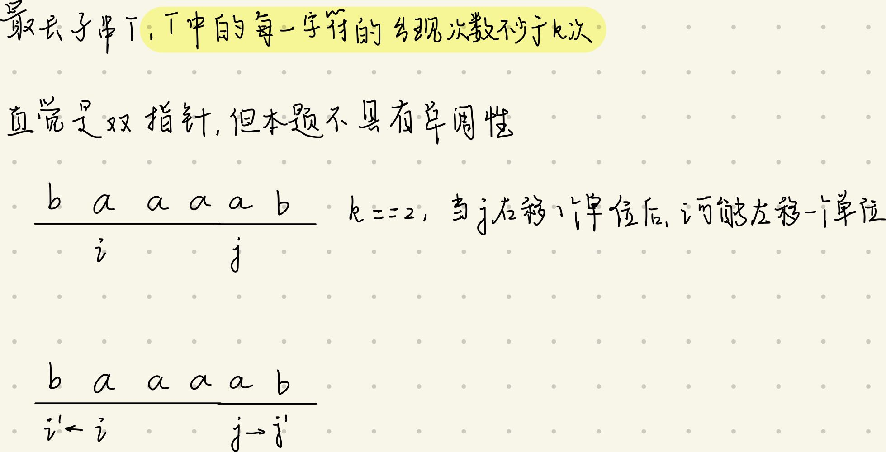

# 数组类双指针
- PS:
  - 双指针算法的使用前提
  - 右边的指针往右走时,左侧的指针是单调的往右侧走的
## 344. 反转字符串
- 思路:
  - first指向数组首位,second指向数组末位
  - 当first < second时
    - 就地交换first和seconde的元素
    - first += 1
    - second -= 1
```
class Solution:
    def reverseString(self, s: List[str]) -> None:
        """
        Do not return anything, modify s in-place instead.
        """
        length = len(s)
        # length > 0
        if length:
            first = 0
            second = length - 1

            while first < second:
                s[first], s[second] = s[second], s[first]
                first += 1
                second -= 1
```
## 977. 有序数组的平方
```
示例 1：

输入：[-4,-1,0,3,10]
输出：[0,1,9,16,100]
```
- 思路1:
  - 输入的列表为A,对应的长度为length
  - 两根指针l,r
    - l起始位置为A[0],r起始位置为A[length-1]
  - 初始化一个空的列表ans
  - 当l <= r时
    - 将$max(|A[l]|, |A[r]|)^2$插入ans的第一个位置,以保证ans中元素最后为升序
    - 当abs(A[l])**>**abs(A[r])
      - 将$A[l]^2$插入ans的第一个位置
      - l++
    - 否则
      - 将$A[r]^2$插入ans的第一个位置 
      - r--
- 该思路存在的问题是每次插入操作带来$O(N)$的时间复杂度,整体时间复杂度为$O(N^2)$ 
- 比暴力遍历计算平方O(N),再进行排序O(logn)还要糟糕

- 思路2:
  - 初始化ans,ans不为空列表,而是[0]*length
  - 使用cur记录两根指针每次比较后较大的元素$max(|A[l]|, |A[r]|)^2$对应的在ans数组中的位置
  - l,r,cur = 0, length-1,length-1
  - 当l <= r时
    - 将$max(|A[l]|, |A[r]|)^2$赋值给ans[cur],以保证ans中元素最后为升序
    - 当abs(A[l])**>**abs(A[r])
      - 将$A[l]^2$赋值给ans[cur]
      - l++
    - 否则
      - 将$A[r]^2$赋值给ans[cur]
      - r--
    - cur --
```
class Solution:
    def sortedSquares(self, A: List[int]) -> List[int]:
        length = len(A)
        l, r, cur = 0, length - 1, length - 1
        # ans = []
        ans = [0] * length
        while l <= r:
            if abs(A[l]) > abs(A[r]):
                ans[cur] = A[l] ** 2
                # ans.insert(0, A[l] ** 2)
                l += 1
            else:
                ans[cur] = A[r] ** 2
                # ans.insert(0, A[r] ** 2)
                r -= 1
            cur -= 1
        return ans
``` 

## Offer 58 - II. 左旋转字符串(记得补充)
- 例
  - 对于```s = "lrlose|umgh", k = 6```,希望得到```umgh|lrlose```
  - ```s = [sA][sB] --> s' = [sB]|[sA]```
  - s'的翻转结果为```[esolrl]|[hgmu]```
  - 可以看作
    - s翻转sA --> ```[esolrl]|umgh```
    - s再翻转sB --> ```[esolrl]|[hgmu]```
    - 整体翻转 --> ```umgh|lrlose```


## 844. 比较含退格的字符串
```
示例 1：

输入：S = "ab#c", T = "ad#c"
输出：true
解释：S 和 T 都会变成 “ac”。
```

- 普通解法(非双指针):
  - 具体地，我们用栈处理遍历过程，每次我们遍历到一个字符：
  - 如果它是退格符，那么我们将栈顶弹出；
  - 如果它是普通字符，那么我们将其压入栈中。

```
class Solution:
    def backspaceCompare(self, S: str, T: str) -> bool:
        ret_s = self.build(S)
        ret_t = self.build(T)
        return "".join(ret_s) == "".join(ret_t)


    def build(self, s):
        stack = []
        for i in range(len(s)):
            if s[i] != "#":
                stack.append(s[i])
            else:
                if stack:
                    stack.pop()
        return stack
```

- 双指针解法

一个字符是否会被删掉，只取决于该字符后面的退格符，而与该字符前面的退格符无关。因此当我们逆序地遍历字符串，就可以立即确定当前字符是否会被删掉。

具体地，我们定义 skip 表示当前待删除的字符的数量。每次我们遍历到一个字符：

若该字符为退格符，则我们需要多删除一个普通字符，我们让 skip += 1；

若该字符为普通字符：

若 skip 为 0，则说明当前字符不需要删去；

若 skip 不为 0，则说明当前字符需要删去，我们让 skip -= 1。

这样，我们定义两个指针，分别指向两字符串的末尾。每次我们让两指针逆序地遍历两字符串，直到两字符串能够各自确定一个字符，然后将这两个字符进行比较。重复这一过程直到找到的两个字符不相等，或遍历完字符串为止。

```
class Solution:
    def backspaceCompare(self, S: str, T: str) -> bool:
        i, j = len(S) - 1, len(T) - 1
        skipS, skipT = 0, 0
        while i >= 0 or j >= 0:
            # 作用是抵消所有#的影响,到达第一个非#的字符
            while i >= 0:
                if S[i] == "#": # 当前字符为退格符
                    skipS += 1
                    i -= 1
                else:# 当前字符为普通字符
                    if skipS > 0: # 如果skip不为0,则表明当前字符需要删去
                        skipS -= 1
                        i -= 1
                    # 否则,当前字符不需删去
                    else:
                        break
            while j >= 0:
                if T[j] == "#":
                    skipT += 1
                    j -= 1
                else:
                    if skipT > 0:
                        skipT -= 1
                        j -= 1
                    else:
                        break
            if i >= 0 and j >= 0:
                if S[i] == T[j]:
                    i -= 1
                    j -= 1
                else:
                    return False
            elif i >= 0 or j >= 0: # 代表其中一个字符串已经匹配完成,但是剩余的字符串还有可行的字符,如'aa#',抵消完#之后剩余的字符为"a"
                return False
        return True
```

## 925.长按键入
- 参考链接

https://leetcode-cn.com/problems/long-pressed-name/solution/shou-hua-tu-jie-shuang-zhi-zhen-925-chang-an-jian-/

- 思路:
  - name为名字字符串,typed为按出来的字符串,其中name中个别字符可能会被多按
  - 使用i,j标记name和typed
  - 循环条件为i < len(name) 且 j < len(typed)
    - 如果name[i] == typed[j]相同,双指针i,j同时向前移动一位
    - 否则,name[i] != typed[j]
      - 如果typed[j] == name[i-1]:
        - 则表明typed[j]是多余按出来的字符,j++
        - 否则,typed是错误字符,返回False

  - 循环终止条件 
    - (1)i匹配name完毕,j匹配typed完毕 --> 返回True
    - (2)i匹配name完毕,j匹配typed未完成
      - 循环检查type[j:]中剩余的字符串是否等等于name[-1]
        - 若是
          - name == $"..z"[]_i$
          - typed == $"..zzzzz"[]_j$
          - 返回True
        - 否则出现typped[j] != name[-1]的情况,如
          - name == $"..[z]_{-1}"$
          - typped == $"..zzzzz[a]_jb"$ 
          - 返回False
    - (3)i匹配name未完毕,j匹配typed完成
      - 返回False 


----

## 763. 划分字母区间

- 思路:
  - 初始化map mapPos
    - 一遍遍历字符串,使用mapPos记录字符串中每个字符出现的最远位置

    - 对于```S = "ababcbacadefegdehijhklij"```
      - 得到的mapPos为```{'a': 8, 'b': 5, 'c': 7, 'd': 14, 'e': 15, 'f': 11, 'g': 13, 'h': 19, 'i': 22, 'j': 23, 'k': 20, 'l': 21}```
  - 使用scannedCharstartPos记录每个区间端点元素在S中第一次出现的位置,scannedCharEndPos记录每个区间端点在S中最后一次出现的位置
    - scannedCharStartPos初始化为0 
    - scannedCharEndPos初始化为float("-inf)
  - res表示每段区间长度
  - 更新标志,表示是否可以考虑一段新的区间
    - newFlag = False
  - 从头开始扫描S,i=0
    - if newFlag:
      - 更新scannedCharStartPos = i
      - 设置newFlag = False,等待下次更新
    - 尝试更新区间右侧端点scannedCharEndPos
      - 如果当前元素出现的最远位置mapPos[s[i]]>scannedCharEndPos,更新scannedCharEndPos
      - 对于第0个元素来说```S[0]=="a"```
        - 其出现的最远位置为8 > float("-inf)(初始值)
          - scannedCharEndPos = mapPos[s[0]] ```==8```
    - 当i==8时,S[0~8]可以构成一段区间,```res.append(scannedCharEndPos - scannedCharStartPos+1)```
      - 设置更新标志为True
        - 即为,希望在下一轮迭代中,当i==9时,希望更新scannedCharStartPos

## 349. 两个数组的交集

给定两个数组，编写一个函数来计算它们的交集。
```
输入：nums1 = [1,2,2,1], nums2 = [2,2]
输出：[2]
```

https://leetcode-cn.com/problems/intersection-of-two-arrays/solution/liang-ge-shu-zu-de-jiao-ji-by-leetcode-solution/


- 思路
  - 先对两个数组排序
  - 使用两根指针p1,p2遍历两个数组,prev记录上次加入数组的元素
    - 如果p1,p2指向的元素不相等,将将指向较小元素的指针右移一位
      - 否则:
        - 若p1,p2指向的元素==prev:
        - 否则:
          - 将p1,p2指向的元素的值加入返回列表中
          - 更新prev
        - p1,p2同时向右移动一位
----    
# 数组双指针--滑动窗口系列
## 976. 三角形的最大周长
```
class Solution {
    public int largestPerimeter(int[] A) {
        Arrays.sort(A);
        int end = A.length - 1;
        
        int S = 0;
        while (end > 1){
            int start = end - 2, mid = end - 1;
            if(A[start] + A[mid] > A[end]){
                S = A[start] + A[mid] + A[end];
                break;
            }
            end --;
        }
        return S;
    }
}
```
## 845. 数组中的最长山脉
- 参考题解链接

https://leetcode-cn.com/problems/longest-mountain-in-array/solution/java-shuang-zhi-zhen-cai-yong-ji-lu-zuo-shan-jiao-/

- (尝试用这个滑窗思路做一下lc上其他的山脉问题)
- **山脉**的定义:
  - 如[2,[1,2,4,5,3],6],其中子数组[1,2,4,5,3]构成了山脉
    - 1 --> 2 --> 4 --> 5 处于上升状态
    - 5 --> 3 处于下降状态
- 初始化
  - 山脉的左侧```left = -1```,山脉的右侧```right = 1```
    - 其中,```left = -1```,表示此时还不存在山脉左侧
  - 当right < length时循环
    - 每次循环得到当前山脉右侧right与上一个位置right-1的差值大小diff
    - 如果```diff > 0```,**此时可以更新山脉左侧left**: 
      - 如果```left == -1```,当前山脉左侧还不存在:
        - 此时right-1可以作为山脉左侧
    - 如果```diff < 0```:
      - 如果```left != -1```,即当前山脉左侧存在,对应类似[1,3,5,4],此时diff==-1(4 - 5),left位置对应的元素为1
        - 在right < length 的情况下, 尝试一直向右移动right,直到找到最后一个right,满足A[right] - A[right-1] < 0
        - 在这种情况下**山脉查找成功,可以更新山脉长度**
        - 退出循环时,right == length 或者 A[right]-A[right-1]>=0
          - 首先检查right,如果right==length,可以跳出最外层循环
            - 否则,检查在当前位置是否要更新左山脚left
              - A[right] - A[right-1] > 0: 
                - 此时要重新更新左侧山脚left为right-1
              - A[right] - A[right-1] = 0:
                - 此时左侧山脚不存在, left = -1 
    - 如果```diff == 0```:
      - 则在当前位置不存在山脉左侧left,```left = -1```

```
class Solution:
    def longestMountain(self, A: List[int]) -> int:
        length = len(A)
        right = 1
        left = -1
        max_length = 0
        while right < length:
            diff = A[right] - A[right-1]
            if diff > 0:
                # 检查左侧山脚是否存在
                if left == -1: left = right - 1
            elif diff < 0:
                if left != -1: # 如果此时左侧山脚存在
                    # 只要diff(A[right] - A[right-1]) < 0,一直尝试右移
                    while right < length and A[right] - A[right-1] < 0:
                        right += 1
                    # 更新max_length 此时[left, right-1]构成了山脉
                    max_length = max(max_length, right - left)
                    # 如果发现[left, length-1]已经构成山脉,数组遍历结束,直接退出
                    if right == length:
                        break
                    # 数组尚未遍历完毕,更新左侧山脚
                    if A[right] - A[right-1] > 0: left = right - 1
                    else: # A[right] - A[right-1] ==0 
                        left = -1
            else: # diff == 0
                left = -1 # 在当前位置,左侧山脚不存在
            right += 1
        
        return max_length
```

### 941. 有效的山脉数组
- 可以由 845 数组中的最长山脉的解法引申过来

```
class Solution:
    def validMountainArray(self, A: List[int]) -> bool:
        length = len(A)
        left = -1
        right = 1
        max_length = -float("inf")
        while right < length:
            diff = A[right] - A[right-1]
            if diff > 0:
                # 检查左侧山脚是否存在,若不存在,则更新左侧山脚
                if left == -1: left = right - 1 
            elif diff < 0:
                # 如果左侧山脚存在,则向右不断移动right
                if left != -1:
                    while right < length and A[right] - A[right-1] < 0:
                        right += 1
                    max_length = max(max_length, right - left)
                    if right == length:
                        break
                    left = right - 1 if A[right] - A[right-1] > 0 else -1
            else: # diff == 0
                left = -1
            
            right = right + 1
        # 检查数组中出现的最长山脉长度是否和数组长度相等
        return max_length == length
```
## 424. 替换后的最长重复字符
- 思路
  - 指针 $[j, i]$构成区间窗口
  - 最外层循环: 枚举 'A' - 'Z',找到出现当前窗口中出现次数最多的字符(换言之,要把当前窗口对应的子串变成哪一个字母),假设枚举到的字母为$C_e$
    - 对于每个指针i,得到**最靠左**的指针j,使得$[j, i]$中$\neq$枚举到字符$C_e$的字符个数$\le k$
- 这种思路是具有单调性的
  - 当$i \rightarrow i^{'}$时,不可能出现$j \rightarrow j^{'}$的情况
    - $j$为**最靠左**的指针,使得$[j, i]$中$\neq$枚举到字符$C_e$的字符个数$\le k$
    - 假设$[j^{'}, i]$中也满足其中不为$C_e$的字符个数$\le k$
    - 则$j$可以替换为$j^{'}$,则与$j$最靠左的条件冲突
    - 所以当$i$右移时,$j$是单调向右移动的


- 实现
```
class Solution {
    public int characterReplacement(String s, int k) {
        char[] ss = s.toCharArray();
        
        int result = 0;
        for(int c = 0; c < 26; c++){
            char cur = (char)('A' + c);
            int j = 0, cnt = 0;
            for(int i = 0; i < ss.length; i++){
                if (ss[i] == cur) cnt ++;
                // 当前[j, i]构成的区间,元素个数为(i - j + 1),非cur元素个数为(i - j + 1) - cnt   
                int num;
                // 使得num <= k
                while((num = i - j + 1 - cnt) > k && j <= i){
                    if(ss[j] == cur) cnt --;
                    j++;
                }
                result = Math.max(result, i - j + 1);
            }
        }
        return result;
    }
}
```

## 480. 滑动窗口中位数(剑指offer)
- 动态中位数
- 相当于维护一个集合的中位数,对该集合存在以下操作
  - (1)添加一个数字
  - (2)删除一个数字
  - (3)求中位数

- 思路
  - 使用对顶堆,两个堆的堆顶相当于集合中元素按升序排列的分界点
    - 使用小根堆$right$维护较大的一半数字(存集合中升序排列右边的数字)
      - 小根堆的堆顶为中位数
    - 使用大根堆$left$维护较小的一半数字(存集合中升序排列左边的数字)
      - 大根堆的堆顶也为中位数
  - <font color=red>**操作对顶堆的原则:**</font>
    - <font color=red>**$1. size(left) \le size(right)$**</font>
    - <font color=red>**$2. top(left) \le top(right)$**</font>
  - 每次**添加一个数字**时,判断该数字是应该添加到较大的一半数字中还是添加到较小的一半数字中,添加完之后,再判断是否要**调整分界点**
    - <font color="blue">**添加操作add**</font>
      - 将元素**优先**添加到right
      - 如果当前$right$为空,则将元素添加到$right$中
      - 如果$top(right) \le$当前元素,则将当前元素添加到$right$中;否则,添加到$left$中
      - 完成添加操作后,如果不满足<font color=red>原则1</font>,则触发<font color=blue>平衡操作</font> 
    - 调整分界点(<font color="blue">**平衡操作balance**</font>)
      - 如果较小的一半数字较多,则分界点往左边移动(相当于将大根堆中的一部分元素放入小根堆中)
      - 如果较大的一半数字较多,则分界点往右边移动(相当于将小根堆中的一部分元素放入大根堆中)
    - 往堆中插入1个元素,然后堆调整的时间复杂度是$O(logn)$
  - <font color=blue>**删除操作remove**</font>
    - 从$left$或者$right$中删除一个和当前num相等的元素即可
    - 完成删除操作后,如果不满足<font color=red>原则1</font>,则触发<font color=blue>平衡操作</font> 
    - <font color="red">**但是删除一个数字的时候,需要从堆中去查找数字**</font>
    - <font color="red">从堆中删除一个元素的时间复杂度是$O(n)$</font>
      - 在C++中可以使用multiSet来作为堆的容器
  - 维护滑动窗口,当窗口向右移动一格时
    - 添加一个新数
    - 删除一个老数

# 滑动窗口系列2
## 159.至多包含<font color=red>两</font>个不同字符的最长子串
- 思路
  - 始终让窗口中的不同字符数为2
```
class Solution {
    public int lengthOfLongestSubstringTwoDistinct(String s) {
        int n = s.length();
        int i = 0;
        char[] ss = s.toCharArray();
        int result = 0;
        Map<Character, Integer> map = new HashMap<>();
        for(int j = 0; j < n; j++){
            map.put(ss[j], map.getOrDefault(ss[j], 0) + 1);
            while(map.size() > 2){
                map.put(ss[i], map.get(ss[i]) - 1);
                if(map.get(ss[i]) == 0) map.remove(ss[i]);
                i++;
            }
            result = Math.max(result, j - i + 1); 
        }
        return result;
    }
}
```

## 340.至多包含 <font color=red> K </font> 个不同字符的最长子串
- 即,将159中的<font color=red>map.size() > 2</font>改为<font color=red>map.size() > K</font >
```
class Solution {
    public int lengthOfLongestSubstringKDistinct(String s, int k) {
        int n = s.length();
        int i = 0;
        char[] ss = s.toCharArray();
        int result = 0;
        Map<Character, Integer> map = new HashMap<>();
        for(int j = 0; j < n; j++){
            map.put(ss[j], map.getOrDefault(ss[j], 0) + 1);
            while(map.size() > k){
                map.put(ss[i], map.get(ss[i]) - 1);
                if(map.get(ss[i]) == 0) map.remove(ss[i]);
                i++;
            }
            result = Math.max(result, j - i + 1); 
        }
        return result;
    }
}
```
## 992. K个不同整数的子数组
###  340. --> 992.
- 即至多包含K个不同整数的子数组个数 - 即至多包含K-1个不同整数的子数组个数
- 当窗口中的不同整数整数恰好为k个时,窗口的范围为$[i, j]$,则此时$[i, i+1, i+2, \dots, j]$与$j$构成的子数组<font color=red>最多</font>包含k个整数
  - 共有**j - i + 1**个符合条件的子数组
```
class Solution {
    public int subarraysWithKDistinct(int[] A, int K) {       
        return numberOfSubarrayDistinctLessEqual(A, K) - numberOfSubarrayDistinctLessEqual(A, K - 1);
    }
    
    // 最多包含K个不同整数的子数组的数目
    public int numberOfSubarrayDistinctLessEqual(int[] A, int K){
        int n = A.length;
        int i = 0;
        Map<Integer, Integer> map = new HashMap<>();
        int cnt = 0;
        for(int j = 0; j < n; j++){
            map.put(A[j], map.getOrDefault(A[j], 0) + 1);
            while(map.size() > K){
                map.put(A[i], map.get(A[i]) - 1);
                if (map.get(A[i]) == 0) map.remove(A[i]);
                i++;
            }
            cnt += (j - i + 1);
        }
        return cnt;
    }
}
```

## 992. K个不同整数的子数组
###  340. --> 395. 至少有K个重复字符的最长子串
- ps:本题也可以用分治来做

- 分析


- 双指针可以用的前提是单调
  - 可以考虑枚举一些条件,使得在枚举之后,变为单调
  - 枚举区间中最多包含的字符数量k得到的最长区间
    - 检查区间中的每个字符是否满足出现次数$>K$
- 实现
```
class Solution {
    public int longestSubstring(String s, int k) {
        int result = 0;
        for(int _k = 1; _k <= 26; _k++){
            result = Math.max(result, lengthOfLongestSubstringKDistinct(s, _k, k));
        }
        return result;
    }
    
    // 小k:至少包括k个不同的字符 大K:出现次数都==K
    public int lengthOfLongestSubstringKDistinct(String s, int k, int K) {
        char[] ss = s.toCharArray();
        int length = ss.length;
        // 至少包括k个不同字母的最长子串
        int i = 0;
        Map<Character, Integer> map = new HashMap<>();
        int result = 0;
        for(int j = 0; j < length; j++){
            map.put(ss[j], map.getOrDefault(ss[j], 0) + 1);
            while(map.size() > k){
                map.put(ss[i], map.get(ss[i]) - 1);
                if(map.get(ss[i]) == 0) map.remove(ss[i]);
                i++;
            }
            // 假设k个字符的出现次数都 >= K
            boolean flag = true;
            for(Character c : map.keySet()){
                if (map.get(c) < K){
                    flag = false;
                    break;
                }
            }
            if (flag) result = Math.max(result, j - i + 1);
        }
        return result;
    }
}


```
# 链表类双指针
## 19. 删除链表的倒数第N个节点
```
class Solution:
    def removeNthFromEnd(self, head: ListNode, n: int) -> ListNode:
        # 1->2->3->4->5
        # 删除倒数第5个节点即head,所以需要设置dummy
        dummy = ListNode(float("inf"))
        dummy.next = head
        slow, fast = dummy, dummy
        cur = dummy
        # slow需要指向倒数第n个节点的前驱
        # 当n==5时
        while n > 0:
            fast = fast.next
            n -= 1
        # fast指向5
        while fast.next:
            fast = fast.next
            slow = slow.next
        # 摘除节点
        slow.next = slow.next.next

        return dummy.next
```

## 143. 重排链表(和判断回文链表使用的方法一致)
### 在
### 前置知识1:快慢指针
```
slow, fast = head, head
while fast.next:
    slow = slow.next
    fast = fast.next
    if fast.next:
        fast = fast.next
```
- 这一段实现的功能是
  - 当链表为1 -->2 -->3 -->4 -->5 -->6时
    - 当迭代结束时,fast指向6(最后一个元素),slow指向4(链表中的右中位数)
  - 当链表为1 -->2 -->3 -->4 -->5时
    - 当迭代结束时,fast指向5(最后一个元素),slow指向3(链表的中间元素)
- 如果需要取到slow和fast的前驱可以这么设置
```
dummy = ListNode("inf")
dummy.next = head
slow_pre, fast_pre = dummy, dummy
slow, fast = head, head
while fast.next:
    slow_pre = slow_pre.next
    slow = slow.next
    fast_pre = fast_pre.next
    fast = fast.next
    if fast.next:
        fast = fast.next
        fast_pre = fast_pre.next
``` 
- 其中slow_pre指向slow的前驱,fast_pre指向fast的前驱

### 前置知识2: 链表翻转
```
# 功能:从a到b翻转链表
    def reverse(self, a, b):
        prev, cur, next = None, a, a
        while cur != b:
            next = cur.next
            cur.next = prev
            prev = cur
            cur = next
        return prev
```

### 过程
- 对于1 -->2 -->3 -->4 -->5
- (1)使用快慢指针定位(找到中间节点slow,fast在本题中并没有起到作用)
  - 1 -->2 -->3(slow) -->4 -->5(fast)
```
slow, fast = head, head
while fast.next:
    slow = slow.next
    fast = fast.next
    if fast.next:
        fast = fast.next
```
- (2)将链表后半段逆置
  - 1 -->2 -->3(slow) -->5(prev) -->4
```
prev, cur, next = None, slow.next, slow.next
while cur:
    next = cur.next
    cur.next = prev
    prev = cur
    cur = next
slow.next = prev
```
- (3)基于slow,将现在的链表断链处理
  -  1(cur1) -->2 -->3(slow) 
  -  5(cur2) -->4
```
cur2 = slow.next
slow.next = None
cur1 = head
```
- (4)合并以cur1为首节点的链表和以cur2为首节点的链表
  - 合并策略是创建一个哑节点dummy,设置一个初始值为1的计数器count
    - 当count为奇数时链接cur1
    - 当count为偶数时链接cur2
```
count = 1
dummy = ListNode("inf")
cur = dummy
while cur1 and cur2:
    if count % 2:
        cur.next = cur1
        cur1 = cur1.next
    else:
        cur.next = cur2
        cur2 = cur2.next
    count += 1
    cur = cur.next
if cur1: cur.next = cur1
if cur2: cur.next = cur2
```
- 代码
```
class Solution:
    def reorderList(self, head: ListNode) -> None:
        if not head:
            return head
        """
        Do not return anything, modify head in-place instead.
        """
        # (1)快慢指针
        slow, fast = head, head
        while fast.next:
            slow = slow.next
            fast = fast.next
            if fast.next:
                fast = fast.next
        # (2)链表反转
        prev, cur, next = None, slow.next, slow.next
        while cur:
            next = cur.next
            cur.next = prev
            prev = cur
            cur = next
        slow.next = prev

        # (3)中点断链
        cur2 = slow.next
        slow.next = None
        cur1 = head

        # (4)链表合并
        count = 1
        dummy = ListNode("inf")
        cur = dummy
        while cur1 and cur2:
            if count % 2:
                cur.next = cur1
                cur1 = cur1.next
            else:
                cur.next = cur2
                cur2 = cur2.next
            count += 1
            cur = cur.next
        if cur1: cur.next = cur1
        if cur2: cur.next = cur2

        return dummy.next
```

### 234.回文链表

```
class Solution:
    def isPalindrome(self, head: ListNode) -> bool:
        if not head:
            return True
        if not head.next:
            return True
        # (1)使用指针进行定位
        dummy = ListNode(float("inf"))
        dummy.next = head

        slow, fast = head, head
        slow_prev = dummy
        count = 1 # 记录链表长度
        while fast.next:
            slow = slow.next
            slow_prev = slow_prev.next
            fast = fast.next
            count += 1
            if fast.next:
                fast = fast.next
                count += 1
            else:
                break
    

        # (2)反转链表
        
        if count % 2 == 1:
            reverse_node = slow.next
            reverse_node_prev = slow
        else:
            reverse_node = slow
            reverse_node_prev = slow_prev
  
        prev, cur, next = None, reverse_node, None
        while cur:
            next = cur.next
            cur.next = prev
            prev = cur
            cur = next

        reverse_node_prev.next = prev

        # [1,2,[2]_slow,1] --> slow 到 end进行反转 [1,2,1,2] 从slow_prev.next和head开始进行比较
        # [1,2,[3]_slow,2,1] --> slow.next 到end进行反转 [1,2,3,1,2]从slow.next和head开始比较
        # (3)比较
        # 从head和reverse_node_prev.next开始比较
        h1 = head
        h2 = reverse_node_prev.next
        while h1 and h2:
            if h1.val == h2.val:
                h1 = h1.next
                h2 = h2.next
            else:
                return False
        return True
```

### 148. 排序链表

### 快慢指针
```
# method1
slow, fast = head, head
while fast.next:
    slow = slow.next
    fast = fast.next
    if fast.next:
        fast = fast.next

# method2
slow, fast = head, head
while fast and fast.next:
    slow = slow.next
    fast = fast.next.next
```
|LinkList|Method|slow|fast|
|--|--|--|--|
|1|method1|1|1|
|1|method2|1|1|
|1-->2|method1|2|2|
|1-->2|method2|2|null|
|1-->2-->3|method1|2|3|
|1-->2-->3|method2|2|3|
|1-->2-->3-->4|method1|3|4|
|1-->2-->3-->4|method2|3|null|

**slow的位置**
- 当遍历完链表时,slow的位置相当于mid = lo + (hi - lo + 1) // 2(即为取右中位数)

```
# method3
slow, fast = head, head.next # 相当于method1 中 fast = head --> fast = head.next
while fast.next:
    slow = slow.next
    fast = fast.next
    if fast.next:
        fast = fast.next

# method4
slow, fast = head, head.next # 相当于method2 中 fast = head --> fast = head.next
while fast and fast.next:
    slow = slow.next
    fast = fast.next.next
```

|LinkList|Method|slow|fast|
|--|--|--|--|
|1|method3|error|NoneType' object has no attribute 'next'|
|1|method4|1|null|
|1-->2|method3|1|2|
|1-->2|method4|1|2|
|1-->2-->3|method3|2|3|
|1-->2-->3|method4|2|null|
|1-->2-->3-->4|method3|2|4|
|1-->2-->3-->4|method4|2|4|

**slow的位置**
- 当遍历完链表时,slow的位置相当于mid = lo + (hi - lo) // 2(即为取左中位数)

- 代码实现
- mergeSort思想
```
class Solution:
    def fun(self, nums):
        length = len(nums)
        temp = [0] * length 
        self.divide(nums, 0, length-1, temp)
        return nums

    def divide(self, nums, lo, hi, temp):
        if lo == hi:
            return 0
        mid = lo + (hi - lo) // 2 # 这里取到的是左中位数
        self.divide(nums, lo, mid, temp)
        self.divide(nums, mid+1, hi, temp)
        self.merge(nums, lo, mid, hi, temp)
    
    def merge(self, nums, lo, mid, hi, temp):
        # left [lo, mid], right[mid+1, hi] 
        for i in range(lo, hi+1):
            temp[i] = nums[i]
        i, j = lo, mid+1
        for k in range(lo, hi+1):
            if i > mid:
                nums[k] = temp[j]
                j += 1
            elif j > hi:
                nums[k] = temp[i]
                i += 1
            elif temp[i] <= temp[j]:
                nums[k] = temp[i]
                i += 1
            else:
                nums[k] = temp[j]
                j += 1
```
- Python版本
```
class Solution:
    def sortList(self, head: ListNode) -> ListNode:
        return self.divide(head)

    def divide(self, head):
        if not head or not head.next:
            return head
        # 相当于取到左中位数
        slow, fast = head, head.next
        # 如果是fast = head,则相当于取右中位数,会出现类似二分死循环的情况
        while fast.next:
            slow = slow.next
            fast = fast.next
            if fast.next:
                fast = fast.next

        last = slow.next
        slow.next = None
        first = self.divide(head) # [lo, mid]
        second = self.divide(last) # [mid+1, hi]
        ret = self.merge(first, second)
        return ret

    
    def merge(self, first, second):
        dummy = ListNode(-float("inf"))
        cur = dummy
        while first and second:
            if first.val < second.val:
                cur.next = first
                first = first.next 
            else:
                cur.next = second
                second = second.next 
            cur = cur.next
        
        cur.next = first if first else second
        return dummy.next
```

- Java版本
```
class Solution {
    public ListNode sortList(ListNode head) {

        return divide(head);
    }

    public ListNode divide(ListNode head){
        if ((head == null) || (head.next == null)) return head;
        ListNode slow = head, fast = head.next;
        while ((fast != null) && (fast.next != null)) {
            slow = slow.next;
            fast = fast.next.next;
        }

        ListNode last = slow.next;
        slow.next = null;

        ListNode first = divide(head);
        ListNode second = divide(last);
        ListNode ret = merge(first, second);
        return ret;
    }

    public ListNode merge(ListNode first, ListNode second){
        ListNode dummy = new ListNode(Integer.MIN_VALUE);
        ListNode cur = dummy;
        while ((first != null) && (second != null)){
            if (first.val < second.val){
                cur.next = first;
                first = first.next;
            }else{
                cur.next = second;
                second = second.next;
            }
            cur = cur.next;
        }
        
        cur.next = (first != null) ? first : second;
        
        return dummy.next;
    }
}
```

### 328. 奇偶链表

- 思路
  - 使用last_odd标记最后一个奇数位的节点
  - 使用first_even标记第一个偶数位节点(即head.next)
  - 使用last_even标记最后一个偶数位节点
```
class Solution:
    def oddEvenList(self, head: ListNode) -> ListNode: 
        # self.partition(head, 0)
        # 链表长度 <= 2,直接返回
        if not head or not head.next:
            return head
        # 最后一个奇数位
        last_odd = head
        # 第一个偶数位 最后一个偶数位
        first_even, last_even = head.next, head.next
        cur, pos = head.next.next, 3
        while cur:
            if pos % 2: # 当前位为奇数
                # 当前位的下一位cur_next(为偶数位)
                cur_next = cur.next
                # 原本last_odd->first_even->...->last_even->cur->cur_next
                # 实现将当前的奇数位节点cur插入到last_odd和first_even之间
                # 上一个奇数位节点指向当前位
                last_odd.next = cur
                # 当前位节点的下一位指向第一个偶数位节点
                cur.next = first_even
                # 完成插入操作
                # last_odd->[cur]->first_even->...->last_even->cur cur_next

                last_even.next = cur_next
                # 最后一个偶数节点last_even原本指向cur
                # cur被插入到last_odd和first_even之间后
                # last_even指向cur_next
                # last_odd->[cur]->first_even->...->last_even->cur_next

                # 由于当前cur为奇数节点,所以在插入cur之后,可以更新新的last_odd的位置为cur
                last_odd = cur
              
                cur, pos = cur_next, pos + 1
            else:
                last_even = cur
                cur, pos = cur.next, pos + 1
        
        return head
```

