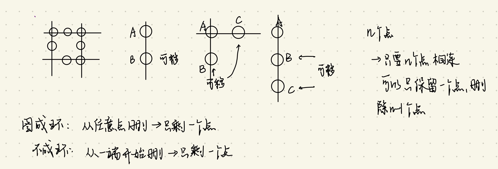
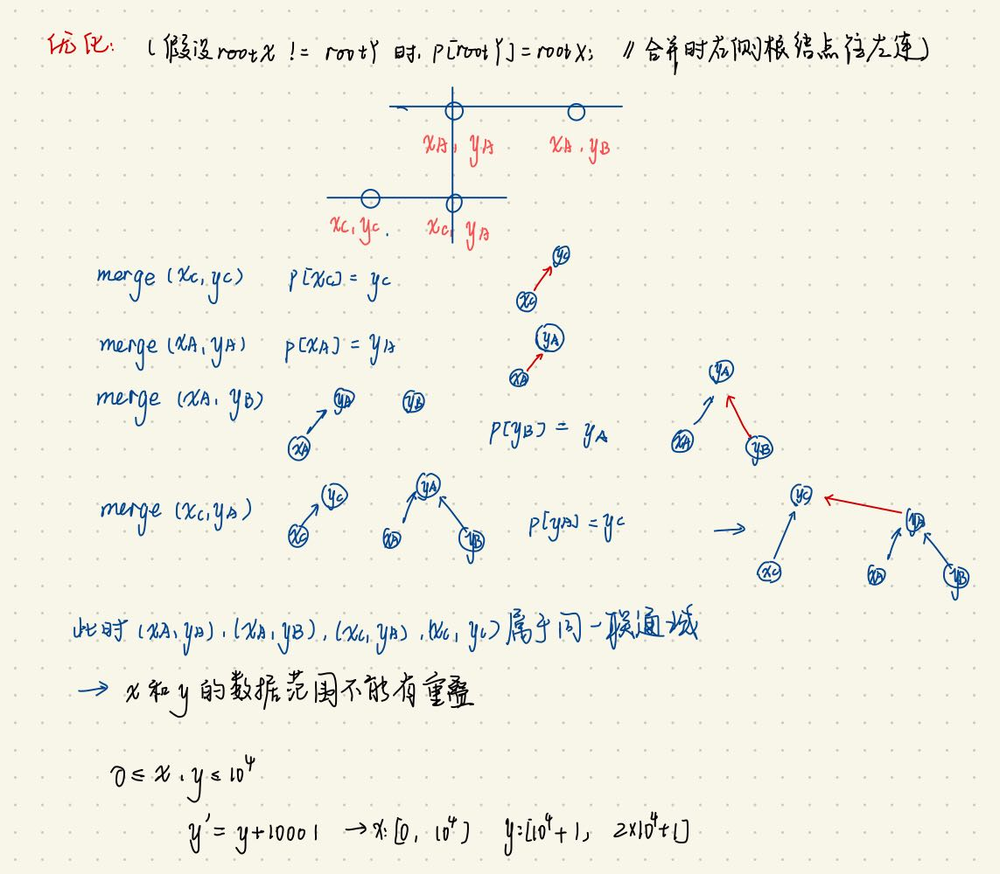

# 并查集
- 将两个集合合并
- 询问两个元素是否在一个集合当中
  -  对应问题2: 找到两个元素的树根, 判断2个元素是否相等

近乎O(1)

- 思路
- (1) 每一个集合用树的形式来维护
- (2) 根节点的编号为当前集合的编号

- 基本原理:
-  每个集合用一棵树来表示。树根的编号就是整个集合的编号。每个节点存储它的父节点, p[x]表示x的父节点
-  问题1: 如何判断树根 if(p[x] == x)
-  问题2: 如何求x的集合编号: while(p[x] != x) x = p[x]; (即: 只要x 不是树根, 就往上走)
   -  其实复杂度会非常高(正比于树高)
   -  优化: **只要找到过一次根节点,就把元素指向根节点(路径压缩 if(p[x] != x) p[x] = find(p[x]))**
-  问题3: 如何合并两个集合(集合1 或者 集合2):
   -  px 是 x 的集合编号, py 是 y的集合编号 合并 p[x] = y
   -  集合1 插入集合2 的某个位置
   -  集合2 插入集合1 的某个位置

## 
## 1202. 交换字符串中的元素
```
class Solution {
    public String smallestStringWithSwaps(String s, List<List<Integer>> pairs) {
        // 参考官方题解的思路
        // 1.遍历pairs,形成并查集
        int n = s.length();
        UnionFindSet set = new UnionFindSet(n);
        for(int i = 0; i < pairs.size(); i++){
            set.union(pairs.get(i).get(0), pairs.get(i).get(1));
        }
        // 2.遍历s,对于其中的每一个元素i,将char[i] 添加到 元素i对应的集合 的 字符集合中
        // 字符集合使用小顶堆
        // 对应关系使用HashMap <元素i对应的并查集根节点的索引parent[i], 并查集字符集合>
        Map<Integer, PriorityQueue<Character>> map = new HashMap<>();
        for(int i = 0; i < s.length(); i++){
            int p = set.find(i); // i 对应的并查集的根节点的索引
            PriorityQueue<Character> heap = map.getOrDefault(p, new PriorityQueue<>());
            heap.offer(s.charAt(i));
            map.put(p, heap);
        }
        // System.out.println(map.toString());
        // 3.遍历s,对于其中的每一个元素i,通过parent[i]得到字符集合,取出堆顶部
        StringBuilder sb = new StringBuilder();
        for(int i = 0; i < s.length(); i++){
            PriorityQueue<Character> heap = map.get(set.find(i));
            Character c = heap.poll();
            sb.append(c);
        }
        return sb.toString();

    }

    static class UnionFindSet{
        int[] parent;
        UnionFindSet(int n){
            this.parent = new int[n];
            for(int i = 0; i < n; i++){
                parent[i] = i;
            }
        }    
        
        public int find(int x){
            if(parent[x] != x) parent[x] = find(parent[x]);
            return parent[x];
        }

        public void union(int x, int y){
            int rootX = find(x), rootY = find(y);
            if (rootX == rootY) return;
            parent[rootX] = rootY; // x的根节点指向y的根节点
        }
    }   
}
``` 

### 5650. 执行交换操作后的最小汉明距离
```
class Solution {
    public int minimumHammingDistance(int[] source, int[] target, int[][] allowedSwaps) {
        int n = source.length;
        UnionFindSet set = new UnionFindSet(n);
        for(int i = 0; i < allowedSwaps.length; i++){
            set.union(allowedSwaps[i][0], allowedSwaps[i][1]);
        }
        // i --> p[i] <P[i], Set>
        Map<Integer, Map<Integer, Integer>> map = new HashMap<>();
        for(int i = 0; i < n; i++){
            int p = set.find(i);
            Map<Integer, Integer> tmap = map.getOrDefault(p, new HashMap<>());
            tmap.put(source[i], tmap.getOrDefault(source[i], 0) + 1);
            map.put(p, tmap);
        }
        // System.out.println(map.toString());
        int result = 0;
        for(int i = 0; i < n; i++){
            int p = set.find(i);
            Map<Integer, Integer> tmap = map.get(p);
        
            if(tmap.containsKey(target[i])){
                int t = tmap.get(target[i]);
                t--;
                if(t == 0) tmap.remove(target[i]);
                else{
                    tmap.put(target[i], t);
                    map.put(p, tmap);
                }
            }else{
                result++;
            }
        }
        return result;
    }

     static class UnionFindSet{
        int[] parent;
        UnionFindSet(int n){
            this.parent = new int[n];
            for(int i = 0; i < n; i++){
                parent[i] = i;
            }
        }    
        
        public int find(int x){
            if(parent[x] != x) parent[x] = find(parent[x]);
            return parent[x];
        }

        public void union(int x, int y){
            int rootX = find(x), rootY = find(y);
            if (rootX == rootY) return;
            parent[rootX] = rootY; // x的根节点指向y的根节点
        }
    }
}
```

### 947. 移除最多的同行或同列石头

#### 思路
 

#### 普通解法:
- 合并是stones 间合并
- 检查stone是否可以合并时$O(n^2)$,即比较stones[i]和stones[j]是否处于同一行或者同一列

```
class Solution {
    public int removeStones(int[][] stones) {
        int n = stones.length; // 此时的n为stones.length
        boolean[] merged = new boolean[n]; // 记录某个元素是否被合并过
        UnionFindSet uset = new UnionFindSet(n); // 此时并查集中存放的是stones的元素下标
        for(int i = 0; i < n; i++){
            int x1 = stones[i][0], y1 = stones[i][1];
            for(int j = i + 1; j < n; j++){
                int x2 = stones[j][0], y2 = stones[j][1];
                // System.out.println("i: " + i + " x1: " + x1 + " y1: " + y1 + " j: " + j + " x2: " + x2 + " y2: " + y2);
                // System.out.println("before: " + Arrays.toString(uset.parent));
                if( x1 == x2 || y1 == y2 ){
                    uset.merge(i, j);
                }
                // System.out.println("after: " + Arrays.toString(uset.parent));
            }
        }
        // 统计有多少个集合
        Set<Integer> set = new HashSet<>();
        for(int i = 0; i < n; i++){
            set.add(uset.find(i));
        }
        return n - set.size();


    }

    static class UnionFindSet{
        public int[] parent;
        UnionFindSet(int n){
            parent = new int[n];
            for(int i = 0; i < n; i++){
                parent[i] = i;
            }
        }
        public int find(int x){
            if(parent[x] != x) parent[x] = find(parent[x]);
            return parent[x];
        }
        public void merge(int x, int y){
            int rootX = find(x), rootY = find(y);
            if(rootX != rootY) parent[rootY] = rootX;
        }
    }
}
```
#### 优化:
 

- 检查stone是否可以合并时$O(n)$
- 合并是对于每一个stone的x,y合并
- 对于任意一个石头stone[i],对其x和y合并处理,思路见图

```
class Solution {
    public int removeStones(int[][] stones) {
        int n = stones.length; 
        int N = 20002;
        UnionFindSet uset = new UnionFindSet(N); // 此时并查集中存放的是的取值范围
        for(int i = 0; i < n; i++){
            int x1 = stones[i][0], y1 = stones[i][1];
            uset.merge(x1, y1 + 10001);
        }
        // 统计有多少个集合
        Set<Integer> set = new HashSet<>();
        for(int i = 0; i < n; i++){
            set.add(uset.find(stones[i][0]));
        }
        return n - set.size();


    }

    static class UnionFindSet{
        public int[] parent;
        UnionFindSet(int n){
            parent = new int[n];
            for(int i = 0; i < n; i++){
                parent[i] = i;
            }
        }
        public int find(int x){
            if(parent[x] != x) parent[x] = find(parent[x]);
            return parent[x];
        }
        public void merge(int x, int y){
            int rootX = find(x), rootY = find(y);
            if(rootX != rootY) parent[rootY] = rootX;
        }
    }
}
```


### 721.账户合并
```
class Solution {
    public List<List<String>> accountsMerge(List<List<String>> accounts) {
        // <邮箱地址, emailInfo(邮箱id, 邮箱地址, 邮箱持有者)>
        Map<String, emailInfo> emailMap = new HashMap<>();
        // <邮箱id, emailInfo(邮箱id, 邮箱地址, 邮箱持有者))>
        Map<Integer, emailInfo> idMap = new HashMap<>();
        int id = 0;
        for(List<String> account: accounts){
            String[] accountArray = new String[account.size()];
            account.toArray(accountArray);
            String owner = accountArray[0];
            for(int i = 1; i < account.size(); i++){
                String email = accountArray[i];
                if(!emailMap.containsKey(email)){
                    emailInfo ei = new emailInfo(id, email, owner);
                    emailMap.put(email, ei);
                    idMap.put(id, ei);
                    id++;
                }
            }
        }
        // System.out.println(emailMap.toString());
        int num = id; // 不重复的邮箱id范围 [0, num - 1]
        UnionFindSet uset = new UnionFindSet(num);
        // 初始化
        // 对同一个账户对应的邮箱合并处理
        // 需要使用emailMap <邮箱地址, emailInfo(邮箱id, 邮箱地址, 邮箱持有者)>
        for(List<String> account: accounts){
            String[] accountArray = new String[account.size()];
            account.toArray(accountArray);
            String owner = accountArray[0];
            if(account.size() == 2) continue; // 如果该account只有两个元素 即账户名, 邮箱, 则不需做合并处理
            for(int i = 2; i < account.size(); i++){ // 依次合并accountArray[i], accountArray[i-1]
                String email1 = accountArray[i], email2 = accountArray[i-1];
                int id1 = emailMap.get(email1).id, id2 = emailMap.get(email2).id;
                uset.merge(id1, id2);
            }
        }

        // <根节点邮箱id, 根节点邮箱对应的集合中的所有邮箱id集合>
        Map<Integer, Set<Integer>> ridMap = new HashMap<>();
        for(int i = 0; i < num; i++){
            int rid = uset.find(i);
            // 以根节点邮箱id对应的id集合
            Set<Integer> ids = ridMap.getOrDefault(rid, new HashSet<>());
            ids.add(i);
            ridMap.put(rid, ids);  
        }              
        // System.out.println(ridMap.toString());
        // 根据ridMap,返回结果
        // 需要使用idMap <邮箱id, emailInfo(邮箱id, 邮箱地址, 邮箱持有者))> 和 ridMap <根节点邮箱id, 根节点邮箱对应的集合中的所有邮箱id集合>
        int rootNum = ridMap.size(); // 根节点邮箱账户的数量
        List<List<String>> results = new LinkedList<>(); 
        for(int rid: ridMap.keySet()){
    
            List<String> result =  new LinkedList<>();
            // 首先加入rid对应的账户名
            result.add(idMap.get(rid).owner);
            // 得到和rid 同属一个集合的ids
            Set<Integer> ids = ridMap.get(rid);
            // 题目中要求,对每个账户对应的多个邮箱地址需要排列
            String[] emails = new String[ids.size()];
            int i = 0;
            // 遍历ids,将每个id对应的账户名加入到result中
            for(Integer idx: ids){
                emails[i] = idMap.get(idx).email;
                i++;
            }
            // 对多个邮箱排序
            if(ids.size() >= 2){
                Arrays.sort(emails);
            }
            Collections.addAll(result, emails);
            results.add(result);
        }

        return results;
    }
    static class emailInfo{
        int id;
        String email;
        String owner;
        emailInfo(int id, String email, String owner){
            this.id = id;
            this.email = email;
            this.owner = owner;
        }
        public String toString(){
            return "id: " + id + " email: " + email + " owner: " + owner;
        }
    }

    static class UnionFindSet{
        int[] p;
        UnionFindSet(int n){
            p = new int[n];
            for(int i = 0; i < n; i++){
                p[i] = i;
            }
        }
        public int find(int x){
            if(p[x] != x) p[x] = find(p[x]);
            return p[x];
        }
        public void merge(int x, int y){
            int rX = find(x), rY = find(y);
            if(rX != rY) p[rX] = rY;
        }

    }
}
```

### 1631.最小体力消耗路径
- 这种做法是Kruskal了
```
class Solution {
    public int minimumEffortPath(int[][] heights) {
        int M = heights.length, N = heights[0].length;
        if(M == N && M == 1) return 0;
        Queue<Edge> pq = new PriorityQueue<>(new Comparator<Edge>(){
            @Override
            public int compare(Edge e1, Edge e2){
                return e1.w - e2.w;
            }
        });
        
        
        // 将每个顶点的右边和下边添加到并查集中
        for(int i = 0; i < M; i++){
            for(int j = 0; j < N; j++){
                int aid = i * N + j;
                if (j < N - 1){ // 此时可以添加右侧边
                    int bid = i * N + j + 1;
                    int rw = Math.abs(heights[i][j + 1] - heights[i][j]);
                    pq.add(new Edge(rw, aid, bid));
                }
                if (i < M - 1) { // 此时可以添加下侧边
                    int bid = (i + 1) * N + j;
                    int dw = Math.abs(heights[i+1][j] - heights[i][j]);
                    pq.add(new Edge(dw, aid, bid));
                }
            }
        }
        UnionFindSet uset = new UnionFindSet(M * N);
        int result = Integer.MAX_VALUE;
        int startid = 0, endid = M * N - 1;
        while (!pq.isEmpty()){
            Edge curE = pq.poll();
            int aid = curE.aid, bid = curE.bid;
            uset.merge(aid, bid);
            if(uset.find(startid) == uset.find(endid)){
                result = curE.w;
                break;
            }
        }
        return result;
    }

    static class Edge{
        int w; // 每条边的权重
        int aid; // 边连接的点a id
        int bid; // 边连接的点b id
        Edge(int w, int aid, int bid){
            this.w = w;
            this.aid = aid;
            this.bid = bid;
        }
    }
    static class UnionFindSet{
        int[] p;
        UnionFindSet(int n){
            p = new int[n];
            for(int i = 0; i < n; i++){
                p[i] = i;
            }
        }
        public int find(int x){
            if(p[x] != x) p[x] = find(p[x]);
            return p[x];
        }

        public void merge(int x, int y){
            int rx = find(x), ry = find(y);
            if(rx != ry) p[rx] = ry;
        }
    }
}

// 并查集: 将所有边按照权重大小依次加入并查集,直至起点到终点联通
```

### 839.相似字符串组
```
class Solution {
    public int numSimilarGroups(String[] strs) {
        int N = strs.length;
        UFS u = new UFS(N);
        for(int i = 0; i < N; i++){
            for(int j = i + 1; j < N; j++){
                // 判断对应的两个字符串是否相似
                String s1 = strs[i], s2 = strs[j];
                if(ifSimilar(s1, s2)){
                    u.merge(i, j);
                }
            }
        }
        // 统计集合数量
        Set<Integer> set = new HashSet<>();
        for(int i = 0; i < N; i++){
            set.add(u.find(i));
        }
        return set.size();
    }

    // 判断两个字符串是否相似
    public boolean ifSimilar(String s1, String s2){
        // 相似条件1:两个字符串相等
        if (s1.equals(s2)) return true;
        // 相似条件2:两个字符串中某两个位置发生了互换的情况
        int[] ac = new int[26]; // 字母计数
        char[] cs1 = s1.toCharArray(), cs2 = s2.toCharArray();
        int diff = 0; // 不相同的字母的数量
        for(int i = 0; i < cs1.length; i++){
            if(cs1[i] != cs2[i]) diff++;
            if(diff > 2) return false;
        }
        return true;
    }

    static class UFS{
        int[] p;
        UFS(int n){
            p = new int[n];
            for(int i = 0; i < n; i++){
                p[i] = i;
            }
        }
        public void merge(int x, int y){
            int rx = find(x), ry = find(y);
            if (rx != ry) p[rx] = ry;
        }

        public int find(int x){
            if (p[x] != x) p[x] = find(p[x]);
            return p[x];
        }
    }
}
```