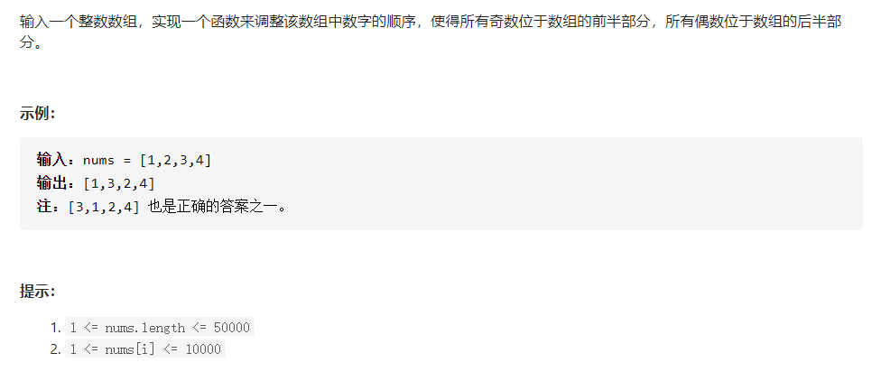

# 剑指 Offer 03. 数组中的重复数字
https://leetcode-cn.com/problems/shu-zu-zhong-zhong-fu-de-shu-zi-lcof/
## 时间O(n),空间O(1)解法
- (1)先遍历判断,数组中的数的范围是不是都是在[0, n- 1]内,如果不是,返回-1
- (2)遍历,**原地hash**
  - 如果num < 0 或 num >= n,返回-1
  - 如果nums[i] != i 并且 (nums[nums[i]] != nums[i]) 一直原地交换
  - 如果发现坐标i, nums[i]上的元素相等,返回nums[i]

# 剑指 Offer xx-不修改数组找出重复的数字

不能修改
## 迭代版
```Python
class Solution:
    def findDuplicate(self, nums: List[int]) -> int:
        left = 1
        right = len(nums) - 1
        while left < right:
            mid = left + (right - left) // 2
            cnt = 0
            for num in nums:
                if num <= mid:
                    cnt += 1
            if cnt <= mid:
                left = mid + 1
            else:
                right = mid

        return left 
```

# 剑指 Offer xx-搜索二维矩阵
## 递归版

## 迭代版


## 递归版(todo:补充)

# 剑指 Offer xx.从尾到头打印链表
- 其实就是反转链表    
  

# 剑指 Offer xx.重建二叉树

```java
class Solution {
    Map<Integer, Integer> map;
    static int[] preorder;
    static int[] inorder;
    public TreeNode buildTree(int[] _preorder, int[] _inorder) {
        if(_preorder == null || _preorder.length == 0) return null;
        preorder = _preorder;
        inorder = _inorder;
        
        map = new HashMap<>(); // 记录中序遍历序列中<val-index>
        for(int i = 0; i < inorder.length; i++){
            map.put(inorder[i], i);
        }
        return dfs(0, preorder.length - 1, 0, inorder.length - 1);
    }
    
    private TreeNode dfs(int prelo, int prehi, int inlo, int inhi){
        if(prelo > prehi) return null;
        if(inlo > inhi) return null;
        TreeNode root = new TreeNode(preorder[prelo]);
        int index = map.get(root.val);
        int leftLength = index - inlo;
        
        // [inlo, index - 1] [index] [index + 1, inhi]
        root.left = dfs(prelo + 1, prelo + leftLength, 
                        inlo, index - 1);
        root.right = dfs(prelo + leftLength+ 1, prehi, 
                         index + 1, inhi);
        return root;
    }
}
```
### Points:
- (1)使用hashmap替代线性扫描,查找中序遍历序列中值和前序遍历序列头节点相等的元素的下标
- (2)<font color="red">查找到**index**后,通过计算左子树L的长度leftLength进行区间的划分</font>

# 剑指 Offer xx.二叉树的下一个节点


分类讨论

(1)如果F为根节点,F有右孩子,则F的下一个节点为H(<font color=red><b>F为左侧链的起点</b></font>)


H为F的下一个节点的原因:
- **pop F**,F has rightChild E,goLeft(E)
- push(E),push(H)
- **pop H**
  
(2)如果B为D的左孩子,则B的下一个节点为D


- goLeft(D)
- pushD, pushB
- popB, popE
  
(3)D为C的右孩子,D不存在右孩子,D的后继为F

- goLeft(F)
- push F, push C, pushA
- popA, popC, C has rightChild D, go right
- pushD, pushB
- popB, popD
- popF

### 总结
- (1)如果当前节点有右孩子,当前节点中序遍历下的下一个节点为goLeft(rightChild)抵达的左侧链顶点(见分类讨论(1))
- (2)如果当前节点没有右孩子,如果他是左儿子,则他的中序遍历下一个节点是他爸爸(见分类讨论(2))
- (3)如果当前节点(D)没有右孩子,如果他不是左儿子,则一直往他祖先找,一直到找到他的某个祖先(C)是该祖先的父节点(F)的左儿子,则他的中序遍历下一个节点是该祖先的父节点(见分类讨论(3))
# 剑指 Offer 12. 矩阵中的路径

https://leetcode-cn.com/problems/word-search/
和lc79相同

**思路**
- 主函数中,建立循环,遍历每一个格子
  - 对每一个格子进行backtrack匹配,一旦匹配成功一次,跳出循环
- 辅助函数backtrack:
  - 从word中第start个元素出发
    - 递归终点:
    - ```匹配成功start == len(word) - 1 and  word[start] == broad[x][y]```
    - ```匹配失败start == len(word) - 1 and  word[start] != broad[x][y]```
**多写几遍**
```
class Solution:
    def exist(self, board: List[List[str]], word: str) -> bool:
        m, n = len(board), len(board[0])
        self.m, self.n = m, n
        # 遍历每一个单元格,开始试探
        res = False
        for i in range(m):
            for j in range(n):
                # 表示某一个单元格是否被访问过
                visited = [[False] * n for _ in range(m)]
                visited[i][j] = True
                tag = self.backtrack(board, visited, i, j, word, 0)
                visited[i][j] = False
                if tag:
                    res = tag
                # 这里写if tag: break会无论如何都返回false
        
        return res
    # board i, j 匹配到对应的board的位置 word, index 匹配到对应的word中字符的位置
    # visited 表示i,j是否被访问过
    def backtrack(self, board, visited, x, y, word, index):
        positions = [[-1,0],[1,0],[0,1],[0,-1]] 
        # 失败情况
        if board[x][y] != word[index]:
            # print(board[x][y], word[index])
            return False
        if index == len(word):
            return False
        # 最终成功情况
        if board[x][y] == word[index] and index == len(word) - 1:
            return True
        
        # 此时board[x][y]和word[index]是匹配成功的
        tag = False
        for pos in positions:
            next_x, next_y  = x + pos[0], y + pos[1]
            if 0 <= next_x < self.m and 0 <= next_y < self.n and not visited[next_x][next_y]:
                    visited[next_x][next_y] = True
                    tag = self.backtrack(board, visited, next_x, next_y, word, index+1)
                    visited[next_x][next_y] = False
                    if tag:
                        return tag # 如果tag为真,返回真
        return tag
```
# 剑指 Offer 13. 机器人的运动范围
```
关键点:
- 数位和:
    - 获得10进制的个位
    - 10进制左移一位
```
```
from collections import deque
class Solution:
    def movingCount(self, m: int, n: int, k: int) -> int:
        # m, n = m - 1, n - 1/
        # 生成位置合法矩阵,根据bit_sum来判断坐标m,n对应的位置是否合法
        valid = [[False] * n for _ in range(m)]
        for i in range(m):
            for j in range(n):
                cur_sum_i, cur_sum_j = self.bit_sum(i), self.bit_sum(j)
                print(cur_sum_i, cur_sum_j)
                valid[i][j] = True if k >= (cur_sum_i + cur_sum_j) else False
    
        # 从[0,0]开始运动
        # 四个方向
        positions = [[-1, 0], [1, 0], [0, 1], [0, -1]]
        visited = [[False] * n for _ in range(m)]
        # 开始遍历
        queue = deque()
        queue.append((0, 0))
        visited[0][0] =True
        cell_num = 0
        while queue:
            cur_pos = queue.pop()
            cell_num += 1
            for pos in positions:
                next_pos_x, next_pos_y = cur_pos[0] + pos[0], cur_pos[1] + pos[1]
                if 0 <= next_pos_x < m and 0 <= next_pos_y < n and not visited[next_pos_x][next_pos_y]:
                    if valid[next_pos_x][next_pos_y]:
                        visited[next_pos_x][next_pos_y] = True
                        queue.append((next_pos_x, next_pos_y))
        return cell_num
    # 根据k的大小判断当前位置是否合法
    def bit_sum(self, m):
        curr_sum = 0
        while m != 0:
            remainder = m % 10
            m = m // 10
            curr_sum += remainder
        return curr_sum

```
# 剑指 Offer 14- I. 剪绳子
```
class Solution:
    def cuttingRope(self, n: int) -> int:
        if n <= 3:
            return n - 1
        divider = 3 # 除数
        remainder = 0 # 余数
        result, remainder = n // divider, n % divider
        
        if remainder == 0:
            return 3 ** result
        elif remainder == 1:
            return (3 ** (result - 1)) * 4
        elif remainder == 2:
            return (3 ** result) * 2
```

# 剑指 Offer 14- II. 剪绳子 II
- 知识点是大数求余
  - 循环求余,快速幂求余两种方式
  - 下午做
# 剑指 Offer 21. 调整数组顺序使奇数位于偶数前面
- leetcode: https://leetcode-cn.com/problems/diao-zheng-shu-zu-shun-xu-shi-qi-shu-wei-yu-ou-shu-qian-mian-lcof/
- 牛客: https://www.nowcoder.com/practice/beb5aa231adc45b2a5dcc5b62c93f593?tpId=13&tqId=11165&rp=1&ru=%2Fta%2Fcoding-interviews&qru=%2Fta%2Fcoding-interviews%2Fquestion-ranking




## 思路1:快排
```
class Solution:
    def exchange(self, nums: List[int]) -> List[int]:
        if not nums:
            return nums
        lo, hi = 0, len(nums) - 1
        # 先保存pivot
        pivot = nums[lo]
        while lo < hi:
            # nums[hi]对应的为偶数
            while (lo < hi) and (nums[hi] & 1 == 0) :
                hi -= 1
            '''先更新nums[lo]'''
            # 此时nums[hi]对应的为奇数,更新为nums[lo]
            nums[lo] = nums[hi]
            # nums[lo]对应的为奇数
            while (lo < hi) and (nums[lo] & 1 == 1):
                lo += 1
            # 此时nums[lo]对应的为偶数,更新为nums[hi]
            nums[hi] = nums[lo]
        nums[lo] = pivot
        
        return nums
```
**注意点**
- 先保存pivot的端点为nums[lo],则在循环中先对nums[lo]进行更新
- 在循环结束后恢复nums[lo]
- 快排会导致奇数和奇数,偶数和偶数之间相对位置发生变化,无法通过牛客

### 可以用的一个版本的快排
```
def quick_sort2(nums):
    n = len(nums)
    return quick2(nums, 0, n-1)
def quick2(nums, lo, hi):
    if lo >= hi:
        return nums
    p_idx = partition(nums, lo, hi)
    quick2(nums, lo, p_idx-1)
    quick2(nums, p_idx+1, hi)
    return nums

def partition(nums, lo, hi):
    # 随机化轴点或者设置为lo
    rand_idx = random.randint(lo, hi)
    nums[rand_idx], nums[lo] = nums[lo], nums[rand_idx]
    pivot = nums[lo]
    j = lo
    for i in range(lo+1, hi+1):
        if nums[i] < pivot: # [只需要改成if nums[i] & 1 == 1即可,但是在lc上会超时]
            j += 1
            nums[i], nums[j] = nums[j], nums[i]
    nums[lo], nums[j] = nums[j], nums[lo]
    return j
```
## 思路2:有点类似于插入排序
- 思路2使用插入排序的思想
  - **优点在于**不会导致奇数和奇数,偶数和偶数之间相对位置发生变化,可以通过牛客
  - **缺点在于**时间复杂度较高
- 参考的Java版本:https://blog.csdn.net/zhangshk_/article/details/81190870
- 修改过来的python版本(leetcode会超时,但是可以通过牛客网)
- liweiwei版本排序复习:

https://leetcode-cn.com/problems/sort-an-array/solution/fu-xi-ji-chu-pai-xu-suan-fa-java-by-liweiwei1419/
```
class Solution:
    def exchange(self, nums: List[int]) -> List[int]:
        # 如果是牛客的话nums这里要改成array # nums = array
        if not nums:
            return nums
        # index为第一次碰到偶数元素的坐标
        index = -1
        for i in range(len(nums)):
            # nums[i]为奇数,将nums[i]插入到偶数索引index之前
            if nums[i] & 1 == 1:
                if index >= 0:
                    temp = nums[i] # 保留nums[i]这个奇数
                    # nums[index-1]到nums[i]为偶数
                    # nums[index-1]到nums[i]依次后移
                    for j in range(i, index, -1):
                        nums[j] = nums[j-1]
                    nums[index] = temp
                    # 奇数后设置为偶数
                    index += 1
            else:
                if index < 0:
                    index = i
        
        return nums
```

# 剑指 Offer 22. 链表中倒数第k个节点
https://leetcode-cn.com/problems/lian-biao-zhong-dao-shu-di-kge-jie-dian-lcof/
https://www.nowcoder.com/practice/529d3ae5a407492994ad2a246518148a?tpId=13&tags=&title=&diffculty=0&judgeStatus=0&rp=1


**思路** 双指针一遍遍历
- 可以通过leetcode所有测试用例
```
class Solution:
    def getKthFromEnd(self, head: ListNode, k: int) -> ListNode:
        p_l = head
        count = 0
        while head:
            head = head.next
            count += 1
            if count >= k + 1:
                p_l = p_l.next
        return p_l
```

- 但是无法通过牛客全部测试用例
- ```6,{1,2,3,4,5}```,即k>链表长度时
```
class Solution:
    def FindKthToTail(self, head, k):
        # write code here
        p_slow = head
        count = 0
        while head:
            head = head.next
            count += 1
            if count >= k + 1:
                p_slow = p_slow.next
        # 增加一处判断
        if count < k:
            return None
        return p_slow
```

# 剑指 Offer 24. 反转链表
https://leetcode-cn.com/problems/fan-zhuan-lian-biao-lcof/
https://www.nowcoder.com/practice/75e878df47f24fdc9dc3e400ec6058ca?tpId=13&tags=&title=&diffculty=0&judgeStatus=0&rp=1

**字节要求**
- 使用**迭代**和**递归**一起做
- 感觉还是需要反复做的
**思路**
- 如果链表为空,则返回空链表
- 创建一个哑节点dummy,指向表头
```dummy = prev, curr = head```
**自己画图**
- 当curr存在时
  - 使用next指向curr的下一个节点
  - curr的下一个位置指向前驱节点啊
  - prev移动到curr的位置
  - curr移动到next的位置
- head(此时指向的是头节点(即反转前的第1个节点))的下一个节点设置为None
- 返回 prev(因为此时curr不存在,只能返回curr的前驱)

**[指针写法]**
```
class Solution:
    def reverseList(self, head: ListNode) -> ListNode:
        if not head:
            return head
        dummy = ListNode(float("inf"))
        prev, curr = dummy, head
        while curr:
            next = curr.next
            curr.next = prev
            prev = curr
            curr = next
        head.next = None
        return prev
```
**[头插法]**

参考链接:
https://leetcode-cn.com/problems/fan-zhuan-lian-biao-lcof/solution/yuan-di-ni-zhi-tai-jian-dan-liao-by-agitated-kapit/

先让p指向head，然后将p后的一个结点断开并插到头部，并让head指向新的头。如此往复，p后面的结点全部被插到头部，此时链表就是逆序了
```
class Solution:
    def reverseList(self, head: ListNode) -> ListNode:
        if not head:
            return head
        p = head
        while p.next:
            reverse = p.next
            p.next = p.next.next
            reverse.next = head
            head = reverse
        
        return head
```

**[递归写法]**

参考链接:
https://leetcode-cn.com/problems/fan-zhuan-lian-biao-lcof/solution/di-gui-jie-fa-by-sweeneycai-4/

```
class Solution:
    def reverseList(self, head: ListNode) -> ListNode:
    # last:上一个节点,head:当前节点
        return self.helper(None, head)

    def helper(self, last, cur):
    # 如果当前节点为空,返回当前节点
        if cur == None: return cur
    # 当前节点的下一个节点为next
        next = cur.next
    # 当前节点指向上一个节点
        cur.next = last
    # 如果下一个节点为空,返回当前节点
        if next == None: return cur
        return self.helper(cur, next)

```

- ps:有时间的话回顾k个1组反转链表

# 剑指 Offer 25. 合并两个排序的链表
https://leetcode-cn.com/problems/he-bing-liang-ge-pai-xu-de-lian-biao-lcof/
https://www.nowcoder.com/practice/d8b6b4358f774294a89de2a6ac4d9337?tpId=13&tags=&title=&diffculty=0&judgeStatus=0&rp=1

**还可以的思路(推荐)**
https://leetcode-cn.com/problems/he-bing-liang-ge-pai-xu-de-lian-biao-lcof/solution/mian-shi-ti-25-he-bing-liang-ge-pai-xu-de-lian-b-2/

**流程**

1.初始化:首节点dummy,cur指向dummy

2.循环合并:当l1**或**l2为空时跳出
- 当l1.val < l2.val时:cur的后继节点指定为l1,cur向后走一步
- 当l1.val >= l2.val时:cur的后继节点指定为l2,cur向后走一步
- 节点cur向前走一步

3.合并剩余尾部:
- l1 非空,l1添加到节点cur后继
- 否则l2非空,l2添加到节点cur后继

4.返回值
- dummy的下一个节点

```
class Solution:
    def mergeTwoLists(self, l1: ListNode, l2: ListNode) -> ListNode:
        dummy = ListNode(float("inf"))
        cur = dummy
        while l1 and l2: # 注意要点,在这里l1和l2是都存在的
            if l1.val < l2.val:
                cur.next = l1
                l1 = l1.next
            else:
                cur.next = l2
                l2 = l2.next
            cur = cur.next
        
        if l1 and not l2:
            cur.next = l1
        elif not l1 and l2:
            cur.next = l2
        
        return dummy.next
```
**注意**
- 下面这种写法是错误的
```
class Solution:
    def mergeTwoLists(self, l1: ListNode, l2: ListNode) -> ListNode:
        dummy = ListNode(float("inf"))
        head = dummy
        while l1 and l2:
            if l1.val < l2.val:
                head.next = l1
                l1 = l1.next
            else:
                head.next = l2
                l2 = l2.next # ![漏了head = head.next]
        if l1 and not l2:
            head.next = l1
        elif l2 and not l1:
            head.next = l2
        return dummy.next
```


# 剑指 Offer 26. 树的子结构
还有之前的题目
自身递归+自身和左子树递归+自身和右子树递归

leetcode:匹配类二叉树总结
https://leetcode-cn.com/problems/shu-de-zi-jie-gou-lcof/solution/pi-pei-lei-er-cha-shu-ti-mu-zong-jie-by-z1m/

**思路**
- 在A中,找到和B一模一样的子结构
- **模板**
```
class Solution:
    def isSubStructure(self, A: TreeNode, B: TreeNode) -> bool:
        if not A or not B:
            return False

        return self.dfs(A, B) or self.isSubStructure(A.left, B) or self.isSubStructure(A.right, B)
    
    # 判断两棵树是否相等
    def dfs(self, A, B):
        # B提前匹配结束
        if A and not B:
            return True
        # A,B同时匹配结束
        if not A and not B:
            return True
        # A提前匹配结束
        if not A and B:
            return False
        return A.val == B.val and self.dfs(A.left, B.left) and self.dfs(A.right, B.right)
```
**注意**

本题和面试题 04.10. 检查子树不同

检查子树要求A,B同时匹配结束

# 剑指offer 29. 顺时针打印矩阵
https://leetcode-cn.com/problems/shun-shi-zhen-da-yin-ju-zhen-lcof/solution/xiong-mao-shua-ti-python3-mo-ni-fa-yi-kan-jiu-dong/

**这个思路可以多读一读**
```
class Solution:
    # matrix类型为二维列表，需要返回列表
    def printMatrix(self, matrix):
        # write code here
        if not matrix:
            return []
        # 易错点:left,right和top,bottom不要混淆
        left, right = 0, len(matrix[0]) - 1
        top, bottom = 0, len(matrix) - 1
        
        # 需要返回地结果
        ret = []
        while True:
            # 从左上方一直到右上方
            for j in range(left, right+1):
                ret.append(matrix[top][j])
            # 划掉top,立刻判断top和bottom关系
            top += 1
            if top > bottom: break
            # 从右上方一直到右下方
            for i in range(top, bottom+1):
                ret.append(matrix[i][right])
            # 划掉right,立即判断right和left关系
            right -= 1
            if left > right:break
            # 从右下方一直到左下方
            for j in range(right, left - 1, -1):
                ret.append(matrix[bottom][j])
            # 划掉bottom,立即判断bottom和top关系
            bottom -= 1
            if top > bottom: break
            # 从左下方一直到左上方
            for i in range(bottom, top - 1, -1):
                ret.append(matrix[i][left])
            left += 1
            if left > right:break
            # 划掉left
        return ret
```

# 剑指 Offer 30. 包含min函数的栈
https://leetcode-cn.com/problems/bao-han-minhan-shu-de-zhan-lcof/solution/mian-shi-ti-30-bao-han-minhan-shu-de-zhan-fu-zhu-z/

**思路**
- 感觉和用两个栈实现队列比较像,共同点在于要考虑到辅助栈是否为空的情况
- 建立辅助栈B:
  - push(x) 保证B中元素非严格降序
    - 把x压入栈A中
    - 若:
      - (1)栈B中为空
      - (2)x<=栈B的栈顶元素,则将x压入栈B中 !!注意是小于B中栈顶元素
  - pop() 保持栈A,B元素的一致性
    - 在栈A中出栈,将出栈元素标记为y
    - 若y等于栈B的栈顶元素,则执行栈B出栈(B.pop())
  - top():返回A的栈顶元素
  - min():返回B的栈顶元素
  
# 剑指 Offer 31. 栈的压入、弹出序列
https://www.nowcoder.com/practice/d77d11405cc7470d82554cb392585106?tpId=13&tags=&title=&diffculty=0&judgeStatus=0&rp=1

**思路**
```
class Solution:
    def validateStackSequences(self, pushed: List[int], popped: List[int]) -> bool:
        # 辅助栈,popped当前的位置i
        stack, i = [], 0
        # 遍历辅助栈pushed
        for num in pushed:
            # 将pushed中元素加入到辅助栈中
            stack.append(num) # num 入栈
            # 当辅助栈非空且栈顶的元素与当前popped遍历到位置对应的元素相等,辅助栈弹栈,且popped对应的元素i位置+1
            # 注意这里的条件是while
            while stack and stack[-1] == popped[i]: 
                stack.pop()
                i += 1
        return not stack
```
# 剑指 Offer 32 - III. 从上到下打印二叉树 III
- 其实就是二叉树的锯齿形层次遍历
  
**代码**
```
from collections import deque
class Solution:
    def levelOrder(self, root: TreeNode) -> List[List[int]]:
        if not root: return []
        layer = -1
        queue = deque()
        queue.append(root)
        results = []
        while queue:
            length = len(queue)
            layer += 1
            result = []
            for i in range(length):
                node = queue.popleft()
                result.append(node.val)
                if node.left: queue.append(node.left)
                if node.right: queue.append(node.right)
            if layer % 2 == 0: results.append(result)
            elif layer % 2 == 1: results.append(result[::-1])
        
        return results
```

# 剑指 Offer 33. 二叉搜索树的后序遍历序列
- 二叉搜索树的关键条件:
  - 第一个大于根节点的节点为该二叉搜索树根节点的右孩子
  
**参考链接**
https://leetcode-cn.com/problems/er-cha-sou-suo-shu-de-hou-xu-bian-li-xu-lie-lcof/solution/di-gui-jie-fa-jian-dan-yi-dong-by-henggezhizou/

**思路**
- 使用递归:
  - 如果不存在后续遍历序列,返回True
  - 根节点为后续遍历序列中最后一个元素:
    - 找到该元素的左子树left,右子树right
    - 左右子树的判断条件是大于根节点的索引对应右子树的第一个节点
  - 对右子树的性质进行判断,如果右子树中出现比根节点小的节点,直接返回False
  - 否则,返回当前节点的左子树和右子树是否满足性质的结果

# 剑指 Offer 34. 二叉树中和为某一值的路径

https://leetcode-cn.com/problems/path-sum-ii/
- 同时也是lc上组合总和2
# 这道题可以深挖
# 递归和回溯的不同使用场景
- 什么时候递归,一撸到底(如,路径上的叶子节点全部都为正数),这个时候一旦加和累计到sum的话就要返回
- 什么时候回溯,(如,路径上的叶子节点有正有负)
  - [1, 4, 2(叶子节点)],和为7
  - [1, 4, 2, 1, -1(叶子节点)],和同样为7

**思路**
- 回溯
- 首先判断根节点是否满足要求
  - 若满足,将根节点加入solution,同时sum-root.val
- backtrack
  - 需要满足的条件:抵达根节点,并且sum == 0:
    - 增加总体解集
  - 如果有左子树:
    - 加入左节点值(append)
    - 递归
    - 回溯(pop)
  - 右子树同理

**扩展**
- 三道路径总和系列

```
class Solution:
    def pathSum(self, root: TreeNode, sum: int) -> List[List[int]]:
        if not root:
            return []
        # 所有解的集合
        self.solutions = []
        # 递归处理
        self.dfs(root, sum - root.val, [root.val])
        return self.solutions
        
    
    def dfs(self, root, sum, solution):
        if not root:
            return None
        if sum == 0 and not root.left and not root.right:
            self.solutions.append(solution)
            return None
        
        if root.left:
            self.dfs(root.left, sum - root.left.val, solution + [root.left.val])
        if root.right:
            self.dfs(root.right, sum - root.right.val, solution + [root.right.val])
```
# 剑指 Offer 35 复杂链表的复制
https://leetcode-cn.com/problems/fu-za-lian-biao-de-fu-zhi-lcof/solution/lian-biao-de-shen-kao-bei-by-z1m/

## lc上有类似一题:就是二叉树,上面有随机指针

**思路**
- 深度优先,同时建立已遍历节点对新建节点的映射
- **自底向上**的递归,因为要先得到返回值的结果
- dfs(head, visited)
  - 如果没有head,返回None
  - 否则,检查head是否在visited中出现过
    - 是,返回head[visited]
    - 否,新建节点copy
      - 建立head和其拷贝copy之间的映射关系
      - copy.next = dfs(head.next)
      - copy.random = dfs(head.random)
      - 返回copy

**对应代码**

```
class Solution:
    # 返回 RandomListNode
    def Clone(self, pHead):
        # write code here
        if not pHead:
            return None
        # 每个节点-每个节点的copy
        visited = {}
        return self.dfs(pHead, visited)
    
    def dfs(self, pHead, visited):
        if not pHead:
            return None
        if pHead in visited:
            return visited[pHead]
        copy = RandomListNode(pHead.label)
        visited[pHead] = copy
        copy.next = self.dfs(pHead.next, visited)
        copy.random = self.dfs(pHead.random, visited)
        return copy
```

# 克隆图

- 和克隆复杂链表的思路一致

```
class Solution:
    def cloneGraph(self, node: 'Node') -> 'Node':
        if not node:
            return node
        return self.recurse(node, {})

    def recurse(self, node, seen):
        if not node:
            return None
        if node in seen:
            return seen[node]
        copy = Node(node.val, None)
        seen[node] = copy
        if node.neighbors:
            neighbors = []
            for node_neighbor in node.neighbors:
                neighbors.append(self.recurse(node_neighbor, seen))
            copy.neighbors = neighbors
        
        return copy
```
# 克隆包含随机指针的二叉树
- 思路和克隆复杂链表,克隆图一致
```
class Solution:
    def copyRandomBinaryTree(self, root: 'Node') -> 'NodeCopy':
        if not root:
            return root
        return self.recurse(root, {})    
    def recurse(self, root, seen):
        if not root:
            return None
        if root in seen:
            return seen[root]
        # 注意这里实例化的是NodeCopy类而不是Node类
        copy = NodeCopy(root.val, None, None, None)
        seen[root] = copy
        copy.left = self.recurse(root.left, seen)
        copy.right = self.recurse(root.right, seen)
        copy.random = self.recurse(root.random, seen)
        return copy
```
# 克隆N叉树
- 思路和之前的一样
```
class Solution:
    def cloneTree(self, root: 'Node') -> 'Node':
        if not root:
            return root
        return self.recurse(root, {})

    def recurse(self, root, seen):
        if not root:
            return root
        if root in seen:
            return seen[root]
        copy = Node(root.val, None)
        seen[root] = copy
        if root.children:
            children = []
            for child in root.children:
                children.append(self.recurse(child, seen))
            copy.children = children
        return copy
```

# Offer 36. 二叉搜索树与双向链表
https://leetcode-cn.com/problems/convert-binary-search-tree-to-sorted-doubly-linked-list/

**思路**

这个题目的意思是将二叉搜索树转换成双向链表
- 自底向上的递归:
  - 先抵达树的叶子节点,将左子树和右子树转化成只有一个节点的双向链表,返回给上一个根节点
  - left - > root - > right

**直接看代码,小心,细心**
```
class Solution:
    def treeToDoublyList(self, root: 'Node') -> 'Node':
        if not root:
            return root
        head = self.recurse(root)
        tail = head
        while tail.right:
            tail = tail.right
        tail.right = head.right
        head.right.left = tail
        return head.right

    def recurse(self, node):
        if not node.left and not node.right:
            head = Node(float("inf"))
            head.right = node # [注意是head.right,而非head.next!!]
            return head
        
        if node.left:
            left_head = self.recurse(node.left) 
            left_tail = left_head
            while left_tail.right:
                left_tail = left_tail.right

        if node.right:
            right_head = self.recurse(node.right)
        
        if node.left and node.right:
            left_tail.right = node
            node.left = left_tail
            node.right = right_head.right
            right_head.right.left = node
            return left_head
        if node.left:
            left_tail.right = node
            node.left = left_tail
            return left_head
        if node.right:
            curr_head = Node(float("inf"))
            curr_head.right = node
            node.right = right_head.right
            right_head.right.left = node
            return curr_head
```

# 剑指 Offer 37. 序列化二叉树
**关键点**
- 个人认为,难点在于反序列化中二叉树的节点和孩子之间的对应关系
参考链接
https://leetcode-cn.com/problems/xu-lie-hua-er-cha-shu-lcof/

**note**
- 二叉树的序列化千万别写成bfs了

- 假设序列中[0,n]对应的节点为node,此时共有m个空节点
  - node.left的索引为2(n-m)+1
  - node.right的索引为2(n-m)+2

- 反序列化
- 若data为空,返回null
- 初始化:序列化列表为vals
  - 根节点root,对应vals[0],根节点root入队,此时根节点的左子树的坐标为i,i==1
- bfs:
  - 节点出队,记为node
  - 建立node的左子节点,值为vals[i],将node.left入队,i += 1(在这里,不管vals[i]对应的是否为"null",i最终都要+1处理)
  - 建立node的右子节点,值为vals[i],将node.right入队, i += 1
```
from collections import deque
class Codec:

    def serialize(self, root):
        """Encodes a tree to a single string.
        
        :type root: TreeNode
        :rtype: str
        """
        if not root:
            return "[]"
        queue = deque()
        ret = []
        queue.append(root)
        while queue:
            node = queue.popleft()
            if node:
                ret.append(str(node.val))
                queue.append(node.left)
                queue.append(node.right)
            else:
                ret.append("null")
        
        return "[" + ",".join(ret) + "]"

                
    def deserialize(self, data):
        """Decodes your encoded data to tree.
        
        :type data: str
        :rtype: TreeNode
        """
        if not data:
            return None
        if data == "[]":
            return None
        length = len(data)
        data = data[1:length-1]
        data_lists = data.split(",")
        root = TreeNode(int(data_lists[0]))
        queue = deque()
        queue.append(root)
        idx = 1 # 左子树的位置
        while queue:
            node = queue.popleft()
            if data_lists[idx] != "null":
                node.left = TreeNode(int(data_lists[idx]))
                queue.append(node.left)
            idx += 1
            if data_lists[idx] != "null":
                node.right = TreeNode(int(data_lists[idx]))
                queue.append(node.right)
            idx += 1
        return root
```

# 剑指 Offer 38. 字符串的排列
参考lc 47 全排列Ⅱ
https://leetcode-cn.com/problems/permutations-ii/

```
class Solution:
    def permuteUnique(self, nums: List[int]) -> List[List[int]]:
        nums.sort() # 先就地排序
        used = len(nums) * [False]
        self.solutions = []
        solution = []
        self.dfs(used, nums, solution)
        return self.solutions

    def dfs(self, used, nums, solution):
        if sum(used) == len(nums):
            self.solutions.append(solution.copy())
            return 
        
        for i in range(len(nums)):
            if not used[i]:
                # 易错点在这里,剪枝需要满足三个条件
                # (1)i > 0 (2)nums[i-1]使用过 (3)nums[i] == nums[i-1]
                if i > 0 and used[i-1] and nums[i] == nums[i-1]:
                    continue
                used[i] = True
                solution.append(nums[i])
                self.dfs(used, nums, solution)
                solution.pop()
                used[i] = False
```
```
class Solution:
    def permutation(self, s: str) -> List[str]:
        if not s:
            return []
        # 如果
        strs = []
        # 字符串转化成列表
        for i in range(len(s)):
            strs.append(s[i])
        # 对列表进行排序
        strs.sort()

        useds = len(strs) * [False]
       
        solution = ""
        self.solutions = []
        self.dfs(strs, useds, solution)
        return self.solutions
    
    def dfs(self, strs, useds, solution):
        if len(strs) == sum(useds):
            self.solutions.append(solution)
            return 
        
        for i in range(len(strs)):
            if not useds[i]:
                if i > 0 and useds[i-1] and strs[i] == strs[i-1]:
                    continue
                useds[i] = True
                self.dfs(strs, useds, solution + strs[i])
                useds[i] = False
```

# 剑指 Offer 39. 数组中出现次数超过一半的数字
https://leetcode-cn.com/problems/majority-element/

**思路**
- 一次遍历肯定是不行的、
- 采用**分治**的思路
- 将nums分为lo,mid,hi
  - nums左侧的众数对应的为left_majority,由divide(lo,mid,nums)得到
  - nums右侧的众数对应的为right_majority,由divide(mid+1,hi,nums)得到
- 统计和左侧众数相等的元素个数maj_left_nums
- 统计和右侧众数相等的元素个数maj_right_nums
- 比较maj_left_nums和maj_right_nums的大小,返回整体的众数

```
class Solution:
    def majorityElement(self, nums: List[int]) -> int:
        lo, hi = 0, len(nums) - 1
        return self.divide(nums, lo, hi)
    
    def divide(self, nums, lo, hi):
        if lo == hi:
            return nums[lo]
        mid = (lo + hi) // 2
        # !注意是[lo, mid]和[mid+1, hi]
        left_maj = self.divide(nums, lo, mid)
        right_maj = self.divide(nums, mid + 1, hi)
        left_maj_num = sum(nums[i] == left_maj for i in range(lo, hi + 1))
        right_maj_num = sum(nums[i] == right_maj for i in range(lo, hi + 1))
        return left_maj if left_maj_num > right_maj_num else right_maj
```

# 排序类复习
# 剑指 Offer 40. 最小的k个数
https://leetcode-cn.com/problems/zui-xiao-de-kge-shu-lcof/


# 剑指 Offer 42. 连续子数组的最大和
https://leetcode-cn.com/submissions/detail/63099720/

**思路**
- O(n)
```
class Solution:
    def maxSubArray(self, nums: List[int]) -> int:
        if not nums:
            return 0
        if len(nums) == 1:
            return nums[0]
        max_sub_sum = nums[0] # 注意应该设置为nums[0]
        for i in range(1, len(nums)):
            nums[i] = max(nums[i-1]+nums[i], nums[i])
            max_sub_sum = max(max_sub_sum, nums[i])
        return max_sub_sum
```
- 分治
- 递归的求左区间[lo, mid],右区间[mid+1, hi]的最大子序和
  - 同时从当前mid向左向右出发,求**必定**包含[mid,mid+1]的最大子序和
    - 这也是分治的代码中,为什么一定从mid向左出发,从mid+1向右出发
  
```
class Solution:
    def maxSubArray(self, nums: List[int]) -> int:
        if not nums:
            return 0
        return self.divide(nums, 0, len(nums) - 1)
    
    def divide(self, nums, lo, hi):
        if lo == hi:
            return nums[lo]
        mid = (lo + hi) // 2
        left_sub = self.divide(nums, lo, mid)
        right_sub = self.divide(nums, mid+1, hi)

        cross_sub_left, temp = nums[mid], 0
        for i in range(mid, lo - 1, -1):
            temp += nums[i]
            cross_sub_left = max(temp, cross_sub_left)

        cross_sub_right, temp = nums[mid+1], 0
        for j in range(mid+1, hi+1):
            temp += nums[j]
            cross_sub_right = max(temp, cross_sub_right)
        
        return max(left_sub, right_sub, cross_sub_left + cross_sub_right)
```

# Offer 43. 1～n整数中1出现的次数(感觉后面还是不太明白,暂时放弃)
# 推荐题解

https://leetcode-cn.com/problems/1nzheng-shu-zhong-1chu-xian-de-ci-shu-lcof/solution/python-olgn-di-gui-fang-fa-qing-xi-jiang-jie-by-ch/

# 可以多回顾几遍
**思路**
- 1.找规律:
  - 统计[1~10),100),1000),...时,出现的1的次数总数
  - 猜到递推公式$f(n)=n×10^{n-1}$
```
# 找规律部分对应代码
# 1位数:1~9对应1的个数,2位数:1~99对应的1的个数
def count_beyond(n):
    count = 0
    for i in range(1, n):
        temp_str = str(i)
        count += temp_str.count("1")
    return count

if __name__ == '__main__':
    for i in (10, 100, 1000, 10000):
        print(count_beyond(i))
```
- 2.分析
- recurse(s):功能
  - 对于6345来说:
    - 对于千位6,包含1xxx,会含有$10^{n-1}$个1
    - 剩下的1000-5999,包含5个999,即为$(n-1)*countBeyound(n-1)$
  - 对于1345来说:
    -  
  - 此时已经得到了1~5999的1的个数,现在要求6000-6345中1的个数
    - 调用recurse(s)

**思路2**
- 遍历字符串,从最高位到最低位,自左向右的累加每一位可能出现的1的次数
- 对于23[cur]4
  - 求出所有<23[cur]4的数字中,[cur]对应的当前位置可能出现的1的次数
  - 此时的[cur]对应为十位,高位``high==[23]``,低位``low==[4]``
  - case1:cur == 0,即为``23[0]4``
    - 千位和百位可以选择[00,01,02,...,22]
      - 即``00xx,01xx,02xx,...,22xx``都<```2304```
      - 十位可以**取到1**,因为``00[1]x,01[1]x,02[1]x,...,22[1]x``都<```2304```
      - 个位可以**选择[0~9]**,因为``001[0~9],011[0~9],021[0~9],...,221[0~9]``都<```2304```
    - 当cur==0时,对于**[00~22],共计23位high**,1都可以在[cur]对应的位置(即十位)出现10次
      - 此时1总共在[cur]对应的位置出现$high*10^{low的位数}$次,在本case中共计出现$23*10==230次$
  - cases2:cur == 1,即为``23[1]4``
    - 对于第[cur]位来说:
      - (1)因为``23[1]4 > 23[0]4``,所以1在第[cur]位出现了230次
      - (2)对于``23[1]0,23[1]1,23[1]2,23[1]3,23[1]4``,1在第[cur]位还出现了5次
    - 此时1总共在[cur]对应的位置出现$case1 + low + 1$次
  - case3:cur > 1,即为``23[2~9]4``
    - 对于第[cur]位来说:
      - (1)因为``23[2~9]4 > 23[0]4``,所以1在第[cur]位出现了230次
      - (2)``23[2~9]4 包括了 23[1]0,23[1]1,...,23[1]9``,所以1在第[cur]位的出现次数+10($10==10^{low的位数}$)
      - (3)对于``23xx >= 23[2]0``,此时1不会再第[cur]位再次出现
    - 此时1总共在[cur]对应的位置出现$case1 + 10^{low的位数}$次

- 遍历字符串,从最高位到最低位,自左向右的累加每一位可能出现的1的次数
- 对于23[cur]45
  - 求出所有<23[cur]45的数字中,[cur]对应的当前位置可能出现的1的次数
  - 此时的[cur]对应为百位,高位``high==[23]``,低位``low==[45]``
  - case1:cur == 0,即为``23[0]45``
    - 千位和百位可以选择[00,01,02,...,22]
      - 即``00xx,01xx,02xx,...,22xx``都<```23045```
      - 百位可以**取到1**,因为``00[1]xx,01[1]xx,02[1]xx,...,22[1]xx``都<```23045```
      - 十位可以**选择[0~9]**,因为``001[0~9]x,011[0~9]x,021[0~9]x,...,221[0~9]x``都<```23045```
      - 个位可以**选择[0~9]**,因为``001x[0~9],011x[0~9],021x[0~9],...,221x[0~9]``都<```23045```
    - 当cur==0时,对于[00~22],共计23位high,1都可以在[cur]对应的位置(即百位)出现100次
      - 此时1总共在[cur]对应的位置出现$high*10^{low的位数}$次,在本case中共计出现$23*100==2300次$
  - cases2:cur == 1,即为``23[1]45``
    - 对于第[cur]位来说:
      - (1)因为``23[1]45 > 23[0]45``,所以1在第[cur]位出现了2300次
      - (2)对于``23[1]00,23[1]01,23[1]02,...,23[1]44,23[1]45``,1在第[cur]位还出现了46次
    - 此时1总共在[cur]对应的位置出现$case1 + low + 1$次
  - case3:cur > 1,即为``23[2~9]4``
    - 对于第[cur]位来说:
      - (1)因为``23[2~9]45 > 23[0]45``,所以1在第[cur]位出现了2300次
      - (2)``23[2~9]45 包括了 23[1]00,23[1]01,...,23[1]99``,所以1在第[cur]位的出现次数+100($100==10^{low的位数}$)
      - (3)对于``23xxx >= 23[2]00``,此时1不会再第[cur]位再次出现
    - 此时1总共在[cur]对应的位置出现$case1 + 10^{low的位数}$次

**实现**
```
class Solution:
    def countDigitOne(self, n: int) -> int:
        # 将n转化位字符串
        num_str = str(n)
        # 当前1出现的次数
        count = 0
 
        for i in range(len(num_str)):
            high = num_str[:i] # 当前高位,当i==0时,high为""
            low = num_str[i+1:] # 当前低位,当i==len(num_str)-1时,low为"",1[2]34  low对应的位数为len(num_str)-i-1
            
        
            cur = num_str[i]
            base_value = (int(high) if high != "" else 0)*(10 **(len(num_str)-i-1)) # 即cur==0时,cur所在的位置对应的1出现的次数

            if cur == "0":
                count += base_value
            elif cur == "1":
                count += (base_value + (int(low) if low != "" else 0) + 1)
            else:
                count += (base_value + 10 **(len(num_str)-i-1))
        
        return count
```

# 剑指 Offer 45. 把数组排成最小的数

https://leetcode-cn.com/problems/ba-shu-zu-pai-cheng-zui-xiao-de-shu-lcof/

**参考题解**
https://leetcode-cn.com/problems/ba-shu-zu-pai-cheng-zui-xiao-de-shu-lcof/solution/mian-shi-ti-45-ba-shu-zu-pai-cheng-zui-xiao-de-s-4/

**思路**
- 例如,对于```["3","30"]```
- 假设```x="3",y="30"```
  - ```x+y=="330",y+x=="303"```,x+y```>```y+x,则x>y,为了排成最小的数字,y应该放在x前面
  - ```>```是指字典序的比较
- 同理,假设```x="30",y="3"``` 
  - ```x+y=="303",y+x=="330"```,x+y```<```y+x,则x<y,为了排成最小的数字,x应该放在y前面
  - ```<```同样是指字典序的比较
- 使用快排完成排序 

```
import random
class Solution:
    def minNumber(self, nums: List[int]) -> str:
        nums = [str(num) for num in nums]
        self.quick_sort(nums, 0, len(nums)-1)
        ret = ""
        for num in nums:
            ret += num
        return ret
        
    def quick_sort(self, nums, lo, hi):
        if lo >= hi:
            return 
        idx = self.partition(nums, lo, hi)
        self.quick_sort(nums, lo, idx-1)
        self.quick_sort(nums, idx+1, hi)
    
    def partition(self, nums, lo, hi):
        idx = random.randint(lo, hi)
        nums[idx], nums[lo] = nums[lo], nums[idx]
        pivot, j = nums[lo], lo
        for i in range(lo+1, hi+1):
            if nums[i] + pivot < pivot + nums[i]:
                # x+y < y+x --> nums[i]<pivot
                j += 1
                nums[i], nums[j] = nums[j], nums[i]
        nums[j], nums[lo] = nums[lo], nums[j]
        return j
```

# 剑指 Offer 46. 把数字翻译成字符串
斐波那契 -- > 青蛙跳台阶 --> 数字翻译成字符串

**[动态规划]**

参考链接:https://leetcode-cn.com/problems/ba-shu-zi-fan-yi-cheng-zi-fu-chuan-lcof/solution/xiang-xue-dong-tai-gui-hua-de-dao-wo-wan-li-lai-zh/

```
代码重写一遍,总结比较坑爹的几个点
```

# 剑指 Offer 48. 最长不含重复字符的子字符串
**[滑动窗口]**
- 思路1:滑动窗口
- 滑动窗口万能模板参见:
  
https://leetcode-cn.com/problems/longest-substring-without-repeating-characters/solution/hua-dong-chuang-kou-by-powcai/

```
class Solution:
    def lengthOfLongestSubstring(self, s: str) -> int:
        start = 0
        max_length = 0
        for end in range(len(s)):
            while s[end] in s[start:end]:
                start += 1
            max_length = max(end-start+1, max_length)
        return max_length
```
- 滑动窗口由start, end构成
- 滑动窗口的尾指针为end,用end遍历字符串
- 当s[end]出现在s[start:end]中(注意这里是当!而非如果):
    - 窗口start增加一个单位
  - 更新max_length
  
- 思路2:
- 其他思路稍后再看


# 剑指 Offer 49. 丑数
**思路**
```
class Solution:
    def nthUglyNumber(self, n: int) -> int:
        if n == 1:
            return 1
        
        dp = [1] * n

        p1 = 0
        p2 = 0
        p3 = 0
        seen = set()
        for i in range(1, n):
            if_valid = False
            while not if_valid:
                min_value = min(dp[p1] * 2, dp[p2] * 3, dp[p3] * 5)
                if min_value == dp[p1] * 2:
                        p1 += 1
                elif min_value == dp[p2] * 3:
                        p2 += 1
                elif min_value == dp[p3] * 5:
                        p3 += 1
                if min_value not in seen:
                    seen.add(min_value)
                    if_valid = True
            dp[i] = min_value
        return dp[n-1]

```

# 剑指 Offer 50. 第一个只出现一次的字符

https://leetcode-cn.com/problems/di-yi-ge-zhi-chu-xian-yi-ci-de-zi-fu-lcof/

**[hash]**

**思路**
- 普通的想法是遍历字符串2遍,字符串的长度为N,则复杂度为O(N)
  - 第一遍创建一个大小为26的字典,key为字母,value为出现次数
  - 第二遍遍历,检查某个字符对应的value是否为1,最坏情况遍历到达字符串尾部
- 好一点的想法是遍历字符串1遍,建立字典
  - key:字母,value为[字母第一次出现索引,字母出现次数]
  - 第二遍只用遍历长度为O(1)的字典,获得当**字母出现次数为1**时最小的字母索引

```
class Solution:
    def firstUniqChar(self, s: str) -> str:
        if not s:
            return " "
        records = {}
        for idx in range(len(s)):
            if s[idx] not in records:
                records[s[idx]] = [idx, 1]
            else:
                times = records[s[idx]][1]
                times += 1
                records[s[idx]] = [idx, times]
        index = float("inf")
        for key in records.keys():
            if records[key][1] == 1:
                index = min(index, records[key][0])
        
        if index != float("inf"):
            return s[index]
        else:
            return " "
```

# 剑指 Offer 59 - I. 滑动窗口的最大值

**滑动窗口**

**注**
- 在剑指Offer中虽然是简单难度,但是本题可以深挖

https://leetcode-cn.com/problems/hua-dong-chuang-kou-de-zui-da-zhi-lcof/

```
class Solution:
    def maxSlidingWindow(self, nums: List[int], k: int) -> List[int]:
        # 边界
        if not nums:
            return []
        start = 0
        ret = []
        for end in range(start + k - 1, len(nums)):
            max_value = max(nums[start:end+1])
            ret.append(max_value)
            start += 1
        return ret
```


# 剑指 Offer 62. 圆圈中最后剩下的数字
**思路**
# 不熟练,一定要多过几遍
- 参考连接
- https://leetcode-cn.com/problems/yuan-quan-zhong-zui-hou-sheng-xia-de-shu-zi-lcof/

- 基本解法:使用链表实现,报数,每报到规定的数字出队,最后链表只剩下最后一个数字
- 高级解法:参见参考连接
- 递归解法:(超时)
```
class Solution:
    def lastRemaining(self, n: int, m: int) -> int:
        nums = [_ for _ in range(n)]
        idx = self.helper(n, m)
        return nums[idx]
    def helper(self, n, m):
        if n == 1:
            return 0
        x = self.lastRemaining(n-1, m)
        return (x + m) % n
```
- 动态规划
```
class Solution:
    def lastRemaining(self, n: int, m: int) -> int:
        if n == 1:
            return n
        dp = [0] * n # 0, 1个, 1, 2个
        for i in range(1, n):
            dp[i] = (dp[i-1] + m) % (i + 1)
        
        
        return dp[n-1]
```

# 剑指 Offer 51. 数组中的逆序对

**思路**

参考liweiwei题解
https://leetcode-cn.com/problems/shu-zu-zhong-de-ni-xu-dui-lcof/solution/bao-li-jie-fa-fen-zhi-si-xiang-shu-zhuang-shu-zu-b/

- 此题思路和最大子序和存在共同点
思想是「分治算法」，所有的「逆序对」来源于 3 个部分：

- 左边区间的逆序对；
- 右边区间的逆序对；
- 横跨两个区间的逆序对。

1、在第 2 个子区间元素归并回去的时候，计算逆序对的个数(参考代码 2)

2、在第 1 个子区间元素归并回去的时候，计算逆序对的个数(参考代码 3)

# liweiwei排序总结
https://leetcode-cn.com/problems/sort-an-array/solution/fu-xi-ji-chu-pai-xu-suan-fa-java-by-liweiwei1419/

# 剑指 Offer 52 两个链表的第一个公共节点

**思路**
https://leetcode-cn.com/problems/liang-ge-lian-biao-de-di-yi-ge-gong-gong-jie-dian-lcof/solution/shuang-zhi-zhen-fa-lang-man-xiang-yu-by-ml-zimingm/

- node1指向head1,node2指向head2
- 当node1和node2没有相遇
  - node1沿着head1走,直至末尾 --> 转入head2
  - node2沿着head2走,直至末尾 --> 转入head1
- 返回node1

```
class Solution:
    def getIntersectionNode(self, headA: ListNode, headB: ListNode) -> ListNode:
        node1, node2 = headA, headB
        while node1 != node2:
            node1 = node1.next if node1 else headB
            node2 = node2.next if node2 else headA
        return node1
```

# 剑指 Offer 56 - I. 数组中数字出现的次数
**思路**
位运算(略过)

# 剑指 Offer 57. 和为s的两个数字
**[hash]**
- 第一版思路
  - 遍历一遍数组中各个元素nums[i],构建字典{target-nums[i]:nums[i]}
  - 再次遍历数组中各个元素nums[j],如果nums[j]出现在字典的键中,则返回[nums[j], dict[nums[j]]]
```
class Solution:
    def twoSum(self, nums: List[int], target: int) -> List[int]:
        value_find = {}
        for num in nums:
            value_find[target-num] = num
        for num in nums:
            if num in value_find:
                return [num, value_find[num]]
        return []
```

- 第二版思路
  - 遍历一遍数组中各个元素nums[i],构建字典{target-nums[i]:nums[i]}
    - 对于每一个nums[i],判断自己是否在字典中出现过,
      - 如果出现过,直接返回即可

```
class Solution:
    def twoSum(self, nums: List[int], target: int) -> List[int]:
        value_find = {}
        for num in nums:
            if num not in value_find:
                value_find[target-num] = num
            else:
                return [target-num, num]
        return []
```
**双指针**


# 剑指 Offer 57 - II. 和为s的连续正数序列
**[滑动窗口]**
**思路**
- 初始化窗口左右边界i,j=1,2
- 当右边界<=target中值
  - 计算当前窗口内数字之和
  - 如果数字之和小于target:右指针向右
  - 否则数字之和大于target,左指针向右
  - 否则相等,将左右边界形成的列表加入解集
    - 右指针向右
```
class Solution:
    def findContinuousSequence(self, target: int) -> List[List[int]]:
        if target == 1:
            return [[1]]
        start = 1
        end = 2
        solutions = []
        while end <= target//2 + 1:
            curr_sum = (start + end) * (end - start + 1) / 2
            if curr_sum < target:
                end += 1
            elif curr_sum > target:
                start += 1
            else:
                solutions.append([_ for _ in range(start, end + 1)])
                end += 1
        return solutions
```

# 剑指 Offer 63. 股票的最大利润

**思路**

https://leetcode-cn.com/problems/best-time-to-buy-and-sell-stock/solution/yi-ge-fang-fa-tuan-mie-6-dao-gu-piao-wen-ti-by-l-3/

- **易错点**
- 当只能交易1次时(买入一次,卖出一次),k设置为2而非1
- 当输入为列表时,注意列表长度为1或者为0
  
- dp[i][k][s]
  - i 为天数,k为交易次数,n为为持有股票或者不持有股票
  - $0\le i \le n, 0\le k \le K, n = 0, 1$
  - 非法情况:
    - i == 0时,n==1
    - k == 0是,n==1
- 递推:
  - 第i天持有股票dp[i][k][1]:
    - 第i-1天买入或第i-1天无操作已持有股票
    - = dp[i-1][k-1][0] - price[i-1], dp[i-1][k][1]
  - 第i天不持有股票dp[i][k][0]:
    - 第i-1天卖出或第i-1天没有股票无操作
    - = dp[i-1][k-1][1] + price[i-1], dp[i-1][k][0]

# 剑指 Offer 64. 求1+2+…+n

https://leetcode-cn.com/problems/qiu-12n-lcof/solution/mian-shi-ti-64-qiu-1-2-nluo-ji-fu-duan-lu-qing-xi-/

**思路**
- 没做过就肯定不会做
```
class Solution:
    def __init__(self):
        self.res = 0
    def sumNums(self, n: int) -> int:
        n > 1 and self.sumNums(n-1)
        self.res += n
        return self.res
```
# 剑指 Offer 65. 不用加减乘除做加法
**[位运算]**

# 剑指 Offer 60. n个骰子的点数
https://leetcode-cn.com/problems/nge-tou-zi-de-dian-shu-lcof/

**思路**
```
class Solution:
    def twoSum(self, n: int) -> List[float]:
        if n == 1:
            return [1/6] * 6
        dp = [[0] * (6 * n + 1) for _ in range(n + 1)]
        for j in range(1, 6*1 + 1):
            dp[1][j] = 1
    
        res = []
        for i in range(2, n + 1):zhuyi
            for j in range(i, 6*i + 1):
                for k in range(1, 7):
                    dp[i][j] += dp[i-1][j-k]
                if i == n:
                    res.append(dp[i][j] / (6 ** n))
                    
        return res
```

# 剑指 Offer 66. 构建乘积数组
**思路**
- 坐标的对应位置要好好梳理一下
- 创建ass1,ass2
  - ass1[i]记录A[0]*A[1]*..*A[i-1]
  - ass2[i]记录A[i+1]*A[i+2]*..*A[n-1]
```
class Solution:
    def constructArr(self, a: List[int]) -> List[int]:
        if not a:
            return a
        if len(a) == 1:
            return [1]
        n = len(a)
        ass1, ass2 = [1] * (n + 1), [1] * (n + 1)

        for i in range(1, n+1):
            # 左乘积
            ass1[i] = ass1[i-1]*a[i-1]
            # 右乘积 
            ass2[i] = ass2[i-1] * a[n-i]

        B = []
        for j in range(n):
        
            B.append(ass1[j]*ass2[n-j-1])
        return B
```

# 剑指 Offer 67.把字符串转成整数

https://leetcode-cn.com/problems/ba-zi-fu-chuan-zhuan-huan-cheng-zheng-shu-lcof/solution/

**思路**
- 参考链接

https://leetcode-cn.com/problems/ba-zi-fu-chuan-zhuan-huan-cheng-zheng-shu-lcof/solution/mian-shi-ti-67-ba-zi-fu-chuan-zhuan-huan-cheng-z-4/

- 需要注意,合成的数字是否越界
- 环境只能存储32位大小的有符号整数,数值范围为$-2^{31}\quad to \quad 2^{31}-1$
  - 当整数为负,$2^{31}==2147483648,可以视为int\_max$
  - 当整数为正,$2^{31}-1==2147483647,可以视为int\_min$

- 按照顺序在字符串中进行遍历,可能会碰到
  - (1)字符串中的首部空格
  - (2)符号位```sign_bit```:"+","-",或者不存在符号位,默认为"+"
    - $sign\_bit==-1 \quad or \quad 1$
  - (3)数字字符,初始化字符串对应的整数之和res
    - 当前数字x:由当前所处的数字字符和'0'的ascii码相减得到
    - res = res + 10 * x
    - 当x为数字字符时,需要对右值res + 10 * x进行特判
      - temp_value = res + 10 * x
      - 当sign_bit == 1, res = int_max if (temp_value >= int_max) else temp_value
      - 当sign_bit == -1, res = int_min if (temp_value >=int_min) else temp_value
  - (4)一旦碰到首个非数字的符号,立即返回

**代码**
```
class Solution:
    def strToInt(self, str: str) -> int:
        length = len(str)
        if length == 0: return 0
        # (1)去掉空格
        i = 0
        while i < length and str[i] == " ":
            i += 1
        if i == length: return 0 # 字符串仅仅只由空格组成
        str = str[i:]
        # (2)判断此时字符串第一个非空格位是否为"+","-"
        # 默认整数为正数
        sign_bit = 1
        sign_bit = (-1) * sign_bit if str[0] == "-" else sign_bit
        if str[0] == "+" or str[0] == "-":
            str = str[1:]
        # (3.1)第一个非空格位如果为"+"或者"-",其后可能跟随空格
        # 此时输入的字符串非法,如"  +  2342",返回0
        length = len(str)
        if length >= 1 and str[0] == " ": return 0
        if length == 0: return 0
    
        # (3.2)遍历此时的str,当对应的字符不为" "时,开始逐个字符串累加
        int_max = 2 ** 31 - 1
        int_min = 2 ** 31
        res = 0
        for str_ele in str:
            if "0" <= str_ele <= "9":
                x = ord(str_ele) - ord("0")
                temp_value = res * 10 + x
                if sign_bit == 1:
                    res = temp_value if temp_value <= int_max else int_max
                elif sign_bit == -1:
                    res = temp_value if temp_value <= int_min else int_min
            else:
                break
        return res * sign_bit
```


# 剑指 Offer 68 - II. 二叉树的最近公共祖先
- 和lc236一致

https://leetcode-cn.com/problems/er-cha-shu-de-zui-jin-gong-gong-zu-xian-lcof/

**思路**
**最近的公共祖先**的特点
- 假设root为p和q的最近公共祖先,p存在于root的左子树中,q存在于root的右子树中
  - 则root的左右子树中必然存在p和q
- 而root的上层节点,即p和q的稍远一些的祖先,p和q要么只存在其左子树中,要么只存在其右子树中‘
- 特例,p是q的祖先或者q是p的祖先也可以解释:
  - 因为是自顶向下进行递归,只要第一次匹配到了p或者q,无论先匹配到了谁:
    - eg.先匹配到了p,p肯定是q的最近公共祖先
```
class Solution:
    def lowestCommonAncestor(self, root: 'TreeNode', p: 'TreeNode', q: 'TreeNode') -> 'TreeNode':
        return self.dfs(root, p, q)
    
    def dfs(self, root, p, q):
        # 无论root和p或者q相等,只要第一次匹配成功,则立即返回root,root必为公共祖先
        if not root or root == p or root == q:
            return root
        left = self.dfs(root.left, p, q)
        right = self.dfs(root.right, p, q)
        # !![易错]注意这里是返回当前节点root,而非left或者right
        # 追其原因,当left和right都匹配到时,root为最近的公共祖先
        if left and right:
            return root
        
        return left if left else right
```
 

# 字节-[字符串]
## 最长公共前缀
**参考**

https://leetcode-cn.com/problems/longest-common-prefix/solution/duo-chong-si-lu-qiu-jie-by-powcai-2/

- 暴力思路
  - 遍历一遍字符串集合strs,找到其中最短的字符串对应的索引idx 以及长度length 
    - for _ in range(len(strs))
  - 从最短的字符串strs[idx]首元素开始出发
    - for l in range(length):
      - 初始化集合dup 
      - for id in range(len(strs)):
        - 若dup为空,将strs[id][l]对应元素加入dup
          - 否则检查strs[id][l]是否和dup中元素相同,若不相同则退出循环

- 解法1:利用**python特性**,取每一个单词同一个位置字母,看是否相同
```
strs = ["flower","flow","flight"]
for tmp in zip(*strs):
    print(tmp)
# 输出结果为
('f', 'f', 'f')
('l', 'l', 'l')
('o', 'o', 'i')
('w', 'w', 'g')
```

- 代码
```
class Solution:
    def longestCommonPrefix(self, strs: List[str]) -> str:
        
        ret = ""
        for tmp in zip(*strs):
            prefix = set(tmp)
            if len(prefix) == 1:
                ret += prefix.pop()  # 公共前缀+1
            else:
                break
        return ret
```
- 解法2:利用**python特性**,min(strs)和max(strs)可以返回字符串列表中字典序和最小和字典序和最大的字符串

```
class Solution:
    def longestCommonPrefix(self, strs: List[str]) -> str:
        if not strs: return ""
        str0 = min(strs)
        str1 = max(strs)
        for i in range(len(str0)):
            if str0[i] != str1[i]:
                return str0[:i] # 这里的关键点在于,一旦匹配失败立即返回
        return str0
```
**我觉得这个思路还行**
- 解法3:分治+寻找最长公共子串
**两个字符串最短公共前缀,要么多写写要么背下来**
```
# 寻找两个字符串的公共前缀
def lcp(str1, str2):
    min_len = min(len(str1), len(str2))
    for i in range(min_len):
        if str1[i] != str2[i]:
            return str1[:i]
    return str1[:min_len]
```
- 全部代码为
```
class Solution:
    def longestCommonPrefix(self, strs: List[str]) -> str:
        if not strs:
            return ""
        if len(strs) == 1:
            return strs[0]
        return self.dac(strs, 0, len(strs)-1)
    
    def dac(self, strs, lo, hi):
        if lo == hi:
            return strs[lo]
        mid = (lo + hi) // 2
        # strs[lo, min]--左侧的最长公共子串
        left_str = self.dac(strs, lo, mid)
        # strs[mid+1, hi]右侧的最长公共子串
        right_str = self.dac(strs, mid + 1, hi)
        return self.lcp(left_str, right_str)
    def lcp(self, str1, str2):
        min_len = min(len(str1), len(str2))
        for i in range(min_len):
            if str1[i] != str2[i]:
                 return str1[:i]
        return str1[:min_len]
```

## 字符串的排列
**[滑动窗口]**
```
class Solution:
    def checkInclusion(self, s1: str, s2: str) -> bool:
        if len(s1) > len(s2):
            return False
        need = {k:0 for k in string.ascii_lowercase}
        window = {k:0 for k in string.ascii_lowercase}
        
        for i in range(len(s1)):
            need[s1[i]] += 1
        length1 = len(s1)
        # 始终保持长度为length的滑动窗口
        for right in range(len(s2)):
        
            window[s2[right]] += 1
            left = right - (length1 - 1)

            if left > -1:
                if window == need:
                    return True

                window[s2[left]] -= 1
        return False
```

## 字符串相乘
- 一个非常简洁清晰的解决方案
- **可以多写写,因为不熟**
```
class Solution:
    def multiply(self, num1: str, num2: str) -> str:
        if num1 == "0" or num2 == "0":
            return "0"

        lenth1, lenth2 = len(num1), len(num2)
        multi = [0] * (lenth1 + lenth2)
        
        for i in range(lenth1-1, -1, -1):
            for j in range(lenth2-1, -1, -1):
                multi[i+j] += int(num1[i]) * int(num2[j])
        add = 0
        ret = ""
        for k in range(lenth1+lenth2-2, -1, -1):
                curr = multi[k] + add # add是来自上一位的进位
                ret = str(curr%10) + ret
                add = curr // 10
        if add: ret = str(add) + ret
        return ret
```
- 原方案更优:

https://leetcode-cn.com/problems/multiply-strings/solution/yi-chong-yi-li-jie-de-jian-duan-pythonshi-xian-by-/


**[前置题目]**
### 字符串相加
https://leetcode-cn.com/problems/add-strings/

```
class Solution:
    def addStrings(self, num1: str, num2: str) -> str:
        len1, len2 = len(num1), len(num2)
        i, j = len1-1, len2-1
        res = 0
        str_sum = ""
        while i >= 0 or j >= 0:
            if i >= 0 and j >= 0:
                res += int(num1[i]) + int(num2[j])
                i, j = i-1, j-1
            elif i >= 0:
                res += int(num1[i])
                i = i - 1
            elif j >= 0:
                res += int(num2[j])
                j = j - 1
            str_sum = str(res%10) + str_sum # 注意是字符串余数+字符串和
            res = res // 10
        ret = "1" + str_sum if res else str_sum
        
        return ret
```
## 翻转字符串中的单词

- (1)对于单词中首尾空串,去除
- (2)i,j指向剩余单词部分尾部,当i>=0时有
  - 在i>=0时移动i,一直到发现第一个空格
  - res添加单词s[i+1:j+1]
  - 在i>=0时移动i,一直到发现第一个不为空格
  - j移动到i的位置
- 返回''.join(res)


**代码**
```
class Solution:
    def reverseWords(self, s: str) -> str:
        if not s:
            return s 
        i, j = 0, len(s)-1
        # print(i, j)
        while i <= len(s) - 1 and s[i] == " ": i += 1
        while j >= 0 and s[j] == " ": j -= 1

        s = s[i:j+1]
        j = len(s) - 1
        i = j
        res = []
        while i >= 0:
            while i >= 0 and s[i] != " ": i -= 1
            res.append(s[i+1:j+1])
            while i >= 0 and s[i] == " ": i -= 1
            j = i
        return " ".join(res)
```

# 字节-[数组与排序]
## 三数之和

- 三数之和为0

lc链接:
https://leetcode-cn.com/problems/3sum/

**参考题解**

https://leetcode-cn.com/problems/3sum/solution/pai-xu-shuang-zhi-zhen-zhu-xing-jie-shi-python3-by/

**流程**
- 1.特判:
  - 数组长度n,如果n为null或者数组长度小于3,返回[]
- 2.对数组排序,记录数组长度为length
  - 两个优化点:
    - 若nums[0] > 0,则返回[]
    - 若nums[length-1] <0,则返回[]
- 3.遍历排序后数组
  -  对于重复元素,即i>0且nums[i] == nums[i-1],跳过
  -  令左指针L为i+1,右指针R为length-1,当L<R时,执行循环
     -  如果nums[i] + nums[L] + nums[R] == 0:
        -  res增加一组解集
        -  保证L<R, L右移动,跳过重复元素
        -  保证L<R, R左移动,跳过重复元素
     -  如果nums[i] + nums[L] + nums[R] > 0:
        -  R向左移
     -  如果nums[i] + nums[L] + nums[R] < 0:
        -  L向右移
  - 返回res 


## 寻找旋转排序数组中的最小值(这个不是字节题目,只不过长得像)
https://leetcode-cn.com/problems/find-minimum-in-rotated-sorted-array/

**思路**
- 分治
  - 数组被分为lo,hi
  - 得到nums[lo, mid]中的最小值left和nums[mid+1,hi]中的最小值right
  - 如果left < right, return left,否则return right
- 其实该思路可以用于搜索任意数组,感觉没有用到排序数组的特性

## 搜索旋转排序数组

https://leetcode-cn.com/problems/search-in-rotated-sorted-array/

**思路**
- 分治
  - 数组被分为lo, hi
  - dac
    - 递归基为lo==hi,如果匹配成功,返回lo,否则返回-1
    - 得到nums[lo,mid]中匹配结果left,nums[mid+1,hi]中匹配结果right
    - 向上返回(-1)*left*right(left和right其一取值必为-1)

```
class Solution:
    def search(self, nums: List[int], target: int) -> int:
        if not nums:
            return -1
        return self.dac(nums, 0, len(nums)-1, target)
    
    def dac(self, nums, lo, hi, target):
        if lo == hi:
            return lo if nums[lo] == target else -1
        mid = lo + (hi - lo) // 2
        left = self.dac(nums, lo, mid, target)
        right = self.dac(nums, mid+1, hi, target)
        return (-1) * left * right
```
## 最长连续递增序列
**[滑动窗口]**


- 以下写法和本题类似,求得是最长的连续递增等差数列长度
- 有时间尝试改写lc:最长定差子序列
```
class Solution:
    def findLengthOfLCIS(self, nums: List[int]) -> int:
        # 对于序列长度为0,1,2时进行特判
        if not nums:
            return 0
        length = len(nums)
        if length == 1:
            return length
        # 这个写法是等差数列
        # nums的长度至少为3
        left = 0
        last_delta = 0 # 记录上一个窗口差值,对应left == 0, right == 0
        max_length = 1 
        # 一旦差值不同,以right为右端点的窗口长度缩减为2
        for right in range(1, len(nums)):
            new_delta = nums[right] - nums[right-1]
            if new_delta > 0 and new_delta != last_delta:
                left = right - 1
                last_delta = new_delta
            if new_delta <= 0:
                left = right
                last_delta = 0
            max_length = max(max_length, right - left + 1)
        return max_length
```
## 数组中的第k个最大元素

**思路**
- 只需要找到第k个最大元素,而非数组完全有序
  - 对于[1,2,(3),4]来说,length==4,(3)的idx为2
  - (3)为第2大元素,idx==2,k=length-idx
  - (2)为第3大元素,idx==1,k=length-idx
  - idx = length - k
- 使用partition方法
  - 即找到索引为length - k的元素,其中[0,k-1]都小于该元素,[k+1, length-1]则反之

## 最长连续序列

https://leetcode-cn.com/problems/longest-consecutive-sequence/solution/dong-tai-gui-hua-python-ti-jie-by-jalan/

**思路**
- 非常巧妙,可以多敲几遍
```
class Solution:
    def longestConsecutive(self, nums: List[int]) -> int:
        if not nums:
            return 0
        hash_map = dict()
        max_length = -float("inf")
        for num in nums:
            if num not in hash_map:
                left = hash_map.get(num - 1, 0) 
                right = hash_map.get(num + 1, 0)
                cur_length = left + right + 1
                hash_map[num] = cur_length
                # ![更新区间两个端点的长度值]
                hash_map[num-left] = cur_length
                hash_map[num+right] = cur_length
                max_length = max(max_length, cur_length)
        return max_length
```
## 合并区间

**思路**
- 对区间左端点进行排序
- 初始化结果列表
- 遍历排序完成后的二维列表中的元素
  - 如果结果列表为空,将二维列表对应的元素加入结果列表
    - 否则,比较当前列表最后一个元素和结果列表中最后一个列表的末端元素的大小
      - 如果当前列表中最后一个元素的大小>结果列表中最后一个一个元素的大小,修改结果列表中最后一个元素

# 字节-[动态规划]
## 最大正方形(的面积)

**思路**
- 假设矩阵中某一个元素[i,j],他的值为1
  - 则他对应的最大正方形的边长可能由左上方的元素[i-1,j-1] 或 正上方的元素[i-1,j] 或 左方的元素[i,j-1] 扩展而来
  - 应该考虑到最小者
- 否则,他不能和任何元素构成正方形
```
class Solution:
    def maximalSquare(self, matrix: List[List[str]]) -> int:
        if not matrix: return 0
        
        m, n = len(matrix), len(matrix[0])
        dp = [[0] * (n + 1) for _ in range(m + 1)]
        # 正方形的边长
        max_width = -float("inf")
        for i in range(1, m + 1):
            for j in range(1, n + 1):
                if matrix[i-1][j-1] == "1":
                    dp[i][j] = min(dp[i-1][j-1], dp[i][j-1], dp[i-1][j]) + 1
                else:
                    dp[i][j] = 0
                max_width = max(max_width, dp[i][j])
        
        return max_width ** 2
```
# 字节-[链表与树]

## 两数相加
**思路**

- [参考链接]
  
https://leetcode-cn.com/problems/add-two-numbers/solution/zui-zhi-bai-de-xie-fa-by-meng-zhi-hen-n-2/

- 创建一个dummy,dummy和p指向头节点
- 初始化进位s为0
- **当**l1或l2或s存在时
  - 如果l1,l2存在,则s累加两者值
    - 如果只有l1存在,则s累加l1
    - 如果只有l2存在,则s累加l2
  - 创建新节点,节点值为s%10,p的下一个节点为该节点
  - p往后移动一位
  - s //= 10 **[功能是有进位的情况下取到进位,没有进位的情况下取到余数,18//10==1, 8//10==8]**
  - 如果**l1**存在,l1后移一位,否则置为None
  - 如果**l2**存在,l2后移一位,否则置为None
- 返回哑节点的下一位 

## 排序链表

**参考链接**
https://leetcode-cn.com/problems/sort-list/solution/sort-list-gui-bing-pai-xu-lian-biao-by-jyd/


**注意**
O(nlogn)的时间复杂度，因此要利用二分的思想，同时要用常数级的空间复杂度，因此不能使用递归的方式只能使用迭代的方式
**[太难了,每天敲一遍]**
**思路**
- (1)初始化指向链表头的指针cur,链表长度length,合并的最小区间intv
- (2)计算链表长度length
```
while cur: cur, length = cur.next, length + 1
```
- (3)初始化哑节点dummy,dummy的下一个位置指向head
- (4)当intv < length时,开始合并
    - pre, cur 分别指向dummy, dummy.next(**注意这里不能直接指向head**)
    - 当cur存在时
      - **[分治操作]**
      - h1 指向cur, i 表示区间长度intv
      - 当i!=0且cur存在时,cur向后遍历,同时i减少长度1
      - 如果i!=0,则表示提前到达重点,只有h1,没有h2
        - 此时可以跳出本轮迭代
      - h2 指向cur, i 表示区间长度
      - 当i!=0且cur存在时,cur向后遍历,同时i减少长度1
      - **[合并操作]**
      - c1, c2记录h1对应链表区间长度intv, h2对应链表区间长度intv - i
      - 当c1和c2都存在:
        - 如果h1.val < h2.val: 
          - pre的下一个指向h1, h1后移一位, h1对应区间长度c1-1
        - 否则:pre的下一个指向h2,h2后移一位, h2对应的区间长度c2-1
        - pre后移一位
      - pre 的下一个位置指向h1 如果c1存在,否则为h2
      - 当c1 > 0 或者 c2 > 0: pre一直后移, c1, c2同时自我减少(**这里很关键,都是>0**)
      - pre的下一个位置指向cur
    - intv 翻倍

# 各种排序方法
## 选择排序
- 每一轮选择最小元素交换到未排定部分的开头
```
def selection_sort(nums):
    length = len(nums)
    # 循环不变量:[0,i)有序,且该区间里所有元素就是最终排定的样子
    for i in range(length):
        min_index = i
        for j in range(i+1, length):
            if nums[j] < nums[min_index]:
                min_index = j
        nums[i], nums[min_index] = nums[min_index], nums[i]
    return nums
```
## 插入排序
- 每次将1个数字插入一个有序的数组里,成为一个长度更长的有序数组
- 有限次操作后,数组整体有序
```
def insertion_sort(nums):
    length = len(nums)
    for i in range(1, length):
        temp = nums[i]
        j = i
        while j > 0 and nums[j-1] > temp:
            nums[j] = nums[j-1]
            j -= 1
        nums[j] = temp
    return nums
```
## 归并排序
- 借助额外空间,合并两个有序数组,得到更长的有序数组
- 个人不喜欢的版本
```
def merge_sort(nums):
    if len(nums) <= 1:
        return nums
    mid = len(nums) // 2
    left = merge_sort(nums[:mid])
    right = merge_sort(nums[mid:])
    return merge(left, right)

def merge(left, right):
    res = []
    i = 0
    j = 0
    while i < len(left) and j < len(right):
        if left[i] <= right[j]:
            res.append(left[i])
            i += 1
        else:
            res.append(right[j])
            j += 1
    res += left[i:]
    res += right[j:]
    return res
```
- 比较通用的版本
```
def divide(self, nums, lo, hi)
```

## 快速排序
- 选取一个pivot,将小于pivot的放左边,把大于pivot放右边
```
def quick_sort(nums):
    n = len(nums)
    return quick(nums, 0, n-1)
def quick(nums, lo, hi):
    if lo >= hi:
        return nums
    pivot = lo
    i, j = lo, hi
    while i < j:
        # 从右向左找到离pivot最远的<=nums[pivot]的元素nums[j]
        while i < j and nums[j] > nums[pivot]:
            j -= 1 # 退出时nums[j] <= nums[pivot]
        # 从左向右找到离pivot最近的>nums[pivot]的元素nums[i]
        while i < j and nums[i] <= nums[pivot]:
            i += 1 # 退出时nums[i] > nums[pivot]
        # 交换位置
        nums[i], nums[j] = nums[j], nums[i]
    nums[pivot], nums[j] = nums[j], nums[pivot]
    quick(nums, lo, j-1)
    quick(nums, j + 1, hi)
    return nums
```
## 岛屿的最大面积思路
- bfs

## 朋友圈思路
- 能启动多少次dfs(或者bfs)