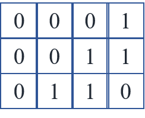
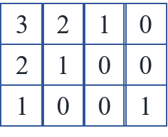
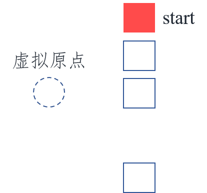
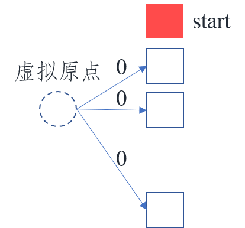
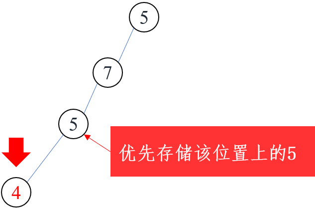
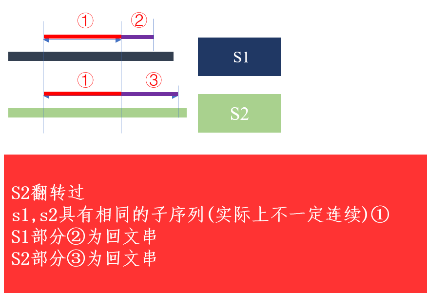

# 第46场双周赛
## 5671.地图中的最高点
- 多源BFS
- 模板题见 Acwing 173.矩阵距离
  

  
  - 目标:求矩阵上每个点到`1`的最短距离(曼哈顿距离)
    - 即:矩阵上的每个点到最近的一个1的距离



- 即:每个起点分别同时bfs
- 某个起点到多个点的最短距离

    - (1)创建一个虚拟原点


    - (2)虚拟原点向每一个点连一条边权为0的虚拟边


- 某个起点到距离它最近的一个起点的距离可以看成<font color=red>该点到虚拟原点的最近距离</font> --> 转化为单源最短路径问题
  - 在本题中,不需要把虚拟原点建立出来,只需要把为1的点的距离初始化为0,然后将所有为1的点添加到队列中(队列中第一层存放的即为所有距离为0的点)


- 实现
  - (1)将所有为"1"的点放入队列,并且将为1的点的dist[x][y]初始化为0
  - (2)开始BFS,如果某个点nx,ny对应的距离dist[nx][ny]尚未计算,则dist[nx][ny] <- dist[x][y] + 1

```
class Solution {
    public int[][] highestPeak(int[][] isWater) {
        Queue<Coo> q = new LinkedList<>();
        int m = isWater.length, n = isWater[0].length;
        int[][] h = new int[m][n];
        for(int i = 0; i < m; i++){
            Arrays.fill(h[i], -1);
        }
        // System.out.println(Arrays.deepToString(h));
        
        // 让水域的高度为0
        for(int i = 0; i < m; i++){
            for(int j = 0; j < n; j++){
                if(isWater[i][j] == 1){
                    h[i][j] = 0;
                    q.offer(new Coo(i, j));
                }
            }
        }
        int[][] pos = new int[][] {{-1, 0}, {1, 0}, {0, -1}, {0, 1}};
        while(q.size() > 0){
            Coo c = q.poll();
            int x = c.x, y = c.y;
            for(int i = 0; i < 4; i++){
                int nx = x + pos[i][0], ny = y + pos[i][1];
                if(0 > nx || nx >= m || 0 > ny || ny >= n) continue;
                if(h[nx][ny] != -1) continue;
                
                h[nx][ny] = h[x][y] + 1;
                q.offer(new Coo(nx, ny));
            
            }
        }
        return h;
    }
    
    static class Coo{
        int x;
        int y;
        Coo(int x, int y){
            this.x = x;
            this.y = y;
        }
    }
}
```

## 1766.互质数
- 数据范围

  - $nums.length == n$
  - $1 <= nums[i] <= 50$
  - $1 <= n <= 10^5$
  - $edges.length == n - 1$
  - $edges[j].length == 2$
  - $0 <= uj, vj < n$
  - $uj != vj$


- 当遍历到一个子节点4时,如果其祖先节点中有两个值相同的节点,那么应该优先存储位于下面的节点



- 当遍历到值为4的节点时
  - 因为其祖先节点的权值只有50种,可以依次枚举节点权值$1~50$
    - 找到离4最近的与其互质的祖先节点

- 时间复杂度
  - 对于每个点,最多枚举50次  $50n$

- 细节
  - (1)当有两个点的值相同时,为了判断哪个点更靠下,可以同时记录每个节点的层数
  - (2)无向树,每条边需要存两遍
  
- PS:图的遍历 --  Acwing.通信网络

## 1770.执行乘法运算的最大分数    

- 分析
  - (1) n相对于m来说数据较大,数组nums中有一部分数永远都不可能被用到,所以可以先删掉永远都不会被用上的那一部分的数字  
  - (2) 接下来为区间dp问题
    - 状态表示
      - f(i,j)
        - 集合:剩余区间为[i,j]时,所有操作方案的集合
    - 状态计算

- 区间dp
  - 先枚举长度,对于每一个长度,枚举左端点,右端点可以直接计算出来

```
class Solution {
    public int maximumScore(int[] _nums, int[] multipliers) {
        int n = _nums.length, m = multipliers.length;
        int[] nums;
        //如果n过长,则减少n
        if(n >= 2 * m){
            nums = new int[2 * m];
            for(int i = 0; i < m; i++){
                nums[i] = _nums[i];
            }
            for(int i = n - m; i < n; i++){
                nums[m + i - (n - m)] = _nums[i];
            }
            n = 2 * m;
        }else{
            nums = _nums;
        } 
      
        int[][] dp = new int[n+2][n+2]; // n + 2的原因在于要使得dp[n+1]有效,因为dp[n][n] = max(dp[n+1][n], dp[n][n-1])
        for(int len = n - m + 1; len <= n; len++){
            // 区间左端点
            for(int i = 1; i + len - 1 <= n; i++){ // i = 1的原因在于要使得dp[0]有效,因为dp[1][1] = max(dp[2][1], dp[1][0])
                int j = i + len - 1; // i + 1 <= i + len - 1
                dp[i][j] = Math.max(dp[i+1][j] + nums[i-1] * multipliers[n-len], dp[i][j-1] + nums[j-1] * multipliers[n-len]);                   // dp[i][j]只会由 dp[i+1][j] 或dp[i][j-1]得到
            
            }
            // System.out.println("len: " + len);
        }
        return dp[1][n];
    }
}
```

## 1771.由子序列构造的最长回文串的长度

- 即,在$S1$和$S2$中分别选择一些子序列(不一定要连续),这些子序列能构成的回文串的最大长度
- 分析
  - (1)翻转$S2$
  - (2)见图
  


  - s1的①来自于$S1[1,i]$
  - s2的①来自于$S2[1,j]$
   
  - s2的②来自于$S2[i+1,m]$
  - s3的③来自于$S3[j+1,n]$
  - 此时的最长回文子序列为 $LCS(S1[1,i], S2[1,j]) * 2 + maxPalindromicLength(S1[i+1,m],S2[j+1,n])$

```


class Solution {
    int m, n;
    int[][] f1;
    char[] s1, s2;
    
    public int longestPalindrome(String word1, String word2) {
     
        m = word1.length(); 
        n = word2.length();
        s1 = new char[m + 1];
        s2 = new char[n + 1];
        for(int i = 1; i <= m; i++){
            s1[i] = word1.charAt(i-1);
        }
        // System.out.println(Arrays.toString(s1));
        for(int j = 1; j <= n; j++){
            s2[j] = word2.charAt(n - j);
        }
        // System.out.println(Arrays.toString(s2));
        
        f1 = new int[m + 1][n + 1];
        LCS();
        int[][] f2 = new int[m + 2][m + 2];
        int[][] f3 = new int[n + 2][n + 2];
        System.out.println(Arrays.deepToString(f1));
        
        maxPalindromicLength(f2, s1);
        maxPalindromicLength(f3, s2);
        
        int[][] dp = new int[m + 1][n + 1];
        int result = 0;
        for(int i = 1; i <= m; i++){
            for(int j = 1; j <= n ; j++){
                if(f1[i][j] != 0){
                    dp[i][j] = f1[i][j] * 2 + Math.max(f2[i+1][m], f3[j+1][n]);
                result = Math.max(result, dp[i][j]);
                }
            }
        }
        return result;
    }
    
    public void LCS(){
        for(int i = 1; i <= m; i++){
            for(int j = 1; j <= n; j++){
                if(s1[i] == s2[j]){
                    f1[i][j] = Math.max(f1[i][j], f1[i-1][j-1] + 1);
                }else{
                    f1[i][j] = Math.max(f1[i][j], f1[i-1][j]);
                    f1[i][j] = Math.max(f1[i][j], f1[i][j-1]);
                }
            }
        }
    }
    
    public void maxPalindromicLength(int[][] f, char[] s){
        int d = f.length - 2;
        for(int length = 1; length <= d; length ++){
            for(int i = 1; i + length - 1 <= d; i++){
                int j = i + length - 1;
                if(i == j) f[i][j] = 1;
                else if(s[i] == s[j]){
                    // [i+1,j-1] j - 1 - i - 1 + 1
                    f[i][j] = Math.max(f[i][j], f[i+1][j-1] + 2);
                    f[i][j] = Math.max(f[i][j], f[i+1][j]);
                    f[i][j] = Math.max(f[i][j], f[i][j-1]);
                }else{
                    f[i][j] = Math.max(f[i][j], f[i+1][j]);
                    f[i][j] = Math.max(f[i][j], f[i][j-1]);
                }
            }
        }
    }
}
```