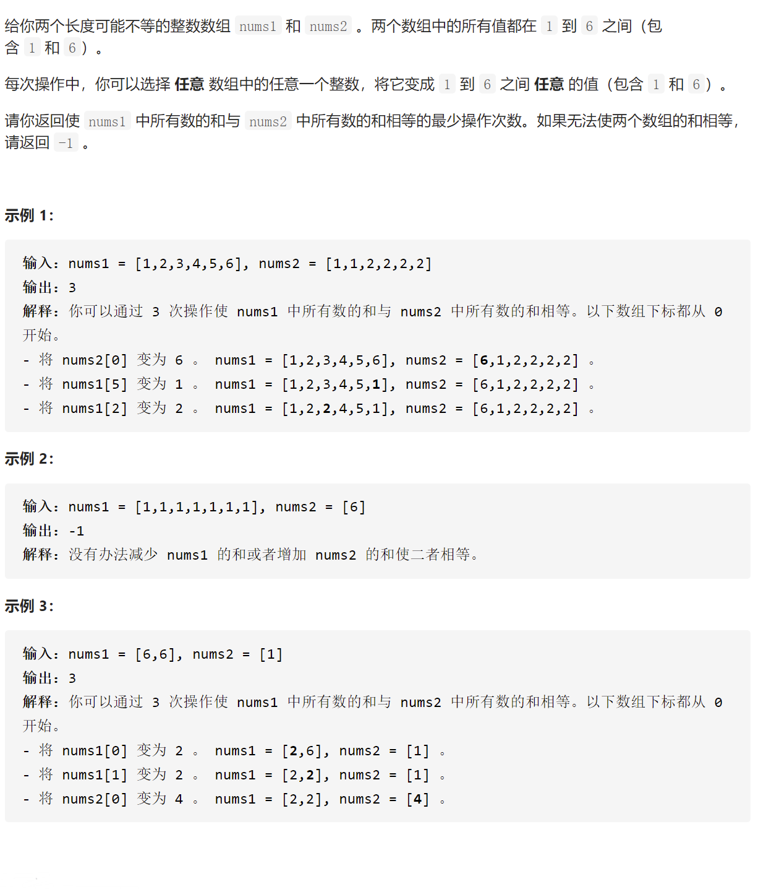
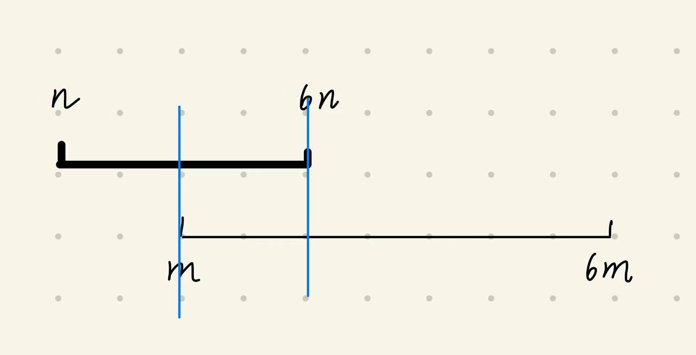

## 5691.通过最少操作次数使数组的和相等




- 数据范围
  - $1 <= nums1.length, nums2.length <= 10^5$
  - $1 <= nums1[i], nums2[i] <= 6$

- 分析
  - (1)无解的情况
    - 长度为$n$的数组的总和范围为$n \le sum(nums) \le 6n$
    - 较短的数组长为$n$,较长的数组长为$m$
      - $6n \lt m$
- <font color=red>**保证n $\le$ m的操作**</font>
```
public int func(int[] nums1, int[] nums2){
    int n = nums1.length, m = nums2.length;
    if(n > m) return func(nums2, nums1);
}
```
- 分析
  - (2)有解的情况

  - 最小的操作数对应的数组之和必然是在$[m, 6n]$之间
  - 枚举$[m, 6n]$中所有的总和集合S
    - $S = \{s1, s2, ...ss\}$,对于集合中任意一个$s$,分别得到nums1中的所有数累加到s最少需要修改多少步,nums2中所有数累加到s最少需要修改多少步,将两个步数相加,为最终的总和
    - 问题变为,**对于一个数组,如何用最小的修改步数,将其总和变为S**

### **对于一个数组,如何用最小的修改步数,将其总和变为S**
- 当前数组的总和为sum
  - 如果$sum \gt S$,则需要将数组中的每一个数总共减去$x = sum - S$
    - 当前数为6,则最多只能减少5
    - 当前数为5,则最多只能减少4
    - 当先数越大,其可以减的值越多
  - 因此,<font color=red>可以先用数组中的6去减,然后再用数组中的5去减,...</font>
  - nums中$1\sim6$的个数可以用数组来存
    - $if \quad h[6] * 5 \ge x$,表示只用nums中的6就可以减到S
      - 操作数总数$cnt += ceil(\frac{x}{5})$
      - $else \quad x \leftarrow x - h[6] * 5, compare(x, h[5] * 4)$
        - 操作总数$cnt += h[6]$
  - 如果$sum \lt S$,则需要将数组中的每一个数总共加上$x = S - sum$
    - 当前数为1,最多只能加上5
    - 当前数为2,最多只能加上4
    - ...其他部分以此类推
  - note:
    - int 向上取整 ``` step += x % mults[i] == 0 ? x / mults[i] : x / mults[i] + 1;```
  
```
class Solution {
    public int minOperations(int[] nums1, int[] nums2) {
        int n = nums1.length, m = nums2.length;
        // 确保 n <= m
        if(n > m) return minOperations(nums2, nums1);
        if(6 * n < m) return -1;
        int[] h1, h2; // 分别表示nums1中1~6的元素个数,nums2中1~6的元素个数
        h1 = new int[7];
        int sum1 = 0;
        for(int n1 : nums1){
            h1[n1]++;
            sum1 += n1;
            
        }
        
        h2 = new int[7];
        int sum2 = 0;
        for(int n2 : nums2){
            h2[n2]++;
            sum2 += n2;
        }
        
        // [m, 6n]范围
        int minStep = Integer.MAX_VALUE;
        for(int s = m; s <= 6 * n; s++){
            int step1 = getStep(sum1, s, h1);
            int step2 = getStep(sum2, s, h2);
            minStep = Math.min(step1 + step2, minStep);
        }
        return minStep;
        
    }
    
    public int getStep(int sum, int s, int[] h){
        int step = 0;
      
        int[] mults = new int[] {5, 4, 3, 2, 1, 0};
        // 首先判断sum和s的关系
        int[] vals;
        
        if(sum > s){
            int x = sum - s;
            vals = new int[] {6, 5, 4, 3, 2, 1};
            for(int i = 0; i < 6; i++){
                if(h[vals[i]] * mults[i] >= x){
                    step += x % mults[i] == 0 ? x / mults[i] : x / mults[i] + 1;
                    return step;
                }else{
                    step += h[vals[i]];
                    x -= h[vals[i]] * mults[i];
                }
            }
        }else if(sum < s){
            int x = s - sum;
            vals = new int[] {1, 2, 3, 4, 5, 6};
            for(int i = 0; i < 6; i++){
                if(h[vals[i]] * mults[i] >= x){
                    step += x % mults[i] == 0 ? x / mults[i] : x / mults[i] + 1;
                    return step;
                }else{
                    step += h[vals[i]];
                    x -= h[vals[i]] * mults[i];
                }
            }
        }
        return step;
    }
}
```

