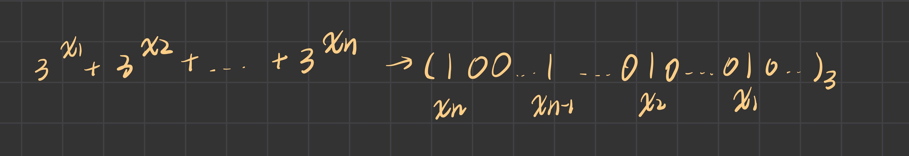

# 第47场双周赛
## 1780. 判断一个数字是否可以表示成三的幂的和
- 分析
  - 假设一个数字可以表示为3的若干个次幂之和,则它的每一位要么为0,要么为1
  - 所以某一位对应的余数非0/1(因为题目给出的是三进制),所以对应的余数为2时,表示这个数不能表示成三的幂的和



## 1781.所有子字符串美丽值之和
- 暴力
```
class Solution {
    int[] freq;
    int length;
    char[] ss;
    
    public int beautySum(String s) {
        ss = s.toCharArray();
        freq = new int[26];
        length = s.length();
        int result = 0;
        for(int i = 0; i < length; i++){
            Arrays.fill(freq, 0);
            // 当前[i, j]构成子字符串
            for(int j = i; j < length; j++){
                freq[ss[j] - 'a']++;
                int[] res = cal();
                int mi = res[0], ma = res[1];
                if(mi != ma) result += (ma - mi);
                // System.out.println("freq" + Arrays.toString(freq) + " [i,j] " + i + "," + j + ":"
                               // + s.substring(i, j + 1) + "  result: " + result);
            }
            
        }
        return result;
    }
    
    public int[] cal(){
        int mi = Integer.MAX_VALUE, ma = Integer.MIN_VALUE;
        for(int i = 0; i < 26; i++){
            if(freq[i] != 0){
                 mi = Math.min(mi, freq[i]);
                 ma = Math.max(ma, freq[i]);
            }
        }
        return new int[] {mi, ma};
    }
}
```