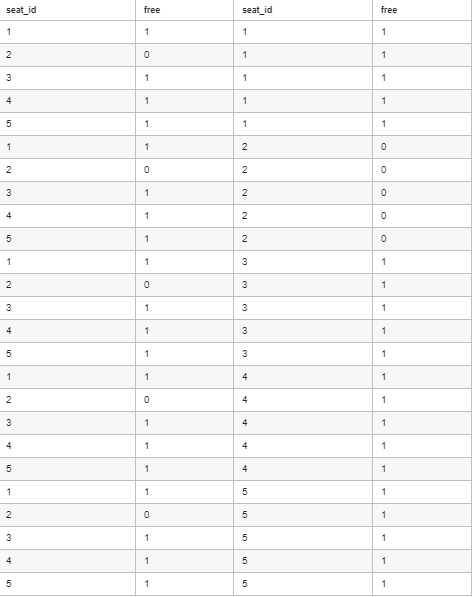
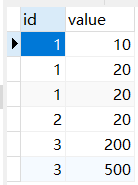
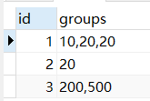
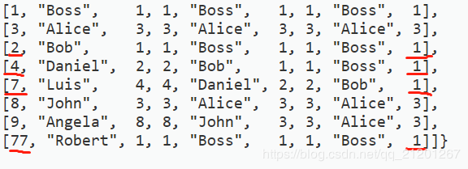

# SQL
## where与空值
### 175.组合两个表
编写一个 SQL 查询，满足条件：无论 person 是否有地址信息，都需要基于上述两表提供 person 的以下信息：

 ```
 FirstName, LastName, City, State
 ```

 **代码**
 ```
select firstname, lastname, city, state
from Person left join Address
on Person.PersonId = Address.PersonId
 ```


- 需要用left join。因为需要展现所有人的数据，而Address里不一定有所有人（因为不一定所有人都有地址），但是Person里一定储存了所有人的数据。
- 最后一行得用on而不能用where。因为如果Address中查询的所有人的地址都存在，那么这么做没有问题。但是，题目中强调了，人一定存在，但地址不一定。一旦无法匹配到，where语句就行不通了。


### 1378.使用唯一标识码替换员工ID

**代码**
```
select a.unique_id, b.name
from employees as b
left join employeeuni as a
on a.id = b.id
```
**错误**
```
select a.unique_id, b.name
from employeeuni as a
left join employees as b
on a.id = b.id
```
### 1421.净现值查询
```
select 
    q.id,
    q.`year`,
    ifNull(n.npv, 0) `npv`
from 
    queries q
left join 
    npv n
on
    q.id = n.id and q.`year` = n.`year`
```
### 1350.院系无效的学生
**代码**
```
select s.id, s.name 
from departments d
right join students s
on d.id = s.department_id
where 
d.id is null
```
### 584.寻找用户推荐人
```
SELECT
	`name`
FROM
	customer
WHERE
	referee_id IS NULL OR referee_id <> 2;
```

### 1068.产品销售分析Ⅰ
**代码**
```
select p.product_name, s.year, s.price
from sales s 
left join product p
on s.product_id = p.product_id
```
### 1173. 即时食物配送 I
**错误代码**
```
select round(count(customer_id)/sum(customer_id) * 100, 2) immediate_percentage
from delivery d 
where d.order_date = d.customer_pref_delivery_date
```
- 错误原因
  - 匹配到where condition可能为空,查询返回为Null,而非0.00

**代码**
- 分子和分母分别用两个查询替代
```
select round(
(select count(d.customer_id) from delivery d
where d.order_date = d.customer_pref_delivery_date)/
(select count(d.customer_id) from delivery d)*100, 2)
as immediate_percentage
```

### 1407. 排名靠前的旅行者
```
select u.`name`, ifnull(sum(r.`distance`),0) travelled_distance
from users u
left join rides r
on u.id = r.user_id
group by r.user_id
order by travelled_distance desc, u.`name` asc
```

### 1607.没有卖出的买家
```
select distinct seller.seller_name
from (
select seller_id from orders
where sale_date > "2019-12-31"
) as a
right join seller
on a.seller_id = seller.seller_id
where a.seller_id is null
order by seller.seller_name
```
## 匹配类型
### 1527.患某种疾病的患者
https://leetcode-cn.com/problems/patients-with-a-condition/solution/conditions-like-diab1-or-conditions-like-diab1-by-/

- binary的作用:限制匹配内容大小写
- 通配符"%"的作用是代替0个或者多个字符

**代码**
```
select patient_id, patient_name, conditions
from patients
where conditions like binary 'DIAB1%'
or conditions like '% DIAB1%'
```

### 1517. 查找拥有有效邮箱的用户
- 主要是正则表达式匹配
```
SELECT
	*
FROM
	Users
WHERE mail REGEXP '^[a-zA-Z]+[a-zA-Z0-9_\\.\\-]*@leetcode.com$'
```
前缀名是包含字母（大写或小写）、数字、下划线 '_'、句点 '.' 和/或横杠 '-' 的字符串

前缀名必须以字母开头

域名是 '@leetcode.com' 


## 内连接
### 1303.求团队人数
https://leetcode-cn.com/problems/find-the-team-size/solution/1303-qiu-tuan-dui-ren-shu-by-eric-345/

```
Employee Table:
+-------------+------------+
| employee_id | team_id    |
+-------------+------------+
|     1       |     8      |
|     2       |     8      |
|     3       |     8      |
|     4       |     7      |
|     5       |     9      |
|     6       |     9      |
+-------------+------------+
Result table:
+-------------+------------+
| employee_id | team_size  |
+-------------+------------+
|     1       |     3      |
|     2       |     3      |
|     3       |     3      |
|     4       |     1      |
|     5       |     2      |
|     6       |     2      |
+-------------+------------+
```
**思路**
- 先对employee表进行处理,得到[team_id, team_size]表t
```
select team_id, count(team_id) team_size
from employee
group by team_id
```
- 用原表对该表内连接
```
select e.employee_id, t.team_size 
from employee as e
inner join (
    select team_id, count(team_id) team_size
    from employee
    group by team_id
) as t
on e.team_id = t.team_id
```
### 613.直线上的最近距离

- 表名为point,在sql中是关键字,需要用```''```包裹
- 使用point进行自连接
```
select temp.distance shortest
from (
    select p1.x x, abs(p1.x - p2.x) as distance
    from `point` p1
    inner join `point` p2
    on p1.x > p2.x
) as temp
order by temp.distance asc
limit 1
```

## 内连接中,涉及到分析笛卡尔积
### 603. 连续空余座位

- 内连接
  

```
select a.seat_id, a.free, b.seat_id, b.free
from cinema a join cinema b
```


- 连续座位
  - 从结果来看,cinema中的连续座位为[3,4,5]
  - 从手动筛选出的结果来看,连续座位的特点是
    - abs(a.seat_id - b.seat_id) = 1
    - a.free = 1 and b.free = 1

|a.seat_id|a.free|b.seat_id|b.free|
|--|--|--|--|
| 4 | 1 | 3 | 1 |
| 3 | 1 | 4 | 1 |
| 5 | 1 | 4 | 1 |
| 4 | 1 | 5 | 1 |


```
select a.seat_id, a.free, b.seat_id, b.free
from cinema a join cinema b
where abs(a.seat_id - b.seat_id) = 1
and a.free = 1 and b.free = 1
```

- 最后对seat_id去重处理
```
select distinct a.seat_id
from cinema a join cinema b
where abs(a.seat_id - b.seat_id) = 1
and a.free = 1 and b.free = 1
order by a.seat_id 
```

### 180.连续出现的数字
- 由603扩展过来
  
找到表中,连续出现3次的数字
```
select distinct l1.num `ConsecutiveNums`
from `logs` l1
join `logs` l2
join `logs` l3
where l1.id + 1 = l2.id
and l2.id + 1 = l3.id
and l1.num = l2.num 
and l2.num = l3.num
```

### 1623.三人代表国家队
```
select schoolA.student_name `member_A`, schoolB.student_name `member_B`, schoolC.student_name `member_C`
from schoolA cross join schoolB
cross join schoolC
where 
schoolA.student_id != schoolB.student_id and 
schoolA.student_name != schoolB.student_name and 
schoolA.student_id != schoolC.student_id and 
schoolA.student_name != schoolC.student_name and
schoolB.student_id != schoolC.student_id and
schoolB.student_name != schoolC.student_name
```

### 1633.各赛事的用户注册率
```
# (1)从register中选出所有的contest_id,将contest_id和user_id进行内连接得到虚拟表a
# (2)使用contest_id和user_id,让a left join register r


select contest_id_a `contest_id`, round(count(user_id) / count(user_id_a) * 100, 2) `percentage` 
from 
(
select contest_id `contest_id_a`, user_id `user_id_a`, user_name
from 
(select distinct contest_id from register) as _a
cross join users
) as a
left join 
register r
on a.contest_id_a = r.contest_id
and a.user_id_a = r.user_id
group by contest_id_a
order by percentage desc, contest_id asc
```

----

### 1251. 平均售价
- round(xx,2) 保留小数点后2位
- 将Prices table和UnitsSold table用product_id进行连接,选出purchase_date位于start_date和end_date中的记录
- 计算平均价格,按照product_id分组
```
select p.product_id, round(sum(p.price * u.units)/sum(u.units), 2) average_price
from (
prices p
inner join unitssold u
on p.product_id = u.product_id
and u.purchase_date 
between p.start_date and p.end_date    
)
group by p.product_id
```

### 1571. 仓库经理
- 求出Products表中每个product_name的体积 p_volume
```
select p.product_id, p.width * p.length * p.height p_volume
from products p
```
- 基于p_volume,连接warehouse,得到总体积
```
select w.name warehouse_name, sum(w.units * p_volume) volume
from warehouse w
left join 
(select p.product_id, p.width * p.length * p.height p_volume
from products p) as p
on w.product_id = p.product_id
group by w.name
```

### 181. 超过经理收入的员工
```
select e1.name employee
from (
    employee e1
    inner join employee e2
    on e1.managerid = e2.id
    and e1.salary > e2.salary
)
```

## 生成新列
### 1565.按照月统计订单数与顾客数
```
Orders
+----------+------------+-------------+------------+
| order_id | order_date | customer_id | invoice    |
+----------+------------+-------------+------------+
| 1        | 2020-09-15 | 1           | 30         |
| 2        | 2020-09-17 | 2           | 90         |
| 3        | 2020-10-06 | 3           | 20         |
| 4        | 2020-10-20 | 3           | 21         |
| 5        | 2020-11-10 | 1           | 10         |
| 6        | 2020-11-21 | 2           | 15         |
| 7        | 2020-12-01 | 4           | 55         |
| 8        | 2020-12-03 | 4           | 77         |
| 9        | 2021-01-07 | 3           | 31         |
| 10       | 2021-01-15 | 2           | 20         |
+----------+------------+-------------+------------+
```
- (1)实现按月统计:基于原表生成一个新列month
```
substring(order_date, 1, 7) month
```
- (2)根据条件筛选出记录
```
select substring(order_date, 1, 7) month, count(distinct order_id) `order_count`, count(distinct customer_id) `customer_count`
from orders 
where invoice > 20
group by month
```
  
## 对子分组筛选-having
## having count 使用having 来筛选出满足某一数量要求的子分组
### 182. 查找重复的电子邮箱
```
select email 
from person
group by email
having count(email) > 1
```

### 586.订单最多的客户数量
- 思路
- 需要考虑到有多个客户订单数都达到最多的情况
- (1) 找出订单最多的客户的订单数
```
select count(*) as c 
from orders 
group by customer_number order by c desc limit 1
```
- (2) 从所有记录中找出订单数和最多的订单数相等的客户记录
```
select customer_number
from orders
group by customer_number
having count(*) = (
select count(*) as c 
from orders 
group by customer_number order by c desc limit 1
)
```

### 1149. 文章浏览 II
```
SELECT 
    DISTINCT viewer_id `id`
FROM
    views
GROUP BY
    view_date, viewer_id
HAVING
    COUNT(DISTINCT article_id) >= 2
ORDER BY
    viewer_id ASC
```
### 1050. 合作过至少三次的演员和导演
**group by用法**
``` 
group by A,B
```
- 即先对A分组,再对B分组
```
select actor_id, director_id
from actorDirector
group by actor_id, director_id
having count(`timestamp`) >= 3
```

### 1076.项目员工Ⅱ
https://leetcode-cn.com/problems/project-employees-ii/

- 思路:
- 要求为报告所有雇员最多的项目
- (1)找到所有项目对应的最大雇员数(子查询)
```
select count(employee_id) as c
from project
group by project_id 
order by c desc
limit 1
```
- (2)根据子查询结果,找到项目对应雇员数==(子查询所得雇员数结果)的项目id
```
select project_id from project
group by project_id
having count(employee_id) = ( -- 子查询
select count(employee_id) as c
from project
group by project_id 
order by c desc
limit 1
)
```

### 619.只出现过一次的数字
- 错误思路(或者说可能会忽视一些边界情况)
  - 按照num分组 --> group by hum
  - 使用having count(*)筛选出只出现过一次的数字 --> having count(*) = 1
  - 按照num大小排序 --> order by num desc
  - 限制只取一个 --> limit 1
```
select num
from my_numbers
group by num 
having count(*) = 1
order by num desc
limit 1
```
- 对于样例
  
{"headers": {"my_numbers": ["num"]}, "rows": {"my_numbers": [[8],[1],[8],[3],[4],[3],[1],[4],[5],[5],[6],[6]]}}

- 此时不存在只出现一次的数字
- 代码输出
  - {"headers": ["num"], "values": []}
- 预期输出
  - {"headers":["num"],"values":[[null]]}
- 对于不存在只出现过一次的数字这种情况时,错误代码返回为空,而预期希望用```null``` 填充

- 修改
  - 外面包裹一层```select ifnull(xxx,null) as num```
  - 另一版错误代码
```
select ifnull(
select num
from my_numbers
group by num 
having count(*) = 1
order by num desc
limit 1,null)
as num
```
 - 注:**作为Ifnull参数的select 子句需要用括号包裹起来**

- 正确版本
```
select ifnull(
(select num
from my_numbers
group by num 
having count(*) = 1
order by num desc
limit 1),null)
as num
```

### 512. 游戏玩法分析 II
- 思路
  - (1)找到每个用户对应的最早的event_date --> earliest_event_date
  - (2)找到[player_id, earliest_event_date]对应的device_id

```
select a.player_id, b.device_id
from(
select player_id, min(event_date) earliest_event_date
from activity
group by player_id
)
as a
join activity b
where a.player_id = b.player_id
and a.earliest_event_date = b.event_date
```

## 条件--case when then end
### 627.交换工资
```
update salary
set sex = (
    case when sex = "m"
    then "f"
    else "m"
end)
```
### 1211. 查询结果的质量和占比
- case when可以在聚合函数(如count)中使用
```
# Write your MySQL query statement below
select query_name, round(sum(rating / `position`) / count(query_name), 2) quality, 
round(100 * count(case when rating < 3 then 1 end) / count(result), 2) poor_query_percentage
from queries
group by query_name
```

### 1294. 不同国家的天气类型
- case when then end可以用于生成一个字段
```
select countries.country_name, 
case when avg(weather_state) <= 15 then "Cold"
    when avg(weather_state) >= 25 then "Hot"
    else "Warm"
end weather_type
from weather 
join countries 
on weather.country_id = countries.country_id
where weather.`day` between "2019-11-01" and "2019-11-30"
group by weather.country_id
```

### 1322. 广告效果

```

select ad_id, round(ifnull(
    sum(case when `action` = "Clicked" then 1 else 0 end)/
    (sum(case when `action` = "Clicked" then 1 else 0 end) + sum(case when `action` = "Viewed" then 1 else 0 end)), 0
    ) * 100, 2)  `ctr`
from ads
group by ad_id
order by `ctr` desc, ad_id asc
```

### 1393. 股票的资本损益

```
select stock_name,  
sum((case when `operation` = "Buy"
then -price
else price
end)) `capital_gain_loss`
from stocks
group by stock_name
order by stock_name
```
### 1445. 苹果和橘子

```
select sale_date, sum((case when fruit = "oranges" then -sold_num else sold_num end)) `diff`
from sales
group by sale_date
```

### 1398. 购买了产品A和产品B却没有购买产品C的顾客
```
select distinct c.customer_id, c.customer_name
from (
select customer_id, 
sum((case when product_name = "A" then 1 else 0 end)) + sum((case when product_name = "B" then 1 else 0 end)) `AB`, 
sum((case when product_name = "C" then 1 else 0 end)) `C`
from orders
group by customer_id
) as a
left join customers c
on a.customer_id = c.customer_id
where a.`AB` = 2 and a.`C` = 0
```

### 1468. 计算税后工资
- PS:round是四舍五入取整
```
SELECT 
    s.company_id,
    s.employee_id, 
    s.employee_name, 
    ROUND(s.salary * (1 - tr.tex / 100)) `salary`
FROM
(
SELECT 
    company_id, 
    (CASE 
        WHEN MAX(salary) < 1000 THEN 0
        WHEN MAX(salary) > 10000 THEN 49
        ELSE 24
    END) `tex`
FROM 
    Salaries
GROUP BY
    company_id
) AS tr
LEFT JOIN 
    Salaries s
ON tr.company_id = s.company_ids
```

### 1440. 计算布尔表达式的值
```
# 先对表进行连接
# 基于连接后的表再CASE WHEN 进行判断
SELECT 
v1.name `left_operand`,
e.operator, 
v2.name `right_operand`,
IF((CASE
    WHEN operator = ">" THEN v1.value > v2.value
    WHEN operator = "<" THEN v1.value < v2.value
    ELSE v1.value = v2.value
END),"true","false") `value`
FROM 
    `Variables` v1
INNER JOIN
    Expressions e
ON 
    e.left_operand = v1.name
INNER JOIN 
    `Variables` v2
ON
    e.right_operand = v2.name
```

### 1158. 市场分析Ⅰ
```
SELECT 
    U.user_id `buyer_id`,
    u.join_date,
    IFNULL(SUM(
        (CASE 
            WHEN SUBSTRING(o.order_date, 1, 4) = "2019" THEN 1
            ELSE 0
        END)
    ),0) `orders_in_2019`
FROM 
    orders o
RIGHT JOIN 
    users u
ON
    o.buyer_id = u.user_id
-- 以值最多的user_id进行group by 和 order by  
GROUP BY
    u.user_id
ORDER BY
    u.user_id
```
## 行列转换
### 1179. 重新格式化部门表

https://leetcode-cn.com/problems/reformat-department-table/

- 同样使用case when end的语法
```
select id, 
    sum(case when `month`="Jan" then revenue end) Jan_Revenue,
    sum(case when `month`="Feb" then revenue end) Feb_Revenue,
    sum(case when `month`="Mar" then revenue end) Mar_Revenue,
    sum(case when `month`="Apr" then revenue end) Apr_Revenue,
    sum(case when `month`="May" then revenue end) May_Revenue,
    sum(case when `month`="Jun" then revenue end) Jun_Revenue,
    sum(case when `month`="Jul" then revenue end) Jul_Revenue,
    sum(case when `month`="Aug" then revenue end) Aug_Revenue,
    sum(case when `month`="Sep" then revenue end) Sep_Revenue,
    sum(case when `month`="Oct" then revenue end) Oct_Revenue,
    sum(case when `month`="Nov" then revenue end) Nov_Revenue,
    sum(case when `month`="Dec" then revenue end) Dec_Revenue
from department
group by id
```
- 注:如果没有符合条件的记录,此时新创建的一列中的值会用"null"进行填充

## union/union all 使用
### 1435. 制作会话柱状图
- 注
  - 如果用单引号' 包裹1个字段,则为生成1个虚拟的记录值,如'[0-5>'
  - 如果使用点号` 包裹1个字段,则为会从table查找该字段是否存在,如果不存在,则会报错
```
select '[0-5>' `bin`, count(*) `total`
from sessions
where duration between 0 and 299
union all
select '[5-10>' as `bin`, count(*) `total`
from sessions
where duration between 300 and 599
union all
select '[10-15>' as `bin`, count(*) `total`
from sessions
where duration between 600 and 899
union all
select '15 or more' as `bin`, count(*) `total`
from sessions
where duration > 899

```

### 602
- union all + limit筛选出极值


```
SELECT
    r `id`,
    COUNT(DISTINCT `a`) `num`
FROM
(
    SELECT 
        requester_id `r`,
        accepter_id `a`
    FROM
        request_accepted
    UNION ALL 
    SELECT
        accepter_id `r`,
        requester_id `a`
    FROM 
        request_accepted
) `t`
GROUP BY
    `r`
ORDER BY
    `num` DESC
LIMIT 1

```

### 1341. 电影评分

```
(SELECT 
    us.`name` `results`
FROM 
    movie_rating mr 
LEFT JOIN 
    users us
ON mr.user_id = us.user_id
GROUP BY 
    mr.user_id
ORDER BY 
    COUNT(mr.movie_id) DESC,
    us.`name` ASC
LIMIT 1)
UNION
-- 筛选出符合要求的电影
(SELECT
    mo.title `results`
FROM 
    movie_rating mr
LEFT JOIN
    movies mo
ON 
    mr.movie_id = mo.movie_id
WHERE
    SUBSTRING(mr.created_at, 1, 7) = "2020-02"
GROUP BY
    mr.movie_id
ORDER BY
    AVG(mr.rating) DESC,
    mo.title ASC
LIMIT 1)
```

## 去重
### 596. 超过5名学生的课
```
+---------+------------+
| student | class      |
+---------+------------+
| A       | Math       |
| B       | English    |
| C       | Math       |
| D       | Biology    |
| E       | Math       |
| F       | Computer   |
| G       | Math       |
| H       | Math       |
| I       | Math       |
+---------+------------+
```

**注意**
- 可能存在重复的情况
  - 即:一名学生选了一门课多次

错误写法
```
select class
from courses
group by class
having count(student) >= 5
```
正确写法
```
select class
from courses
group by class
having count(distinct student) >= 5
```

## 删除
### delete 多表删除
- 从1个表或者多个表中删除满足条件的数据
```
delete p1
from person p1
join person p2
on p1.email = p2.email
where p1.id > p2.id
```

## 日期
**datediff**
### 1141. 查询近30天活跃用户数
https://leetcode-cn.com/problems/user-activity-for-the-past-30-days-i/
- 解法1
```
select a.activity_date day, count(distinct user_id) active_users
from activity a
where a.activity_date between '2019-06-28' and '2019-07-27'
group by a.activity_date
```
- 解法2
  - 此时datediff的用法中activity_date是早于'2019-07-27'的时间
```
SELECT
	activity_date AS `day`,
	COUNT(DISTINCT user_id) AS active_users
FROM
	Activity
WHERE
	activity_date BETWEEN DATE_SUB('2019-07-27', INTERVAL 29 DAY) AND '2019-07-27'
GROUP BY
	activity_date;


SELECT
	activity_date AS `day`,
	COUNT(DISTINCT user_id) AS active_users
FROM
	Activity
WHERE
	DATEDIFF('2019-07-27', activity_date) < 30
GROUP BY
	activity_date;

```

### 197. 上升的温度
- 要求:
  - 查询第二天温度比第一天温度高的记录
- 内连接
  - 使用w1.weather和w2.weather进行连接
  - 其中w1.weather和w2.weather之间的天数相差为1

```
select w1.id id
from weather w1
inner join weather w2
-- 根据两表之间的天数差进行连接
on datediff(w1.recorddate, w2.recorddate) = 1
where w1.temperature > w2.temperature
```

### 1107.每日新用户统计
```
SELECT
    t.activity_date `login_date`,
    COUNT(t.user_id) `user_count`
FROM 
(
SELECT
    tr.user_id,
    MIN(tr.activity_date) `activity_date`
FROM 
    traffic tr
WHERE
    tr.activity = "login" 
GROUP BY 
    tr.user_id
) AS t
WHERE 
    DATEDIFF("2019-06-30", t.activity_date) <= 90
GROUP BY
    t.activity_date
```
## 空值处理--IFNULL
### 1142.过去30天的用户活动 Ⅱ

**错误代码**
```
select round((select count(distinct session_id) from activity
where datediff("2019-07-27", activity_date) < 30) /
(select count(distinct user_id) from activity
where datediff("2019-07-27", activity_date) < 30),2)
as average_sessions_per_user
```
- 错误原因
  - 当分母select count(distinct user_id) from activity
where datediff("2019-07-27", activity_date) < 30)为0时,代码运行的结果为Null,而实际希望得到的结果为0

**正确**
- 使用IFNULL(expression A,B)
- 作用为当epression A 求出的结果为null时,使用B来填充

```
select round(
ifnull(
(select count(distinct session_id) from activity
where datediff("2019-07-27", activity_date) < 30) /
(select count(distinct user_id) from activity
where datediff("2019-07-27", activity_date) < 30), 0),2)
as average_sessions_per_user
```

### 577. 员工奖金
- 要求:
  - 筛选出所以bonus < 1000的员工记录
- 注:
  - 筛选出来的记录需要包括**空值** 
  - 在where条件中,使用isnull进行筛选

```
select e.`name`, b.bonus
from employee e
left join bonus b
on e.empId = b.empId
where b.bonus < 1000 or isnull(b.bonus)
```
----

### 1113. 报告的记录
```
select extra report_reason, count(distinct post_id) report_count
from actions
where `action` = 'report' and datediff("2019-07-05", action_date) < 2
group by extra
```

### 597. 好友申请 I ：总体通过率
- 注:distinct如果要对**两列**进行去重
- 即对[colA-colB]的对应结果共同去重
- 应该使用**distinct colA, colB**的语法,而非**distinct (colA, colB)**

```
select 
round(
ifnull(
(select count(distinct requester_id, accepter_id) from request_accepted)/
(select count(distinct sender_id, send_to_id) from friend_request)
,0),2)
accept_rate

```

### 1241. 每个帖子的评论数

- 注意点
  - 判断某个值为空值使用函数**ifnull()**
    - item = null 返回结果为空
  - 判断某个值非空值使用**is not null**
    - item != null 返回结果也为空
```
select b.sub_id `post_id`, ifnull(a.`number_of_comments`, 0) `number_of_comments`
from 
(select distinct parent_id, count(distinct sub_id) `number_of_comments`
from submissions
where parent_id is not null
group by parent_id
) as a
right join (
    select distinct sub_id
    from submissions
    where isnull(parent_id)
) as b
on a.parent_id = b.sub_id
order by b.sub_id
```

### 1280. 学生们参加各科测试的次数

```
学生表: Students

+---------------+---------+
| Column Name   | Type    |
+---------------+---------+
| student_id    | int     |
| student_name  | varchar |
+---------------+---------+
主键为 student_id（学生ID），该表内的每一行都记录有学校一名学生的信息。
 

科目表: Subjects

+--------------+---------+
| Column Name  | Type    |
+--------------+---------+
| subject_name | varchar |
+--------------+---------+
主键为 subject_name（科目名称），每一行记录学校的一门科目名称。
 

考试表: Examinations

+--------------+---------+
| Column Name  | Type    |
+--------------+---------+
| student_id   | int     |
| subject_name | varchar |
+--------------+---------+
这张表压根没有主键，可能会有重复行。
学生表里的一个学生修读科目表里的每一门科目，而这张考试表的每一行记录就表示学生表里的某个学生参加了一次科目表里某门科目的测试。
 

要求写一段 SQL 语句，查询出每个学生参加每一门科目测试的次数，结果按 student_id 和 subject_name 排序。

查询结构格式如下所示：

Students table:
+------------+--------------+
| student_id | student_name |
+------------+--------------+
| 1          | Alice        |
| 2          | Bob          |
| 13         | John         |
| 6          | Alex         |
+------------+--------------+
Subjects table:
+--------------+
| subject_name |
+--------------+
| Math         |
| Physics      |
| Programming  |
+--------------+
Examinations table:
+------------+--------------+
| student_id | subject_name |
+------------+--------------+
| 1          | Math         |
| 1          | Physics      |
| 1          | Programming  |
| 2          | Programming  |
| 1          | Physics      |
| 1          | Math         |
| 13         | Math         |
| 13         | Programming  |
| 13         | Physics      |
| 2          | Math         |
| 1          | Math         |
+------------+--------------+
Result table:
+------------+--------------+--------------+----------------+
| student_id | student_name | subject_name | attended_exams |
+------------+--------------+--------------+----------------+
| 1          | Alice        | Math         | 3              |
| 1          | Alice        | Physics      | 2              |
| 1          | Alice        | Programming  | 1              |
| 2          | Bob          | Math         | 1              |
| 2          | Bob          | Physics      | 0              |
| 2          | Bob          | Programming  | 1              |
| 6          | Alex         | Math         | 0              |
| 6          | Alex         | Physics      | 0              |
| 6          | Alex         | Programming  | 0              |
| 13         | John         | Math         | 1              |
| 13         | John         | Physics      | 1              |
| 13         | John         | Programming  | 1              |
+------------+--------------+--------------+----------------+
结果表需包含所有学生和所有科目（即便测试次数为0）：
Alice 参加了 3 次数学测试, 2 次物理测试，以及 1 次编程测试；
Bob 参加了 1 次数学测试, 1 次编程测试，没有参加物理测试；
Alex 啥测试都没参加；
John  参加了数学、物理、编程测试各 1 次。
```

- 思路
- 参考链接
  - https://leetcode-cn.com/problems/students-and-examinations/solution/jie-ti-si-lu-yi-bu-yi-bu-lai-by-littlebob-2/
  
- (1)result Table的前三列(student_id, student_name, subject_name)可以看作是students Table和subjects Table的笛卡尔积
  - 作为表ss
```
select * 
from students s1
cross join subjects s2
```
- (2)对examnation分组统计student_id, subject_name的出现次数
  - 作为表e
```
select student_id, subject_name, count(student_id) as attend_exams
from `examinations`
group by student_id, subject_name
```
- (3)将两部分连接起来,以第一部分ss为准
  - 按照student_id和subject_name
  - 如果e中[student_id, subject_name]在ss中没有对应取值,则e.attend_exams显示为null

```
select ss.student_id, ss.student_name, ss.subject_name, ifnull(e1.attended_exams, 0) attended_exams
from 
# (1)笛卡尔积
(select s.student_id, s.student_name, sub.subject_name
from students s
cross join subjects sub) as ss
left join 
# (2)统计每门考试的参与次数
(select e.student_id, e.subject_name, count(e.student_id) attended_exams
from examinations e
group by e.student_id, e.subject_name) as e1
on ss.student_id = e1.student_id
and ss.subject_name = e1.subject_name
order by ss.student_id, ss.subject_name
```
----
## IF
- if语法:
  - if(expression, A, B)

### 610. 判断三角形
```
select x, y, z,
    if((x + y > z) and (x - y < z) and (x + z > y) and (x - z < y) and (y + z > x) and (y - z < x), "Yes", "No") triangle
from triangle
```

----
## 开窗函数Over()
- over使用
  - 参考链接
  - https://www.cnblogs.com/tyyking/p/10665027.html

### 1596. 每位顾客最经常订购的商品
- 参考题解链接
  - https://leetcode-cn.com/problems/the-most-frequently-ordered-products-for-each-customer/solution/kai-chuang-han-shu-by-vanas/

```
Orders
+----------+------------+-------------+------------+
| order_id | order_date | customer_id | product_id |
+----------+------------+-------------+------------+
| 1        | 2020-07-31 | 1           | 1          |
| 2        | 2020-07-30 | 2           | 2          |
| 3        | 2020-08-29 | 3           | 3          |
| 4        | 2020-07-29 | 4           | 1          |
| 5        | 2020-06-10 | 1           | 2          |
| 6        | 2020-08-01 | 2           | 1          |
| 7        | 2020-08-01 | 3           | 3          |
| 8        | 2020-08-03 | 1           | 2          |
| 9        | 2020-08-07 | 2           | 3          |
| 10       | 2020-07-15 | 1           | 2          |
+----------+------------+-------------+------------+
```

```
SELECT customer_id, product_id,COUNT(*)
FROM Orders o
GROUP BY customer_id, product_id
ORDER BY customer_id
```
```
{"headers": 
["customer_id", "product_id", "COUNT(*)"], 
"values": [
[1, 1, 1], 
[1, 2, 3], 
[2, 1, 1], 
[2, 2, 1], 
[2, 3, 1], 
[3, 3, 2], 
[4, 1, 1]
]}
```

```
SELECT customer_id, product_id,
ROW_NUMBER() OVER(PARTITION BY customer_id ORDER BY COUNT(*) DESC ) AS RK
FROM Orders o
GROUP BY customer_id, product_id
ORDER BY customer_id
```
```
{"headers": 
["customer_id", "product_id", "RK"], 
"values": [
  [1, 2, 1], 
  [1, 1, 2], 
  --- ROW_NUMBER() 和 RANK() 在这里表现出差异 ---
  -- ROW_NUMBER()
  ----- 每个[customer_id, product_id]对应的count(*) 不唯一, ROW_NUMBER()会对重复值进行累加
  ------- [2, 2, 1] --> row number == 1
  ------- [2, 1, 1] --> row number == 2
  ------- [2, 3, 1] --> row number == 3
  [2, 2, 1], 
  [2, 1, 2], 
  [2, 3, 3], 
  --- ---
  [3, 3, 1], 
  [4, 1, 1]
]}
```

```
SELECT customer_id, product_id,
RANK() OVER(PARTITION BY customer_id ORDER BY COUNT(*) DESC ) AS RK
FROM Orders o
GROUP BY customer_id, product_id
ORDER BY customer_id
```
```
{"headers": 
["customer_id", "product_id", "RK"], 
"values": [
  [1, 2, 1], 
  [1, 1, 2], 
  --- ROW_NUMBER() 和 RANK() 在这里表现出差异 ---
  -- RANK()
  ----- 每个[customer_id, product_id]对应的count(*) 不唯一, RANK() 不会考虑重复值
  ------- [2, 2, 1] --> rank == 1
  ------- [2, 1, 1] --> rank == 1
  ------- [2, 3, 1] --> rank == 1
  [2, 2, 1], 
  [2, 1, 1], 
  [2, 3, 1], 
  --- ---
  [3, 3, 1], 
  [4, 1, 1]
]}
```
- 参考代码
```
SELECT customer_id, T.product_id, product_name 
FROM(
    SELECT customer_id, product_id,
    RANK() OVER(PARTITION BY customer_id ORDER BY COUNT(*) DESC ) AS RK
    FROM Orders o
    GROUP BY customer_id, product_id
) T
LEFT JOIN Products p on p.product_id = t.product_id 
WHERE RK=1
```

```
--二刷
SELECT
    t.customer_id,
    t.product_id,
    p.product_name
FROM(
    SELECT 
        o.customer_id,
        o.product_id,
        COUNT(o.product_id) `buy_times`,
        RANK() OVER(PARTITION BY o.customer_id ORDER BY COUNT(o.product_id) DESC) rk
    FROM 
        orders o
    GROUP BY
        o.customer_id, o.product_id
) `t`
LEFT JOIN
    products p 
ON 
    t.product_id = p.product_id
WHERE
    t.rk = 1
```

### 1164.指定日期的产品价格
```
SELECT
    DISTINCT p.product_id `product_id`,
    IFNULL(a.new_price, 10) `price`
FROM 
    products p
LEFT JOIN(
    SELECT
        p.product_id,
        p.new_price,
        RANK() OVER(PARTITION BY p.product_id ORDER BY p.change_date DESC) rk 
    FROM 
        products p
    WHERE
        p.change_date < "2019-08-17"
) `A`
ON 
    p.product_id = A.product_id
WHERE 
    A.rk = 1 or A.rk is null
```

## 区间连续值
### 1285. 找到连续区间的开始和结束数字
- 前置知识: row_number()使用
  - 参考链接:
  - https://www.cnblogs.com/willingtolove/p/10623841.html
  
|||
|--|--|
|语法形式|ROW_NUMBER() OVER(PARTITION BY COL1 ORDER BY COL2)|
|解释|根据COL1分组，在分组内部根据 COL2排序，而此函数计算的值就表示每组内部排序后的顺序编号（组内连续的唯一的)|
|常用的使用场景|取每个学科的前3名|

```
Logs 表：
+------------+
| log_id     |
+------------+
| 1          |
| 2          |
| 3          |
| 7          |
| 8          |
| 10         |
+------------+
```
```
-- temp表示的是对于每个log_id来说,其>=其他log_id的数量
select 
    log_id, 
    ROW_NUMBER() OVER ( ORDER BY log_id ASC ) temp
from 
    `logs`
```
- 输出
```
{"headers": ["log_id", "temp"], 
"values": 
[[1, 1], 
[2, 2], 
[3, 3], 
[7, 4], 
[8, 5], 
[10, 6]]}
```
```
select 
    log_id, 
    log_id - ROW_NUMBER() OVER ( ORDER BY log_id ASC ) temp
from 
    `logs`
```
- 输出
```
{"headers": ["log_id", "temp"], 
"values": [
  [1, 0], 
  [2, 0], 
  [3, 0], 
  [7, 3], 
  [8, 3], 
  [10, 4]
  ]}
```

- 可以看到位于同一个区间中的元素,所形成的temp为固定值

- 实现代码
```
select 
    min(T.log_id) `start_id`,
    max(T.log_id) `end_id`
from 
(
    select 
        log_id, 
        log_id - ROW_NUMBER() OVER ( ORDER BY log_id ASC ) reference
    from 
        `logs`
) as T
group by T.reference
order by start_id
```

### 1454.活跃用户
```
SELECT
-- 一个用户可能会多次连续登录5天
    DISTINCT ll.id, ll.`name`
FROM
(
    SELECT
        l.id, 
        l.login_date,
        l.`name`,
        DATE_SUB(l.login_date, INTERVAL ROW_NUMBER() OVER(PARTITION BY l.id ORDER BY l.login_date) DAY) rn
    FROM 
        (
            SELECT
                DISTINCT lo.login_date, lo.id, a.`name`
            FROM 
                logins lo
            LEFT JOIN
                accounts a
            ON 
                lo.id = a.id
        ) `l`
) `ll`
GROUP BY
    ll.id, ll.rn
HAVING
    COUNT(*) >= 5
``` 
### 184.部门工资最高的员工
```
SELECT 
    d.`name` `department`, 
    e.`name` `employee`, 
    e.salary `salary`
FROM
(
    SELECT 
        `name`,
        salary,
        departmentId,
        RANK() OVER(PARTITION BY departmentId ORDER BY salary DESC) rk
    FROM 
        employee
) AS e
JOIN 
    department d
ON
    e.departmentId = d.id
WHERE 
    rk = 1
```
1116
- 继续根据用户
  - https://leetcode-cn.com/u/128/
  - 写的题解做其他的sql题目

### 1077. 项目员工 III
- 查询每个项目对应的经验年限最长的员工

SELECT 
    r.project_id,
    r.employee_id
FROM
(
    SELECT
        p.employee_id,
        p.project_id,
        RANK() OVER(PARTITION BY p.project_id ORDER BY e.experience_years DESC) rk
    FROM 
        Employee e
    RIGHT JOIN
        Project p
    ON
        e.employee_id = p.employee_id
) AS r
WHERE 
    r.rk = 1


### 1549. 每件商品的最新订单

```
SELECT 
    product_name,
    product_id,
    order_id,
    order_date
FROM
(
    SELECT
        p.product_name,
        o.product_id,
        o.order_id,
        o.order_date,
        RANK() OVER(PARTITION BY product_id ORDER BY order_date DESC) rk
    FROM 
        orders o
    LEFT JOIN 
        products p
    ON 
        o.product_id = p.product_id
) t
WHERE 
    t.rk = 1
ORDER BY
    t.product_name, t.product_id, t.order_id
``` 

## 区间累积值
### 1204. 最后一个能进入电梯的人
```
SELECT person_name
FROM
    (
    SELECT
        person_id,
        SUM(weight) OVER(ORDER BY turn ASC) `acc_weight`,
        person_name
    FROM 
        QUEUE
    ) AS t
WHERE 
    t.`acc_weight` <= 1000
ORDER BY
    t.`acc_weight` DESC
LIMIT 1
```

### 1308.不同性别每日分数总计
```
select 
    gender, `day`, 
    sum(score_points) over(PARTITION BY gender ORDER by Gender, `day`) total
from scores
order by gender, `day`
```

### 534. 游戏玩法分析 III
```
SELECT
    player_id,
    event_date,
    SUM(games_played) OVER(PARTITION BY player_id ORDER BY event_date ASC) `games_played_so_far`
FROM 
    activity
GROUP BY
    player_id,
    event_date
ORDER BY
    player_id,
    event_date DESC
```
----
## 嵌套查询
### 1083. 销售分析

https://leetcode-cn.com/problems/sales-analysis-ii/

- 思路:
- 两个子查询分别查询出两组id
- 筛选购买了product_name为s8的唯一buyer_id(子查询1)
```
select distinct s.buyer_id
from sales s 
join product p
on s.product_id = p.product_id
where p.product_name = "s8"
```

  - 筛选购买了product_name为iphone的唯一buyer_id(子查询2)

```
select distinct s.buyer_id
from sales s 
join product p
on s.product_id = p.product_id
where p.product_name = "iPhone"
```

- 筛选出buyer_id在子查询1中,但是不在子查询2中的buyer_id
```
select distinct s.buyer_id from sales s
where s.buyer_id in( -- 子查询1
select distinct s.buyer_id
from sales s 
join product p
on s.product_id = p.product_id
where p.product_name = "S8")
and s.buyer_id not in( -- 子查询2
select distinct s.buyer_id
from sales s 
join product p
on s.product_id = p.product_id
where p.product_name = "iPhone")
```

### 1581. 进店却未进行过交易的客户
- 目标
  - 查询出进店却未进行过交易的客户,以及他们对应的交易次数

```
Visits
+----------+-------------+
| visit_id | customer_id |
+----------+-------------+
| 1        | 23          |
| 2        | 9           |
| 4        | 30          |
| 5        | 54          |
| 6        | 96          |
| 7        | 54          |
| 8        | 54          |
+----------+-------------+

Transactions
+----------------+----------+--------+
| transaction_id | visit_id | amount |
+----------------+----------+--------+
| 2              | 5        | 310    |
| 3              | 5        | 300    |
| 9              | 5        | 200    |
| 12             | 1        | 910    |
| 13             | 2        | 970    |
+----------------+----------+--------+

Result 表：
+-------------+----------------+
| customer_id | count_no_trans |
+-------------+----------------+
| 54          | 2              |
| 30          | 1              |
| 96          | 1              |
+-------------+----------------+

```
- 思路
- https://leetcode-cn.com/problems/customer-who-visited-but-did-not-make-any-transactions/solution/1581-customer-who-visited-but-did-not-make-any-t-2/

```
select vi.customer_id customer_id, count(vi.visit_id) count_no_trans
from visits vi
-- 使用left join是因为左表visit_id更多,使得右表中transaction_id,amount可以有空值
left join transactions tr
on vi.visit_id = tr.visit_id
where tr.transaction_id is null
group by vi.customer_id
```

### 1082. 销售分析 I 
```
Sales 表：
+-----------+------------+----------+------------+----------+-------+
| seller_id | product_id | buyer_id | sale_date  | quantity | price |
+-----------+------------+----------+------------+----------+-------+
| 1         | 1          | 1        | 2019-01-21 | 2        | 2000  |
| 1         | 2          | 2        | 2019-02-17 | 1        | 800   |
| 2         | 2          | 3        | 2019-06-02 | 1        | 800   |
| 3         | 3          | 4        | 2019-05-13 | 2        | 2800  |
+-----------+------------+----------+------------+----------+-------+

Result 表：
+-------------+
| seller_id   |
+-------------+
| 1           |
| 3           |
+-------------+
Id 为 1 和 3 的销售者，销售总金额都为最高的 2800。
```
- 思路
- (1)子查询:先查询得到每个seller_id对应的销售总数
```
select sum(s.price) total_sale
from sales s
group by s.seller_id
```
- (2)根据子查询结果,查询得到所有seller_id对应的全体最高销售总数(max_total_sale)
```
select max(total_sale) from (
select sum(s.price) total_sale
from sales s
group by s.seller_id
)as temp
```
- (3)再次查询得到每个seller_id对应的销售总数,筛选出销售总数==max_total_sale的seller_id
```
select seller_id
from sales
group by seller_id
having sum(price) = (
select max(total_sale) from (
select sum(s.price) total_sale
from sales s
group by s.seller_id
)as temp
)
```
- 改进
  - 直接由一次子查询查询得到得到所有seller_id对应的全体最高销售总数(max_total_sale)
```
select sum(s.price) total_sale
from sales s
group by s.seller_id
order by total_sale desc
limit 1
```

```
select seller_id
from sales
group by seller_id
having sum(price) = (
select sum(s.price) total_sale
from sales s
group by s.seller_id
order by total_sale desc
limit 1
)
```

### 1084.销售分析Ⅲ

```
select p.product_id, p.product_name
from product p
join (
select product_id, min(sale_date) `earliest`, max(sale_date) `lastest`
from sales
group by product_id
) as a
where p.product_id = a.product_id
and a.`earliest` >= "2019-01-01"
and a.`lastest` <= "2019-03-31"
```


### 1327. 列出指定时间段内所有的下单产品
```
select p.product_name, u.unit 
from products p
join 
(
select product_id, sum(unit) unit
from orders
where order_date < "2020-03-01" and order_date > "2020-01-31"
group by product_id
having unit >= 100
) as u
on p.product_id = u.product_id
```
### 1587.银行账户概要 Ⅱ
```
select u.`name`, a.`balance`
from users u
join
(
select `account`, sum(amount) balance
from transactions 
group by `account`
) as a
on u.`account` = a.`account`
where a.`balance` > 10000
```

### 1511.消费者下单频率
- 要求:
```
表: Customers

+---------------+---------+
| Column Name   | Type    |
+---------------+---------+
| customer_id   | int     |
| name          | varchar |
| country       | varchar |
+---------------+---------+
customer_id 是该表主键.
该表包含公司消费者的信息.
 

表: Product

+---------------+---------+
| Column Name   | Type    |
+---------------+---------+
| product_id    | int     |
| description   | varchar |
| price         | int     |
+---------------+---------+
product_id 是该表主键.
该表包含公司产品的信息.
price 是本产品的花销.
 

表: Orders

+---------------+---------+
| Column Name   | Type    |
+---------------+---------+
| order_id      | int     |
| customer_id   | int     |
| product_id    | int     |
| order_date    | date    |
| quantity      | int     |
+---------------+---------+
order_id 是该表主键.
该表包含消费者下单的信息.
customer_id 是买了数量为"quantity", id为"product_id"产品的消费者的 id.
Order_date 是订单发货的日期, 格式为('YYYY-MM-DD').
 

写一个 SQL 语句,  报告消费者的 id 和名字, 其中消费者在 2020 年 6 月和 7 月, 每月至少花费了$100.
```
**month关键字的使用**
- **month** + 表示日期的字符串
  - 返回的结果是表示日期的字符串对应的月份

- 思路
  - (1) 连接orders和Product,按月聚合,求出用户在每月总消费
```
select O.customer_id,O.order_date,sum(O.quantity*P.price) as total
from Orders O 
inner join Product P 
on O.product_id = P.product_id 
where month(order_date) = 6 or month(order_date) = 7 
group by O.customer_id,month(O.order_date)
```
 - (2)基于(1),得到用户在6,7两个月消费金额>100的次数,筛选出次数==2的所有用户
```
select a.customer_id, count(a.total) times 
from (
select O.customer_id,O.order_date,sum(O.quantity*P.price) as total
from Orders O 
inner join Product P 
on O.product_id = P.product_id 
where month(order_date) = 6 or month(order_date) = 7 
group by O.customer_id,month(O.order_date)
) as a
where a.total >= 100
group by a.customer_id
having times = 2
```
 - (3)基于(2),连接customers,得到name
```
select c.customer_id, c.name
from(
select a.customer_id, count(a.total) times 
from (
select O.customer_id,O.order_date,sum(O.quantity*P.price) as total
from Orders O 
inner join Product P 
on O.product_id = P.product_id 
where month(order_date) = 6 or month(order_date) = 7 
group by O.customer_id,month(O.order_date)
) as a
where a.total >= 100
group by a.customer_id
having times = 2
) as b
join customers c
on c.customer_id = b.customer_id
```

### 1543.产品名称格式修复

https://leetcode-cn.com/problems/fix-product-name-format/solution/liu-bu-jie-jue-jian-dan-wen-ti-i-can-by-bodian_li/

**group by用法**
``` 
group by A,B
```
- 即先对A分组,再对B分组

- 思路
  - 筛选出product_name,sale_date
```
select product_name, sale_date
```
  - 对product_name, sale_date进行分组
    - 在本题中,按照group by product_name, sale_date或者group by sale_date, product_name的方式分组都不影响最终结果
```
select product_name, sale_date, count(*) total
from sales
group by product_name, sale_date
```

 -  由于name的格式问题(需要去除空格后转换成小写),date的日期格式需要处理,所以考虑先建立一个子表,子表的结果为处理完毕的product_name和sale_date
```
-- 子查询
select 
lower(trim(product_name)) as product_name, 
substr(sale_date,1,7) as sale_date
from sales
```
 - 基于子查询的结果,得到product_name, sale_date, total
   - 按照product_name sale_date排序
```
select s.product_name, s.sale_date, count(*) total
from (
    select 
    lower(trim(product_name)) product_name,
    substring(sale_date, 1, 7) sale_date
    from 
    sales
) as s
group by product_name, sale_date
order by product_name, sale_date
```
## Group concat用法

- 语法:

```
group_concat([DISTINCT] 要连接的字段 [Order BY ASC/DESC 排序字段] [Separator '分隔符'])
```

- 作用:
 - 将相同的行组合在一起



```
SELECT `id`, GROUP_CONCAT(`value`) `groups` FROM `lc1485`
GROUP BY `id`
```



### 1485. 按日期分组销售产品
```
select sell_date, 
count(distinct a.`product`) `num_sold`, 
group_concat(distinct a.`product` order by a.`product` ASC) `products`
from activities a
group by sell_date
```

## 多表连接查询
### 1270. 向公司CEO汇报工作的所有人

- 参考题解连接:
  - https://leetcode-cn.com/problems/all-people-report-to-the-given-manager/solution/xiang-xi-bu-zou-er-ci-lian-jie-by-kobe24o/

- 要求
  - 由于公司规模较小，经理之间的间接关系不超过 3 个经理
- 思路
  - 一张表可以查询出直接关系(涉及1个经理) a --> [b]
  - 两张表(连接1次)可以查询出间接关系(最多涉及2个经理) a --> [b] --> [c]
  - 按照题目要求,三张表(连接2次)可以查询出间接关系(最多涉及3个经理) a --> [b] --> [c] --> [d]


```
select e1.employee_id
from employees e1
left join employees e2
on e1.manager_id = e2.employee_id
left join employees e3
on e2.manager_id = e3.employee_id
where e3.manager_id = 1
and e1.employee_id != 1
```

## 简单
### 1148. 文章浏览 I
```
select distinct author_id `id`
from views
where author_id = viewer_id
group by author_id
order by author_id
```

### 607.销售员
```
select sales.name name
from salesperson sales
where sales.sales_id not in (
select o.sales_id
from orders o
join company c 
on o.com_id = c.com_id
where c.name = "RED"
) 
```

### 1075.项目员工Ⅰ
```
select p.project_id, round(avg(e.experience_years), 2) average_years
from project p
inner join employee e
on p.employee_id = e.employee_id
group by p.project_id
```

### 1495. 上月播放的儿童适宜电影
```
select distinct a.title
from 
(
select content_id, title
from content
where kids_content = "Y" and content_type = "Movies"
) as a
join TVProgram tv
on a.content_id = tv.content_id
where tv.program_date between "2020-06-01" and "2020-06-30"
```

## 组合
- 连接,分组,按照条件对分组筛选

### 1126. 查询活跃业务

SELECT 
    e.business_id
FROM 
    `events` e
LEFT JOIN
(
    SELECT
        event_type,
        AVG(occurences) `avg_occ`
    FROM 
        `events`
    GROUP BY
        event_type
) AS t
ON 
    e.event_type = t.event_type
WHERE 
    e.occurences > t.`avg_occ`
GROUP BY
    e.business_id
HAVING 
    COUNT(*) >= 2

## 使用辅助表
### 1613. 找到遗失的ID

**WITH用法**
- 参考链接
- https://zhuanlan.zhihu.com/p/73283006

- 参考题解
https://leetcode-cn.com/problems/find-the-missing-ids/solution/tong-guo-unionsheng-cheng-fu-zhu-biao-by-dhyana198/

- 参考代码
```
```

## 使用辅助表2
### 608. 树节点
```
WITH `nodes` AS (
    SELECT t1.id `t1_id`, t1.p_id `t1_p_id`, t2.id `t2_id`, t2.p_id `t2_p_id`
    FROM 
        TREE t1
    RIGHT JOIN 
        TREE t2
    ON 
        t1.~~p_id~~ = t2.id
) 

SELECT DISTINCT nodes.t2_id `id`, "Root" `Type`
FROM `nodes`
WHERE t2_p_id is null
UNION 
SELECT DISTINCT nodes.t2_id `id`, "Inner" `Type`
FROM `nodes`
WHERE t2_p_id is not null and t1_p_id is not null
UNION
SELECT DISTINCT nodes.t2_id `id`, "Leaf" `Type`
FROM `nodes`
WHERE t1_p_id is null and t2_p_id is not null
```

### 1364.顾客的可信联系人数量
```
WITH 
`T` AS(
    SELECT
        cu.customer_name `trusted_name`
    FROM 
        customers cu
    JOIN
        contacts co
    ON
        cu.email = co.contact_email
),
`Contacts_Times` AS(
    SELECT
        co.user_id,
        count(*) `contacts_cnt`
    FROM 
        contacts co
    GROUP BY
        user_id
),
`Trusted_Contacts_Times` AS(
    SELECT
        co.user_id,
        count(DISTINCT co.contact_name) `trusted_contacts_cnt`
    FROM
        contacts co
    RIGHT JOIN 
        `T`
    ON 
        `T`.`trusted_name` = co.contact_name
    GROUP BY
        co.user_id
)
SELECT 
    inv.invoice_id,
    cu.customer_name,
    inv.price,
    ifnull(Contacts_Times.contacts_cnt,0) `contacts_cnt`,
    ifnull(Trusted_Contacts_Times.trusted_contacts_cnt,0) `trusted_contacts_cnt`
FROM 
    Invoices inv
LEFT JOIN
    `Trusted_Contacts_Times`
ON
    inv.user_id = Trusted_Contacts_Times.user_id
LEFT JOIN
    `Contacts_Times`
ON 
    inv.user_id = Contacts_Times.user_id
LEFT JOIN
    customers cu
ON 
    inv.user_id = cu.customer_id
ORDER BY
    inv.invoice_id
```

### 612.平面上的最近距离
```
WITH `T` AS(
    SELECT 
        p1.`x` AS `p1_x`,
        p1.`y` AS `p1_y`,
        p2.`x` AS `p2_x`,
        p2.`y` AS `p2_y`
    FROM 
        point_2d p1
    JOIN 
        point_2d p2
    WHERE
        (p1.`x` != p2.`x` AND p1.`y` != p2.`y`)
        OR 
        (p1.`x` != p2.`x` AND p1.`y` = p2.`y`)
        OR
        (p1.`x` = p2.`x` AND p1.`y` != p2.`y`)
)
SELECT 
    ROUND(MIN(SQRT(POW((p1_x - p2_x),2) + POW((p1_y - p2_y),2))),2) `shortest`
FROM 
    T
```

### 614. 二级关注者
```
WITH `Follower` AS(
    SELECT 
        DISTINCT f1.follower `f_name`
    FROM 
        follow f1
    JOIN
        follow f2
    WHERE 
        f1.follower = f2.followee
)
SELECT 
    f.followee `follower`,
    count(DISTINCT f.follower) `num`
FROM 
    follow f
RIGHT JOIN
    `follower` fo
ON
    f.followee = fo.f_name
GROUP BY
    f.followee
ORDER BY
    f.followee
```
### 1555.银行账户概要
```
WITH 
`COST` AS
(
    SELECT
        paid_by `user_id`,
        -amount `amount`
    FROM
        transactions
    UNION ALL
    SELECT
        paid_to `user_id`,
        amount `amount`
    FROM 
        transactions
)
SELECT
    u.user_id,
    u.user_name,
    u.credit + SUM(IFNULL(c.amount,0)) `credit`,
    (
        CASE WHEN u.credit + SUM(IFNULL(c.amount,0)) >= 0 
            THEN "No"
            ELSE "Yes"
        END
    ) `credit_limit_breached`
FROM
    `COST` c   
RIGHT JOIN 
    Users u
ON 
    c.user_id = u.user_id
GROUP BY
    c.user_id
```
## FROM中生成虚拟列和主表并列
### 1355. 活动参与者
```
WITH `times` AS(
    SELECT
    f.activity,
    COUNT(f.id) `times`
    FROM
        friends f
    GROUP BY
        f.activity
)
SELECT 
    activity
FROM
    times t,
    (
    SELECT
        MAX(t.`times`) `max_times`
    FROM
        times t
    ) `max`,
    (
    SELECT
        MIN(t.`times`) `min_times`
    FROM
        times t
    ) `min`
WHERE
    times != max_times AND times != min_times
```
### 1045. 买下所有产品的客户
```
SELECT
    c.customer_id 
FROM
    (
    SELECT 
        customer_id,
        COUNT(DISTINCT product_key) `buy_times`
    FROM
        customer
    GROUP BY
        customer_id
    ) AS c,
    (SELECT COUNT(DISTINCT product_key) `max_times` FROM product) `ALL_TIMES`
WHERE
    c.buy_times = max_times
```

### 1321. 餐馆营业额变化增长
```
WITH 
`a` AS(
    SELECT 
        DISTINCT visited_on,
        SUM(amount) OVER(PARTITION BY visited_on ORDER BY visited_on) `amount`
    FROM
        Customer
),
`b` AS(
    SELECT
        visited_on,
        -- rows between用于限制窗体大小
        -- precedign 先于 表示按照visited_on 升序 包括当前行在内,先于当前行6行的窗口
        SUM(amount) OVER(ORDER BY visited_on ROWS BETWEEN 6 PRECEDING AND CURRENT ROW) `amount`,
        ROUND(AVG(amount) OVER(ORDER BY visited_on ROWS BETWEEN  6 PRECEDING AND CURRENT ROW), 2) `average_amount`,
        -- <= 当前行的行数
        ROW_NUMBER() OVER(ORDER BY visited_on) `rn` 
    FROM 
        `a`
)
SELECT 
    visited_on,
    amount,
    average_amount
FROM `b`
WHERE 
    `b`.rn >= 7
```

### 1132. 报告的记录 II
```
WITH `t` AS(
SELECT 
    COUNT(DISTINCT r.post_id) / COUNT(DISTINCT a.post_id) * 100 `daily_percent`
FROM 
    actions a
LEFT JOIN
    removals r
ON 
    a.post_id = r.post_id
WHERE 
    a.`action` = "report" AND a.extra = "spam"
GROUP BY
    a.action_date
)
SELECT 
    ROUND(AVG(t.daily_percent),2) ` average_daily_percent`
FROM 
    t
```

### 1098.小众书籍
```
WITH `b` AS(
  -- 筛选出上架满一个月的书籍
    SELECT
        bs.book_id id,
        bs.`name`,
        DATEDIFF("2019-06-23", bs.available_from) `interval`
    FROM
        books bs
),
`s` AS(
    -- 筛选出过去一年中[出售过]书籍的订单总量
    SELECT  
        od.book_id id,
        SUM(IFNULL(od.quantity,0)) `total_sale`
    FROM
        orders od
    WHERE
        DATEDIFF("2019-06-23", od.dispatch_date) <= 365
    GROUP BY
        od.book_id    
),
`s2` AS(
    -- 筛选出过去一年中[出售过]书籍的订单总量以及未出售过的书籍的订单总量(即为0))
    SELECT
        od2.book_id,
        IFNULL(s.total_sale,0) `ts`
    FROM 
        (SELECT DISTINCT book_id FROM books) od2
    LEFT JOIN s
    ON 
        s.id = od2.book_id
)    
SELECT 
    s2.book_id,
    b.`name`
FROM
    b
LEFT JOIN
    s2
ON 
    b.id = s2.book_id
WHERE 
    b.`interval` >= 30 AND s2.ts < 10

```

### 1205.每月交易Ⅱ
```
WITH 
`A` AS(
    SELECT
        SUBSTRING(tr.trans_date, 1, 7) `month`
    FROM 
        transactions tr
    UNION
    SELECT
        SUBSTRING(ch.trans_date, 1, 7) `month`
    FROM 
        chargebacks ch
),
`B` AS(
    SELECT
        *
    FROM
        A,
        (SELECT DISTINCT(tr.country) FROM transactions tr) `t`
),
`T1` AS(
    -- [month, country, approved_count, approved_amount]
    SELECT 
        B.`month`,
        B.country,
        SUM(CASE WHEN tr.state = 'approved' THEN 1 ELSE 0 END) `approved_count`,
        SUM(CASE WHEN tr.state = 'approved' THEN tr.amount ELSE 0 END) `approved_amount`
    FROM 
        B
    LEFT JOIN 
        transactions tr
    ON
        B.`month` = SUBSTRING(tr.trans_date, 1, 7) AND B.country = tr.country
    GROUP BY
        B.`month`, B.country
),
`T2` AS(
   -- [month, country, chargeback_count, chargeback_amount]
    SELECT
        SUBSTRING(ch.trans_date, 1, 7) `month`,
        tr.country,
        COUNT(ch.trans_id) `chargeback_count`,
        SUM(tr.amount) `chargeback_amount`
    FROM 
        chargebacks ch
    LEFT JOIN
        transactions tr
    ON 
        ch.trans_id = tr.id
    GROUP BY
        SUBSTRING(ch.trans_date, 1, 7),
        tr.country 
)
SELECT
    T1.`month`,
    T1.country,
    IFNULL(T1.approved_count, 0) `approved_count`,
    IFNULL(T1.approved_amount, 0) `approved_amount`,
    IFNULL(T2.chargeback_count, 0) `chargeback_count`,
    IFNULL(T2.chargeback_amount, 0) `chargeback_amount`
FROM 
    T1
LEFT JOIN 
    T2
ON 
    T1.`month` = T2.`month` AND T1.`country` = T2.`country`
WHERE
    IFNULL(T1.approved_count, 0) +
    IFNULL(T1.approved_amount, 0) +
    IFNULL(T2.chargeback_count, 0) +
    IFNULL(T2.chargeback_amount, 0) != 0
```

### 1264. 页面推荐
```
WITH `A` AS(
    -- (1)先找出user_id == 1的用户的朋友(单向和双向的)
    SELECT 
        fr.user2_id `user_id`
    FROM 
        friendship fr
    WHERE
        fr.user1_id = 1
    UNION
    SELECT
        fr.user1_id `user_id`
    FROM 
        friendship fr
    WHERE
        fr.user2_id = 1    
)
-- (2)找出朋友们的distinct的喜欢的页面
, `B` AS(
    SELECT
        DISTINCT l.page_id `b_page_id`
    FROM 
        likes l
    RIGHT JOIN 
        A
    ON 
        l.user_id = A.user_id
), `C` AS(
    SELECT
        user_id `c_user_id`,
        page_id `c_page_id`
    FROM 
        likes
    WHERE
        user_id = 1
)
SELECT 
    DISTINCT l.page_id `recommended_page`
FROM 
    B
RIGHT JOIN 
    likes l
ON
    B.b_page_id = l.page_id
LEFT JOIN 
    C
ON 
    B.b_page_id = C.c_page_id
WHERE 
    c.c_user_id is null
    AND B.b_page_id is not null
```

数据库全部题目参考题解分析链接

https://leetcode-cn.com/circle/article/vGr1Mc/