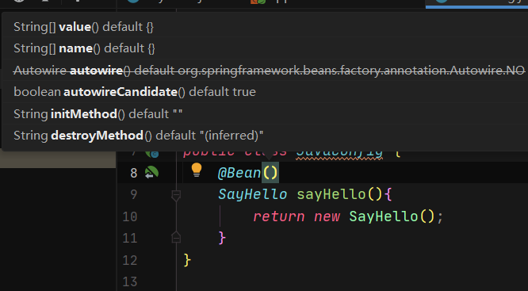

# 一条update语句是如何执行的
## 第一阶段:加载数据到Buffer Pool
- 涉及到的数据结构:
    - free链表
    - lru链表

## 第二阶段:在InnoDB中执行更新操作
- 涉及到的数据结构:
  - lru链表
  - flush链表

## 第三阶段:缓冲池内存不足触发脏页刷盘

- 涉及到的数据结构
  - lru链表
  - flush链表
  - free链表

