- 查找某一个类
  - Ctrl + Shift + n
- 查看类的继承结构
  - Ctrl + H
- 将选中的一块代码抽象成方法
  - Ctrl + Alt + M
- 在方法上生成多行注释
  - /** + Enter 
- 输出
  - **soutv**
    - response.body().string().soutv
    - --> System.out.println("response.body().string() = " + response.body().string());
 
- 显示方法的参数的快捷键
  - **ctrl + p** 
  - 
- 修改类名的快捷键
  - 选中类名
  - 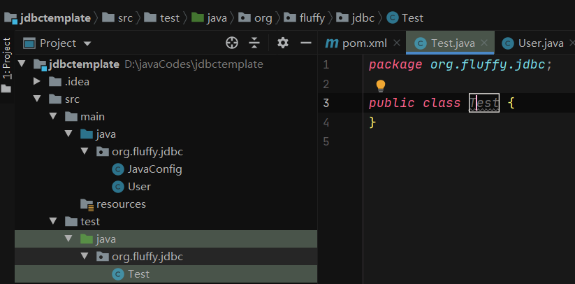
  - **shift + f6**
  - 完成修改
  - 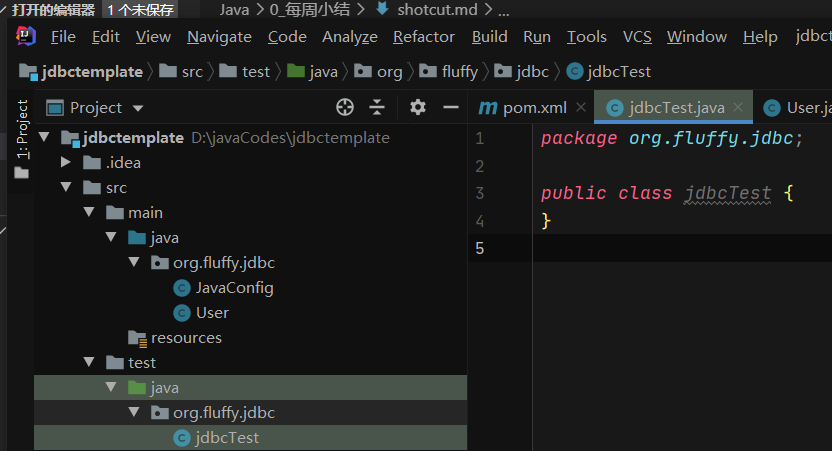
- 类内的表达式--抽取成全局变量
  - **类内表达式.fi**
  - 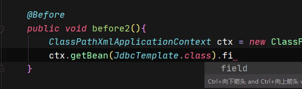
  - 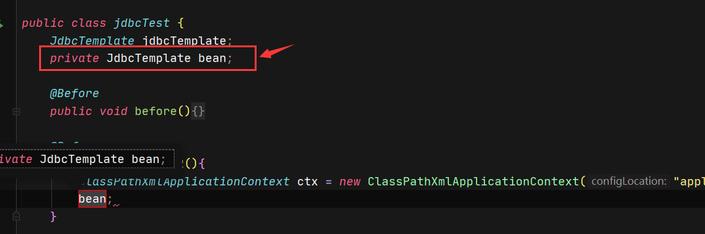

- 修改project settings/module settings
  - 将光标放在项目名上,然后按F4
  - 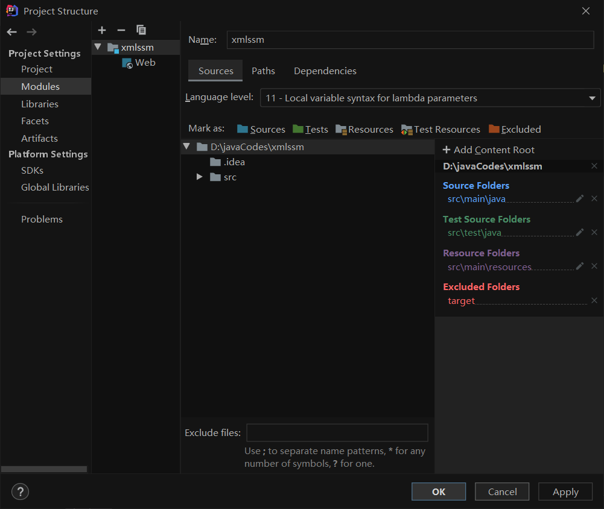
  - 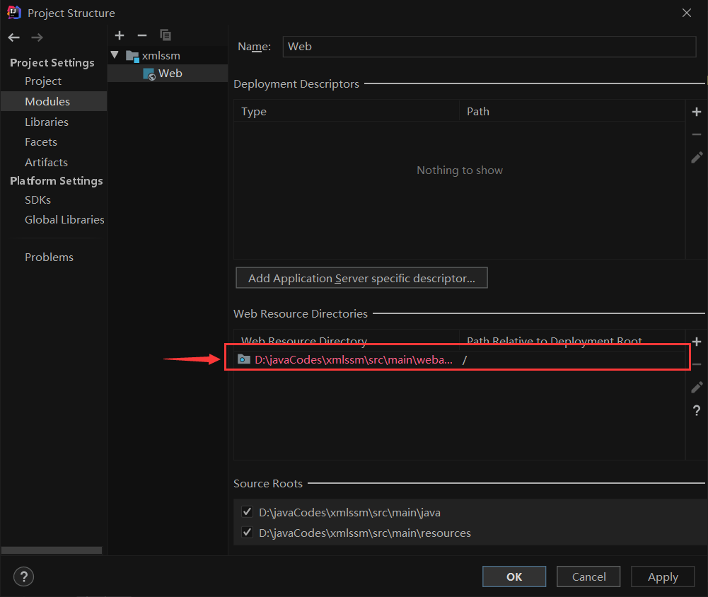
  - 创建webapp目录
  - 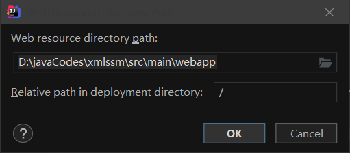
  - 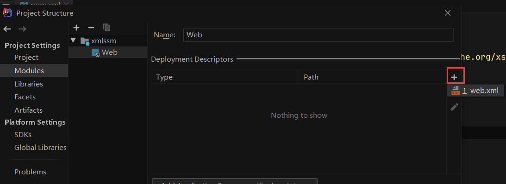
  - 剪切选中段
  - 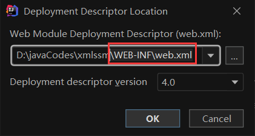
  - 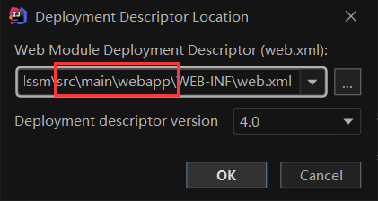

- 修改文件夹的位置
  - 将光标放在文件夹名上,然后按F6
  - 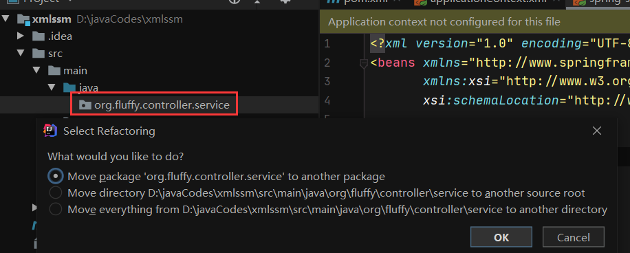  
  - 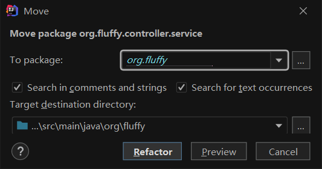  

- 在接口的实现类中直接重写方法
  - **ctrl + o**
- **.var()** 使用 
  - 应用场景
    - 往列表中加入一个新创建的对象,该对象需要用一个该类的引用来绑定
      - 为什么不直接加入匿名对象
        - --> 需要使用引用对该对象进行操作,如设置属性
  - example 1 
  - 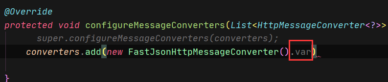  
  - 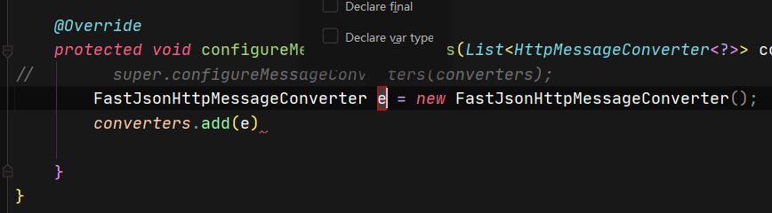  
  - example 2
  - 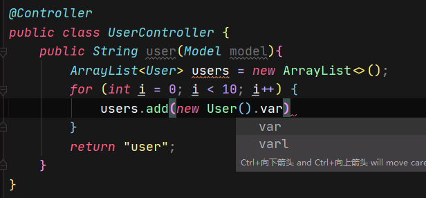 
  - 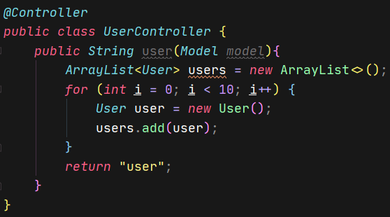
  - 设置对象属性
  - 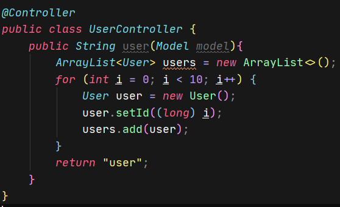
- 组合使用:**实现复制一行,然后将被复制的一行下移**
- 应用场景
  - 为实体类注入属性
  - 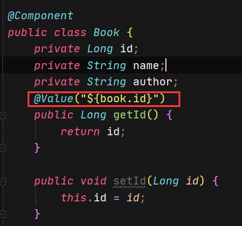
  - ctrl + D复制当前的一行
  - 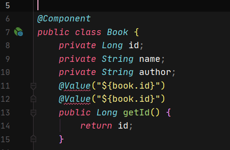
  - 按alt + shift + ↓ 下移到下方属性
  - 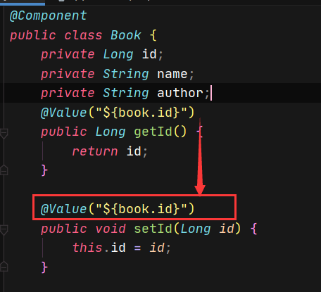

- 如何复制一个java项目
- 以一个springboot为例
- **操作参考链接**
  - https://www.cnblogs.com/zero-vic/p/12775944.html
- 确保原项目可以正常运行
- (1) 复制原项目,并修改名字
- 
- (2) 修改名字为 conditionalAnnotationDemo_copied 
  - 为了方便起见 可以把修改后的名字对应的字符串粘贴
- (3) 修改
  - 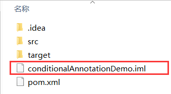
  - --> conditionalAnnotationDemo_copied.iml
- (4) 打开文件并编辑
  - 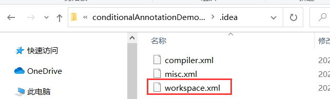
  - 替换所有的conditionalAnnotationDemo --> conditionalAnnotationDemo_copied
  - 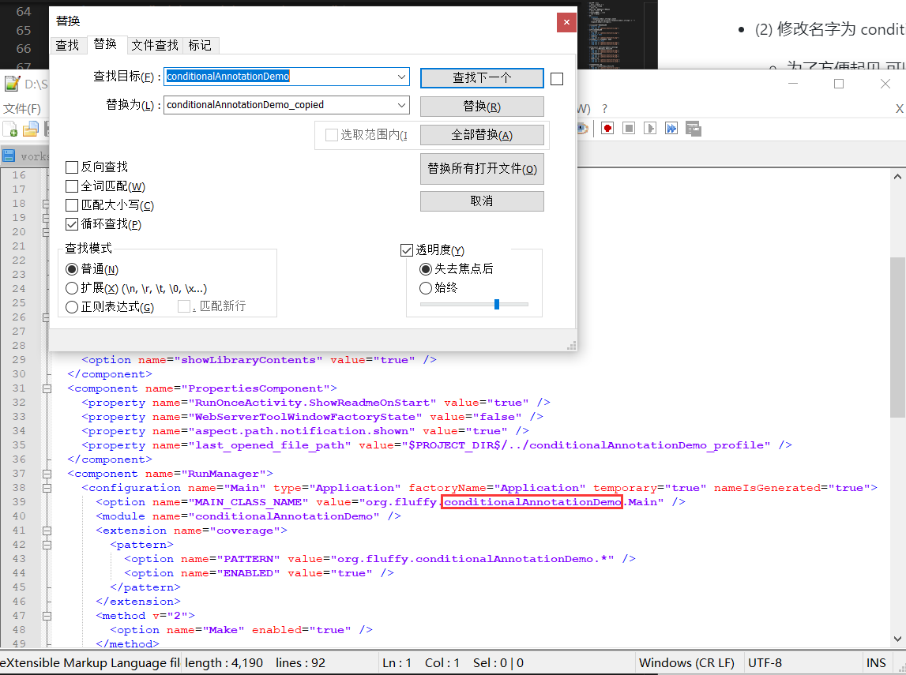
- (5) 在idea中打开复制的项目,尝试运行main
  - 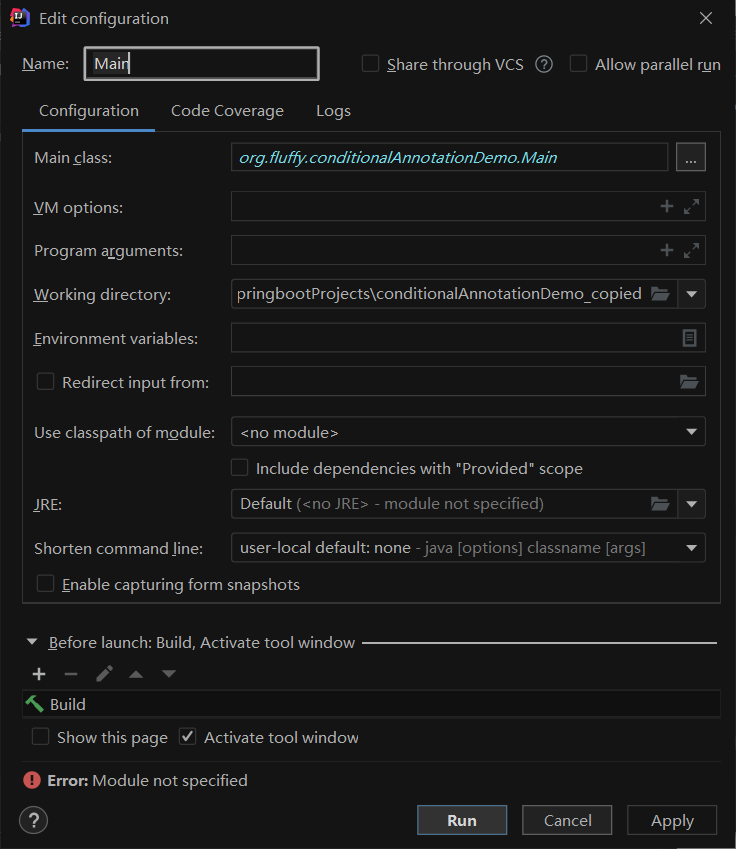
- (6) 选择模块
  - 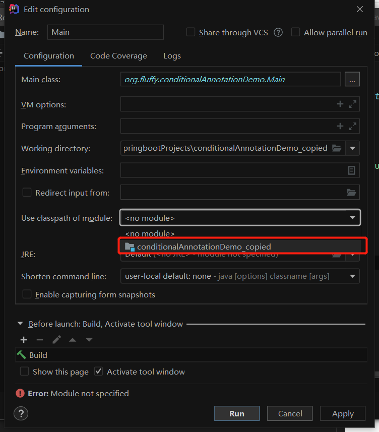

- 如何移除无效的Import
  - ctrl + alt + O 
  - (ps: 这个时候需要关闭QQ,否则会发生快捷键冲突)

- 给对象重命名
  - shift + F6

- 选中一个变量名(或者方法名)并复制
  - ctrl + w 选中变量名
  - ctrl + c 复制
# 光标移动相关
- 移动到一行开始 Home
- 移动到一行结束 end
- 多行编辑
  - Alt + Shift
  - 左键在每一行的需要同时修改的位置点击
# MAVEN
- 在pom.xml中添加依赖
  - alt + insert
    - 选择Dependency
  - 在弹出的search for artifact中输入要增加的依赖  

# Spring
- 在applicationContext.xml中添加bean,或者给bean注入properties
  - alt + insert

# 标签文本
- 如.xml或者网页模板中
  - table + Tab --> ```<table></table>```
  - dependency + Tab --> ```<dependency>...</dependency>```